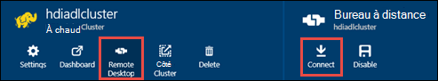

<properties
   pageTitle="Créer des clusters de HDInsight avec le magasin de LAC de données Azure à l’aide du Gestionnaire de ressources de modèles | Microsoft Azure"
   description="Utiliser les modèles du Gestionnaire de ressources Azure pour créer et utiliser des clusters de HDInsight avec le lac Azure Data Store"
   services="data-lake-store,hdinsight"
   documentationCenter=""
   authors="nitinme"
   manager="jhubbard"
   editor="cgronlun"/>

<tags
   ms.service="data-lake-store"
   ms.devlang="na"
   ms.topic="article"
   ms.tgt_pltfrm="na"
   ms.workload="big-data"
   ms.date="10/21/2016"
   ms.author="nitinme"/>

# <a name="create-an-hdinsight-cluster-with-data-lake-store-using-azure-resource-manager-template"></a>Créer un cluster HDInsight avec magasin lac de données à l’aide du modèle de gestionnaire de ressources Azure

> [AZURE.SELECTOR] - [À l’aide du portail de](data-lake-store-hdinsight-hadoop-use-portal.md) - [à l’aide de PowerShell](data-lake-store-hdinsight-hadoop-use-powershell.md) - [à l’aide du Gestionnaire de ressources](data-lake-store-hdinsight-hadoop-use-resource-manager-template.md)

Apprenez à utiliser un modèle de gestionnaire de ressources Azure pour configurer un cluster de HDInsight disposant d’un accès au magasin de LAC de données Azure. Certaines considérations importantes pour cette version :

-   **D’allumage (Linux), les clusters et clusters Hadoop/Storm (Windows et Linux)**, le magasin de LAC de données utilisable uniquement sous la forme d’un compte de stockage supplémentaire. Le compte de stockage par défaut pour les clusters de ce type sera toujours Azure stockage BLOB (WASB).

-   **Les clusters pour HBase (Windows et Linux)**, le magasin lac de données peut être utilisé comme un espace de stockage supplémentaire ou de stockage par défaut.

> [AZURE.NOTE] Certains points importants à noter.
>
> - Option permettant de créer des clusters de HDInsight disposant d’un accès au magasin de données lac n’est disponible que pour les HDInsight les versions 3.2 et 3.4 (pour les clusters Hadoop, HBase et Storm sur Windows et Linux). Pour les clusters d’allumage sous Linux, cette option est uniquement disponible sur les clusters de HDInsight 3.4.
>
> - Comme mentionné ci-dessus, banque de données lac est disponible sous la forme d’espace de stockage supplémentaire pour les autres types de cluster (Hadoop, étincelle, tempête) et de stockage par défaut pour certains types de cluster (HBase). À l’aide du magasin de données lac comme un compte de stockage supplémentaire n’affecte pas les performances ou la capacité de lecture/écriture pour le stockage du cluster. Dans un scénario où la banque de données lac est utilisé comme espace de stockage supplémentaire, les fichiers liés au cluster (par exemple, les journaux, etc.) sont écrits dans le stockage par défaut (BLOB Azure), tandis que les données que vous souhaitez traiter peuvent être stockées dans un compte de banque de données lac.
>

Dans cet article, nous mettre en service un cluster Hadoop avec le magasin de données lac comme espace de stockage supplémentaire.

## <a name="prerequisites"></a>Conditions préalables

Avant de commencer ce didacticiel, vous devez disposer des éléments suivants :

-   **Abonnement d’un Azure**. Consultez [Azure d’obtenir la version d’évaluation gratuite](https://azure.microsoft.com/pricing/free-trial/).

-   **Azure PowerShell 1.0 ou supérieure**. Voir [comment installer et configurer Azure PowerShell](../powershell-install-configure.md).

- **Azure Principal du Service Active Directory**. Étapes de ce tutoriel fournissent des instructions sur la création d’une entité de sécurité de service dans Active Directory Azure. Toutefois, vous devez être un administrateur AD Azure pour être en mesure de créer une entité de sécurité du service. Si vous êtes un administrateur AD Azure, vous pouvez ignorer ces conditions préalables et poursuivre le didacticiel.
    
    **Si vous n’êtes pas un administrateur AD Azure**, vous ne serez pas en mesure d’effectuer les étapes nécessaires à la création d’une entité de sécurité du service. Dans ce cas, votre administrateur AD Azure devez d’abord créer une entité de service avant de pouvoir créer un cluster de HDInsight avec le magasin de données lac. En outre, l’entité du service doit être créée à l’aide d’un certificat, comme indiqué à la [Création d’un service principal avec certificat](../resource-group-authenticate-service-principal.md#create-service-principal-with-certificate).

## <a name="create-an-hdinsight-cluster-with-azure-data-lake-store"></a>Créer un cluster HDInsight avec magasin de LAC de données Azure

Le modèle de gestionnaire de ressources et que les conditions préalables à l’aide du modèle, sont disponibles sur GitHub à [déployer un cluster Linux de HDInsight avec le nouveau magasin de données lac](https://github.com/Azure/azure-quickstart-templates/tree/master/201-hdinsight-datalake-store-azure-storage). Suivez les instructions fournies sur ce lien pour créer un cluster de HDInsight avec le lac Azure Data Store comme l’espace de stockage supplémentaire.

Les instructions sur le lien mentionné ci-dessus requièrent PowerShell. Avant de commencer ces instructions, vérifiez que vous vous connectez à votre compte Azure. À partir de votre bureau, ouvrir une nouvelle fenêtre PowerShell d’Azure et entrez les extraits de code suivants. Lorsque vous êtes invité à ouvrir une session, vérifiez que vous vous connectez sous la forme d’un abonnement admininistrators/du propriétaire de la :

```
# Log in to your Azure account
Login-AzureRmAccount

# List all the subscriptions associated to your account
Get-AzureRmSubscription

# Select a subscription
Set-AzureRmContext -SubscriptionId <subscription ID>
```

## <a name="upload-sample-data-to-the-azure-data-lake-store"></a>Télécharger des exemples de données au magasin de LAC données Azure

Le modèle de gestionnaire de ressources crée un nouveau compte de banque de données LAC et l’associe avec le cluster HDInsight. Vous devez maintenant télécharger des exemples de données au magasin de LAC données. Vous aurez besoin de ces données plus loin dans le didacticiel pour exécuter des tâches à partir d’un cluster d’HDInsight d’accès aux données du magasin de données lac. Pour obtenir des instructions sur la façon de télécharger des données, reportez-vous à la section [télécharger un fichier vers votre magasin lac de données](data-lake-store-get-started-portal.md#uploaddata). Si vous recherchez des exemples de données à télécharger, vous pouvez obtenir le dossier de **Données d’Ambulance** à partir du [Référentiel Git lac Azure](https://github.com/Azure/usql/tree/master/Examples/Samples/Data/AmbulanceData).

## <a name="set-relevant-acls-on-the-sample-data"></a>Définir des ACL appropriées sur les exemples de données

Pour vous assurer que vous téléchargez des exemples de données sont accessibles à partir du cluster HDInsight, vous devez vous assurer que l’application Azure AD qui est utilisée pour établir l’identité entre le cluster de HDInsight et le magasin de données lac a accès sur le dossier que vous essayez d’accéder. Pour ce faire, procédez comme suit.

1.  Recherchez le nom de l’application Azure AD qui est associé avec le cluster de HDInsight et le lac de Data Store. Une pour rechercher le nom consiste à ouvrir la lame de cluster HDInsight que vous avez créé en utilisant le modèle de gestionnaire de ressources, cliquez sur l’onglet **Identité de DAS de Cluster** et recherchez la valeur du **Nom Principal de Service**.

2.  Maintenant, donnent accès à cette application Azure AD dans le fichier/dossier que vous souhaitez accéder à partir du cluster HDInsight. Pour définir les ACL droit sur le dossier dans le magasin de données lac, consultez [sécurisation de données dans le magasin de données lac](data-lake-store-secure-data.md#assign-users-or-security-group-as-acls-to-the-azure-data-lake-store-file-system).

## <a name="run-test-jobs-on-the-hdinsight-cluster-to-use-the-data-lake-store"></a>Exécuter des tâches d’essai sur le cluster de HDInsight à utiliser le magasin de LAC de données

Après avoir configuré un cluster HDInsight, vous pouvez exécuter des tâches d’essai sur le cluster pour vérifier que le cluster HDInsight peut accéder aux données lac magasin. Pour ce faire, nous allons exécuter un travail de ruche d’exemple qui crée une table à l’aide de l’exemple de données que vous avez téléchargé précédemment à votre magasin de LAC de données.

### <a name="for-a-linux-cluster"></a>Pour un cluster Linux

Dans cette section, vous allez SSH dans le cluster et exécuter l’exemple de requête ruche. Windows ne fournit pas un client SSH intégré. Nous vous recommandons d’à l’aide de **PuTTY**, qui peut être téléchargé à partir de [http://www.chiark.greenend.org.uk/~sgtatham/putty/download.html](http://www.chiark.greenend.org.uk/~sgtatham/putty/download.html).

Pour plus d’informations sur l’utilisation de PuTTY, reportez-vous à la section [Utiliser SSH avec basé sur Linux d’Hadoop sur HDInsight à partir de Windows ](../hdinsight/hdinsight-hadoop-linux-use-ssh-windows.md).

1.  Une fois connecté, démarrer l’interface CLI de la ruche à l’aide de la commande suivante :

    ```
    hive
    ```

2.  À l’aide de l’interface CLI, entrez les instructions suivantes pour créer une nouvelle table nommée **véhicules** en utilisant les exemples de données du magasin de données lac :

    ```
    DROP TABLE vehicles;
    CREATE EXTERNAL TABLE vehicles (str string) LOCATION 'adl://<mydatalakestore>.azuredatalakestore.net:443/';
    SELECT * FROM vehicles LIMIT 10;
    ```

    Vous devriez voir une sortie semblable à la suivante :

    ```
    1,1,2014-09-14 00:00:03,46.81006,-92.08174,51,S,1
    1,2,2014-09-14 00:00:06,46.81006,-92.08174,13,NE,1
    1,3,2014-09-14 00:00:09,46.81006,-92.08174,48,NE,1
    1,4,2014-09-14 00:00:12,46.81006,-92.08174,30,W,1
    1,5,2014-09-14 00:00:15,46.81006,-92.08174,47,S,1
    1,6,2014-09-14 00:00:18,46.81006,-92.08174,9,S,1
    1,7,2014-09-14 00:00:21,46.81006,-92.08174,53,N,1
    1,8,2014-09-14 00:00:24,46.81006,-92.08174,63,SW,1
    1,9,2014-09-14 00:00:27,46.81006,-92.08174,4,NE,1
    1,10,2014-09-14 00:00:30,46.81006,-92.08174,31,N,1
    ```

### <a name="for-a-windows-cluster"></a>Pour un cluster de Windows

Utiliser les applets de commande suivantes pour exécuter la requête de la ruche. Dans cette requête, nous créer une table à partir des données du magasin de données LAC et puis exécutez une requête select sur la table.

```
$queryString = "DROP TABLE vehicles;" + "CREATE EXTERNAL TABLE vehicles (str string) LOCATION 'adl://$dataLakeStoreName.azuredatalakestore.net:443/';" + "SELECT * FROM vehicles LIMIT 10;"

$hiveJobDefinition = New-AzureRmHDInsightHiveJobDefinition -Query $queryString

$hiveJob = Start-AzureRmHDInsightJob -ResourceGroupName $resourceGroupName -ClusterName $clusterName -JobDefinition $hiveJobDefinition -ClusterCredential $httpCredentials

Wait-AzureRmHDInsightJob -ResourceGroupName $resourceGroupName -ClusterName $clusterName -JobId $hiveJob.JobId -ClusterCredential $httpCredentials
```

Cela aura la sortie suivante. **ExitValue** de 0 dans le résultat suggère que la tâche s’est terminée correctement.

```
Cluster         : hdiadlcluster.
HttpEndpoint    : hdiadlcluster.azurehdinsight.net
State           : SUCCEEDED
JobId           : job_1445386885331_0012
ParentId        :
PercentComplete :
ExitValue       : 0
User            : admin
Callback        :
Completed       : done
```

Récupérer la sortie de la tâche à l’aide de l’applet de commande suivante :

```
Get-AzureRmHDInsightJobOutput -ClusterName $clusterName -JobId $hiveJob.JobId -DefaultContainer $containerName -DefaultStorageAccountName $storageAccountName -DefaultStorageAccountKey $storageAccountKey -ClusterCredential $httpCredentials
```

La sortie de projet semblable au suivant :

```
1,1,2014-09-14 00:00:03,46.81006,-92.08174,51,S,1
1,2,2014-09-14 00:00:06,46.81006,-92.08174,13,NE,1
1,3,2014-09-14 00:00:09,46.81006,-92.08174,48,NE,1
1,4,2014-09-14 00:00:12,46.81006,-92.08174,30,W,1
1,5,2014-09-14 00:00:15,46.81006,-92.08174,47,S,1
1,6,2014-09-14 00:00:18,46.81006,-92.08174,9,S,1
1,7,2014-09-14 00:00:21,46.81006,-92.08174,53,N,1
1,8,2014-09-14 00:00:24,46.81006,-92.08174,63,SW,1
1,9,2014-09-14 00:00:27,46.81006,-92.08174,4,NE,1
1,10,2014-09-14 00:00:30,46.81006,-92.08174,31,N,1
```

## <a name="access-data-lake-store-using-hdfs-commands"></a>Magasin de LAC de données Access à l’aide des commandes de très

Une fois que vous avez configuré le cluster HDInsight pour utiliser le magasin de données lac, vous pouvez utiliser les commandes de shell très pour accéder au magasin.

### <a name="for-a-linux-cluster"></a>Pour un cluster Linux

Dans cette section vous seront SSH dans le cluster et exécutez les commandes très. Windows ne fournit pas un client SSH intégré. Nous vous recommandons d’à l’aide de **PuTTY**, qui peut être téléchargé à partir de [http://www.chiark.greenend.org.uk/~sgtatham/putty/download.html](http://www.chiark.greenend.org.uk/~sgtatham/putty/download.html).

Pour plus d’informations sur l’utilisation de PuTTY, reportez-vous à la section [Utiliser SSH avec basé sur Linux d’Hadoop sur HDInsight à partir de Windows ](../hdinsight/hdinsight-hadoop-linux-use-ssh-windows.md).

Une fois connecté, utilisez la commande de système de fichiers très suivante pour répertorier les fichiers du magasin de données lac.

```
hdfs dfs -ls adl://<Data Lake Store account name>.azuredatalakestore.net:443/
```

Cette opération doit répertorier le fichier que vous avez téléchargé précédemment à la banque de LAC de données.

```
15/09/17 21:41:15 INFO web.CaboWebHdfsFileSystem: Replacing original urlConnectionFactory with org.apache.hadoop.hdfs.web.URLConnectionFactory@21a728d6
Found 1 items
-rwxrwxrwx   0 NotSupportYet NotSupportYet     671388 2015-09-16 22:16 adl://mydatalakestore.azuredatalakestore.net:443/mynewfolder
```

Vous pouvez également utiliser le `hdfs dfs -put` commande pour télécharger des fichiers vers la banque de LAC de données, puis utilisez `hdfs dfs -ls` pour vérifier si les fichiers ont été correctement téléchargées.

### <a name="for-a-windows-cluster"></a>Pour un cluster de Windows

1.  Ouvrez une session sur le nouveau [Portail Azure](https://portal.azure.com).

2.  Cliquez sur **Parcourir**et cliquez sur **HDInsight les clusters**, puis cliquez sur le cluster de HDInsight que vous avez créé.

3.  Dans la carte de cluster, cliquez sur **Bureau à distance**et puis dans la lame du **Bureau à distance** , cliquez sur **se connecter**.

    

    Lorsque vous y êtes invité, entrez les informations d’identification que vous avez fournie pour l’utilisateur de bureau à distance.

4.  Dans la session à distance, démarrer Windows PowerShell et les commandes de système de fichiers très permet de répertorier les fichiers dans le magasin de LAC de données Azure.

    ```
    hdfs dfs -ls adl://<Data Lake Store account name>.azuredatalakestore.net:443/
    ```

    Cette opération doit répertorier le fichier que vous avez téléchargé précédemment à la banque de LAC de données.

    ```
    15/09/17 21:41:15 INFO web.CaboWebHdfsFileSystem: Replacing original urlConnectionFactory with org.apache.hadoop.hdfs.web.URLConnectionFactory@21a728d6
    Found 1 items
    -rwxrwxrwx   0 NotSupportYet NotSupportYet     671388 2015-09-16 22:16 adl://mydatalakestore.azuredatalakestore.net:443/vehicle1_09142014.csv
    ```

    Vous pouvez également utiliser le `hdfs dfs -put` commande pour télécharger des fichiers vers la banque de LAC de données, puis utilisez `hdfs dfs -ls` pour vérifier si les fichiers ont été correctement téléchargées.

## <a name="next-steps"></a>Étapes suivantes

-   [Copier des données d’objets BLOB de stockage Azure au magasin de données lac](data-lake-store-copy-data-wasb-distcp.md)
