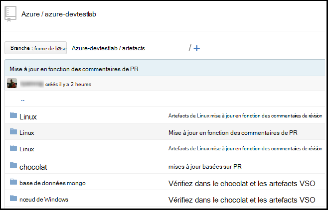
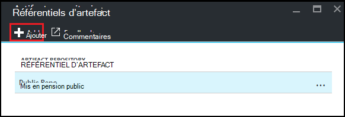
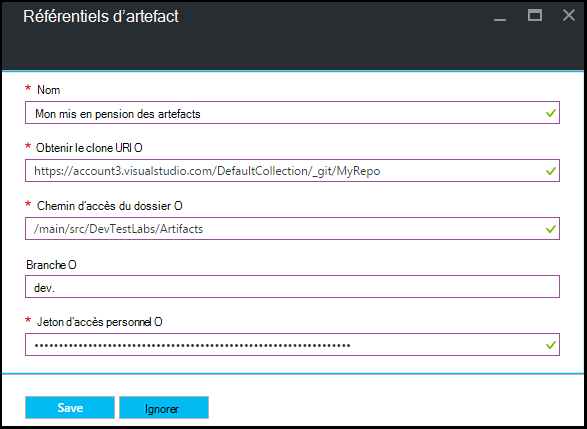

<properties
    pageTitle="Ajouter un référentiel d’artefact Git à un laboratoire dans Azure DevTest Labs | Microsoft Azure"
    description="Ajouter un référentiel GitHub ou Git de Services Visual Studio Team pour votre source d’artefacts personnalisé dans Azure DevTest Labs"
    services="devtest-lab,virtual-machines,visual-studio-online"
    documentationCenter="na"
    authors="tomarcher"
    manager="douge"
    editor=""/>

<tags
    ms.service="devtest-lab"
    ms.workload="na"
    ms.tgt_pltfrm="na"
    ms.devlang="na"
    ms.topic="article"
    ms.date="09/06/2016"
    ms.author="tarcher"/>

# Ajouter un référentiel d’artefact Git à un laboratoire dans Azure DevTest Labs

> [AZURE.VIDEO how-to-add-your-private-artifacts-repository-in-a-devtest-lab]

Dans les ateliers de DevTest d’Azure, les artefacts sont des *actions* , telles que l’installation de logiciels ou en cours d’exécution de scripts et de commandes - lors de la création d’une machine virtuelle. Par défaut, un laboratoire comprend des artefacts à partir du référentiel d’artefact Azure DevTest laboratoires officiel. Vous pouvez ajouter un référentiel d’artefact Git à votre laboratoire à inclure les artefacts que votre équipe crée. Le référentiel peut être hébergé sur [GitHub](https://github.com) ou sur [Visual Studio Team Services (VSTS)](https://visualstudio.com).

- Pour savoir comment créer un référentiel de GitHub, consultez le [Cours d’initiation sur GitHub](https://help.github.com/categories/bootcamp/).
- Pour savoir comment créer un projet d’équipe Services grâce à un référentiel Git, voir [se connecter à Visual Studio Team Services](https://www.visualstudio.com/get-started/setup/connect-to-visual-studio-online).

La capture d’écran suivante montre un exemple de quoi il pourrait ressembler un référentiel contenant des artefacts dans GitHub :  

## Obtenir les informations du référentiel et les informations d’identification

Pour ajouter un référentiel d’artefact à votre laboratoire, vous devez d’abord obtenir certaines informations à partir de votre référentiel. Les sections suivantes vous guident tout au long de l’obtention de ces informations pour les référentiels d’artefact hébergé sur GitHub et Visual Studio Team Services.

### Obtenir l’URL de clone de référentiel de GitHub et d’un accès personnel jeton

Pour obtenir le clone du référentiel GitHub URL et le jeton d’accès personnel, procédez comme suit :

1. Accédez à la page d’accueil du référentiel GitHub qui contient les définitions de l’artefact.

1. Sélectionnez **Clone ou téléchargement**.

1. Cliquez sur le bouton Copier l' **url HTTPS du clone** vers le Presse-papiers et d’enregistrer l’URL pour une utilisation ultérieure.

1. Sélectionnez l’image de profil dans le coin supérieur droit de GitHub et sélectionnez **paramètres**.

1. Dans le menu **paramètres personnels** sur la gauche, sélectionnez **les jetons d’accès personnel**.

1. Sélectionnez **Générer un nouveau jeton**.

1. Dans la page **nouveau jeton d’accès personnel** , permet d’entrer une **description de jeton**et accepter les éléments par défaut dans les **étendues de sélectionner**puis choisissez **Générer un jeton**.

1. Enregistrer le jeton généré comme vous en avez besoin plus tard.

1. Vous pouvez fermer GitHub maintenant.   

1. Passez à la section [se connecter votre laboratoire dans le référentiel de l’artefact](#connect-your-lab-to-the-artifact-repository) .

### Obtenir l’URL du référentiel de Visual Studio Team Services clone et accès personnel jeton

Pour obtenir l’URL de clone de Visual Studio Team Services référentiel et le jeton d’accès personnel, procédez comme suit :

1. Ouvrez la page d’accueil de votre collection d’équipe (par exemple, `https://contoso-web-team.visualstudio.com`), puis sélectionnez le projet de l’artefact.

1. Sur la page d’accueil de projet, sélectionnez le **Code**.

1. Pour afficher l’URL de clone, sur la page de **Code** du projet, sélectionnez **cloner**.

1. Enregistrer l’URL comme vous en avez besoin plus loin dans ce didacticiel.

1. Pour créer un jeton d’accès personnel, sélectionnez **Mon profil** dans le menu déroulant du compte utilisateur.

1. Sur la page d’informations de profil, sélectionnez **sécurité**.

1. Sous l’onglet **sécurité** , sélectionnez **Ajouter**.

1. Dans la page **créer un jeton d’accès personnel** :

    - Permet d’entrer une **Description** pour le jeton.
    - Sélectionnez les **180 jours** à partir de la liste **Expire dans** .
    - Cliquez sur **tous les comptes accessibles** à partir de la liste des **comptes** .
    - Choisissez l’option **toutes les étendues** .
    - Choisissez de **créer un jeton**.

1. Lorsque vous avez terminé, le nouveau jeton apparaît dans la liste de **Jetons d’accès personnel** . Sélectionnez **Copie de jeton**et enregistrez la valeur du jeton pour une utilisation ultérieure.

1. Passez à la section [se connecter votre laboratoire dans le référentiel de l’artefact](#connect-your-lab-to-the-artifact-repository) .

##Connecter votre laboratoire dans le référentiel d’artefact

1. Connectez-vous au [portail Azure](http://go.microsoft.com/fwlink/p/?LinkID=525040).

1. Sélectionnez **Plus de Services**et sélectionnez **DevTest Labs** à partir de la liste.

1. Dans la liste des laboratoires, sélectionnez l’atelier de votre choix.   

1. Sur les lames de l’atelier, sélectionnez **Configuration**.

1. Sur la lame de **Configuration** de l’atelier, sélectionnez **Référentiels d’artefacts**.

1. Sur la blade **d’Artefacts de référentiels** , sélectionnez **+ Ajouter**.

    
 
1. Sur la deuxième lame de **Référentiels d’artefacts** , spécifiez les éléments suivants :

    - **Nom** : entrez un nom pour le référentiel.
    - **Url de Clone Git** - Entrez l’URL de clone Git HTTPS que vous avez copié précédemment à partir de Visual Studio Team Services ou GitHub. 
    - **Chemin d’accès de dossier** - permet d’entrer le chemin d’accès du dossier par rapport à l’URL de clone qui contient les définitions de l’artefact.
    - **Branche** - Entrez la branche pour obtenir les définitions de l’artefact.
    - **Jeton d’accès personnel** - Entrez le jeton d’accès personnel obtenues précédemment à partir de Visual Studio Team Services ou GitHub. 
     
    

1. Cliquez sur **Enregistrer**.

[AZURE.INCLUDE [devtest-lab-try-it-out](../../includes/devtest-lab-try-it-out.md)]

## Publications de blogs connexes
- [Comment résoudre les problèmes liés à l’échec des artefacts dans AzureDevTestLabs](http://www.visualstudiogeeks.com/blog/DevOps/How-to-troubleshoot-failing-artifacts-in-AzureDevTestLabs)
- [Joindre un ordinateur virtuel à des domaines Active Directory existant à l’aide du modèle ARM dans le laboratoire de Test Dev Azure](http://www.visualstudiogeeks.com/blog/DevOps/Join-a-VM-to-existing-AD-domain-using-ARM-template-AzureDevTestLabs)