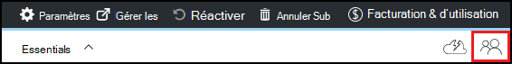

<properties
    pageTitle="Ajouter des utilisateurs et des propriétaires dans Azure DevTest Labs | Microsoft Azure"
    description="Ajouter des utilisateurs et des propriétaires dans Azure Labs de DevTest à l’aide de PowerShell ou Azure portal"
    services="devtest-lab,virtual-machines"
    documentationCenter="na"
    authors="tomarcher"
    manager="douge"
    editor=""/>

<tags
    ms.service="devtest-lab"
    ms.workload="na"
    ms.tgt_pltfrm="na"
    ms.devlang="na"
    ms.topic="article"
    ms.date="09/12/2016"
    ms.author="tarcher"/>

# Ajouter des utilisateurs et des propriétaires dans Azure DevTest Labs

> [AZURE.VIDEO how-to-set-security-in-your-devtest-lab]

Accès dans Azure DevTest Labs est contrôlé par le [Contrôle d’accès Azure Role-Based (RBAC)](../active-directory/role-based-access-control-what-is.md). L’utilisation de RBAC, vous pouvez séparer les droits au sein de votre équipe dans des *rôles* où vous accordez uniquement la quantité de l’accès nécessaire aux utilisateurs pour effectuer leur travail. Trois de ces rôles RBAC sont *propriétaire*, *DevTest Labs utilisateur*et *collaborateurs*. Dans cet article, vous apprendrez les actions peuvent être effectuées dans chacun des trois principaux rôles RBAC. À partir de là, vous apprendrez comment ajouter des utilisateurs à un atelier - à la fois via le portail et un script PowerShell et comment ajouter des utilisateurs au niveau de l’abonnement.

## Actions qui peuvent être effectuées dans chaque rôle.

Il existe trois rôles principaux que vous pouvez affecter un utilisateur :

- Propriétaire
- Utilisateur de laboratoires DevTest
- Collaborateur

Le tableau suivant montre les actions qui peuvent être exécutées par les utilisateurs dans chacun de ces rôles :

| **Peuvent effectuer des actions que les utilisateurs dans ce rôle** | **Utilisateur de laboratoires DevTest**            | **Propriétaire** | **Collaborateur** |
|---|---|---|---|
| **Tâches de l’atelier**                          |                              |       |             |
| Ajouter des utilisateurs à un laboratoire                     | N°                           | Oui   | N°          |
| Mettre à jour les paramètres de coût                   | N°                           | Oui   | Oui         |
| **Tâches de base de machine virtuelle**                      |                              |       |             |
| Ajouter et supprimer des images personnalisées           | N°                           | Oui   | Oui         |
| Ajouter, mettre à jour et supprimer des formules       | Oui                          | Oui   | Oui         |
| Images de la liste d’autorisation Azure Marketplace     | N°                           | Oui   | Oui         |
| **Tâches de machine virtuelle**                           |                              |       |             |
| Créer des ordinateurs virtuels                             | Oui                          | Oui   | Oui         |
| Démarrer, arrêter et supprimer des ordinateurs virtuels            | Seuls les ordinateurs virtuels créés par l’utilisateur | Oui   | Oui         |
| Mise à jour des stratégies de machine virtuelle                     | N°                           | Oui   | Oui         |
| Ajouter ou supprimer des disques de données vers/à partir d’ordinateurs virtuels      | Seuls les ordinateurs virtuels créés par l’utilisateur | Oui   | Oui         |
| **Tâches d’artefact**                     |                              |       |             |
| Ajouter et supprimer des référentiels de l’artefact   | N°                           | Oui   | Oui         |
| Appliquer des artefacts                        | Oui                          | Oui   | Oui         |

> [AZURE.NOTE] Lorsqu’un utilisateur crée un ordinateur virtuel, cet utilisateur est automatiquement affecté au rôle de **propriétaire** de la machine virtuelle créée.

## Ajouter un propriétaire ou un utilisateur au niveau de l’atelier

Les propriétaires et les utilisateurs peuvent être ajoutés au niveau de l’atelier via le portail Azure. Cela inclut les utilisateurs externes avec un valide [le compte Microsoft (MSA)](devtest-lab-faq.md#what-is-a-microsoft-account).
La procédure suivante vous guide à travers le processus d’ajout d’un propriétaire ou un utilisateur à un laboratoire dans Azure DevTest Labs :

1. Connectez-vous au [portail Azure](http://go.microsoft.com/fwlink/p/?LinkID=525040).

1. Sélectionnez les **autres services**et sélectionnez **DevTest Labs** à partir de la liste.

1. Dans la liste des laboratoires, sélectionnez l’atelier de votre choix.

1. Sur les lames de l’atelier, sélectionnez **Configuration**. 

1. Sur la lame de **Configuration** , sélectionnez **utilisateurs**.

1. Sur la blade **d’utilisateurs** , sélectionnez **+ Ajouter**.

    

1. Sur la lame **Sélectionnez un rôle** , sélectionnez le rôle souhaité. La section [Actions pouvant être effectuées dans chaque rôle](#actions-that-can-be-performed-in-each-role) répertorie les diverses actions pouvant être effectuées par les utilisateurs dans le propriétaire, DevTest utilisateur et les rôles de collaborateur.

1. Sur la blade **d’Ajouter des utilisateurs** , entrez l’adresse e-mail ou le nom de l’utilisateur que vous souhaitez ajouter dans le rôle spécifié. Si l’utilisateur ne peut pas être trouvé, un message d’erreur explique le problème. Si l’utilisateur est trouvé, cet utilisateur est répertorié et sélectionné. 

1. Sélectionnez **Sélectionner**.

1. Cliquez sur **OK** pour fermer la blade **d’Ajouter l’accès** .

1. Lorsque vous revenez à la blade **d’utilisateurs** , l’utilisateur a été ajouté.  

## Ajouter un utilisateur externe à un laboratoire à l’aide de PowerShell

En plus de l’ajout d’utilisateurs dans le portail Azure, vous pouvez ajouter un utilisateur externe à votre laboratoire à l’aide d’un script PowerShell. Dans l’exemple suivant, simplement modifier les valeurs de paramètre sous le commentaire **à modifier les valeurs** .
Vous pouvez récupérer le `subscriptionId`, `labResourceGroup`, et `labName` les valeurs de la lame de laboratoire dans le portail Azure.

> [AZURE.NOTE]
> L’exemple de script suppose que l’utilisateur spécifié a été ajouté en tant qu’invité à Active Directory et échouera si ce n’est pas le cas. Pour ajouter un utilisateur pas dans Active Directory à un laboratoire, utiliser le portail Azure pour affecter l’utilisateur à un rôle, comme illustré dans la section, [Ajouter un propriétaire ou un utilisateur au niveau de l’atelier](#add-an-owner-or-user-at-the-lab-level).   

    # Add an external user in DevTest Labs user role to a lab
    # Ensure that guest users can be added to the Azure Active directory:
    # https://azure.microsoft.com/en-us/documentation/articles/active-directory-create-users/#set-guest-user-access-policies

    # Values to change
    $subscriptionId = "<Enter Azure subscription ID here>"
    $labResourceGroup = "<Enter lab's resource name here>"
    $labName = "<Enter lab name here>"
    $userDisplayName = "<Enter user's display name here>"

    # Log into your Azure account
    Login-AzureRmAccount
    
    # Select the Azure subscription that contains the lab. 
    # This step is optional if you have only one subscription.
    Select-AzureRmSubscription -SubscriptionId $subscriptionId
    
    # Retrieve the user object
    $adObject = Get-AzureRmADUser -SearchString $userDisplayName
    
    # Create the role assignment. 
    $labId = ('subscriptions/' + $subscriptionId + '/resourceGroups/' + $labResourceGroup + '/providers/Microsoft.DevTestLab/labs/' + $labName)
    New-AzureRmRoleAssignment -ObjectId $adObject.Id -RoleDefinitionName 'DevTest Labs User' -Scope $labId

## Ajouter un propriétaire ou un utilisateur au niveau de l’abonnement

Azure autorisations sont propagées à partir de la portée parent à la portée des enfants dans Azure. Par conséquent, les propriétaires d’un abonnement Azure contenant des ateliers sont automatiquement les propriétaires de ces laboratoires. Ils possèdent également les ordinateurs virtuels et autres ressources créés par les utilisateurs de l’atelier et le service Azure DevTest Labs. 

Vous pouvez ajouter les autres propriétaires à un laboratoire par lame de laboratoire dans le [portail Azure](http://go.microsoft.com/fwlink/p/?LinkID=525040). Toutefois, la portée le propriétaire ajouté de l’administration est plus étroite que le champ d’application du propriétaire de l’abonnement. Par exemple, propriétaires ajoutés n’ont pas d’un accès complet à certaines ressources qui sont créés dans l’abonnement par le service de DevTest Labs. 

Pour ajouter un propriétaire à un abonnement Azure, procédez comme suit :

1. Connectez-vous au [portail Azure](http://go.microsoft.com/fwlink/p/?LinkID=525040).

1. Sélectionnez **Plus de Services**et sélectionnez **abonnements** à partir de la liste.

1. Sélectionnez l’abonnement de votre choix.

1. Sélectionnez l’icône **d’accès** . 

    

1. Sur la blade **d’utilisateurs** , sélectionnez **Ajouter**.

    

1. Sur la lame **Sélectionnez un rôle** , sélectionnez **propriétaire**.

1. Sur la blade **d’Ajouter des utilisateurs** , entrez l’adresse e-mail ou le nom de l’utilisateur que vous souhaitez ajouter en tant que propriétaire. Si l’utilisateur ne peut pas être trouvé, vous obtenez un message d’erreur expliquant le problème. Si l’utilisateur est trouvé, celui-ci est répertorié sous la zone de texte **utilisateur** .

1. Sélectionnez le nom d’utilisateur introuvable.

1. Sélectionnez **Sélectionner**.

1. Cliquez sur **OK** pour fermer la blade **d’Ajouter l’accès** .

1. Lorsque vous revenez à la blade **d’utilisateurs** , l’utilisateur a été ajouté en tant que propriétaire. Cet utilisateur est propriétaire de tous les laboratoires créées sous cet abonnement et donc être en mesure d’effectuer des tâches de propriétaire. 

[AZURE.INCLUDE [devtest-lab-try-it-out](../../includes/devtest-lab-try-it-out.md)]
