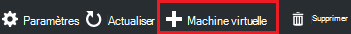

<properties
    pageTitle="Ajouter un ordinateur virtuel avec des artefacts à un laboratoire dans Azure DevTest Labs | Microsoft Azure"
    description="Apprenez à ajouter un ordinateur virtuel avec les artefacts dans Azure DevTest Labs"
    services="devtest-lab,virtual-machines"
    documentationCenter="na"
    authors="tomarcher"
    manager="douge"
    editor=""/>

<tags
    ms.service="devtest-lab"
    ms.workload="na"
    ms.tgt_pltfrm="na"
    ms.devlang="na"
    ms.topic="article"
    ms.date="08/30/2016"
    ms.author="tarcher"/>

# Ajouter un ordinateur virtuel avec des artefacts à un laboratoire dans Azure DevTest Labs

> [AZURE.VIDEO how-to-create-vms-with-artifacts-in-a-devtest-lab]

Vous créez un ordinateur virtuel dans un laboratoire à partir d’une *base* qui est une [image personnalisée](./devtest-lab-create-template.md), une [formule](./devtest-lab-manage-formulas.md)ou une [image du marché](./devtest-lab-configure-marketplace-images.md).

DevTest Labs *artefacts* vous permettent de spécifier les *actions* qui sont exécutées lorsque la machine virtuelle est créée. 

Actions d’artefact peuvent exécuter des procédures telles que de l’exécution de scripts Windows PowerShell, exécuter des commandes de Bash et l’installation du logiciel. 

L' objet *paramètres* vous permettent de personnaliser l’artefact pour votre scénario particulier.

Cet article vous montre comment créer un ordinateur virtuel dans votre atelier avec des artefacts.

## Ajouter un ordinateur virtuel avec des artefacts

1. Connectez-vous au [portail Azure](http://go.microsoft.com/fwlink/p/?LinkID=525040).

1. Sélectionnez **Plus de Services**et sélectionnez **DevTest Labs** à partir de la liste.

1. Dans la liste des laboratoires, sélectionnez le laboratoire dans lequel vous souhaitez créer la machine virtuelle.  

1. Sur la lame de **présentation** de l’atelier, sélectionnez **+ Machine virtuelle**.  
    

1. Sur la lame de **Choisir une base** , sélectionnez une base pour la machine virtuelle.

1. Sur la lame de la **machine virtuelle** , entrez un nom pour le nouvel ordinateur virtuel dans la zone de texte **nom de l’ordinateur virtuel** .

    

1. Entrez un **Nom d’utilisateur** qui seront accordées des privilèges d’administrateur sur l’ordinateur virtuel.  

1. Si vous souhaitez utiliser un mot de passe stocké dans votre *magasin des secrets*, sélectionnez **utiliser les secrets de mon magasin des secrets**et spécifier une valeur de clé qui correspond à votre mot de passe. Dans le cas contraire, entrez simplement un mot de passe dans le champ de texte appelé **Type d’une valeur**.
 
1. Sélectionnez la **taille de la machine virtuelle** et sélectionnez un des éléments prédéfinis qui spécifient les cœurs de processeur, la taille de la mémoire RAM et la taille du disque dur de l’ordinateur virtuel pour créer.

1. Sélectionnez le **réseau virtuel** et le réseau virtuel souhaité.

1. Sélectionnez le **sous-réseau** et sous-réseau.

1. Si la stratégie du laboratoire est définie pour autoriser les adresses IP publiques pour le sous-réseau sélectionné, spécifiez si vous souhaitez que l’adresse IP soit publique en sélectionnant **Oui** ou **non**. Dans le cas contraire, cette option est désactivée et sélectionnée comme **N°**. 

1. Sélectionner les **artefacts** - à partir de la liste des artefacts - et sélectionnez Configurer les artefacts que vous souhaitez ajouter à l’image de base. 
**Remarque :** Si vous connaissez les laboratoires DevTest ou des artefacts de configuration, passez à la section [Ajouter un artefact existant pour une machine virtuelle](#add-an-existing-artifact-to-a-vm) et revenez ensuite ici lorsque vous avez terminé.

1. Si vous souhaitez afficher ou copier le modèle du Gestionnaire de ressources Azure, passez à la section [modèle de gestionnaire de ressources Azure enregistrer](#save-arm-template) et revenir ici lorsque vous avez terminé.

1. Sélectionnez **créer** pour ajouter l’ordinateur virtuel spécifié à l’atelier.

1. La lame de laboratoire affiche l’état de la création de la machine virtuelle ; tout d’abord en tant que **Création**, puis comme **en cours d’exécution** après la machine virtuelle a été démarré.

1. Passez à la section [Étapes suivantes](#next-steps) . 

## Ajouter un artefact existant à une machine virtuelle

Lors de la création d’une machine virtuelle, vous pouvez ajouter des artefacts existants. Chaque laboratoire comprend des artefacts à partir du référentiel artefact de laboratoires DevTest Public, ainsi que les artefacts que vous avez créé et ajouté à votre propre référentiel de l’artefact.
Pour découvrir comment créer des artefacts, consultez l’article, [Découvrez comment créer vos propres objets pour une utilisation avec les laboratoires DevTest](devtest-lab-artifact-author.md).

1. Sur la lame de la **machine virtuelle** , sélectionnez **artefacts**. 

1. Sur la blade **d’artefacts d’ajouter** , sélectionnez l’objet souhaité.  

    

1. Entrez les valeurs de paramètre requis et tous les paramètres facultatifs dont vous avez besoin.  

1. Sélectionnez **Ajouter** pour ajouter l’objet et de revenir à la lame **d’Ajouter des artefacts** .

1. Continuez d’ajouter des artefacts en fonction des besoins de votre machine virtuelle.

1. Une fois que vous avez ajouté vos artefacts, vous pouvez [Modifier l’ordre dans lequel les artefacts sont exécutées](#change-the-order-in-which-artifacts-are-run). Vous pouvez également revenir en arrière pour [Afficher ou modifier un artefact](#view-or-modify-an-artifact).

## Modifier l’ordre dans lequel sont exécutées les artefacts

Par défaut, les actions des artefacts sont exécutées dans l’ordre dans lequel elles sont ajoutées à la machine virtuelle. Les étapes suivantes illustrent comment modifier l’ordre dans lequel les artefacts sont exécutées.

1. En haut de la lame **d’Ajouter des artefacts** , cliquez sur le lien indiquant le nombre d’artefacts qui ont été ajoutés à la machine virtuelle.

    

1. Pour spécifier l’ordre dans lequel les artefacts sont exécutées, glisser- déposer les artefacts dans l’ordre souhaité. **Remarque :** Si vous avez des difficultés à faire glisser l’artefact, assurez-vous que vous faites glisser à partir du côté gauche de l’artefact. 

1. Cliquez sur **OK** lorsque vous avez terminé.  

## Permet d’afficher ou de modifier un artefact

Les étapes suivantes montrent comment afficher ou modifier les paramètres d’un objet :

1. En haut de la lame **d’Ajouter des artefacts** , cliquez sur le lien indiquant le nombre d’artefacts qui ont été ajoutés à la machine virtuelle.

    

1. Sur la blade **Sélectionnée des artefacts** , sélectionnez l’objet que vous souhaitez afficher ou modifier.  

1. Sur la lame de **Ajouter un artefact** , apportez les modifications nécessaires et cliquez sur **OK** pour fermer la lame **Ajouter un artefact** .

1. Cliquez sur **OK** pour fermer la lame **Sélectionné des artefacts** .

## Enregistrer le modèle de gestionnaire de ressources Azure

Un modèle de gestionnaire de ressources Azure offre un moyen déclaratif pour définir un déploiement reproductible. Les étapes suivantes expliquent comment enregistrer le modèle de gestionnaire de ressources Azure pour la machine virtuelle en cours de création.
Une fois enregistré, vous pouvez utiliser le modèle de gestionnaire de ressources Azure pour [déployer de nouvelles machines virtuelles avec PowerShell d’Azure](../azure-resource-manager/resource-group-overview.md#template-deployment).

1. Sur la lame de la **machine virtuelle** , sélectionnez le **Modèle d’affichage de ARM**.

1. Dans le **modèle d’affichage de gestionnaire de ressources Azure lame**, sélectionnez le texte du modèle.

1. Copier le texte sélectionné dans le Presse-papiers.

1. Cliquez sur **OK** pour fermer le **modèle d’affichage de gestionnaire de ressources Azure lame**.

1. Ouvrez un éditeur de texte.

1. Collez le texte du modèle à partir du Presse-papiers.

1. Enregistrez le fichier pour une utilisation ultérieure.

[AZURE.INCLUDE [devtest-lab-try-it-out](../../includes/devtest-lab-try-it-out.md)]

## Étapes suivantes

- Une fois que la machine virtuelle a été créée, vous pouvez vous connecter à la machine virtuelle en sélectionnant **se connecter** sur la lame de l’ordinateur.
- Découvrez comment [créer des artefacts personnalisés pour votre ordinateur virtuel Labs de DevTest](devtest-lab-artifact-author.md).
- Explorez la [Galerie de modèles de DevTest Labs ARM QuickStart](https://github.com/Azure/azure-devtestlab/tree/master/ARMTemplates)