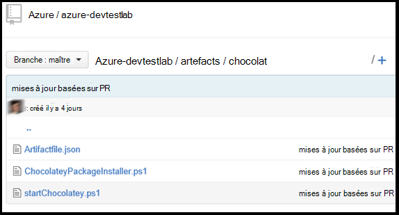

<properties 
    pageTitle="Créer des artefacts de personnalisé pour votre ordinateur virtuel Labs de DevTest | Microsoft Azure"
    description="Apprenez à créer vos propres objets pour une utilisation avec les laboratoires DevTest"
    services="devtest-lab,virtual-machines"
    documentationCenter="na"
    authors="tomarcher"
    manager="douge"
    editor=""/>

<tags
    ms.service="devtest-lab"
    ms.workload="na"
    ms.tgt_pltfrm="na"
    ms.devlang="na"
    ms.topic="article"
    ms.date="08/25/2016"
    ms.author="tarcher"/>

#Créer des artefacts de personnalisé pour votre ordinateur virtuel laboratoires de DevTest

> [AZURE.VIDEO how-to-author-custom-artifacts] 

## Vue d’ensemble
**Artefacts** sont utilisés pour déployer et configurer votre application après qu’un ordinateur virtuel est en service. Un artefact se compose d’un fichier de définition d’objet et d’autres fichiers de script stockés dans un dossier dans un référentiel git. Fichiers de définition d’artefact se composent de JSON et des expressions que vous pouvez utiliser pour spécifier ce que vous voulez installer sur une machine virtuelle. Par exemple, vous pouvez définir le nom de l’artefact, commande à exécuter et les paramètres qui sont mis à disposition lors de l’exécution de la commande. Vous pouvez faire référence à d’autres fichiers de script dans le fichier de définition d’artefact par nom.

##Format de fichier de définition d’artefact
L’exemple suivant montre les sections qui composent la structure de base d’un fichier de définition.

    {
      "$schema": "https://raw.githubusercontent.com/Azure/azure-devtestlab/master/schemas/2015-01-01/dtlArtifacts.json",
      "title": "",
      "description": "",
      "iconUri": "",
      "targetOsType": "",
      "parameters": {
        "<parameterName>": {
          "type": "",
          "displayName": "",
          "description": ""
        }
      },
      "runCommand": {
        "commandToExecute": ""
      }
    }

| Nom de l’élément | Obligatoire ? | Description
| ------------ | --------- | -----------
| $schema      | N°        | Emplacement du fichier de schéma JSON qui vous aide à tester la validité du fichier de définition.
| titre        | Oui       | Nom de l’objet affiché dans le laboratoire.
| Description  | Oui       | Description de l’objet affiché dans le laboratoire.
| iconUri      | N°        | URI de l’icône s’affichée dans le laboratoire.
| targetOsType | Oui       | Système d’exploitation de la machine virtuelle où artefact sera installé. Options prises en charge sont : Windows et Linux.
| paramètres   | N°        | Valeurs fournies lorsque la commande d’installation artefact est exécuté sur une machine. Cela permet la personnalisation de votre objet.
| runCommand   | Oui       | Artefact installer la commande est exécutée sur un ordinateur virtuel.

###Paramètres d’artefact

Dans la section Paramètres du fichier de définition, vous spécifiez les valeurs d’un utilisateur peut entrer lors de l’installation d’un artefact. Vous pouvez faire référence à ces valeurs dans la commande d’installation artefact.

Vous définissez des paramètres sera la structure suivante.

    "parameters": {
        "<parameterName>": {
          "type": "<type-of-parameter-value>",
          "displayName": "<display-name-of-parameter>",
          "description": "<description-of-parameter>"
        }
      }

| Nom de l’élément | Obligatoire ? | Description
| ------------ | --------- | -----------
| type de         | Oui       | Type de valeur de paramètre. Consultez la liste ci-dessous pour les types autorisés :
| displayName Oui       | Nom du paramètre qui est affiché à un utilisateur dans le laboratoire.
| Description  | Oui       | Description du paramètre s’affiche dans le laboratoire.

Les types autorisés sont :

- chaîne : toute chaîne JSON valide
- int : un nombre entier JSON valide
- bool : tout Boolean JSON valide
- tableau – tout tableau JSON valide

##Fonctions et expressions d’artefact

Vous pouvez utiliser des expression et fonctions pour construire l’objet commande d’installation.
Les expressions sont placées entre crochets ([et]) et sont évaluées lors de l’installation de l’artefact. Les expressions peuvent apparaître n’importe où dans une valeur de chaîne JSON et toujours retourner une autre valeur JSON. Si vous devez utiliser une chaîne littérale qui commence par un crochet [, vous devez utiliser deux crochets [[.
En général, vous utilisez des expressions avec des fonctions pour construire une valeur. Comme dans JavaScript, les appels de fonction sont mis en forme en tant que functionName(arg1,arg2,arg3)

La liste suivante affiche les fonctions communes.

- Parameters(parameterName) - renvoie une valeur de paramètre fournie lors de l’exécution de la commande de l’artefact.
- concat (arg1, arg2, arg3,...) - combine plusieurs valeurs de chaîne. Cette fonction peut prendre n’importe quel nombre d’arguments.

L’exemple suivant montre comment utiliser des fonctions et expression pour construire une valeur.

    runCommand": {
         "commandToExecute": "[concat('powershell.exe -File startChocolatey.ps1'
    , ' -RawPackagesList ', parameters('packages')
    , ' -Username ', parameters('installUsername')
    , ' -Password ', parameters('installPassword'))]"
    }

##Créez un objet personnalisé

Créez votre objet personnalisé en suivant les étapes ci-dessous :

1. Installer un éditeur de JSON, vous aurez besoin d’un éditeur de JSON pour travailler avec des fichiers de définition d’artefact. Nous vous recommandons d’à l’aide de [Code de Visual Studio](https://code.visualstudio.com/), qui est disponible pour Windows, Linux et OS X.

1. Obtenir un artifactfile.json exemple : extraction d’artefacts créés par l’équipe Azure DevTest Labs à notre [référentiel de GitHub](https://github.com/Azure/azure-devtestlab) où nous avons créé une riche bibliothèque d’artefacts qui vous permettra de créer vos propres objets. Téléchargement d’un fichier de définition d’objet et de le modifier pour créer vos propres objets.

1. Vérifiez l’utilisation de IntelliSense - IntelliSense exploiter pour voir les éléments valides qui peuvent être utilisés pour créer un fichier de définition d’artefact. Vous pouvez également voir les différentes options pour les valeurs d’un élément. Par exemple, IntelliSense vous montrer les deux choix de Windows ou Linux lors de la modification de l’élément **targetOsType** .

1. Stocker l’objet dans un référentiel git
    1. Créez un répertoire distinct pour chaque artefact, où le nom du répertoire est le même que le nom de l’objet.
    1. Stocker le fichier de définition d’objet (artifactfile.json) dans le répertoire que vous avez créé.
    1. Stocker les scripts qui sont référencés à partir de la commande d’installation artefact.

    Voici un exemple de la façon dont un dossier artefact peut se présenter :

    

1. Ajouter le référentiel d’artefacts à l’atelier -, reportez-vous à l’article, [Ajouter un référentiel d’artefact Git à un laboratoire](devtest-lab-add-artifact-repo.md).

[AZURE.INCLUDE [devtest-lab-try-it-out](../../includes/devtest-lab-try-it-out.md)]

## Publications de blogs connexes
- [Comment résoudre les problèmes liés à l’échec des artefacts dans AzureDevTestLabs](http://www.visualstudiogeeks.com/blog/DevOps/How-to-troubleshoot-failing-artifacts-in-AzureDevTestLabs)
- [Joindre un ordinateur virtuel à des domaines Active Directory existant à l’aide du modèle ARM dans le laboratoire de Test Dev Azure](http://www.visualstudiogeeks.com/blog/DevOps/Join-a-VM-to-existing-AD-domain-using-ARM-template-AzureDevTestLabs)

## Étapes suivantes

- Découvrez comment [Ajouter un référentiel d’artefact Git à un laboratoire](devtest-lab-add-artifact-repo.md).
