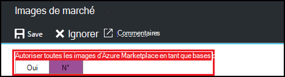
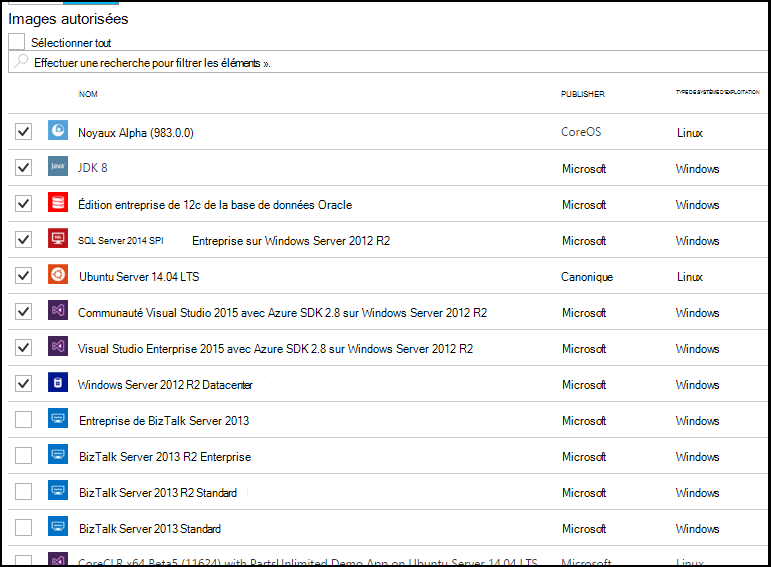

<properties
    pageTitle="Configurer les paramètres d’image Azure Marketplace dans Azure DevTest Labs | Microsoft Azure"
    description="Configurer les images Azure Marketplace peuvent être utilisés lors de la création d’une machine virtuelle dans Azure DevTest Labs"
    services="devtest-lab,virtual-machines"
    documentationCenter="na"
    authors="tomarcher"
    manager="douge"
    editor=""/>

<tags
    ms.service="devtest-lab"
    ms.workload="na"
    ms.tgt_pltfrm="na"
    ms.devlang="na"
    ms.topic="article"
    ms.date="09/06/2016"
    ms.author="tarcher"/>

# Configurer les paramètres d’image Azure Marketplace dans Azure DevTest Labs

DevTest Labs prend en charge les ordinateurs virtuels création basées sur des images en fonction de la façon dont vous avez configuré les images Azure Marketplace Azure Marketplace à utiliser dans votre laboratoire. Cet article vous indique comment spécifier qui, le cas échéant, les images d’Azure Marketplace peuvent être utilisé lors de la création d’ordinateurs virtuels dans un laboratoire.

## Sélectionnez les images Azure Marketplace sont autorisés lors de la création d’une machine virtuelle

1. Connectez-vous au [portail Azure](http://go.microsoft.com/fwlink/p/?LinkID=525040).

1. Sélectionnez **Plus de Services**et sélectionnez **DevTest Labs** à partir de la liste.

1. Dans la liste des laboratoires, sélectionnez l’atelier de votre choix. 

1. Sur les lames de l’atelier, sélectionnez **Configuration**.
    
1. Sur la lame de **Configuration** du laboratoire, sélectionnez **images de la Marketplace**

1. Spécifiez si vous souhaitez que toutes les images Azure Marketplace qualifiées pour être utilisé comme base d’une nouvelle machine virtuelle. Si vous sélectionnez **Oui**, toutes les images d’Azure Marketplace qui répondent à tous les critères suivants sont autorisés dans le laboratoire :

    - L’image crée une machine virtuelle unique **et**
    - L’image utilise Azure le Gestionnaire de ressources à la disposition de machines virtuelles **et**
    - L’image ne nécessite pas d’achat d’un plan de gestion des licences supplémentaires
    
    Si vous ne souhaitez aucune image à être autorisée, ou que vous souhaitez spécifier les images peuvent être utilisées, sélectionnez **non**.
 
    
 
1. Si vous sélectionnez **non** à l’étape précédente, la case à cocher **Images autorisées/sélectionner tous les** est activée. Vous pouvez utiliser cette option avec la zone de recherche pour rapidement sélectionner ou désélectionner tous les éléments affichés dans la liste.
Vous pouvez également sélectionner les images Azure Marketplace que vous voulez autoriser pour la création de la machine virtuelle individuellement en cochant les cases à cocher correspondantes de chaque image.
Si vous ne souhaitez pas autoriser toutes les images à utiliser dans le laboratoire Azure Marketplace ne sélectionnez rien dans la liste.

    

[AZURE.INCLUDE [devtest-lab-try-it-out](../../includes/devtest-lab-try-it-out.md)]

## Étapes suivantes

Une fois que vous avez configuré la façon dont les images Azure Marketplace sont autorisés lors de la création d’une machine virtuelle, l’étape suivante consiste à [Ajouter un ordinateur virtuel à votre laboratoire](./devtest-lab-add-vm-with-artifacts.md).