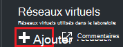
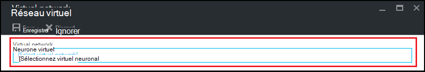
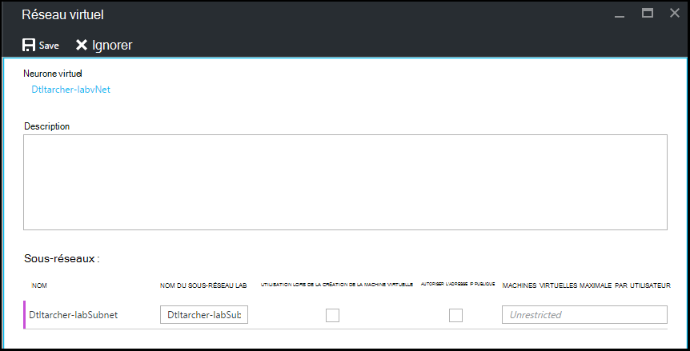

<properties
    pageTitle="Configurer un réseau virtuel dans Azure DevTest Labs | Microsoft Azure"
    description="Apprenez à configurer un réseau virtuel existant et le sous-réseau et les utiliser dans une machine virtuelle avec Azure DevTest Labs"
    services="devtest-lab,virtual-machines"
    documentationCenter="na"
    authors="tomarcher"
    manager="douge"
    editor=""/>

<tags
    ms.service="devtest-lab"
    ms.workload="na"
    ms.tgt_pltfrm="na"
    ms.devlang="na"
    ms.topic="article"
    ms.date="09/06/2016"
    ms.author="tarcher"/>

# Configurer un réseau virtuel dans Azure DevTest Labs

Comme expliqué dans l’article, [Ajouter un ordinateur virtuel avec des artefacts à un laboratoire](devtest-lab-add-vm-with-artifacts.md), lorsque vous créez un ordinateur virtuel dans un laboratoire, vous pouvez spécifier un réseau virtuel configuré. Un scénario pour cela est que si vous avez besoin d’accéder aux ressources de votre réseau d’entreprise à partir de vos ordinateurs virtuels à l’aide de l’ordinateur virtuel qui a été configuré avec ExpressRoute ou VPN de site à site. Les sections suivantes montrent comment ajouter votre réseau virtuel existant dans les paramètres de réseau virtuel d’un laboratoire afin qu’il soit disponible à choisir lors de la création d’ordinateurs virtuels.

## Configurer un réseau virtuel pour un laboratoire à l’aide du portail Azure
La procédure suivante explique comment ajouter un réseau virtuel existant (et le sous-réseau) à un laboratoire d’afin qu’il puisse être utilisé lors de la création d’une machine virtuelle dans le même laboratoire. 

1. Connectez-vous au [portail Azure](http://go.microsoft.com/fwlink/p/?LinkID=525040).

1. Sélectionnez **Plus de Services**et sélectionnez **DevTest Labs** à partir de la liste.

1. Dans la liste des laboratoires, sélectionnez l’atelier de votre choix. 

1. Sur les lames de l’atelier, sélectionnez **Configuration**.

1. Sur la lame de **Configuration** de l’atelier, sélectionnez **réseaux virtuels**.

1. Sur la lame de **réseaux virtuels** , vous voyez une liste des réseaux virtuels configurés pour le laboratoire en cours ainsi que le réseau virtuel par défaut qui est créé pour votre laboratoire. 

1. Sélectionnez **+ Ajouter**.

    
    
1. Sur la lame de **réseau virtuel** , sélectionner **[réseau virtuel]**.

    
    
1. Sur la lame de **réseau virtuel de choisir** , sélectionnez le réseau virtuel souhaité. Le serveur lame indique tous les réseaux virtuels sont dans la même région dans l’abonnement comme le laboratoire.  

1. Après avoir sélectionné un réseau virtuel, vous êtes renvoyé à la lame de **réseau virtuel** et plusieurs champs sont activés.  

    

1. Spécifiez une description pour votre réseau virtuel / combinaison de laboratoire.

1. Pour permettre à un sous-réseau être utilisée dans le laboratoire de création de la machine virtuelle, sélectionnez **Utiliser dans la création de machines virtuelles**.

1. Pour autoriser les adresses IP publiques dans un sous-réseau, sélectionnez **Autoriser l’adresse IP publique**.

1. Dans le champ **MAXIMUM DE MACHINES virtuelles par utilisateur** , spécifiez les VM maximum par utilisateur pour chaque sous-réseau. Si vous souhaitez un nombre illimité de machines virtuelles, laissez ce champ vide.

1. Cliquez sur **Enregistrer**.

1. Maintenant que le réseau virtuel est configuré, il peut être sélectionné lors de la création d’une machine virtuelle. Pour voir comment créer un ordinateur virtuel et spécifier un réseau virtuel, reportez-vous à l’article, [Ajouter un ordinateur virtuel avec des artefacts à un laboratoire](devtest-lab-add-vm-with-artifacts.md). 

[AZURE.INCLUDE [devtest-lab-try-it-out](../../includes/devtest-lab-try-it-out.md)]

## Étapes suivantes

Une fois que vous avez ajouté le réseau virtuel souhaité pour votre laboratoire, l’étape suivante consiste à [Ajouter un ordinateur virtuel à votre laboratoire](devtest-lab-add-vm-with-artifacts.md).