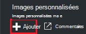
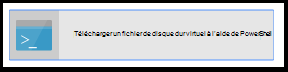
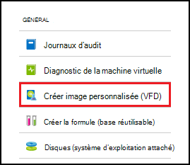
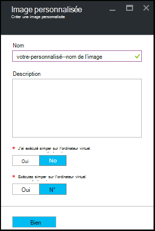

<properties
    pageTitle="Gérer des images personnalisées d’Azure DevTest Labs pour créer des ordinateurs virtuels | Microsoft Azure"
    description="Apprenez à créer une image personnalisée à partir d’un fichier de disque dur virtuel ou une VM existante dans Azure DevTest Labs"
    services="devtest-lab,virtual-machines"
    documentationCenter="na"
    authors="tomarcher"
    manager="douge"
    editor=""/>

<tags
    ms.service="devtest-lab"
    ms.workload="na"
    ms.tgt_pltfrm="na"
    ms.devlang="na"
    ms.topic="article"
    ms.date="09/07/2016"
    ms.author="tarcher"/>

# Gérer des images personnalisées d’Azure DevTest Labs pour créer des ordinateurs virtuels

Dans les ateliers de DevTest d’Azure, images personnalisées permettent de vous permet de créer rapidement des machines virtuelles sans attendre que tous les logiciels requis doit être installé sur l’ordinateur cible. Des images personnalisées vous permettent d’utiliser tous les logiciels dont vous avez besoin dans un fichier de disque dur virtuel et ensuite utilisent le fichier de disque dur virtuel pour créer un ordinateur virtuel. Dans la mesure où le logiciel est déjà installé, l’heure de création de machines virtuelles est beaucoup plus rapide. En outre, les images personnalisées sont utilisés pour cloner des machines virtuelles en créant une image personnalisée à partir d’un ordinateur virtuel, puis création d’ordinateurs virtuels à partir de cette image personnalisée.

Dans cet article, vous apprendrez comment :

- [Créer une image personnalisée à partir d’un fichier de disque dur virtuel de](#create-a-custom-image-from-a-vhd-file) sorte que vous pouvez ensuite créer une machine virtuelle à partir de cette image personnalisée. 
- [Créer une image personnalisée à partir d’un ordinateur virtuel](#create-a-custom-image-from-a-vm) pour un clonage rapide VM.

## Créer une image personnalisée à partir d’un fichier de disque dur virtuel

Dans cette section, vous allez apprendre à créer une image personnalisée à partir d’un fichier de disque dur virtuel.
Vous devez avoir accès à un fichier de disque dur virtuel valide pour effectuer toutes les étapes de cette section.   

1. Connectez-vous au [portail Azure](http://go.microsoft.com/fwlink/p/?LinkID=525040).

1. Sélectionnez les **autres services**et sélectionnez **DevTest Labs** à partir de la liste.

1. Dans la liste des laboratoires, sélectionnez l’atelier de votre choix.  

1. Sur les lames de l’atelier, sélectionnez **Configuration**. 

1. Sur la lame de **Configuration** lab, sélectionnez **les images personnalisées**.

1. Sur la lame **les images personnalisé** , sélectionnez **+ image personnalisée**.

    

1. Entrez le nom de l’image personnalisée. Ce nom s’affiche dans la liste d’images de base lors de la création d’une machine virtuelle.

1. Entrez la description de l’image personnalisée. Cette description est affichée dans la liste d’images de base lors de la création d’une machine virtuelle.

1. Sélectionnez le **fichier de disque dur virtuel**.

1. Si vous avez accès à un fichier de disque dur virtuel qui n’est pas répertorié, ajoutez-la en suivant les instructions de la section de [téléchargement d’un fichier de disque dur virtuel](#upload-a-vhd-file) et revenir ici lorsque vous avez terminé.

1. Sélectionnez le fichier de disque dur virtuel souhaité.

1. Cliquez sur **OK** pour fermer la lame du **Fichier VHD** .

1. Sélectionnez **Configuration du système d’exploitation**.

1. Sous l’onglet **Configuration du système d’exploitation** , sélectionnez **Windows** ou **Linux**.

1. Si **Windows** est sélectionné, spécifiez via la case à cocher si *Sysprep* a été exécuté sur l’ordinateur.

1. Cliquez sur **OK** pour fermer la lame de **Configuration du système d’exploitation** .

1. Cliquez sur **OK** pour créer l’image personnalisée.

1. Passez à la section [Étapes suivantes](#next-steps) .

###Télécharger un fichier de disque dur virtuel

Pour ajouter une image personnalisée, vous devez avoir accès à un fichier de disque dur virtuel.

1. Sur la lame de **Fichier VHD** , sélectionnez **télécharger un fichier de disque dur virtuel à l’aide de PowerShell**.

    

1. La lame suivante affiche les instructions pour modifier et exécuter un script PowerShell qui télécharge à votre abonnement Azure, un fichier de disque dur virtuel. 
**Remarque :** Ce processus peut être long selon la taille du fichier VHD et votre vitesse de connexion.

## Créer une image personnalisée à partir d’un ordinateur virtuel
Si vous disposez d’un ordinateur virtuel qui est déjà configuré, vous pouvez créer une image personnalisée à partir de cet ordinateur virtuel et ensuite utiliser cette image personnalisée pour créer d’autres machines virtuelles identiques. Les étapes suivantes montrent comment créer une image personnalisée à partir d’un ordinateur virtuel :

1. Connectez-vous au [portail Azure](http://go.microsoft.com/fwlink/p/?LinkID=525040).

1. Sélectionnez les **autres services**et sélectionnez **DevTest Labs** à partir de la liste.

1. Dans la liste des laboratoires, sélectionnez l’atelier de votre choix.  

1. Sur les lames de l’atelier, sélectionnez **mes machines virtuelles**.
 
1. Sur la lame de **mes machines virtuelles** , sélectionnez la machine virtuelle à partir de laquelle vous souhaitez créer l’image personnalisée.

1. Sur la lame de l’ordinateur, sélectionnez **créer une image personnalisée (VHD)**.

    

1. Sur la lame de **créer une image** , entrez un nom et une description pour votre image personnalisée. Lorsque vous créez une machine virtuelle, cette information s’affiche dans la liste des bases.

    

1. Permet d’indiquer si sysprep a été exécuté sur l’ordinateur virtuel. Si la sysprep n’a pas été exécutée sur l’ordinateur virtuel, spécifiez si vous voulez exécuter lorsqu’un ordinateur virtuel est créé à partir de cette image personnalisée de sysprep.

1. Cliquez sur **OK** lorsque vous avez terminé de créer l’image personnalisée.

[AZURE.INCLUDE [devtest-lab-try-it-out](../../includes/devtest-lab-try-it-out.md)]

## Publications de blogs connexes

- [Des images personnalisées ou des formules ?](https://blogs.msdn.microsoft.com/devtestlab/2016/04/06/custom-images-or-formulas/)
- [Copie d’Images personnalisés entre DevTest Azure Labs](http://www.visualstudiogeeks.com/blog/DevOps/How-To-Move-CustomImages-VHD-Between-AzureDevTestLabs#copying-custom-images-between-azure-devtest-labs)

##Étapes suivantes

Une fois que vous avez ajouté une image personnalisée à utiliser lors de la création d’une machine virtuelle, l’étape suivante consiste à [Ajouter un ordinateur virtuel à votre laboratoire](./devtest-lab-add-vm-with-artifacts.md).