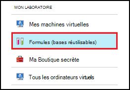
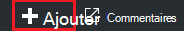
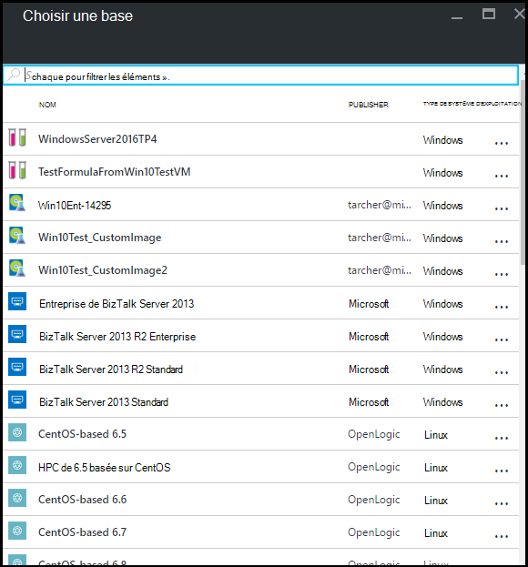
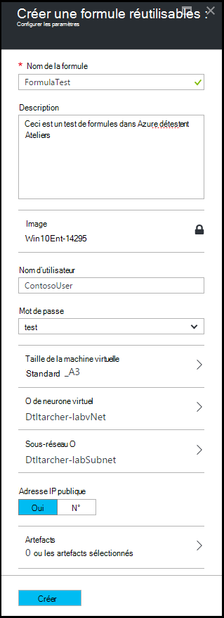
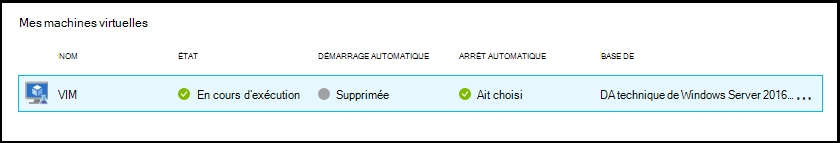
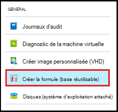
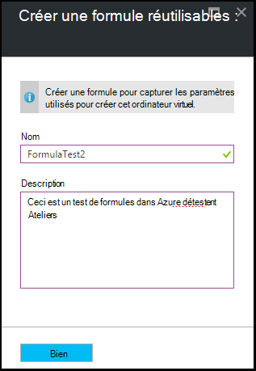
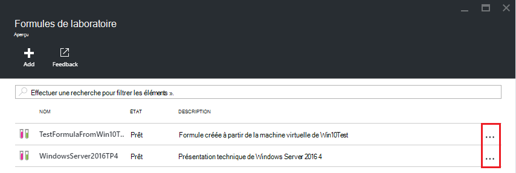
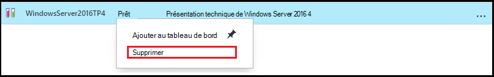

<properties
    pageTitle="Gérer les formules dans les laboratoires de DevTest Azure pour créer des ordinateurs virtuels | Microsoft Azure"
    description="Découvrez comment créer, mettre à jour et supprimer les formules Azure DevTest Labs et les utiliser pour créer de nouvelles machines virtuelles."
    services="devtest-lab,virtual-machines"
    documentationCenter="na"
    authors="tomarcher"
    manager="douge"
    editor=""/>

<tags
    ms.service="devtest-lab"
    ms.workload="na"
    ms.tgt_pltfrm="na"
    ms.devlang="na"
    ms.topic="article"
    ms.date="08/30/2016"
    ms.author="tarcher"/>

# Gérer les formules de DevTest Labs pour créer des ordinateurs virtuels

Une formule dans Azure DevTest Labs est une liste de valeurs de propriété par défaut permet de créer une machine virtuelle (VM). Lorsque vous créez un ordinateur virtuel à partir d’une formule, les valeurs par défaut peuvent être utilisés en tant que-est ou modifié. Comme [des images personnalisées](./devtest-lab-create-template.md) et les [images du marché](./devtest-lab-configure-marketplace-images.md), les formules fournissent un mécanisme de mise en service rapide de machine virtuelle.  

Dans cet article, vous allez apprendre à effectuer les tâches suivantes :

- [Créer une formule](#create-a-formula)
- [Utiliser une formule pour mettre en service un ordinateur virtuel](#use-a-formula-to-provision-a-vm)
- [Modifier une formule](#modify-a-formula)
- [Supprimer une formule](#delete-a-formula)

> [AZURE.NOTE] Formules - comme [des images personnalisées](./devtest-lab-create-template.md) - permettent de créer une image de base à partir d’un fichier de disque dur virtuel. L’image de base puis peut servir à configurer un nouvel ordinateur virtuel. Pour vous aider à décider qui est adaptée à votre environnement particulier, reportez-vous à l’article de la [comparaison des images personnalisées et les formules dans les laboratoires DevTest](./devtest-lab-comparing-vm-base-image-types.md).

## Créer une formule
Quiconque disposant d’autorisations de DevTest Labs *les utilisateurs* est en mesure de créer des ordinateurs virtuels à l’aide d’une formule comme base. Il existe deux façons de créer des formules : 

- À partir d’une base - utiliser lorsque vous souhaitez définir toutes les caractéristiques de la formule.
- À partir d’un laboratoire existant VM - à utiliser lorsque vous souhaitez créer une formule en fonction des paramètres d’un ordinateur virtuel existant.

### Créer une formule à partir d’une base
La procédure suivante vous guide à travers le processus de création d’une formule d’une image personnalisée, image de marché ou d’une autre formule.

1. Connectez-vous au [portail Azure](http://go.microsoft.com/fwlink/p/?LinkID=525040).

1. Sélectionnez **Plus de Services**et sélectionnez **DevTest Labs** à partir de la liste.

1. Dans la liste des laboratoires, sélectionnez l’atelier de votre choix.  

1. Sur les lames de l’atelier, sélectionner **des formules (bases réutilisables)**.

    

1. Sur la lame de **formules de l’atelier** , sélectionnez **+ Ajouter**.

    

1. Sur la lame de **Choisir une base** , sélectionnez la base à partir de laquelle vous souhaitez créer la formule (image personnalisée, image de marché ou formule).

    

1. Sur la lame de la **formule de la créer** , spécifiez les valeurs suivantes :

    - **Nom de la formule** : entrez un nom pour votre formule. Cette valeur s’affichera dans la liste d’images de base lorsque vous créez un ordinateur virtuel. Le nom est validé comme vous le tapez et si elle est non valide, un message indique la configuration requise pour un nom valide.
    - **Description** : entrez une description explicite de la formule. Cette valeur est disponible à partir du menu contextuel de la formule lorsque vous créez un ordinateur virtuel.
    - **Nom d’utilisateur** - Entrez un nom d’utilisateur qui est accordé des privilèges d’administrateur.
    - **Mot de passe** - Entrez - ou sélectionnez dans la liste déroulante - une valeur qui est associée avec le code secret (mot de passe) que vous souhaitez utiliser pour l’utilisateur spécifié.  
    - **Image** – ce champ affiche le nom de l’image de base que vous avez sélectionné sur la lame précédente. 
    - **Taille de machine virtuelle** - sélectionnez un des éléments prédéfinis qui spécifient les cœurs de processeur, la taille de RAM et la taille du disque dur de l’ordinateur virtuel à créer.
    - **Réseau virtuel** - spécifier le réseau virtuel souhaité.
    - **Sous-réseau** - spécifier le sous-réseau souhaité.
    - **Adresse IP publique** : si la stratégie du laboratoire est définie pour autoriser les adresses IP publiques pour le sous-réseau sélectionné, spécifiez si vous souhaitez que l’adresse IP soit publique en ne sélectionnant **Oui** ou ****. Dans le cas contraire, cette option est désactivée et sélectionnée comme **N°**.
    - **Artefacts** - sélectionner et configurer les artefacts que vous souhaitez ajouter à l’image de base. Sécuriser la chaîne de valeurs ne sont pas enregistrées avec la formule. Par conséquent, les paramètres d’artefact sont les chaînes sécurisées ne sont pas affichés. 

        

1. Sélectionnez **créer** pour créer la formule.

### Créer une formule à partir d’un ordinateur virtuel
La procédure suivante vous guide à travers le processus de création d’une formule basée sur une machine virtuelle existante. 

> [AZURE.NOTE] Pour créer une formule à partir d’un ordinateur virtuel, la machine virtuelle doit avoir été créée après le 30 mars 2016. 

1. Connectez-vous au [portail Azure](http://go.microsoft.com/fwlink/p/?LinkID=525040).

1. Sélectionnez **Plus de Services**et sélectionnez **DevTest Labs** à partir de la liste.

1. Dans la liste des laboratoires, sélectionnez l’atelier de votre choix.  

1. Sur la lame de **présentation** de l’atelier, sélectionnez la machine virtuelle à partir de laquelle vous souhaitez créer la formule.

    

1. Sur la lame de l’ordinateur, sélectionnez **créer formule (base réutilisable)**.

    

1. Sur la lame de **formule de créer** , entrez un **nom** et une **Description** pour votre nouvelle formule.

    

1. Cliquez sur **OK** pour créer la formule.

## Utiliser une formule pour mettre en service un ordinateur virtuel
Une fois que vous avez créé une formule, vous pouvez créer un ordinateur virtuel en fonction de cette formule. La section [Ajouter une machine virtuelle avec les artefacts](devtest-lab-add-vm-with-artifacts.md#add-a-vm-with-artifacts) vous guide tout au long du processus.

## Modifier une formule
Pour modifier une formule, procédez comme suit :

1. Connectez-vous au [portail Azure](http://go.microsoft.com/fwlink/p/?LinkID=525040).

1. Sélectionnez **Plus de Services**et sélectionnez **DevTest Labs** à partir de la liste.

1. Dans la liste des laboratoires, sélectionnez l’atelier de votre choix.  

1. Sur les lames de l’atelier, sélectionner **des formules (bases réutilisables)**.

    

1. Sur la lame de **formules de l’atelier** , sélectionnez la formule que vous souhaitez modifier.

1. Sur la lame de **mettre à jour la formule** , apportez les modifications souhaitées et sélectionnez **mise à jour**.

## Supprimer une formule 
Pour supprimer une formule, procédez comme suit :

1. Connectez-vous au [portail Azure](http://go.microsoft.com/fwlink/p/?LinkID=525040).

1. Sélectionnez **Plus de Services**et sélectionnez **DevTest Labs** à partir de la liste.

1. Dans la liste des laboratoires, sélectionnez l’atelier de votre choix.  

1. Sur la lame de **paramètres** lab, sélectionnez les **formules**.

    

1. Sur la lame de **formules de l’atelier** , sélectionnez les points de suspension à droite de la formule que vous souhaitez supprimer.

    

1. Dans le menu contextuel de la formule, cliquez sur **Supprimer**.

    

1. Sélectionnez **Oui** dans la boîte de dialogue de confirmation de suppression.

[AZURE.INCLUDE [devtest-lab-try-it-out](../../includes/devtest-lab-try-it-out.md)]

## Publications de blogs connexes

- [Des images personnalisées ou des formules ?](https://blogs.msdn.microsoft.com/devtestlab/2016/04/06/custom-images-or-formulas/)

## Étapes suivantes
Une fois que vous avez créé une formule à utiliser lors de la création d’une machine virtuelle, l’étape suivante consiste à [Ajouter un ordinateur virtuel à votre laboratoire](./devtest-lab-add-vm-with-artifacts.md).