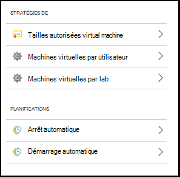
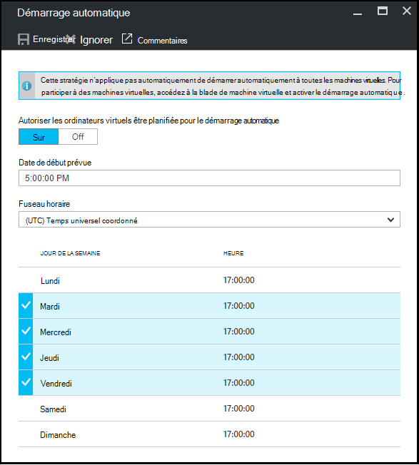

<properties
    pageTitle="Définir les stratégies de laboratoire dans Azure DevTest Labs | Microsoft Azure"
    description="Apprenez à définir des stratégies de laboratoire tels que les tailles VM, VM maximum par l’utilisateur et de l’automatisation de l’arrêt."
    services="devtest-lab,virtual-machines"
    documentationCenter="na"
    authors="tomarcher"
    manager="douge"
    editor=""/>

<tags
    ms.service="devtest-lab"
    ms.workload="na"
    ms.tgt_pltfrm="na"
    ms.devlang="na"
    ms.topic="article"
    ms.date="09/12/2016"
    ms.author="tarcher"/>

# Définir les stratégies de laboratoire dans Azure DevTest Labs

> [AZURE.VIDEO how-to-set-vm-policies-in-a-devtest-lab]

Azure DevTest Labs vous permet de spécifier des stratégies de clés qui vous aident à contrôler les coûts et réduire les déchets dans vos laboratoires. Ces stratégies de laboratoire comprennent le nombre maximal d’ordinateurs virtuels créés par utilisateur et par le laboratoire et diverses options d’arrêt automatique et auto-start. 

## L’accès à des stratégies d’un laboratoire dans Azure DevTest Labs

Les étapes suivantes vous guident dans le processus de configuration des stratégies pour un atelier de Azure DevTest Labs :

Pour afficher (et modifier) les stratégies pour un laboratoire, procédez comme suit :

1. Connectez-vous au [portail Azure](http://go.microsoft.com/fwlink/p/?LinkID=525040).

1. Sélectionnez les **autres services**et sélectionnez **DevTest Labs** à partir de la liste.

1. Dans la liste des laboratoires, sélectionnez l’atelier de votre choix.   

1. Sélectionnez les **paramètres de stratégie**.

1. La lame de **paramètres de stratégie** contienne un menu de paramètres que vous pouvez spécifier : 

    

    Pour plus d’informations sur la définition d’une règle, sélectionnez-la dans la liste suivante :

    - [Tailles de machine virtuelle autorisées](#set-allowed-virtual-machine-sizes) , sélectionnez la liste de tailles de mémoire virtuelle autorisée dans le laboratoire. Un utilisateur peut créer des ordinateurs virtuels uniquement à partir de cette liste.

    - [Machines virtuelles par utilisateur](#set-virtual-machines-per-user) - spécifier le nombre maximum de machines virtuelles qui peuvent être créés par un utilisateur. 

    - [Machines virtuelles par lab](#set-virtual-machines-per-lab) - spécifier le nombre maximum de machines virtuelles qui peuvent être créés pour un atelier. 

    - [Arrêt automatique](#set-auto-shutdown) - spécifiez l’heure lorsque l’atelier en cours de machines virtuelles s’arrête automatiquement.

    - [Démarrage automatique](#set-auto-start) - spécifiez l’heure lors VMs de l’atelier en cours démarrent automatiquement.

## Jeu de machine virtuelle tailles autorisée

La stratégie pour définir les tailles autorisées de la machine virtuelle permet de réduire les déchets de travaux pratiques en vous permettant de spécifier les tailles de la machine virtuelle sont autorisés dans le laboratoire. Si cette stratégie est activée, seules les tailles de machine virtuelle à partir de cette liste peuvent servir à créer des ordinateurs virtuels.

1. Sur la lame de **paramètres de stratégie** de l’atelier, sélectionnez les **tailles de machines virtuelles autorisées**.

    
 
1. Sélectionnez **sur** pour activer cette stratégie et **Off** pour le désactiver.

1. Si vous activez cette stratégie, sélectionnez une ou plusieurs tailles de machine virtuelle qui peuvent être créés dans votre laboratoire.

1. Cliquez sur **Enregistrer**.

## Machines virtuelles de jeu par utilisateur

La stratégie pour les **machines virtuelles par utilisateur** vous permet de spécifier le nombre maximum de machines virtuelles qui peuvent être créés par un utilisateur individuel. Si un utilisateur tente de créer une machine virtuelle lorsque la nombre limite d’utilisateurs a été atteint, un message d’erreur indique que la machine virtuelle ne peut pas être créée. 

1. Sur la lame de **paramètres de stratégie** de l’atelier, sélectionnez **machines virtuelles par utilisateur**.

    

1. Sélectionnez **sur** pour activer cette stratégie et **Off** pour le désactiver.

1. Si vous activez cette stratégie, entrez une valeur numérique qui indique le nombre maximum de machines virtuelles qui peuvent être créés par un utilisateur. Si vous entrez un numéro qui n’est pas valide, l’interface utilisateur affiche le nombre maximal autorisé pour ce champ.

1. Cliquez sur **Enregistrer**.

## Machines virtuelles de jeu par le laboratoire

La stratégie pour les **machines virtuelles par lab** vous permet de vous permet de spécifier le nombre maximum de machines virtuelles qui peuvent être créés pour les travaux pratiques en cours. Si un utilisateur tente de créer un ordinateur virtuel lorsque la limite de l’atelier a été atteint, un message d’erreur indique que la machine virtuelle ne peut pas être créée. 

1. Sur la lame de **paramètres de stratégie** de l’atelier, sélectionnez **machines virtuelles par le laboratoire**.

    

1. Sélectionnez **sur** pour activer cette stratégie et **Off** pour le désactiver.

1. Si vous activez cette stratégie, entrez une valeur numérique qui indique le nombre maximum de machines virtuelles qui peuvent être créés pour les travaux pratiques en cours. Si vous entrez un numéro qui n’est pas valide, l’interface utilisateur affiche le nombre maximal autorisé pour ce champ.

1. Cliquez sur **Enregistrer**.

## Arrêt automatique de jeu

La stratégie d’arrêt automatique permet de réduire les déchets de travaux pratiques en vous permettant de spécifier l’heure à laquelle les ordinateurs virtuels de cet atelier s’arrêter.

1. Sur la lame de **paramètres de stratégie** de l’atelier, sélectionnez **arrêt automatique**.

    

1. Sélectionnez **sur** pour activer cette stratégie et **Off** pour le désactiver.

1. Si vous activez cette stratégie, spécifiez l’heure locale pour arrêter tous les ordinateurs virtuels dans le laboratoire en cours.

1. Cliquez sur **Enregistrer**.

1. Par défaut, une fois activée, cette stratégie s’applique à tous les ordinateurs virtuels dans le laboratoire en cours. Pour supprimer ce paramètre à partir d’un ordinateur virtuel spécifique, ouvrez les lames de la machine virtuelle et modifier son paramètre **d’arrêt automatique** 

## Démarrage automatique de jeu

La stratégie de démarrage automatique vous permet de spécifier quand les ordinateurs virtuels dans le laboratoire en cours doivent être démarrés.  

1. Sur la lame de **paramètres de stratégie** de l’atelier, sélectionnez **démarrage automatique**.

    

1. Sélectionnez **sur** pour activer cette stratégie et **Off** pour le désactiver.

1. Si vous activez cette stratégie, spécifiez le local programmé heure de début et les jours de la semaine auquel s’applique l’heure. 

1. Cliquez sur **Enregistrer**.

1. Une fois activée, cette stratégie n’est pas automatiquement appliquée à des ordinateurs virtuels dans le laboratoire en cours. Pour appliquer ce paramètre à une machine virtuelle spécifique, ouvrez les lames de la machine virtuelle et modifier son paramètre de **démarrage automatique** 

[AZURE.INCLUDE [devtest-lab-try-it-out](../../includes/devtest-lab-try-it-out.md)]

## Étapes suivantes

Une fois que vous avez défini et appliqué les différents paramètres de stratégie de machine virtuelle pour votre laboratoire, voici quelques conseils suivant :

- [Gestion des coûts de configuration](./devtest-lab-configure-cost-management.md) - illustre comment utiliser le graphique de **l’Évolution du coût mensuel estimé**  
Pour afficher le mois en cours d’estimation coût à ce jour et le coût prévisionnel de la fin du mois.
- [Créer une image personnalisée](./devtest-lab-create-template.md) - lorsque vous créez un ordinateur virtuel, vous spécifiez une base, qui peut être soit une image personnalisée ou un Marketplace. Cet article explique comment créer une image personnalisée à partir d’un fichier de disque dur virtuel.
- [Configurer le Marketplace images](./devtest-lab-configure-marketplace-images.md) - Azure DevTest Labs prend en charge la création d’ordinateurs virtuels basés sur des images d’Azure Marketplace. Cet article explique comment spécifier qui, le cas échéant, les images d’Azure Marketplace peuvent être utilisé lors de la création d’ordinateurs virtuels dans un laboratoire.
- [Créer un ordinateur virtuel dans un laboratoire](./devtest-lab-add-vm-with-artifacts.md) - illustre comment créer un ordinateur virtuel à partir d’une image de base (soit personnalisé ou Marketplace) et l’utilisation des artefacts dans votre machine virtuelle.
