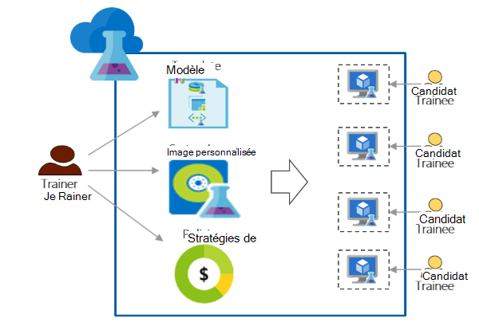

<properties
    pageTitle="Utiliser Azure DevTest Labs pour la formation | Microsoft Azure"
    description="Découvrez comment utiliser Azure DevTest Labs pour les scénarios de formation."
    services="devtest-lab,virtual-machines"
    documentationCenter="na"
    authors="steved0x"
    manager="douge"
    editor=""/>

<tags
    ms.service="devtest-lab"
    ms.workload="na"
    ms.tgt_pltfrm="na"
    ms.devlang="na"
    ms.topic="article"
    ms.date="09/12/2016"
    ms.author="sdanie"/>

# Utiliser Azure DevTest Labs pour la formation

Azure DevTest Labs peut servir à mettre en œuvre les nombreux scénarios clés en plus du développement/test. Une de ces scénarios consiste à configurer un laboratoire pour la formation. Azure DevTest Labs vous permet de créer un laboratoire où vous pouvez fournir des modèles personnalisés pour chaque stagiaire permet de créer des environnements identiques et isolés pour la formation. Vous pouvez vous assurer que les environnements de formation sont disponibles pour chaque stagiaire uniquement lorsqu’ils en ont besoin et contient suffisamment de ressources - tels que les ordinateurs virtuels - requis pour la formation. Enfin, vous pouvez facilement partager l’atelier avec les stagiaires, dont ils peuvent accéder en un seul clic.   

Azure Labs de DevTest les conditions requises suivantes nécessaires à la conduite de la formation dans un environnement virtuel : 

-   Stagiaires ne peuvent pas voir les ordinateurs virtuels créés par les autres stagiaires.
-   Chaque machine de formation doit être identique
-   Stagiaires peuvent provisionner rapidement de leurs environnements de formation
-   Contrôle des coûts en veillant à ce que les stagiaires ne peuvent pas obtenir davantage d’ordinateurs virtuels que nécessaire pour la formation et également l’arrêt VMs lorsqu’ils n’utilisent pas les
-   L’atelier de formation de partager facilement avec chaque candidat
-   Réutiliser indéfiniment de l’atelier de formation

Dans cet article, vous en savoir plus sur les différentes fonctionnalités d’Azure DevTest Labs qui peuvent être utilisées pour répondre aux besoins de formation décrites précédemment et des étapes détaillées que vous pouvez suivre pour configurer un laboratoire pour la formation.  

## Mise en œuvre de la formation avec Azure DevTest Labs

1. **Créer le laboratoire** 

    Les laboratoires sont le point de départ dans Azure DevTest Labs. Une fois que vous créez un laboratoire, vous pouvez effectuer des tâches telles qu’ajouter des utilisateurs (personnel) à l’atelier, définir des stratégies pour contrôler les coûts, de définir des images de machine virtuelle qui peuvent de créer rapidement et plus encore.   

    Pour en savoir plus, cliquez sur les liens dans le tableau suivant :

  	| Tâche                                                            | Ce que vous apprenez                                                    |
|-----------------------------------------------------------------|----------------------------------------------------------------------|
| [Création d’un atelier dans Azure DevTest Labs](devtest-lab-create-lab.md) | Apprenez à créer un atelier dans Azure DevTest Labs dans le portail Azure. |

2. **Créer des ordinateurs virtuels de formation en quelques minutes à l’aide de marché prêtes à l’emploi et les images personnalisées** 
    
    Vous pouvez choisir les images prêtes à l’emploi d’une grande variété d’images sur le marché d’Azure et les rendre disponibles pour les stagiaires de l’atelier. Si les images prêtes à l’emploi ne répondent pas à vos besoins, vous pouvez créer une image personnalisée en créant un machine virtuelle à l’aide d’une image prête à l’emploi d’Azure Marketplace, installer tous les logiciels dont vous avez besoin pour la formation et l’enregistrement de la machine virtuelle sous la forme d’une image personnalisée dans le laboratoire du laboratoire. 

    Pour en savoir plus, cliquez sur les liens dans le tableau suivant :

  	| Tâche                                                                              | Ce que vous apprenez                                                                                                                                  |
|-----------------------------------------------------------------------------------|-------------------------------------------------------------------------------------------------------------------------------------------------|
| [Configurer les images Azure Marketplace](devtest-lab-configure-marketplace-images.md) | Découvrez comment vous pouvez les images Azure Marketplace d’autorisation ; mise à disposition pour la sélection uniquement les images que vous souhaitez pour la formation.                 |
| [Créer une image personnalisée](devtest-lab-create-template.md)                           | Créer une image personnalisée en avant l’installation du logiciel que vous avez besoin pour la formation afin que les stagiaires peuvent créer rapidement un ordinateur virtuel à l’aide de l’image personnalisée. |

3. **Créer des modèles réutilisables pour les machines de la formation** 

    Une formule dans Azure DevTest Labs est une liste de valeurs de propriété par défaut utilisé pour créer un ordinateur virtuel. Vous pouvez créer une formule dans le laboratoire, en choisissant une image, une taille de mémoire virtuelle (il s’agit d’une combinaison de processeur et la RAM) et un réseau virtuel. Chaque stagiaire peut voir la formule dans le laboratoire et l’utiliser pour créer un ordinateur virtuel. 

    Pour en savoir plus, cliquez sur les liens dans le tableau suivant :

  	| Tâche                                                                         | Ce que vous apprenez                                                                                                          |
|------------------------------------------------------------------------------|-------------------------------------------------------------------------------------------------------------------------|
| [Gérer les formules de DevTest Labs pour créer des ordinateurs virtuels](devtest-lab-manage-formulas.md) | Découvrez comment vous pouvez créer une formule en choisissant une image, la taille de mémoire virtuelle (combinaison de processeur et la RAM) et un réseau virtuel. |

4. **Contrôle des coûts**

    Azure DevTest Labs vous permet de définir une stratégie dans le laboratoire pour spécifier le nombre maximum de machines virtuelles qui peuvent être créés par un candidat dans le laboratoire. 

    Si vous effectuez la formation de plusieurs jour et que vous souhaitez arrêter tous les ordinateurs virtuels à un moment précis de la journée et puis redémarrer automatiquement les le jour suivant, vous pouvez facilement accomplir cela en définissant l’arrêt automatique et auto-start stratégies dans le laboratoire. 

    Enfin, lorsque la configuration est terminée vous pouvez supprimer à la fois tous les ordinateurs virtuels en exécutant un script PowerShell. 

    Pour en savoir plus, cliquez sur les liens dans le tableau suivant :

  	| Tâche                                                                                                                                    | Ce que vous apprenez                                                      |
|-----------------------------------------------------------------------------------------------------------------------------------------|---------------------------------------------------------------------|
| [Définir des stratégies de laboratoire](devtest-lab-set-lab-policy.md)                                                                                    | Contrôler les coûts en définissant des stratégies dans le laboratoire.                       |
| [Supprimer tous les ordinateurs virtuels à l’aide d’un script PowerShell de laboratoire](devtest-lab-faq.md#how-can-i-automate-the-process-of-deleting-all-the-vms-in-my-lab) | Supprimer les travaux pratiques en une seule opération une fois la formation terminée. |

5. **Partager l’atelier avec chaque candidat.**

    Les laboratoires sont directement accessibles à l’aide d’un lien que vous partagez avec les stagiaires. Vos stagiaires ne même doivent avoir un compte Azure, dans la mesure où ils disposent d’un [compte Microsoft](devtest-lab-faq.md#what-is-a-microsoft-account). Stagiaires ne peuvent pas voir les ordinateurs virtuels créés par les autres stagiaires.  

    Pour en savoir plus, cliquez sur les liens dans le tableau suivant :

  	| Tâche                                                                                                                                | Ce que vous apprenez                                                   |
|-------------------------------------------------------------------------------------------------------------------------------------|------------------------------------------------------------------|
| [Ajouter un candidat à un laboratoire dans Azure DevTest Labs](devtest-lab-add-devtest-user.md)                                                     | Le portail Azure permet d’ajouter des stagiaires à votre atelier de formation.       |
| [Ajouter des stagiaires pour les travaux pratiques à l’aide d’un script PowerShell](devtest-lab-add-devtest-user.md#add-an-external-user-to-a-lab-using-powershell) | Utilisation de PowerShell pour automatiser l’ajout de stagiaires à votre atelier de formation. |
| [Obtenir un lien vers l’atelier](devtest-lab-faq.md#how-do-i-share-a-direct-link-to-my-lab)                                                  | Découvrez comment un laboratoire est directement accessible via un lien hypertexte.        |

6. **Réutiliser indéfiniment de l’atelier** 

    Vous pouvez automatiser la création de laboratoire, y compris les paramètres personnalisés, par la création d’un modèle de gestionnaire de ressources et de l’utiliser pour créer des laboratoires identiques fois. 

    Pour en savoir plus, cliquez sur les liens dans le tableau suivant :

  	| Tâche                                                                                                                               | Ce que vous apprenez                                                      |
|------------------------------------------------------------------------------------------------------------------------------------|---------------------------------------------------------------------|
| [Création d’un atelier à l’aide d’un modèle de gestionnaire de ressources](devtest-lab-faq.md#how-do-i-create-a-lab-from-an-azure-resource-manager-template) | Créer des laboratoires dans Azure Labs de DevTest à l’aide des modèles du Gestionnaire de ressources. |

[AZURE.INCLUDE [devtest-lab-try-it-out](../../includes/devtest-lab-try-it-out.md)]  

