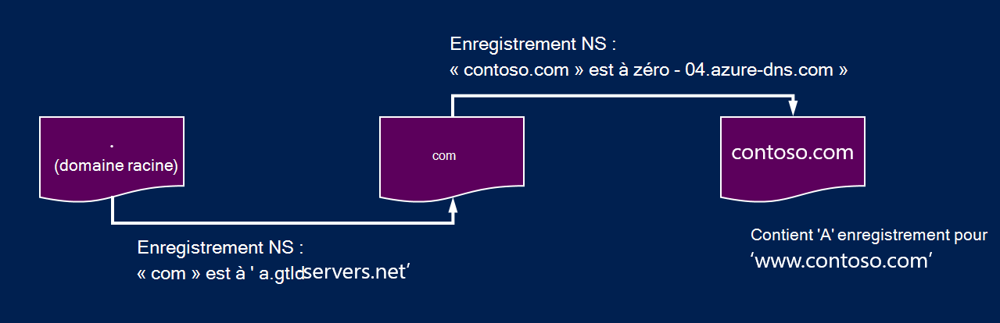
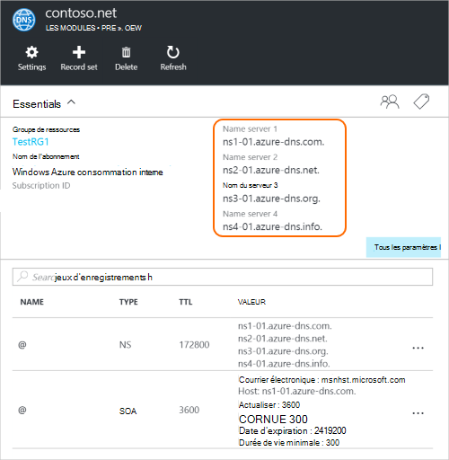

<properties
   pageTitle="Délégué de votre domaine DNS d’Azure | Microsoft Azure"
   description="Apprenez à modifier la délégation de domaine et de serveurs de noms DNS d’Azure permet de fournir le domaine d’hébergement."
   services="dns"
   documentationCenter="na"
   authors="sdwheeler"
   manager="carmonm"
   editor=""/>

<tags
   ms.service="dns"
   ms.devlang="na"
   ms.topic="get-started-article"
   ms.tgt_pltfrm="na"
   ms.workload="infrastructure-services"
   ms.date="06/30/2016"
   ms.author="sewhee"/>

# Déléguer un domaine DNS d’Azure

Azure DNS vous permet d’héberger une zone DNS et de gérer les enregistrements DNS pour un domaine dans Azure. Afin que les requêtes DNS pour un domaine d’atteindre Azure DNS, le domaine doit être déléguée pour Azure DNS du domaine parent. Gardez à l’esprit Azure DNS n’est pas le registraire de domaine. Cet article explique le fonctionne de la délégation de domaine et la délégation des domaines DNS d’Azure.

## Fonctionne de la délégation DNS

### Les zones et les domaines

Le système de nom de domaine est une hiérarchie de domaines. Démarrage de la hiérarchie du domaine « root », dont le nom est simplement '**.**'.  Ci-dessous proviennent des domaines de niveau supérieur, tel que « com », « net », « org », 'uk' ou « jp ».  Dessous de ces derniers sont des domaines de second niveau, tel que 'org.uk' ou 'co.jp'.  Et ainsi de suite. Les domaines dans la hiérarchie DNS sont hébergés à l’aide des zones DNS distinctes. Ces zones sont globalement distribués, hébergés par des serveurs de nom DNS dans le monde entier.

**Zone DNS**

Un domaine est un nom unique dans le système de nom de domaine, par exemple, « contoso.com ». Une zone DNS est utilisée pour héberger les enregistrements DNS pour un domaine particulier. Par exemple, le domaine « contoso.com » peut contenir un nombre d’enregistrements DNS, tels que « mail.contoso.com » (pour un serveur de messagerie) et « www.contoso.com » (pour un site Web).

**Registraire de domaine**

Un registraire de domaine est une entreprise qui peut fournir des noms de domaine Internet. Il vérifie si le domaine Internet que vous souhaitez utiliser est disponible et vous permettent d’acheter. Une fois le nom de domaine est enregistré, vous serez le propriétaire légal du nom de domaine. Si vous avez déjà un domaine Internet, vous allez utiliser le registraire de domaine actuel à déléguer à Azure DNS.

>[AZURE.NOTE] Pour plus d’informations sur le propriétaire d’un nom de domaine donné, ou pour plus d’informations sur la façon d’acheter un domaine, consultez [Gestion des domaines Internet dans Azure AD](https://msdn.microsoft.com/library/azure/hh969248.aspx).

### Résolution et délégation

Il existe deux types de serveurs DNS :

- Un serveur DNS _faisant autorité_ héberge des zones DNS. Il répond aux requêtes DNS pour les enregistrements dans les zones uniquement.
- Un serveur DNS _récursive_ n’héberge pas de zones DNS. Il répond à toutes les requêtes DNS en appelant des serveurs DNS faisant autorité pour rassembler les données dont il a besoin.

>[AZURE.NOTE] Azure DNS fournit un service DNS faisant autorité.  Il ne fournit pas un service DNS récursive.

> Services en nuage et des ordinateurs virtuels dans Azure sont automatiquement configurés pour utiliser les services DNS récursive qui est fourni séparément en tant que partie de l’infrastructure de d’Azure.  Pour plus d’informations sur la modification de ces paramètres DNS, consultez [Résolution de noms dans Azure](../virtual-network/virtual-networks-name-resolution-for-vms-and-role-instances.md#name-resolution-using-your-own-dns-server).

En général, les clients DNS de PC ou des périphériques mobiles appellent un serveur DNS récursive pour effectuer des requêtes DNS que les applications clientes doivent.

Lorsqu’un serveur DNS récursive reçoit une requête pour un enregistrement DNS tel que « www.contoso.com », il doit d’abord rechercher le serveur de noms qui héberge la zone pour le domaine « contoso.com ». Pour ce faire, il commence à des serveurs de noms racines et à partir de là, recherche les serveurs de noms qui héberge la zone « com ». Il interroge ensuite les serveurs de noms de « com » pour trouver les serveurs de noms qui héberge la zone « contoso.com ».  Enfin, il est en mesure d’interroger les serveurs de noms pour « www.contoso.com ».

Cela s’appelle la résolution du nom DNS. Au sens strict, la résolution DNS inclut des étapes supplémentaires, telles que les enregistrements CNAME suivant, mais qui n’est pas important de comprendre le fonctionne de la délégation DNS.

Comment une zone parent 'pointe » sur les serveurs de noms pour une zone enfant ? Pour cela, à l’aide d’un type particulier d’enregistrement DNS appelé un enregistrement NS (NS signifie « serveur de nom »). Par exemple, la zone racine contient des enregistrements NS pour « com » et affiche les serveurs de noms pour la zone « com ». La zone « com » à son tour, contient des enregistrements NS pour « contoso.com », qui affiche les serveurs de noms pour la zone « contoso.com ». Configuration des enregistrements NS pour une zone enfant dans une zone parente est appelé délégation du domaine.

Chaque délégation a en fait deux copies des enregistrements NS ; l’une dans la zone parent pointant vers l’enfant et un autre dans la zone enfant elle-même. La zone « contoso.com » contient les enregistrements NS pour « contoso.com » (en plus des enregistrements NS dans « com »). Il s’agit des enregistrements NS faisant autorités et ils se trouvent au sommet de la zone enfant.

## Délégation d’un domaine DNS d’Azure

Une fois que vous créez votre zone DNS dans le système DNS d’Azure, vous devez configurer les enregistrements NS de la zone parente pour Azure DNS la source faisant autorité pour la résolution de nom pour votre zone. Pour les domaines achetés auprès d’un organisme d’enregistrement, votre registraire offrent la possibilité de définir ces enregistrements NS.

>[AZURE.NOTE] Vous n’êtes pas obligé de posséder un domaine afin de créer une zone DNS portant ce nom de domaine dans DNS d’Azure. Toutefois, vous n’avez pas besoin de posséder le domaine pour configurer la délégation vers Azure DNS dans le Registre.

Par exemple, supposons que vous achetez le domaine « contoso.com » et créez une zone avec le nom « contoso.com » dans Azure DNS. Étant le propriétaire du domaine, votre registraire vous propose l’option pour configurer les adresses de serveur de noms (autrement dit, les enregistrements NS) pour votre domaine. Le Registre stocke ces enregistrements NS dans le domaine parent, dans ce cas « .com ». Clients dans le monde entier seront ensuite être dirigés vers votre domaine dans la zone DNS d’Azure lorsque vous tentez de résoudre les enregistrements DNS « contoso.com ».

### Recherche les noms de serveur de nom

Avant que vous pouvez déléguer votre zone DNS au serveur DNS d’Azure, vous devez d’abord connaître les noms de serveur de nom pour votre zone. DNS Azure alloue des serveurs de noms à partir d’un pool chaque fois qu’une zone est créée.

La façon la plus simple pour afficher les serveurs de noms attribués à votre zone est via le portail Azure.  Dans cet exemple, la zone 'contoso.net' a été affectée à des serveurs de nom ' ns1-01.azure-dns.com », « .net ns2-01.azure-dns », ' ns3-01.azure-dns.org', et ' ns4-01.azure-dns.info':

 

Azure DNS crée automatiquement des enregistrements NS faisant autorités dans la zone contenant les serveurs de nom affecté.  Pour visualiser les noms de serveur de nom via Azure PowerShell ou CLI d’Azure, vous devez simplement récupérer ces enregistrements.

À l’aide de PowerShell d’Azure, les enregistrements NS faisant autorités peuvent être récupérées comme suit. Notez que le nom d’enregistrement “@” est utilisé pour faire référence à des enregistrements au sommet de la zone.

    PS> $zone = Get-AzureRmDnsZone –Name contoso.net –ResourceGroupName MyResourceGroup
    PS> Get-AzureRmDnsRecordSet –Name “@” –RecordType NS –Zone $zone

    Name              : @
    ZoneName          : contoso.net
    ResourceGroupName : MyResourceGroup
    Ttl               : 3600
    Etag              : 5fe92e48-cc76-4912-a78c-7652d362ca18
    RecordType        : NS
    Records           : {ns1-01.azure-dns.com, ns2-01.azure-dns.net, ns3-01.azure-dns.org,
                        ns4-01.azure-dns.info}
    Tags              : {}

Vous pouvez également utiliser la CLI d’Azure multiplates-formes pour récupérer les enregistrements NS faisant autorités et, par conséquent, découvrir les serveurs de noms attribués à la zone :

    C:\> azure network dns record-set show MyResourceGroup contoso.net @ NS
    info:    Executing command network dns record-set show
        + Looking up the DNS Record Set "@" of type "NS"
    data:    Id                              : /subscriptions/.../resourceGroups/MyResourceGroup/providers/Microsoft.Network/dnszones/contoso.net/NS/@
    data:    Name                            : @
    data:    Type                            : Microsoft.Network/dnszones/NS
    data:    Location                        : global
    data:    TTL                             : 172800
    data:    NS records
    data:        Name server domain name     : ns1-01.azure-dns.com.
    data:        Name server domain name     : ns2-01.azure-dns.net.
    data:        Name server domain name     : ns3-01.azure-dns.org.
    data:        Name server domain name     : ns4-01.azure-dns.info.
    data:
    info:    network dns record-set show command OK

### Pour configurer la délégation

Chaque registre a ses propres outils de gestion de DNS pour modifier les enregistrements de serveur de nom pour un domaine. Dans la page de gestion de l’inscription DNS, modifier les enregistrements NS et remplacer les enregistrements NS avec celles créées d’Azure DNS.

Lors de la délégation d’un domaine DNS d’Azure, vous devez utiliser les noms de serveur de nom fournis par le système DNS d’Azure.  Vous devez toujours utiliser toutes les 4 nom noms de serveur, quel que soit le nom de votre domaine.  Délégation de domaine ne requiert pas le nom de serveur pour votre domaine du même domaine de niveau supérieur.

Vous ne devez pas utiliser « coller des enregistrements » pour pointer vers le Azure nom DNS server adresses IP, dans la mesure où ces adresses IP peuvent changer à l’avenir. Les délégations à l’aide du nom de serveur dans votre propre zone, parfois appelé « serveurs de nom vanity », ne sont actuellement pas pris en charge dans Azure DNS.

### Pour vérifier la résolution de nom fonctionne

À la fin de la délégation, vous pouvez vérifier que la résolution de nom fonctionne à l’aide d’un outil tel que 'nslookup' pour interroger l’enregistrement SOA de votre zone (qui est créé automatiquement lors de la création de la zone).

Notez que vous n’êtes pas obligé de spécifier les serveurs de noms DNS d’Azure, dans la mesure où le processus de résolution DNS normal rechercher les serveurs de noms automatiquement si la délégation a été correctement configurée.

    nslookup –type=SOA contoso.com

    Server: ns1-04.azure-dns.com
    Address: 208.76.47.4

    contoso.com
    primary name server = ns1-04.azure-dns.com
    responsible mail addr = msnhst.microsoft.com
    serial = 1
    refresh = 900 (15 mins)
    retry = 300 (5 mins)
    expire = 604800 (7 days)
    default TTL = 300 (5 mins)

## Déléguer des sous-domaines dans Azure DNS

Si vous souhaitez configurer une zone enfant séparée, vous pouvez déléguer un sous-domaine dans Azure DNS. Par exemple, avoir défini et déléguée « contoso.com » dans le système DNS Azure, supposons que vous souhaitez configurer une zone enfant séparée, 'partners.contoso.com'.

Configurer un sous-domaine de suit un processus similaire sous la forme d’une délégation normale. La seule différence est que, dans l’étape 3 que les enregistrements NS doivent être créés dans la zone parent « contoso.com » dans Azure DNS, plutôt que d’être configurés via un registraire de domaine.

1. Créer la zone enfant 'partners.contoso.com' dans le système DNS d’Azure.
2. Recherchez les enregistrements NS faisant autorités dans la zone de l’enfant pour obtenir les serveurs de noms hébergeant la zone enfant dans Azure DNS.
3. Déléguer la zone enfant en configurant les enregistrements NS de la zone parent pointant vers la zone enfant.

### Pour déléguer un sous-domaine

L’exemple de PowerShell suivant montre comment cela fonctionne. Les mêmes étapes peuvent être exécutées via le portail d’Azure, ou la CLI d’Azure multiplates-formes.

#### Étape 1. Créer des zones de l’enfant et parent

Tout d’abord, nous créons le parent et l’enfant zones. Ceux-ci peuvent être dans le même groupe de ressources ou des groupes de ressources différents.

    $parent = New-AzureRmDnsZone -Name contoso.com -ResourceGroupName RG1
    $child = New-AzureRmDnsZone -Name partners.contoso.com -ResourceGroupName RG1

#### Étape 2. Enregistrements NS de récupération

Ensuite, nous avons récupérer les enregistrements NS faisant autorités à partir de la zone enfant comme illustré dans l’exemple suivant.  Cet onglet contient les serveurs de noms attribués à la zone enfant.

    $child_ns_recordset = Get-AzureRmDnsRecordSet -Zone $child -Name "@" -RecordType NS

#### Étape 3. Déléguer la zone enfant

Créer un enregistrement NS correspondant, la valeur dans la zone parente pour achever la délégation. Notez que le nom du jeu d’enregistrements dans la zone parent correspond dans ce cas le nom de la zone enfant, « partenaires ».

    $parent_ns_recordset = New-AzureRmDnsRecordSet -Zone $parent -Name "partners" -RecordType NS -Ttl 3600
    $parent_ns_recordset.Records = $child_ns_recordset.Records
    Set-AzureRmDnsRecordSet -RecordSet $parent_ns_recordset

### Pour vérifier la résolution de nom fonctionne

Vous pouvez vérifier que tout est configuré correctement en recherchant l’enregistrement SOA de la zone enfant.

    nslookup –type=SOA partners.contoso.com

    Server: ns1-08.azure-dns.com
    Address: 208.76.47.8

    partners.contoso.com
        primary name server = ns1-08.azure-dns.com
        responsible mail addr = msnhst.microsoft.com
        serial = 1
        refresh = 900 (15 mins)
        retry = 300 (5 mins)
        expire = 604800 (7 days)
        default TTL = 300 (5 mins)

## Étapes suivantes

[Gérer les zones DNS](dns-operations-dnszones.md)

[Gérer les enregistrements DNS](dns-operations-recordsets.md)

