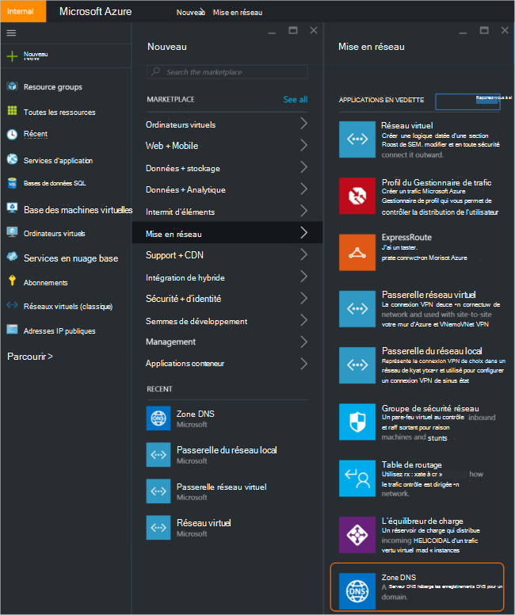
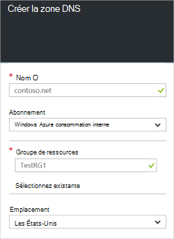
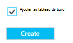
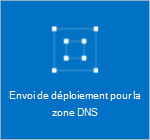
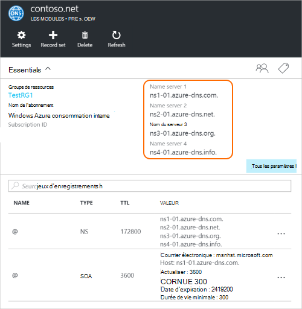
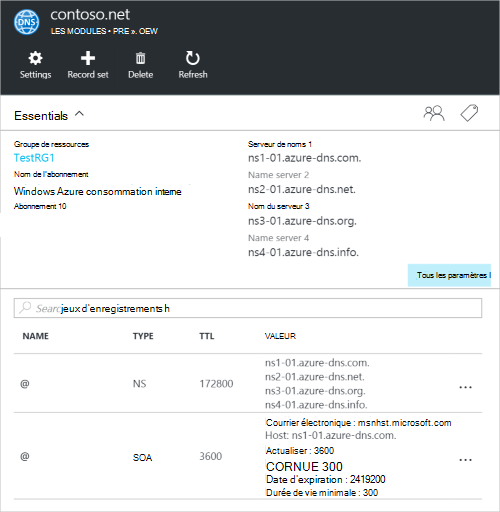

<properties
   pageTitle="Comment faire pour créer et gérer une zone DNS dans le portail Azure | Microsoft Azure"
   description="Apprenez à créer des zones DNS pour Azure DNS. Il s’agit d’un guide étape par étape pour créer et gérer votre premier DNS et héberger votre domaine DNS via le portail Azure."
   services="dns"
   documentationCenter="na"
   authors="sdwheeler"
   manager="carmonm"
   editor=""
   tags="azure-resource-manager"/>

<tags
   ms.service="dns"
   ms.devlang="na"
   ms.topic="article"
   ms.tgt_pltfrm="na"
   ms.workload="infrastructure-services"
   ms.date="08/16/2016"
   ms.author="sewhee"/>

# Créer une zone DNS dans le portail Azure

> [AZURE.SELECTOR]
- [Azure Portal](dns-getstarted-create-dnszone-portal.md)
- [PowerShell](dns-getstarted-create-dnszone.md)
- [CLI Azure](dns-getstarted-create-dnszone-cli.md)

Cet article vous guidera tout au long de la procédure de création d’une zone DNS à l’aide du portail Azure. Vous pouvez également créer une zone DNS à l’aide de PowerShell ou l’interface CLI.

[AZURE.INCLUDE [dns-create-zone-about](../../includes/dns-create-zone-about-include.md)]

### À propos des balises pour Azure DNS

Les balises sont une liste de paires nom-valeur et servent par le Gestionnaire de ressources Azure aux ressources de l’étiquette à des fins de facturation ou de regroupement. Pour plus d’informations sur les balises, consultez l’article [en utilisant des balises pour organiser vos ressources Azure](../resource-group-using-tags.md).

Vous pouvez ajouter des balises dans Azure portal à l’aide de la lame de **paramètres** pour votre zone DNS.

## Créer une zone DNS

1. Connectez-vous au portail Azure

2. Dans le menu de concentrateur, cliquez sur, puis cliquez sur **Nouveau > réseau >** , puis cliquez sur la **zone DNS** pour ouvrir la lame de zone DNS.

    

3. Sur la lame de **zone DNS** , cliquez sur **créer** en bas. La lame de **zone DNS de créer** s’ouvre.

    

4. Sur la lame de **zone DNS de créer** , nommez votre zone DNS. Par exemple, *contoso.com*. Reportez-vous à la section [Sur les noms de zones DNS](#names) dans la section ci-dessus.

5. Ensuite, spécifiez le groupe de ressources que vous souhaitez utiliser. Vous pouvez soit créer un nouveau groupe de ressources, ou sélectionnez-en un qui existe déjà.

6. Dans la liste déroulante **emplacement** , spécifiez l’emplacement du groupe de ressources. Notez que ce paramètre fait référence à l’emplacement du groupe de ressources, et non l’emplacement de la zone DNS. Les ressources réelles de la zone DNS est automatiquement « globale » et n’est pas quelque chose que vous pouvez (ou devez) spécifier dans le portail.

7. Vous pouvez laisser la case à cocher **Ajouter au tableau de bord** sélectionné si vous souhaitez localiser facilement votre nouvelle zone sur votre tableau de bord. Puis cliquez sur **créer**.

    

8. Une fois que vous cliquez sur Créer, vous verrez votre nouvelle zone en cours de configuration sur le tableau de bord.

    

9. Lorsque votre nouvelle zone a été créée, la lame pour votre nouvelle zone s’ouvre sur le tableau de bord.

## Afficher les enregistrements

Création d’une zone DNS crée également les enregistrements suivants :

- L’enregistrement « De SOA » (). La SOA n’est présent à la racine de chaque zone DNS.
- Les enregistrements de serveur (NS) de noms faisant autorité. Ces affichent les serveurs de noms hébergent la zone. DNS Azure utilise un pool de serveurs de noms, et par conséquent, différents serveurs de nom peuvent être affectés à différentes zones dans Azure DNS. Pour plus d’informations, reportez-vous à la section [délégué un domaine DNS d’Azure](dns-domain-delegation.md) .

Vous pouvez afficher les enregistrements à partir du portail Azure

1. À partir de la blade de **zone DNS** , cliquez sur **tous les paramètres** pour ouvrir la **lame de paramètres** pour la zone DNS.

    

2. Dans la partie inférieure du volet Essentials, vous pouvez voir que l’enregistrement définit pour la zone DNS.

    

## Test

Vous pouvez tester votre zone DNS à l’aide d’outils DNS comme nslookup, dig ou l' [applet de commande Resolve-NomDNS PowerShell](https://technet.microsoft.com/library/jj590781.aspx).

Si vous n’avez pas encore reçu votre domaine pour utiliser la nouvelle zone dans Azure DNS, vous devez diriger la requête DNS directement à l’un des serveurs de noms de votre zone. Les serveurs de noms de votre zone figurent dans les enregistrements NS, par `Get-AzureRmDnsRecordSet` ci-dessus. Assurez-vous que le remplaçant les valeurs correctes pour votre zone dans la commande ci-dessous.

    nslookup
    > set type=SOA
    > server ns1-01.azure-dns.com
    > contoso.com

    Server: ns1-01.azure-dns.com
    Address:  208.76.47.1

    contoso.com
            primary name server = ns1-01.azure-dns.com
            responsible mail addr = msnhst.microsoft.com
            serial  = 1
            refresh = 900 (15 mins)
            retry   = 300 (5 mins)
            expire  = 604800 (7 days)
            default TTL = 300 (5 mins)

## Supprimer une zone DNS

Vous pouvez supprimer la zone DNS directement à partir du portail. Avant de supprimer une zone DNS dans le système DNS d’Azure, vous devez supprimer tous les jeux d’enregistrements, à l’exception des enregistrements NS et SOA à la racine de la zone qui ont été créés automatiquement lors de la création de la zone.

1. Recherchez la lame de **zone DNS** pour la zone que vous souhaitez supprimer, puis cliquez sur **Supprimer** en haut de la lame.

2. Un message s’affiche et vous informe que vous devez supprimer tous les jeux d’enregistrements, sauf les enregistrements NS et SOA qui ont été créés automatiquement. Si vous avez supprimé vos jeux d’enregistrements, cliquez sur **Oui**. Notez que lors de la suppression d’une zone DNS à partir du portail, le groupe de ressources qui est associée à la zone DNS ne sont pas supprimé.

## Étapes suivantes

Après avoir créé une zone DNS, créer des [ensembles d’enregistrements et d’enregistrements](dns-getstarted-create-recordset-portal.md) pour démarrer la résolution des noms de votre domaine Internet.
