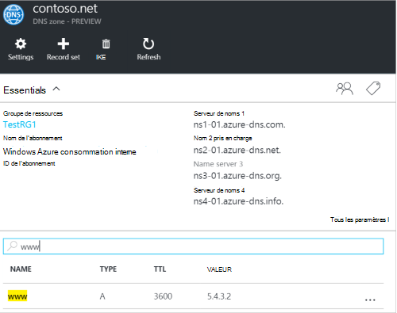
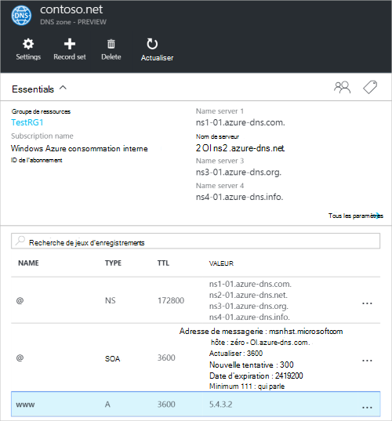
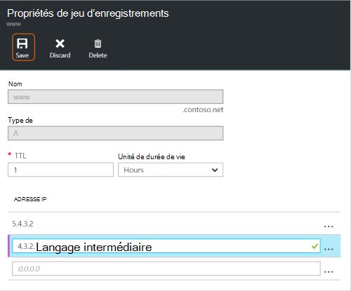
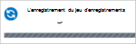
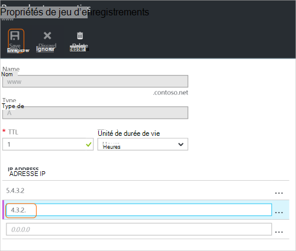
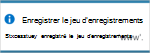
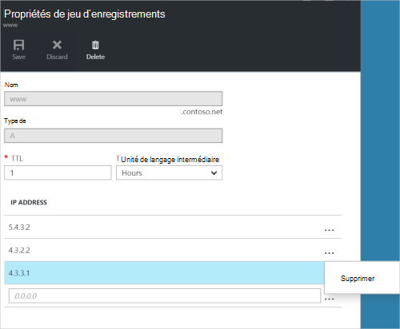
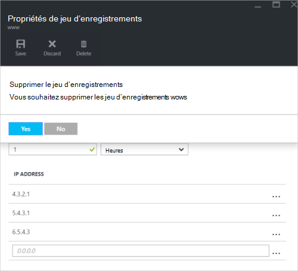

<properties
   pageTitle="Gérer les jeux d’enregistrements DNS et les enregistrements à l’aide du portail Azure | Microsoft Azure"
   description="Gestion du système DNS l’enregistrement définit et enregistre lors de l’hébergement de votre domaine DNS d’Azure."
   services="dns"
   documentationCenter="na"
   authors="sdwheeler"
   manager="carmonm"
   editor=""
   tags="azure-resource-manager"/>

<tags
   ms.service="dns"
   ms.devlang="na"
   ms.topic="article"
   ms.tgt_pltfrm="na"
   ms.workload="infrastructure-services"
   ms.date="08/16/2016"
   ms.author="sewhee"/>

# Gérer les enregistrements DNS et l’enregistrement se définit à l’aide du portail Azure

> [AZURE.SELECTOR]
- [Azure Portal](dns-operations-recordsets-portal.md)
- [CLI Azure](dns-operations-recordsets-cli.md)
- [PowerShell](dns-operations-recordsets.md)

Cet article vous montre comment gérer des ensembles d’enregistrements et d’enregistrements pour votre zone DNS à l’aide du portail Azure.

Il est important de comprendre la différence entre les jeux d’enregistrements DNS et des enregistrements DNS. Un jeu d’enregistrements est un ensemble d’enregistrements dans une zone qui portent le même nom et qui sont du même type. Pour plus d’informations, consultez [créer un DNS de jeux d’enregistrements et les enregistrements à l’aide du portail Azure](dns-getstarted-create-recordset-portal.md).

## Créer un nouveau jeu d’enregistrements et l’enregistrement

Pour créer un enregistrement à définir dans le portail Azure, consultez [les enregistrements DNS de créer à l’aide du portail Azure](dns-getstarted-create-recordset-portal.md).

## Permet d’afficher un jeu d’enregistrements

1. Dans le portail Azure, accédez à la blade de **zone DNS** .

2. Recherchez le jeu d’enregistrements et le sélectionner. Les propriétés du jeu d’enregistrements s’affiche.

    

## Ajoutez un nouvel enregistrement à un jeu d’enregistrements

Vous pouvez ajouter jusqu'à 20 enregistrements à n’importe quel jeu d’enregistrements. Un jeu d’enregistrements ne peut pas contenir deux enregistrements identiques. Jeux d’enregistrements vides (avec zéro enregistrements) peuvent être créés, mais n’apparaissent pas sur les serveurs de noms DNS d’Azure. Jeux d’enregistrements de type CNAME peuvent contenir un enregistrement au plus.

1. Sur la lame de **jeu d’enregistrements de propriétés** pour votre zone DNS, cliquez sur le jeu d’enregistrements que vous souhaitez ajouter un enregistrement à.

    

2. Spécifier que l’enregistrement de jeu de propriétés en renseignant les champs.

    

2. Cliquez sur **Enregistrer** en haut de la lame pour enregistrer vos paramètres. Ensuite, fermez la lame.

3. Dans le coin, vous verrez que l’enregistrement est l’enregistrement.

    

Une fois que l’enregistrement a été enregistré, les valeurs sur la lame de **zone DNS** reflètent le nouvel enregistrement.

## Mise à jour d’un enregistrement

Lorsque vous mettez à jour un enregistrement dans un jeu d’enregistrements existant, les champs que vous pouvez mettre à jour varient selon le type d’enregistrement avec lequel vous travaillez.

1. Sur la lame de **jeu d’enregistrements de propriétés** de votre jeu d’enregistrements, rechercher l’enregistrement.

2. Modifier l’enregistrement. Lorsque vous modifiez un enregistrement, vous pouvez modifier les paramètres disponibles pour l’enregistrement. Dans l’exemple suivant, le champ de **l’adresse IP** est sélectionné, et l’adresse IP est en cours de modification.

    

3. Cliquez sur **Enregistrer** en haut de la lame pour enregistrer vos paramètres. Dans le coin supérieur droit, vous verrez la notification que l’enregistrement a été enregistré.

    

Une fois que l’enregistrement a été enregistré, les valeurs de l’enregistrement sur la lame de **zone DNS** reflètent l’enregistrement mis à jour.

## Supprimer un enregistrement d’un jeu d’enregistrements

Vous pouvez utiliser le portail Azure pour supprimer les enregistrements d’un jeu d’enregistrements. Notez que la suppression du dernier enregistrement d’un jeu d’enregistrements ne supprime pas le jeu d’enregistrements.

1. Sur la lame de **jeu d’enregistrements de propriétés** de votre jeu d’enregistrements, rechercher l’enregistrement.

2. Cliquez sur l’enregistrement que vous souhaitez supprimer. Puis sélectionnez **Supprimer**.

    

3. Cliquez sur **Enregistrer** en haut de la lame pour enregistrer vos paramètres.

3. Une fois que l’enregistrement a été supprimé, les valeurs de l’enregistrement sur la lame de **zone DNS** reflètent la suppression.

## Supprimer un jeu d’enregistrements

1. Sur les **Propriétés de jeu d’enregistrements de** lame pour votre enregistrement de jeu, cliquez sur **Supprimer**.

    

2. Un message s’affiche vous demandant si vous souhaitez supprimer le jeu d’enregistrements.

3. Vérifiez que le nom correspond à l’ensemble d’enregistrements que vous souhaitez supprimer, puis cliquez sur **Oui**.

4. Sur la lame de **zone DNS** , vérifiez que le jeu d’enregistrements n’est plus visible.

## Travailler avec les enregistrements NS et SOA

Les enregistrements NS et SOA qui sont automatiquement créés sont gérés différemment des autres types d’enregistrements.

### Modifier les enregistrements SOA

Vous ne pouvez pas ajouter ou supprimer des enregistrements à partir de l’enregistrement SOA créée automatiquement définie au sommet de la zone (nom = "@"). Toutefois, vous pouvez modifier les paramètres dans l’enregistrement SOA (à l’exception de « hôte ») et l’enregistrement de définie la durée de vie.

### Modifier les enregistrements NS au sommet de la zone

Vous ne pouvez pas ajouter, pour supprimer ou modifier les enregistrements dans l’enregistrement NS créée automatiquement définie au sommet de la zone (nom = "@"). La seule modification autorisée est de modifier le jeu d’enregistrements de durée de vie.

### Supprimer des jeux d’enregistrements SOA ou le NS

Vous ne pouvez pas supprimer l’enregistrement SOA et NS enregistrement définit au sommet de la zone (nom = "@") qui sont créés automatiquement lors de la création de la zone. Ils sont automatiquement supprimés lorsque vous supprimez la zone.

## Étapes suivantes

-   Pour plus d’informations sur le service DNS d’Azure, consultez la [vue d’ensemble de DNS d’Azure](dns-overview.md).
-   Pour plus d’informations sur l’automatisation de DNS voir [zones DNS de création et enregistrement définit à l’aide du Kit de développement .NET](dns-sdk.md).
-   Pour plus d’informations sur les enregistrements DNS inversées, voir [comment gérer les enregistrements DNS inverses pour vos services à l’aide de PowerShell](dns-reverse-dns-record-operations-ps.md).
