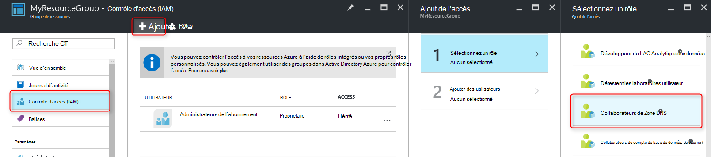
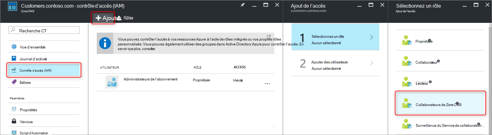
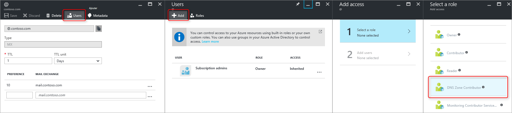
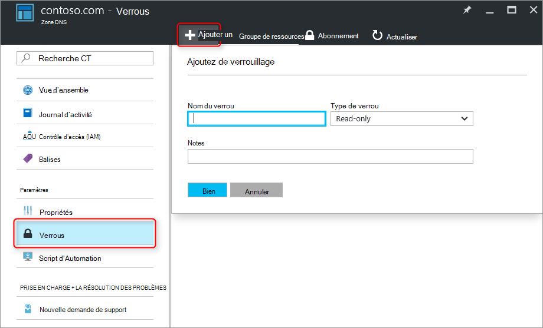

<properties 
   pageTitle="Protection des Zones DNS et enregistrements | Microsoft Azure" 
   description="La protection des zones DNS et les jeux d’enregistrements dans le système DNS de Microsoft Azure." 
   services="dns" 
   documentationCenter="na" 
   authors="jtuliani" 
   manager="carmonm" 
   editor=""/>

<tags
   ms.service="dns"
   ms.devlang="na"
   ms.topic="article"
   ms.tgt_pltfrm="na"
   ms.workload="infrastructure-services" 
   ms.date="10/20/2016"
   ms.author="jtuliani"/>

# Comment protéger les enregistrements et zones DNS

Enregistrements et zones DNS sont des ressources critiques. Suppression d’une zone DNS ou même un seul enregistrement DNS peut entraîner une interruption de service totale.  Il est donc important que les zones DNS et des enregistrements critiques sont protégés contre toute modification non autorisée ou accidentelle.

Cet article explique comment Azure DNS vous permet de protéger vos zones DNS et les enregistrements par rapport à ces modifications.  Nous appliquons deux puissantes fonctions de sécurité fournies par le Gestionnaire de ressources Azure : [contrôle d’accès basé sur les rôles](../active-directory/role-based-access-control-what-is.md) et les [verrous sur les ressources](../resource-group-lock-resources.md).

## Contrôle d’accès basé sur les rôles

Azure contrôle d’accès basée sur les rôles (RBAC) permet la gestion d’accès à granularité fine pour Azure utilisateurs, groupes et ressources. L’utilisation de RBAC, vous pouvez accorder précisément la quantité d’accès que les utilisateurs ont besoin pour effectuer leur travail. Pour plus d’informations sur comment RBAC vous permet de gérer l’accès, consultez [contrôle d’accès basée sur les rôles](../active-directory/role-based-access-control-what-is.md).

### Le rôle de « Collaborateur de Zone DNS »

Le rôle de « Collaborateur de Zone DNS » est un rôle intégré fourni par Azure pour la gestion des ressources DNS.  Attribution d’autorisations de collaborateur de Zone DNS à un utilisateur ou un groupe permet de groupe Gérer les ressources DNS, mais pas aux ressources d’un autre type.

Par exemple, supposons que le groupe de ressources 'myzones' contient les cinq zones pour Contoso Corporation. Octroyer l’administrateur DNS « Collaborateur de Zone DNS » pour ce groupe de ressources, permet un contrôle total sur les zones DNS. Il permet également d’éviter l’octroi des autorisations inutiles, par exemple l’administrateur DNS ne peut pas créer ou arrêter les Machines virtuelles.

Il est plus simple d’attribuer des autorisations de RBAC [via le portail Azure](../active-directory/role-based-access-control-configure.md).  Ouvrez la lame « Contrôle d’accès (IAM) » pour le groupe de ressources, puis cliquez sur 'Ajouter', puis sélectionnez le rôle de « Collaborateur de Zone DNS » et sélectionnez requis des utilisateurs ou des groupes pour accorder des autorisations.

Les autorisations peuvent également être [accordée à l’aide de PowerShell d’Azure](../active-directory/role-based-access-control-manage-access-powershell.md):

    # Grant 'DNS Zone Contributor' permissions to all zones in a resource group
    New-AzureRmRoleAssignment -SignInName <user email address> -RoleDefinitionName "DNS Zone Contributor" -ResourceGroupName <resource group name>

La commande équivalente est également [disponible via la CLI Azure :](../active-directory/role-based-access-control-manage-access-azure-cli.md)

    # Grant 'DNS Zone Contributor' permissions to all zones in a resource group
    azure role assignment create --signInName  <user email address> --roleName "DNS Zone Contributor" --resourceGroup <resource group name>

### Niveau de zone RBAC

Les règles RBAC Azure peuvent être appliquées à un abonnement, un groupe de ressources ou à une ressource individuelle. Dans le cas d’Azure, DNS, cette ressource peut être une zone DNS individuelle, ou même un jeu d’enregistrements individuel.

Par exemple, supposons que le groupe de ressources 'myzones' contient une sous-zone 'customers.contoso.com', dans lequel les enregistrements CNAME sont créés pour chaque compte client et la zone « contoso.com ».  Le compte utilisé pour gérer ces enregistrements CNAME doit avoir les autorisations pour créer des enregistrements dans la zone 'customers.contoso.com', il ne doit pas avoir accès aux autres zones.

Peuvent bénéficier d’autorisations de niveau de zone RBAC via le portail Azure.  Ouvrez la lame '' contrôle d’accès (IAM) pour la zone, puis cliquez sur 'Ajouter', puis sélectionnez le rôle de « Collaborateur de Zone DNS » et sélectionnez requis des utilisateurs ou des groupes pour accorder des autorisations.

Les autorisations peuvent également être [accordée à l’aide de PowerShell d’Azure](../active-directory/role-based-access-control-manage-access-powershell.md):

    # Grant 'DNS Zone Contributor' permissions to a specific zone
    New-AzureRmRoleAssignment -SignInName <user email address> -RoleDefinitionName "DNS Zone Contributor" -ResourceGroupName <resource group name> -ResourceName <zone name> -ResourceType Microsoft.Network/DNSZones

La commande équivalente est également [disponible via la CLI Azure :](../active-directory/role-based-access-control-manage-access-azure-cli.md)

    # Grant 'DNS Zone Contributor' permissions to a specific zone
    azure role assignment create --signInName <user email address> --roleName "DNS Zone Contributor" --resource-name <zone name> --resource-type Microsoft.Network/DNSZones --resource-group <resource group name>

### Jeu d’enregistrements de niveau RBAC

Nous pouvons aller plus loin. Tenez compte de l’administrateur de messagerie pour Contoso Corporation, qui a besoin d’accéder aux enregistrements MX et TXT au sommet de la zone « contoso.com ».  Elle n’a pas besoin d’accéder à tous les autres enregistrements MX ou TXT, ou à tous les enregistrements d’un autre type.  Azure DNS vous permet d’attribuer des autorisations au niveau du jeu d’enregistrements, aux enregistrements précisément que l’administrateur a besoin d’accéder à.  L’administrateur de la messagerie est accordé avec précision le contrôle qu’elle a besoin et ne peut pas apporter d’autres modifications.
  
Autorisations RBAC au niveau du jeu d’enregistrements peuvent être configurées via le portail d’Azure, à l’aide du bouton « Utilisateurs » dans la lame du jeu d’enregistrements :

Autorisations RBAC au niveau du jeu d’enregistrements peuvent également être [accordée à l’aide de PowerShell d’Azure](../active-directory/role-based-access-control-manage-access-powershell.md):

    # Grant permissions to a specific record set
    New-AzureRmRoleAssignment -SignInName <user email address> -RoleDefinitionName "DNS Zone Contributor" -Scope "/subscriptions/<subscription id>/resourceGroups/<resource group name>/providers/Microsoft.Network/dnszones/<zone name>/<record type>/<record name>" 

La commande équivalente est également [disponible via la CLI Azure :](../active-directory/role-based-access-control-manage-access-azure-cli.md)

    # Grant permissions to a specific record set
    azure role assignment create --signInName <user email address> --roleName "DNS Zone Contributor" --scope "/subscriptions/<subscription id>/resourceGroups/<resource group name>/providers/Microsoft.Network/dnszones/<zone name>/<record type>/<record name>"

### Rôles personnalisés

Le rôle de « Collaborateur de Zone DNS » intégré permet un contrôle total sur une ressource DNS. Il est également possible de générer votre propre client de rôles d’Azure, pour fournir un contrôle de même fine.

Reprenons l’exemple dans lequel un enregistrement CNAME dans la zone « customers.contoso.com » est créé pour chaque compte client de Contoso Corporation.  Le compte utilisé pour gérer ces enregistrements CNAME doit être autorisé à gérer uniquement les enregistrements CNAME.  Il est alors impossible de modifier les enregistrements d’autres types (par exemple, modifier les enregistrements MX) ou d’effectuer des opérations de niveau de zone telles que la suppression de la zone.

L’exemple suivant montre une définition de rôle personnalisé pour la gestion des enregistrements CNAME uniquement :

    {
        "Name": "DNS CNAME Contributor",
        "Id": "",
        "IsCustom": true,
        "Description": "Can manage DNS CNAME records only.",
        "Actions": [
            "Microsoft.Network/dnsZones/CNAME/*",
            "Microsoft.Network/dnsZones/read",
            "Microsoft.Authorization/*/read",
            "Microsoft.Insights/alertRules/*",
            "Microsoft.ResourceHealth/availabilityStatuses/read",
            "Microsoft.Resources/deployments/*",
            "Microsoft.Resources/subscriptions/resourceGroups/read",
            "Microsoft.Support/*"
        ],
        "NotActions": [
        ],
        "AssignableScopes": [
            "/subscriptions/ c276fc76-9cd4-44c9-99a7-4fd71546436e"
        ]
    }

La propriété Actions définit les autorisations spécifiques à DNS suivantes :

- `Microsoft.Network/dnsZones/CNAME/*`accorde un contrôle total sur les enregistrements CNAME
- `Microsoft.Network/dnsZones/read`accorde l’autorisation de lire des zones DNS, mais ne pas à les modifier, ce qui vous permet d’afficher la zone dans laquelle est créé l’enregistrement CNAME.

Les Actions restantes sont copiées du [rôle intégré du collaborateur de Zone DNS](../active-directory/role-based-access-built-in-roles.md#dns-zone-contributor).

>[AZURE.NOTE] À l’aide d’un rôle RBAC personnalisé pour empêcher la suppression de jeux d’enregistrements en autorisant les mettre à jour n’est pas un contrôle efficace. Il empêche des ensembles d’enregistrements d’être supprimé, mais il ne les empêche pas de modification.  Modifications autorisées incluent l’ajout et de supprimer des enregistrements dans le jeu d’enregistrements, y compris la suppression de tous les enregistrements pour laisser un jeu d’enregistrements 'empty'. Cela a le même effet que la suppression de l’enregistrement à partir d’un point de vue de résolution DNS.

Définitions de rôle personnalisé ne peut pas actuellement être définies via le portail Azure. Vous pouvez créer un rôle personnalisé en fonction de cette définition de rôle à l’aide de PowerShell d’Azure :

    # Create new role definition based on input file
    New-AzureRmRoleDefinition -InputFile <file path>

Il peut également être créé via la CLI Azure :

    # Create new role definition based on input file
    azure role create –inputfile <file path>

Le rôle peut ensuite être affecté de la même façon que les rôles intégrés, comme décrit précédemment dans cet article.

Pour plus d’informations sur la façon de créer, gérer et affecter des rôles personnalisés, voir [Les rôles personnalisés dans Azure RBAC](../active-directory/role-based-access-control-custom-roles.md).

## Verrous de ressources

Outre RBAC, Azure le Gestionnaire de ressources prend en charge d’un autre type de contrôle de la sécurité, à savoir la possibilité des ressources 'lock'. Où les règles RBAC permettent de contrôler les actions des utilisateurs et groupes spécifiques, les verrous de ressources sont appliquées à la ressource et sont effectives sur tous les utilisateurs et les rôles. Pour plus d’informations, consultez [ressources de verrouillage avec le Gestionnaire de ressources Azure](../resource-group-lock-resources.md).

Il existe deux types de verrou de ressource : **DoNotDelete** et **en lecture seule**. Il peuvent être appliqués à une zone DNS, soit à un jeu d’enregistrements individuel.  Les sections suivantes décrivent plusieurs scénarios courants et comment les prennent en charge à l’aide de verrous sur les ressources.

### Protection contre les modifications

Pour empêcher toute modification effectuée, appliquer un verrou en lecture seule à la zone.  Cela empêche des jeux d’enregistrements nouveaux de jeux d’enregistrements créés et existants soient modifiés ou supprimés.

Verrous de niveau de ressource de zone peuvent être créés via le portail Azure.  À partir de la blade de zone DNS, cliquez sur « Verrous », puis « ajouter » :

Niveau de zone ressources de verrous peuvent également être créés via PowerShell d’Azure :

    # Lock a DNS zone
    New-AzureRmResourceLock -LockLevel <lock level> -LockName <lock name> -ResourceName <zone name> -ResourceType Microsoft.Network/DNSZones -ResourceGroupName <resource group name> 

Configuration des verrouillages des ressources Azure n’est actuellement pas pris en charge via l’interface CLI d’Azure.

### Protection des enregistrements individuels
Pour empêcher un enregistrement DNS existant sur une modification, appliquer un verrou en lecture seule pour le jeu d’enregistrements.

>[AZURE.NOTE] Application d’un verrou de DoNotDelete à un jeu d’enregistrements n’est pas un contrôle efficace. Il empêche l’ensemble de la suppression des enregistrements, mais il n’empêche pas qu’il est modifié.  Modifications autorisées incluent l’ajout et de supprimer des enregistrements dans le jeu d’enregistrements, y compris la suppression de tous les enregistrements pour laisser un jeu d’enregistrements 'empty'. Cela a le même effet que la suppression de l’enregistrement à partir d’un point de vue de résolution DNS.

Les verrous de ressources au niveau de jeu d’enregistrements peuvent actuellement être uniquement configuré à l’aide de PowerShell d’Azure.  Ils ne sont pas pris en charge dans le portail Azure ou la CLI d’Azure.

    # Lock a DNS record set
    New-AzureRmResourceLock -LockLevel <lock level> -LockName <lock name> -ResourceName <zone name>/<record set name> -ResourceType Microsoft.Network/DNSZones/<record type> -ResourceGroupName <resource group name> 

### Protection contre la suppression de zone

Lorsqu’une zone est supprimée dans le système DNS d’Azure, tous les jeux d’enregistrements de la zone sont également supprimés.  Cette opération ne peut pas être annulée.  Suppression accidentelle d’une zone critique est susceptible d’avoir un impact significatif pour l’entreprise.  Il est donc très important de protéger contre la suppression de la zone accidentelle.

Appliquer un verrou de DoNotDelete à une zone empêche de la zone en cours de suppression.  Toutefois, étant donné que les verrous sont hérités par les ressources de l’enfant, elle empêche également les jeux d’enregistrements dans la zone d’être supprimé, ce qui peut être indésirable.  En outre, comme décrit dans la Remarque ci-dessus, il est également inutile dans la mesure où les enregistrements peuvent toujours être supprimés dans les jeux d’enregistrements existants.

Comme alternative, envisagez d’appliquer un verrou de DoNotDelete à un enregistrement définir dans la zone, tels que le jeu d’enregistrements SOA.  Étant donné que la zone ne peut pas être supprimée sans supprimer également les jeux d’enregistrements, cette option empêche la suppression de zone, tout en autorisant les jeux d’enregistrements au sein de la zone à modifier librement. Si une tentative est effectuée pour supprimer la zone, le Gestionnaire de ressources Azure détecte cela supprime également le jeu d’enregistrements SOA et bloque l’appel car le SOA est verrouillé.  Aucuns jeux d’enregistrements ne sont supprimés.

La commande PowerShell suivante crée un verrou DoNotDelete contre l’enregistrement SOA de la zone concernée :

    # Protect against zone delete with DoNotDelete lock on the record set
    New-AzureRmResourceLock -LockLevel DoNotDelete -LockName <lock name> -ResourceName <zone name>/@ -ResourceType Microsoft.Network/DNSZones/SOA -ResourceGroupName <resource group name> 

Une autre consiste à empêcher la suppression de zone accidentelle à l’aide d’un rôle personnalisé pour vous assurer de l’opérateur et comptes de service utilisés pour gérer vos zones n’ont pas de supprimer les autorisations de zone. Lorsque vous n’avez pas besoin de supprimer une zone, vous pouvez appliquer une suppression en deux étapes, la première autorisations de suppression de zone qui accorde (au niveau de l’étendue de la zone, afin d’empêcher la suppression d’une zone) et la seconde pour supprimer la zone.

Cette seconde approche a l’avantage qu’elle fonctionne pour toutes les zones accessibles par ces comptes, sans avoir à vous souvenir de créer tous les verrous. Il a l’inconvénient que tous les comptes avec les autorisations de supprimer la zone, telles que le propriétaire de l’abonnement, peuvent toujours accidentellement supprimer une zone critique.

Il est possible d’utiliser les deux approches, verrouillages des ressources et des rôles personnalisés, en même temps, comme une approche de défense en profondeur pour la protection de zone DNS.

## Étapes suivantes

- Pour plus d’informations sur l’utilisation de RBAC, reportez-vous à la section [mise en route de la gestion de l’accès dans le portail Azure](../active-directory/role-based-access-control-what-is.md). 
- Pour plus d’informations sur l’utilisation de verrous sur les ressources, consultez [ressources de verrouillage avec le Gestionnaire de ressources Azure](../resource-group-lock-resources.md).
- Pour plus d’informations sur la sécurisation des ressources Azure, consultez [Considérations relatives à la sécurité pour le Gestionnaire de ressources Azure](../best-practices-resource-manager-security.md).
