<properties 
    pageTitle="Modifier les notifications à l’aide de la logique d’applications DocumentDB | Microsoft Azure" 
    description="." 
    keywords="notification de modification"
    services="documentdb" 
    authors="hedidin" 
    manager="jhubbard" 
    editor="mimig" 
    documentationCenter=""/>

<tags 
    ms.service="documentdb" 
    ms.workload="data-services" 
    ms.tgt_pltfrm="na" 
    ms.devlang="rest-api" 
    ms.topic="article" 
    ms.date="09/23/2016" 
    ms.author="b-hoedid"/>

# <a name="notifications-for-new-or-changed-documentdb-resources-using-logic-apps"></a>Notifications pour les ressources DocumentDB nouvelles ou modifiées à l’aide de la logique d’applications

Cet article a été développé à partir d’une question que j’ai vu un des forums de la Communauté DocumentDB d’Azure validée. La question a été **DocumentDB d’est prend en charge les notifications pour les ressources modifiées**?

J’ai travaillé avec BizTalk Server depuis de nombreuses années, et il s’agit d’un scénario très courant lors de l’utilisation de l' [Adaptateur de LOB de WCF](https://msdn.microsoft.com/library/bb798128.aspx). J’ai donc décidé de voir si je peux dupliquer cette fonctionnalité dans DocumentDB pour les documents nouveaux ou modifiés.

Cet article fournit une vue d’ensemble des composants de la solution de notification de modification, qui comprend un [déclencheur](documentdb-programming.md#trigger) et une [Logique d’application](../app-service-logic/app-service-logic-what-are-logic-apps.md). Important les extraits de code sont fournis en ligne et de la solution complète est disponible sur [GitHub](https://github.com/HEDIDIN/DocDbNotifications).

## <a name="use-case"></a>Cas d’utilisation

L’article suivant est le cas d’utilisation de cet article.

DocumentDB est le référentiel pour les documents de santé au niveau International 7 (HL7) rapide Healthcare interopérabilité ressources (FHIR). Supposons que votre base de données DocumentDB associée à votre API et la logique d’application constituent un serveur FHIR de HL7.  Un établissement de santé stocke des données patient dans le DocumentDB base de données de « Patients ». Il existe plusieurs collections dans la base de données patient ; Clinique, Identification, etc. Informations sur les patients relèvent de l’identification.  Vous avez une collection nommée « Patient ».

Le département de cardiologie effectue le suivi des données personnelles de santé et d’exercice. Recherche de nouvelles ou modifiées des patients prend beaucoup de temps. Ils demandé le service informatique s’il y avait une façon qu’ils peuvent recevoir une notification pour patients de nouveau ou modifiés.  

Le département informatique a pu facilement fournir ce. Il a également dit que leur pourraient pousser les documents pour le [Stockage des objets Blob Azure](https://azure.microsoft.com/services/storage/) afin que le service de cardiologie peut y accéder facilement.

## <a name="how-the-it-department-solved-the-problem"></a>Comment le service informatique a résolu le problème

Pour créer cette application, le service informatique a décidé de le modéliser en premier.  L’aspect intéressant à l’aide du modèle de processus métier et de Notation (BPMN) est que des personnes à la fois techniques et non techniques peuvent comprendre facilement. Ce processus de notification entier est considéré comme un processus d’entreprise. 

## <a name="high-level-view-of-notification-process"></a>Vue d’ensemble du processus de notification

1. Vous démarrez avec une application de logique qui comporte un déclencheur de minuterie. Par défaut, le déclencheur s’exécute toutes les heures.
2. Ensuite, vous faire un HTTP POST à l’application de la logique.
3. L’application logique effectue tout le travail.

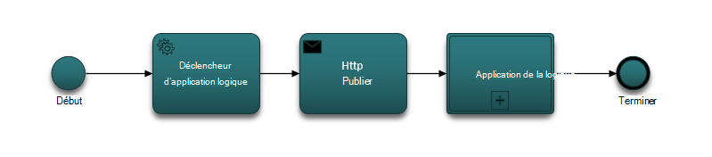

### <a name="lets-take-a-look-at-what-this-logic-app-does"></a>Examinons à présent ce que fait cette application logique
Si vous examinez la figure suivante il existe plusieurs étapes dans le flux de travail LogicApp.

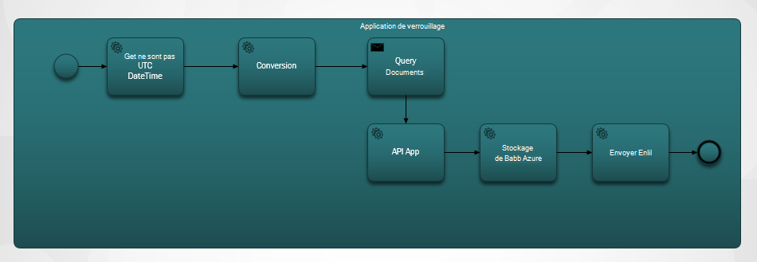

Les étapes sont les suivantes :

1. Vous devez obtenir l’heure UTC actuelle à partir d’une application API.  La valeur par défaut est une heure précédente.

2. La valeur de DateTime UTC est converti en un format Unix Timestamp. Il s’agit du format par défaut pour les estampilles dans DocumentDB.

3. VALIDATION de la valeur à une application API, qui effectue une DocumentDB requête. La valeur est utilisée dans une requête.

    ```SQL
        SELECT * FROM Patients p WHERE (p._ts >= @unixTimeStamp)
    ```

    > [AZURE.NOTE] Le DTS représente les métadonnées d’horodatage pour toutes les ressources DocumentDB.

4. S’il existe des documents trouvés, le corps de réponse est envoyé à votre stockage de Blob Azure.

    > [AZURE.NOTE] Stockage des objets BLOB requiert un compte de stockage Azure. Vous devez configurer un compte de stockage Azure Blob et ajouter un nouveau Blob nommé patients. Pour plus d’informations, consultez [mise en route de stockage des objets Blob Azure](../storage/storage-dotnet-how-to-use-blobs.md)et les [comptes de stockage sur Azure](../storage/storage-create-storage-account.md) .

5. Enfin, un e-mail est envoyé qui indique au destinataire le nombre de documents trouvés. Si aucun document n’a été trouvé, le corps de l’e-mail est « 0 Documents trouvés ». 

Maintenant que vous avez une idée de ce que fait le flux de travail, jetons un œil à la façon de l’implémenter.

### <a name="lets-start-with-the-main-logic-app"></a>Commençons par la logique d’application principale

Si vous n’êtes pas familier avec les applications de logique, ils sont disponibles sur le [Marché d’Azure](https://portal.azure.com/)et vous en apprendrez davantage sur les [Quelles sont les applications logique ?](../app-service-logic/app-service-logic-what-are-logic-apps.md)

Lorsque vous créez une nouvelle application logique, vous êtes invité **comment vous souhaitez démarrer ?**

Lorsque vous cliquez à l’intérieur de la zone de texte, vous avez le choix d’événements. Pour l’application de cette logique, sélectionnez **manuel - lorsque HTTP une demande est reçue** , comme indiqué ci-dessous.

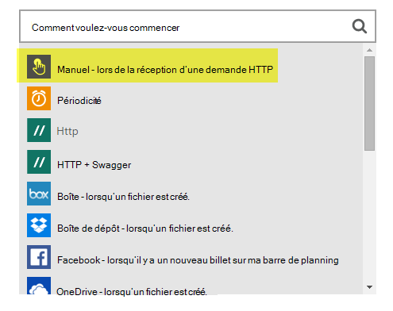

### <a name="design-view-of-your-completed-logic-app"></a>Mode de création de votre application logique terminée
Nous allons passer et consulter la vue Conception terminée de l’application logique, qui est nommé DocDB.


Lorsque vous modifiez les actions dans le Concepteur d’application logique, vous avez la possibilité de sélectionner les **sorties** à partir de la demande HTTP ou l’action précédente comme indiqué dans l’action de sendMail ci-dessous.

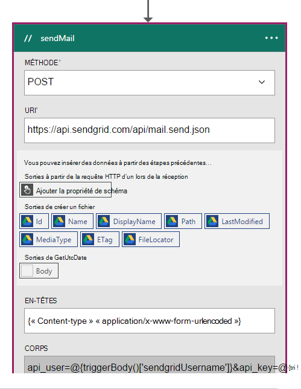

Avant chaque action dans votre flux de travail, vous pouvez prendre une décision ; **Ajouter une action** ou sur **Ajouter une condition** , comme illustré dans la figure suivante.

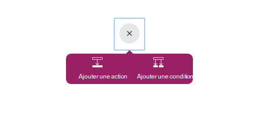

Si vous sélectionnez **Ajouter une condition**, vous sont présentées avec un formulaire, comme illustré dans la figure ci-dessous, pour entrer votre logique.  Il s’agit essentiellement d’une règle d’entreprise.  Si vous cliquez à l’intérieur d’un champ, vous avez la possibilité de sélection des paramètres de l’action précédente. Vous pouvez également entrer les valeurs directement.

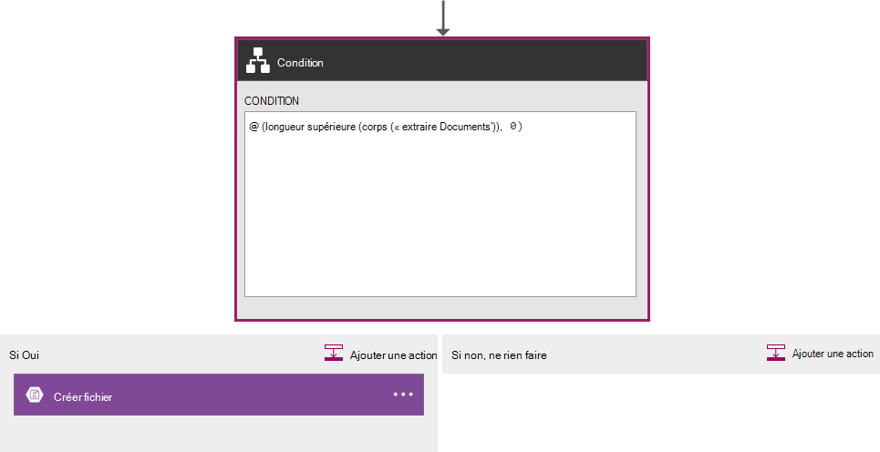

> [AZURE.NOTE] Vous avez également la possibilité d’entrer tous les éléments en mode Code.

Examinons l’application logique terminée en mode code.  

```JSON
   
    "$schema": "https://schema.management.azure.com/providers/Microsoft.Logic/schemas/2015-08-01-preview/workflowdefinition.json#",
    "actions": {
        "Conversion": {
            "conditions": [
                {
                    "dependsOn": "GetUtcDate"
                }
            ],
            "inputs": {
                "method": "post",
                "queries": {
                    "currentdateTime": "@{body('GetUtcDate')}"
                },
                "uri": "https://docdbnotificationapi-debug.azurewebsites.net/api/Conversion"
            },
            "metadata": {
                "apiDefinitionUrl": "https://docdbnotificationapi-debug.azurewebsites.net/swagger/docs/v1",
                "swaggerSource": "custom"
            },
            "type": "Http"
        },
        "Createfile": {
            "conditions": [
                {
                    "expression": "@greater(length(body('GetDocuments')), 0)"
                },
                {
                    "dependsOn": "GetDocuments"
                }
            ],
            "inputs": {
                "body": "@body('GetDocuments')",
                "host": {
                    "api": {
                        "runtimeUrl": "https://logic-apis-westus.azure-apim.net/apim/azureblob"
                    },
                    "connection": {
                        "name": "@parameters('$connections')['azureblob']['connectionId']"
                    }
                },
                "method": "post",
                "path": "/datasets/default/files",
                "queries": {
                    "folderPath": "/patients",
                    "name": "Patient_@{guid()}.json"
                }
            },
            "type": "ApiConnection"
        },
        "GetDocuments": {
            "conditions": [
                {
                    "dependsOn": "Conversion"
                }
            ],
            "inputs": {
                "method": "post",
                "queries": {
                    "unixTimeStamp": "@body('Conversion')"
                },
                "uri": "https://docdbnotificationapi-debug.azurewebsites.net/api/Patient"
            },
            "metadata": {
                "apiDefinitionUrl": "https://docdbnotificationapi-debug.azurewebsites.net/swagger/docs/v1",
                "swaggerSource": "custom"
            },
            "type": "Http"
        },
        "GetUtcDate": {
            "conditions": [],
            "inputs": {
                "method": "get",
                "queries": {
                    "hoursBack": "@{int(triggerBody()['GetUtcDate_HoursBack'])}"
                },
                "uri": "https://docdbnotificationapi-debug.azurewebsites.net/api/Authorization"
            },
            "metadata": {
                "apiDefinitionUrl": "https://docdbnotificationapi-debug.azurewebsites.net/swagger/docs/v1",
                "swaggerSource": "custom"
            },
            "type": "Http"
        },
        "sendMail": {
            "conditions": [
                {
                    "dependsOn": "GetDocuments"
                }
            ],
            "inputs": {
                "body": "api_user=@{triggerBody()['sendgridUsername']}&api_key=@{triggerBody()['sendgridPassword']}&from=@{parameters('fromAddress')}&to=@{triggerBody()['EmailTo']}&subject=@{triggerBody()['Subject']}&text=@{int(length(body('GetDocuments')))} Documents Found",
                "headers": {
                    "Content-type": "application/x-www-form-urlencoded"
                },
                "method": "POST",
                "uri": "https://api.sendgrid.com/api/mail.send.json"
            },
            "type": "Http"
        }
    },
    "contentVersion": "1.0.0.0",
    "outputs": {
        "Results": {
            "type": "String",
            "value": "@{int(length(body('GetDocuments')))} Records Found"
        }
    },
    "parameters": {
        "$connections": {
            "defaultValue": {},
            "type": "Object"
        },
        "fromAddress": {
            "defaultValue": "user@msn.com",
            "type": "String"
        },
        "toAddress": {
            "defaultValue": "XXXXX@XXXXXXX.net",
            "type": "String"
        }
    },
    "triggers": {
        "manual": {
            "inputs": {
                "schema": {
                    "properties": {},
                    "required": [],
                    "type": "object"
                }
            },
            "type": "Manual"
        }
    
```

Si vous n’êtes pas familiarisé avec ce que représente les différentes sections dans le code, vous pouvez afficher la documentation de [Langage de définition de flux de travail logique d’application](http://aka.ms/logicappsdocs) .

Pour ce flux de travail, vous utilisez un [Déclencheur de Webhook HTTP](https://sendgrid.com/blog/whats-webhook/). Si vous examinez le code ci-dessus, vous verrez les paramètres comme dans l’exemple suivant.

```C#

    =@{triggerBody()['Subject']}

```

Le `triggerBody()` représente les paramètres qui sont inclus dans le corps d’un POST reste à l’API de reste de logique d’application. Le `()['Subject']` représente le champ. Tous ces paramètres constituent le JSON mis en forme le corps. 

> [AZURE.NOTE] À l’aide d’un raccordement du Web, vous avez un accès complet à l’en-tête et le corps de la demande du déclencheur. Dans cette application, vous voulez que le corps.

Comme mentionné précédemment, vous pouvez utiliser le concepteur pour attribuer des paramètres ou de le faire en mode code.
Si vous le faites dans le mode code, vous définissez les propriétés qui nécessitent une valeur, comme illustré dans l’exemple de code suivant. 

```JSON

    "triggers": {
        "manual": {
            "inputs": {
            "schema": {
                "properties": {
            "Subject": {
                "type" : "String"   

            }
            },
                "required": [
            "Subject"
                 ],
                "type": "object"
            }
            },
            "type": "Manual"
        }
        }
```

Ce que vous faites sont création d’un schéma JSON qui est passé dans le corps de la publication HTTP à partir de.
Pour déclencher votre déclencheur, vous aurez besoin d’une URL de rappel.  Vous apprendrez comment générer plus loin dans le didacticiel.  

## <a name="actions"></a>Actions
Nous allons voir ce que fait chaque action dans notre logique d’application.

### <a name="getutcdate"></a>GetUTCDate

**Vue du Concepteur**

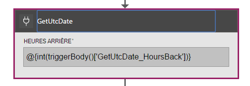

**Affichage du code**

```JSON

    "GetUtcDate": {
            "conditions": [],
            "inputs": {
            "method": "get",
            "queries": {
                "hoursBack": "@{int(triggerBody()['GetUtcDate_HoursBack'])}"
            },
            "uri": "https://docdbnotificationapi-debug.azurewebsites.net/api/Authorization"
            },
            "metadata": {
            "apiDefinitionUrl": "https://docdbnotificationapi-debug.azurewebsites.net/swagger/docs/v1"
            },
            "type": "Http"
        },

```

Cette action HTTP exécute une opération GET.  Il appelle la méthode GetUtcDate d’application API. L’Uri utilise la propriété « GetUtcDate_HoursBack » passée dans le corps du déclencheur.  La valeur 'GetUtcDate_HoursBack' est définie dans la première application logique. Vous en apprendrez davantage sur l’application de la logique de déclencheur plus loin dans le didacticiel.

Cette action appelle l’API application pour renvoyer la valeur de chaîne de Date UTC.

#### <a name="operations"></a>Opérations

**Demande**

```JSON

    {
        "uri": "https://docdbnotificationapi-debug.azurewebsites.net/api/Authorization",
        "method": "get",
        "queries": {
          "hoursBack": "24"
        }
    }

```

**Réponse**

```JSON

    {
        "statusCode": 200,
        "headers": {
          "pragma": "no-cache",
          "cache-Control": "no-cache",
          "date": "Fri, 26 Feb 2016 15:47:33 GMT",
          "server": "Microsoft-IIS/8.0",
          "x-AspNet-Version": "4.0.30319",
          "x-Powered-By": "ASP.NET"
        },
        "body": "Fri, 15 Jan 2016 23:47:33 GMT"
    }

```

L’étape suivante consiste à convertir la valeur DateTime UTC à l’estampille Unix, qui est un type double .NET.

### <a name="conversion"></a>Conversion

##### <a name="designer-view"></a>Vue du Concepteur

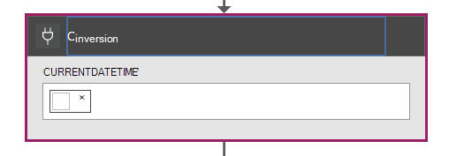

##### <a name="code-view"></a>Affichage du code

```JSON

    "Conversion": {
        "conditions": [
        {
            "dependsOn": "GetUtcDate"
        }
        ],
        "inputs": {
        "method": "post",
        "queries": {
            "currentDateTime": "@{body('GetUtcDate')}"
        },
        "uri": "https://docdbnotificationapi-debug.azurewebsites.net/api/Conversion"
        },
        "metadata": {
        "apiDefinitionUrl": "https://docdbnotificationapi-debug.azurewebsites.net/swagger/docs/v1"
        },
        "type": "Http"
    },

```

Dans cette étape, vous passez dans la valeur retournée par le GetUTCDate.  Il existe une condition dependsOn, ce qui signifie que l’action GetUTCDate doit se terminer normalement. Si ce n’est pas le cas, puis cette action est ignorée. 

Cette action appelle l’API application pour gérer la conversion.

#### <a name="operations"></a>Opérations

##### <a name="request"></a>Demande

```JSON

    {
        "uri": "https://docdbnotificationapi-debug.azurewebsites.net/api/Conversion",
        "method": "post",
        "queries": {
        "currentDateTime": "Fri, 15 Jan 2016 23:47:33 GMT"
        }
    }   
```

##### <a name="response"></a>Réponse

```JSON

    {
        "statusCode": 200,
        "headers": {
          "pragma": "no-cache",
          "cache-Control": "no-cache",
          "date": "Fri, 26 Feb 2016 15:47:33 GMT",
          "server": "Microsoft-IIS/8.0",
          "x-AspNet-Version": "4.0.30319",
          "x-Powered-By": "ASP.NET"
        },
        "body": 1452901653
    }
```

Dans l’action suivante, vous effectuez une opération POST à notre application API.

### <a name="getdocuments"></a>GetDocuments 

##### <a name="designer-view"></a>Vue du Concepteur


##### <a name="code-view"></a>Affichage du code

```JSON

    "GetDocuments": {
        "conditions": [
        {
            "dependsOn": "Conversion"
        }
        ],
        "inputs": {
        "method": "post",
        "queries": {
            "unixTimeStamp": "@{body('Conversion')}"
        },
        "uri": "https://docdbnotificationapi-debug.azurewebsites.net/api/Patient"
        },
        "metadata": {
        "apiDefinitionUrl": "https://docdbnotificationapi-debug.azurewebsites.net/swagger/docs/v1"
        },
        "type": "Http"
    },

```

Pour l’action GetDocuments, vous vous apprêtez à passer dans le corps de la réponse de l’action de Conversion. Il s’agit d’un paramètre dans l’Uri :

 
```C#

    unixTimeStamp=@{body('Conversion')}

```

L’action QueryDocuments effectue une opération de HTTP POST à l’application de l’API. 

La méthode appelée est **QueryForNewPatientDocuments**.

#### <a name="operations"></a>Opérations

##### <a name="request"></a>Demande

```JSON

    {
        "uri": "https://docdbnotificationapi-debug.azurewebsites.net/api/Patient",
        "method": "post",
        "queries": {
        "unixTimeStamp": "1452901653"
        }
    }
```

##### <a name="response"></a>Réponse

```JSON

    {
        "statusCode": 200,
        "headers": {
        "pragma": "no-cache",
        "cache-Control": "no-cache",
        "date": "Fri, 26 Feb 2016 15:47:35 GMT",
        "server": "Microsoft-IIS/8.0",
        "x-AspNet-Version": "4.0.30319",
        "x-Powered-By": "ASP.NET"
        },
        "body": [
        {
            "id": "xcda",
            "_rid": "vCYLAP2k6gAXAAAAAAAAAA==",
            "_self": "dbs/vCYLAA==/colls/vCYLAP2k6gA=/docs/vCYLAP2k6gAXAAAAAAAAAA==/",
            "_ts": 1454874620,
            "_etag": "\"00007d01-0000-0000-0000-56b79ffc0000\"",
            "resourceType": "Patient",
            "text": {
            "status": "generated",
            "div": "<div>\n      \n      <p>Henry Levin the 7th</p>\n    \n    </div>"
            },
            "identifier": [
            {
                "use": "usual",
                "type": {
                "coding": [
                    {
                    "system": "http://hl7.org/fhir/v2/0203",
                    "code": "MR"
                    }
                ]
                },
                "system": "urn:oid:2.16.840.1.113883.19.5",
                "value": "12345"
            }
            ],
            "active": true,
            "name": [
            {
                    "family": [
                        "Levin"
                    ],
                    "given": [
                        "Henry"
                    ]
                }
            ],
            "gender": "male",
            "birthDate": "1932-09-24",
            "managingOrganization": {
                "reference": "Organization/2.16.840.1.113883.19.5",
                "display": "Good Health Clinic"
            }
        },

```

L’action suivante est d’enregistrer les documents pour le [stockage du Blog d’Azure](https://azure.microsoft.com/services/storage/). 

> [AZURE.NOTE] Stockage des objets BLOB requiert un compte de stockage Azure. Vous devez configurer un compte de stockage Azure Blob et ajouter un nouveau Blob nommé patients. Pour plus d’informations, consultez [mise en route de stockage des objets Blob Azure](../storage/storage-dotnet-how-to-use-blobs.md).

### <a name="create-file"></a>Créer fichier

##### <a name="designer-view"></a>Vue du Concepteur

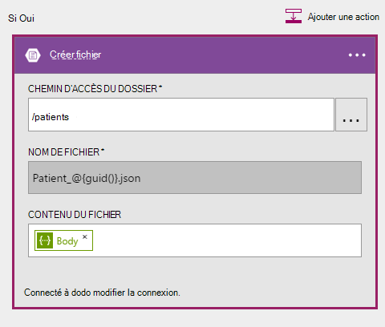

##### <a name="code-view"></a>Affichage du code

```JSON

    {
    "host": {
        "api": {
            "runtimeUrl": "https://logic-apis-westus.azure-apim.net/apim/azureblob"
        },
        "connection": {
            "name": "subscriptions/fxxxxxc079-4e5d-b002-xxxxxxxxxx/resourceGroups/Api-Default-Central-US/providers/Microsoft.Web/connections/azureblob"
        }
    },
    "method": "post",
    "path": "/datasets/default/files",
    "queries": {
        "folderPath": "/patients",
        "name": "Patient_17513174-e61d-4b56-88cb-5cf383db4430.json"
    },
    "body": [
        {
            "id": "xcda",
            "_rid": "vCYLAP2k6gAXAAAAAAAAAA==",
            "_self": "dbs/vCYLAA==/colls/vCYLAP2k6gA=/docs/vCYLAP2k6gAXAAAAAAAAAA==/",
            "_ts": 1454874620,
            "_etag": "\"00007d01-0000-0000-0000-56b79ffc0000\"",
            "resourceType": "Patient",
            "text": {
                "status": "generated",
                "div": "<div>\n      \n      <p>Henry Levin the 7th</p>\n    \n    </div>"
            },
            "identifier": [
                {
                    "use": "usual",
                    "type": {
                        "coding": [
                            {
                                "system": "http://hl7.org/fhir/v2/0203",
                                "code": "MR"
                            }
                        ]
                    },
                    "system": "urn:oid:2.16.840.1.113883.19.5",
                    "value": "12345"
                }
            ],
            "active": true,
            "name": [
                {
                    "family": [
                        "Levin"
                    ],
                    "given": [
                        "Henry"
                    ]
                }
            ],
            "gender": "male",
            "birthDate": "1932-09-24",
            "managingOrganization": {
                "reference": "Organization/2.16.840.1.113883.19.5",
                "display": "Good Health Clinic"
            }
        },

```

Le code est généré à partir de l’action dans le concepteur. Vous n’êtes pas obligé de modifier le code.

Si vous n’êtes pas familiarisé avec l’utilisation de l’API de Blob Azure, consultez [mise en route de l’API du stockage blob Azure](../connectors/connectors-create-api-azureblobstorage.md).

#### <a name="operations"></a>Opérations

##### <a name="request"></a>Demande

```JSON

    "host": {
        "api": {
            "runtimeUrl": "https://logic-apis-westus.azure-apim.net/apim/azureblob"
        },
        "connection": {
            "name": "subscriptions/fxxxxxc079-4e5d-b002-xxxxxxxxxx/resourceGroups/Api-Default-Central-US/providers/Microsoft.Web/connections/azureblob"
        }
    },
    "method": "post",
    "path": "/datasets/default/files",
    "queries": {
        "folderPath": "/patients",
        "name": "Patient_17513174-e61d-4b56-88cb-5cf383db4430.json"
    },
    "body": [
        {
            "id": "xcda",
            "_rid": "vCYLAP2k6gAXAAAAAAAAAA==",
            "_self": "dbs/vCYLAA==/colls/vCYLAP2k6gA=/docs/vCYLAP2k6gAXAAAAAAAAAA==/",
            "_ts": 1454874620,
            "_etag": "\"00007d01-0000-0000-0000-56b79ffc0000\"",
            "resourceType": "Patient",
            "text": {
                "status": "generated",
                "div": "<div>\n      \n      <p>Henry Levin the 7th</p>\n    \n    </div>"
            },
            "identifier": [
                {
                    "use": "usual",
                    "type": {
                        "coding": [
                            {
                                "system": "http://hl7.org/fhir/v2/0203",
                                "code": "MR"
                            }
                        ]
                    },
                    "system": "urn:oid:2.16.840.1.113883.19.5",
                    "value": "12345"
                }
            ],
            "active": true,
            "name": [
                {
                    "family": [
                        "Levin"
                    ],
                    "given": [
                        "Henry"
                    ]
                }
            ],
            "gender": "male",
            "birthDate": "1932-09-24",
            "managingOrganization": {
                "reference": "Organization/2.16.840.1.113883.19.5",
                "display": "Good Health Clinic"
            }
        },….


```

##### <a name="response"></a>Réponse

```JSON

    {
        "statusCode": 200,
        "headers": {
        "pragma": "no-cache",
        "x-ms-request-id": "2b2f7c57-2623-4d71-8e53-45c26b30ea9d",
        "cache-Control": "no-cache",
        "date": "Fri, 26 Feb 2016 15:47:36 GMT",
        "set-Cookie": "ARRAffinity=29e552cea7db23196f7ffa644003eaaf39bc8eb6dd555511f669d13ab7424faf;Path=/;Domain=127.0.0.1",
        "server": "Microsoft-HTTPAPI/2.0",
        "x-AspNet-Version": "4.0.30319",
        "x-Powered-By": "ASP.NET"
        },
        "body": {
        "Id": "0B0nBzHyMV-_NRGRDcDNMSFAxWFE",
        "Name": "Patient_47a2a0dc-640d-4f01-be38-c74690d085cb.json",
        "DisplayName": "Patient_47a2a0dc-640d-4f01-be38-c74690d085cb.json",
        "Path": "/Patient/Patient_47a2a0dc-640d-4f01-be38-c74690d085cb.json",
        "LastModified": "2016-02-26T15:47:36.215Z",
        "Size": 65647,
        "MediaType": "application/octet-stream",
        "IsFolder": false,
        "ETag": "\"c-g_a-1OtaH-kNQ4WBoXLp3Zv9s/MTQ1NjUwMTY1NjIxNQ\"",
        "FileLocator": "0B0nBzHyMV-_NRGRDcDNMSFAxWFE"
        }
    }
```

Votre dernière étape est d’envoyer une notification par e-mail

### <a name="sendemail"></a>sendEmail

##### <a name="designer-view"></a>Vue du Concepteur

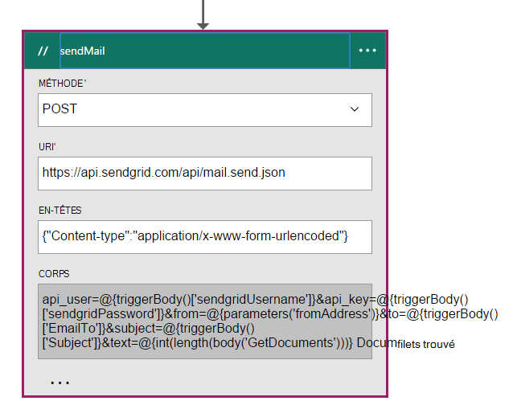

##### <a name="code-view"></a>Affichage du code

```JSON


    "sendMail": {
        "conditions": [
        {
            "dependsOn": "GetDocuments"
        }
        ],
        "inputs": {
        "body": "api_user=@{triggerBody()['sendgridUsername']}&api_key=@{triggerBody()['sendgridPassword']}&from=@{parameters('fromAddress')}&to=@{triggerBody()['EmailTo']}&subject=@{triggerBody()['Subject']}&text=@{int(length(body('GetDocuments')))} Documents Found",
        "headers": {
            "Content-type": "application/x-www-form-urlencoded"
        },
        "method": "POST",
        "uri": "https://api.sendgrid.com/api/mail.send.json"
        },
        "type": "Http"
    }
```

Cette action vous envoyez une notification par e-mail.  Vous utilisez le [SendGrid](https://sendgrid.com/marketing/sendgrid-services?cvosrc=PPC.Bing.sendgrib&cvo_cid=SendGrid%20-%20US%20-%20Brand%20-%20&mc=Paid%20Search&mcd=BingAds&keyword=sendgrib&network=o&matchtype=e&mobile=&content=&search=1&utm_source=bing&utm_medium=cpc&utm_term=%5Bsendgrib%5D&utm_content=%21acq%21v2%2134335083397-8303227637-1649139544&utm_campaign=SendGrid+-+US+-+Brand+-+%28English%29).   

Le code a été généré à l’aide d’un modèle de logique d’application et de SendGrid qui se trouve dans le [référentiel de Github 101-logique-app-sendgrid](https://github.com/Azure/azure-quickstart-templates/tree/master/101-logic-app-sendgrid).
 
L’opération HTTP est une publication. 

Les paramètres d’autorisation sont dans les propriétés du déclencheur

```JSON

    },
        "sendgridPassword": {
             "type": "SecureString"
         },
         "sendgridUsername": {
            "type": "String"
         }

        In addition, other parameters are static values set in the Parameters section of the Logic App. These are:
        },
        "toAddress": {
            "defaultValue": "XXXX@XXXX.com",
            "type": "String"
        },
        "fromAddress": {
            "defaultValue": "XXX@msn.com",
            "type": "String"
        },
        "emailBody": {
            "defaultValue": "@{string(concat(int(length(actions('QueryDocuments').outputs.body)) Records Found),'/n', actions('QueryDocuments').outputs.body)}",
            "type": "String"
        },

```

L’emailBody est concaténant le nombre de documents renvoyés par la requête, ce qui peut être « 0 » ou plus, avec, « Enregistrements trouvés ». Le reste des paramètres sont définis dans les paramètres du déclencheur.

Cette action dépend de l’action **GetDocuments** .

#### <a name="operations"></a>Opérations

##### <a name="request"></a>Demande
```JSON

    {
        "uri": "https://api.sendgrid.com/api/mail.send.json",
        "method": "POST",
        "headers": {
        "Content-type": "application/x-www-form-urlencoded"
        },
        "body": "api_user=azureuser@azure.com&api_key=Biz@Talk&from=user@msn.com&to=XXXX@XXXX.com&subject=New Patients&text=37 Documents Found"
    }

```

##### <a name="response"></a>Réponse

```JSON

    {
        "statusCode": 200,
        "headers": {
        "connection": "keep-alive",
        "x-Frame-Options": "DENY,DENY",
        "access-Control-Allow-Origin": "https://sendgrid.com",
        "date": "Fri, 26 Feb 2016 15:47:35 GMT",
        "server": "nginx"
        },
        "body": {
        "message": "success"
        }
    }
```

Enfin, vous voulez être en mesure de voir les résultats à partir de votre application logique sur le portail d’Azure. Pour ce faire, vous ajoutez un paramètre à la section des sorties.


```JSON

    "outputs": {
        "Results": {
            "type": "String",
            "value": "@{int(length(actions('QueryDocuments').outputs.body))} Records Found"
        }

```

Cela retourne la même valeur que celle qui est envoyée dans le corps de l’e-mail. La figure suivante illustre un exemple où « 29 des enregistrements trouvés ».


## <a name="metrics"></a>Mesures
Vous pouvez configurer la surveillance de l’application principale de logique dans le portail. Cela vous permet d’afficher la latence d’exécuter et d’autres événements, comme indiqué dans la figure suivante.

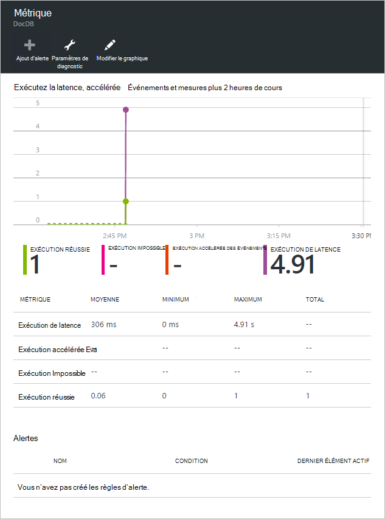

## <a name="docdb-trigger"></a>DocDb déclencheur

Cette application logique est le déclencheur qui lance le flux de travail sur votre application logique principale.

La figure suivante montre la vue de concepteur.

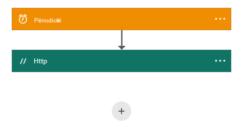

```JSON

    {
        "$schema": "https://schema.management.azure.com/providers/Microsoft.Logic/schemas/2015-08-01-preview/workflowdefinition.json#",
        "actions": {
        "Http": {
            "conditions": [],
            "inputs": {
            "body": {
                "EmailTo": "XXXXXX@XXXXX.net",
                "GetUtcDate_HoursBack": "24",
                "Subject": "New Patients",
                "sendgridPassword": "********",
                "sendgridUsername": "azureuser@azure.com"
            },
            "method": "POST",
            "uri": "https://prod-01.westus.logic.azure.com:443/workflows/12a1de57e48845bc9ce7a247dfabc887/triggers/manual/run?api-version=2015-08-01-preview&sp=%2Ftriggers%2Fmanual%2Frun&sv=1.0&sig=ObTlihr529ATIuvuG-dhxOgBL4JZjItrvPQ8PV6973c"
            },
            "type": "Http"
        }
        },
        "contentVersion": "1.0.0.0",
        "outputs": {
        "Results": {
            "type": "String",
            "value": "@{body('Http')['status']}"
        }
        },
        "parameters": {},
        "triggers": {
        "recurrence": {
            "recurrence": {
            "frequency": "Hour",
            "interval": 24
            },
            "type": "Recurrence"
        }
        }
    }

```

Le déclencheur est défini pour une périodicité de vingt-quatre heures. L’Action est un HTTP POST qui utilise l’URL de rappel pour la logique d’application principale. Le corps contient les paramètres qui sont spécifiés dans le schéma de JSON. 

#### <a name="operations"></a>Opérations

##### <a name="request"></a>Demande

```JSON

    {
        "uri": "https://prod-01.westus.logic.azure.com:443/workflows/12a1de57e48845bc9ce7a247dfabc887/triggers/manual/run?api-version=2015-08-01-preview&sp=%2Ftriggers%2Fmanual%2Frun&sv=1.0&sig=ObTlihr529ATIuvuG-dhxOgBL4JZjItrvPQ8PV6973c",
        "method": "POST",
        "body": {
        "EmailTo": "XXXXXX@XXXXX.net",
        "GetUtcDate_HoursBack": "24",
        "Subject": "New Patients",
        "sendgridPassword": "********",
        "sendgridUsername": "azureuser@azure.com"
        }
    }

```

##### <a name="response"></a>Réponse

```JSON

    {
        "statusCode": 202,
        "headers": {
        "pragma": "no-cache",
        "x-ms-ratelimit-remaining-workflow-writes": "7486",
        "x-ms-ratelimit-burst-remaining-workflow-writes": "1248",
        "x-ms-request-id": "westus:2d440a39-8ba5-4a9c-92a6-f959b8d2357f",
        "cache-Control": "no-cache",
        "date": "Thu, 25 Feb 2016 21:01:06 GMT"
        }
    }
```

Maintenant examinons l’application API.

## <a name="docdbnotificationapi"></a>DocDBNotificationApi

Bien qu’il y a plusieurs opérations dans l’application, vous n’allez utiliser trois.

* GetUtcDate
* ConvertToTimeStamp
* QueryForNewPatientDocuments

### <a name="docdbnotificationapi-operations"></a>Opérations de DocDBNotificationApi
Examinons la documentation Swagger

> [AZURE.NOTE] Pour vous permettre d’appeler les opérations de l’extérieur, vous devez ajouter un CORS autorisé la valeur d’origine de « * » (sans les guillemets) dans les paramètres de votre application API, comme illustré dans la figure suivante.

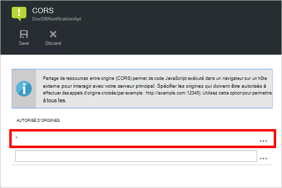

#### <a name="getutcdate"></a>GetUtcDate

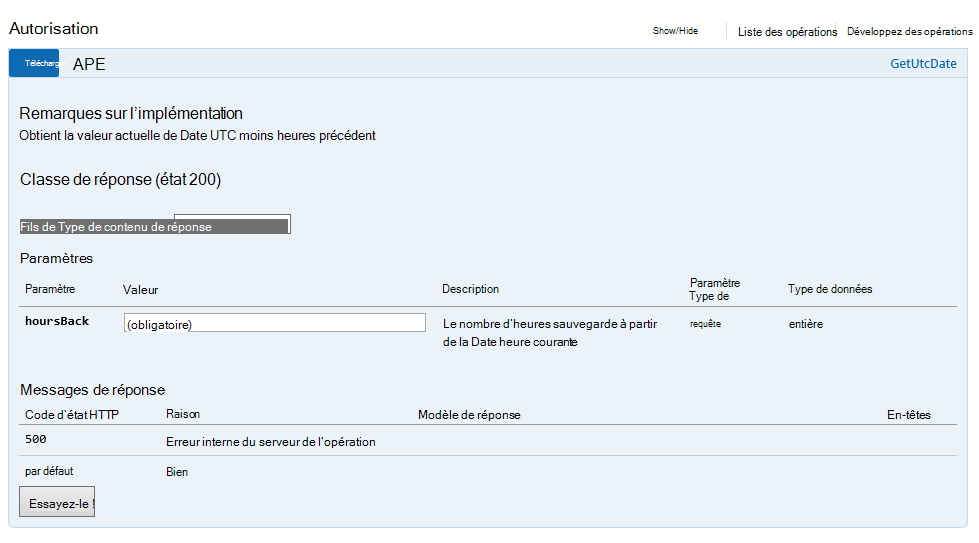

#### <a name="converttotimestamp"></a>ConvertToTimeStamp

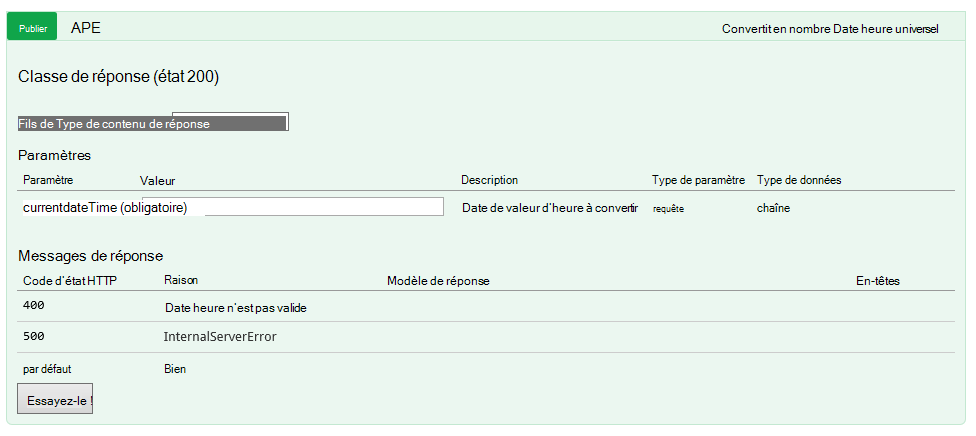

#### <a name="queryfornewpatientdocuments"></a>QueryForNewPatientDocuments

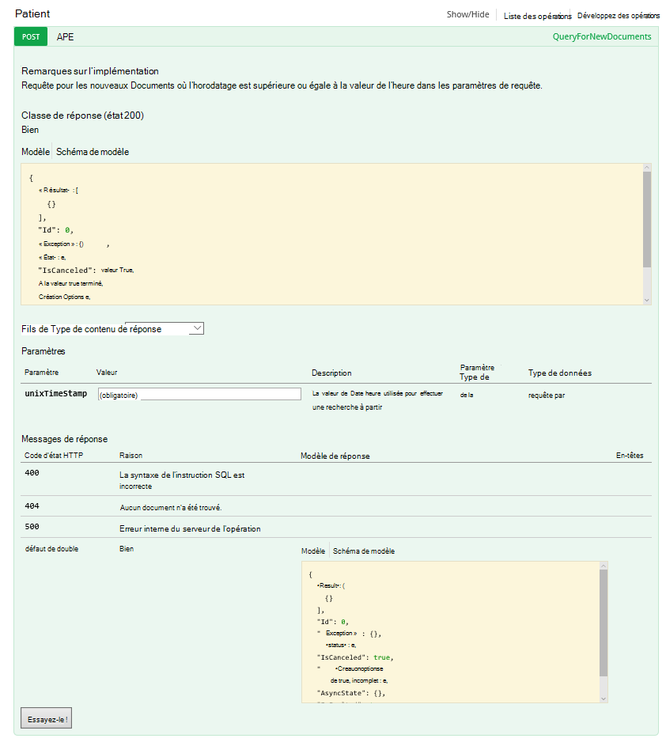

Examinons le code-behind de cette opération.

#### <a name="getutcdate"></a>GetUtcDate

```C#

    /// <summary>
    /// Gets the current UTC Date value
    /// </summary>
    /// <returns></returns>
    [H ttpGet]
    [Metadata("GetUtcDate", "Gets the current UTC Date value minus the Hours Back")]
    [SwaggerOperation("GetUtcDate")]
    [SwaggerResponse(HttpStatusCode.OK, type: typeof (string))]
    [SwaggerResponse(HttpStatusCode.InternalServerError, "Internal Server Operation Error")]
    public string GetUtcDate(
       [Metadata("Hours Back", "How many hours back from the current Date Time")] int hoursBack)
    {


        return DateTime.UtcNow.AddHours(-hoursBack).ToString("r");
    }
```

Cette opération retourne simplement la renvoie le DateTime UTC actuelle moins la valeur de HoursBack.

#### <a name="converttotimestamp"></a>ConvertToTimeStamp

``` C#

        /// <summary>
        ///     Converts DateTime to double
        /// </summary>
        /// <param name="currentdateTime"></param>
        /// <returns></returns>
        [Metadata("Converts Universal DateTime to number")]
        [SwaggerResponse(HttpStatusCode.OK, null, typeof (double))]
        [SwaggerResponse(HttpStatusCode.BadRequest, "DateTime is invalid")]
        [SwaggerResponse(HttpStatusCode.InternalServerError)]
        [SwaggerOperation(nameof(ConvertToTimestamp))]
        public double ConvertToTimestamp(
            [Metadata("currentdateTime", "DateTime value to convert")] string currentdateTime)
        {
            double result;

            try
            {
                var uncoded = HttpContext.Current.Server.UrlDecode(currentdateTime);

                var newDateTime = DateTime.Parse(uncoded);
                //create Timespan by subtracting the value provided from the Unix Epoch
                var span = newDateTime - new DateTime(1970, 1, 1, 0, 0, 0, 0).ToLocalTime();

                //return the total seconds (which is a UNIX timestamp)
                result = span.TotalSeconds;
            }
            catch (Exception e)
            {
                throw new Exception("unable to convert to Timestamp", e.InnerException);
            }

            return result;
        }

```

Cette opération convertit la réponse de l’opération GetUtcDate pour une valeur de type double.

#### <a name="queryfornewpatientdocuments"></a>QueryForNewPatientDocuments

```C#

        /// <summary>
        ///     Query for new Patient Documents
        /// </summary>
        /// <param name="unixTimeStamp"></param>
        /// <returns>IList</returns>
        [Metadata("QueryForNewDocuments",
            "Query for new Documents where the Timestamp is greater than or equal to the DateTime value in the query parameters."
            )]
        [SwaggerOperation("QueryForNewDocuments")]
        [SwaggerResponse(HttpStatusCode.OK, type: typeof (Task<IList<Document>>))]
        [SwaggerResponse(HttpStatusCode.BadRequest, "The syntax of the SQL Statement is incorrect")]
        [SwaggerResponse(HttpStatusCode.NotFound, "No Documents were found")]
        [SwaggerResponse(HttpStatusCode.InternalServerError, "Internal Server Operation Error")]
        // ReSharper disable once ConsiderUsingAsyncSuffix
        public IList<Document> QueryForNewPatientDocuments(
            [Metadata("UnixTimeStamp", "The DateTime value used to search from")] double unixTimeStamp)
        {
            var context = new DocumentDbContext();
            var filterQuery = string.Format(InvariantCulture, "SELECT * FROM Patient p WHERE p._ts >=  {0}",
                unixTimeStamp);
            var options = new FeedOptions {MaxItemCount = -1};


            var collectionLink = UriFactory.CreateDocumentCollectionUri(DocumentDbContext.DatabaseId,
                DocumentDbContext.CollectionId);

            var response =
                context.Client.CreateDocumentQuery<Document>(collectionLink, filterQuery, options).AsEnumerable();

            return response.ToList();
    }

```

Cette opération utilise le [Kit de développement .NET DocumentDB](documentdb-sdk-dotnet.md) pour créer une requête de document. 

```C#
     CreateDocumentQuery<Document>(collectionLink, filterQuery, options).AsEnumerable();
```

La réponse de l’opération ConvertToTimeStamp (unixTimeStamp) est passée. L’opération retourne une liste de documents, `IList<Document>`.

Nous avons parlé précédemment de la CallbackURL. Pour démarrer le flux de travail dans votre logique d’application principal, vous devrez appeler à l’aide de la CallbackURL.

## <a name="callbackurl"></a>CallbackURL

Pour commencer, vous devez votre jeton de publicité Azure.  Il peut être difficile d’obtenir ce jeton. Je recherche une méthode simple et Jeff Hollan, qui est un gestionnaire de programmes Azure logique App, recommandé à l’aide de [armclient](http://blog.davidebbo.com/2015/01/azure-resource-manager-client.html) dans PowerShell.  Vous pouvez l’installer suivant les instructions fournies.

Les opérations que vous souhaitez utiliser sont la connexion et appeler des API ARM.
 
Connexion : Vous utilisez les mêmes informations d’identification pour la connexion au portail Azure. 

L’opération d’appeler les Api ARM est celle qui génère votre CallBackURL.

Dans PowerShell, vous appelez comme suit :  

```powershell

    ArmClient.exe post https://management.azure.com/subscriptions/[YOUR SUBSCRIPTION ID/resourcegroups/[YOUR RESOURCE GROUP]/providers/Microsoft.Logic/workflows/[YOUR LOGIC APP NAME/triggers/manual/listcallbackurl?api-version=2015-08-01-preview

```

Le résultat doit ressembler à ceci :

```powershell

    https://prod-02.westus.logic.azure.com:443/workflows/12a1de57e48845bc9ce7a247dfabc887/triggers/manual/run?api-version=2015-08-01-prevaiew&sp=%2Ftriggers%2Fmanual%2Frun&sv=1.0&sig=XXXXXXXXXXXXXXXXXXX

```

Vous pouvez utiliser un outil tel que [postman](http://www.getpostman.com/) pour tester des application principale de logique comme indiqué dans la figure suivante.

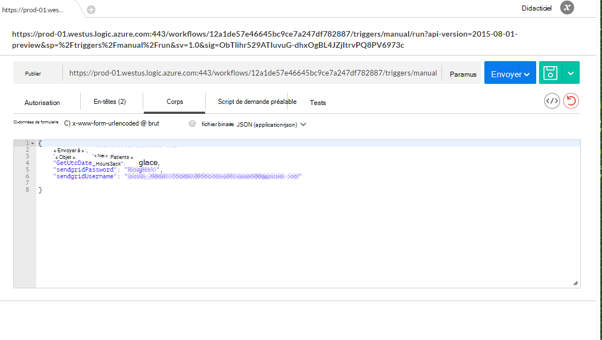

Le tableau suivant répertorie les paramètres de déclencheur qui constituent le corps de l’application logique du déclencheur DocDB.

Paramètre | Description 
--- | --- 
GetUtcDate_HoursBack | Permet de définir le nombre d’heures pour la date de début de recherche
sendgridUsername | Permet de définir le nombre d’heures pour la date de début de recherche
sendgridPassword | Le nom d’utilisateur pour e-mail d’envoyer une grille
EmailTo | L’adresse de messagerie qui recevra la notification par e-mail
Objet | L’objet de l’e-mail

## <a name="viewing-the-patient-data-in-the-azure-blob-service"></a>Affichage des données patient dans le service d’objet Blob d’Azure

Accédez à votre compte de stockage Azure, puis sélectionnez les objets BLOB sous services comme indiqué dans la figure suivante.

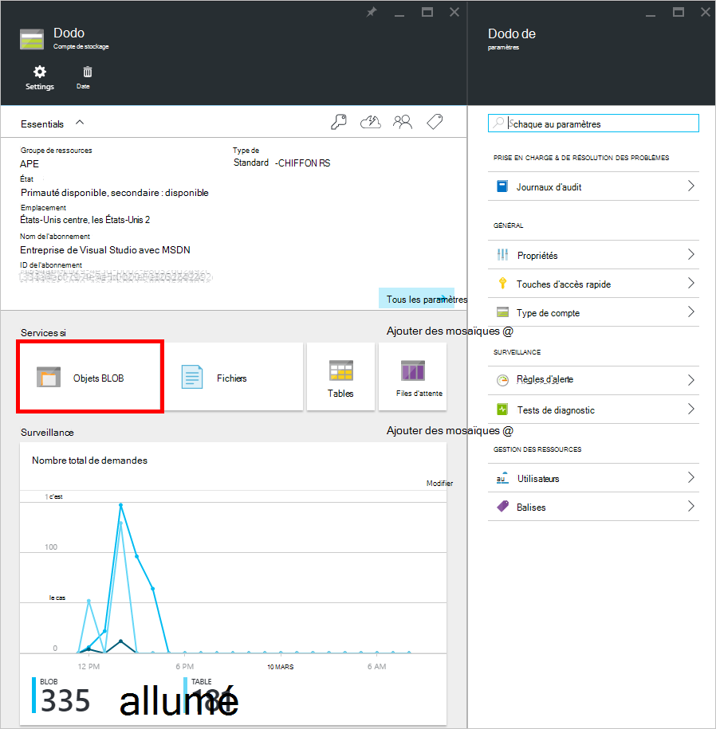 

Vous ne pourrez pas afficher les informations du fichier blob de Patient comme indiqué ci-dessous.

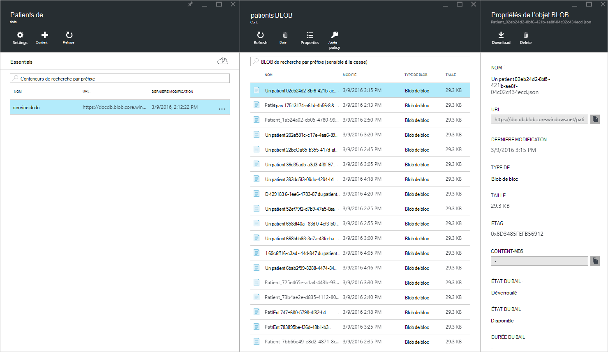


## <a name="summary"></a>Résumé

Dans cette procédure pas à pas, vous avez appris les éléments suivants :

* Il est possible d’implémenter les notifications dans DocumentDB.
* À l’aide d’applications de logique, vous pouvez automatiser le processus.
* À l’aide d’applications de logique, vous pouvez réduire le temps que nécessaire pour remettre une application.
* À l’aide de HTTP, vous pouvez facilement consommer une application API au sein d’une application de logique.
* Vous pouvez facilement créer un CallBackURL qui remplace l’écouteur HTTP.
* Vous pouvez facilement créer des flux de travail personnalisés avec le Concepteur d’applications logique.

La clé est à prévoir et modéliser votre flux de travail.

## <a name="next-steps"></a>Étapes suivantes
Veuillez télécharger et utiliser le code d’application de la logique fourni sur [Github](https://github.com/HEDIDIN/DocDbNotifications). Je vous invite à appuyer sur l’application et d’envoyer les modifications à la mis en pension. 

Pour en savoir plus sur DocumentDB, visitez le [Cursus](https://azure.microsoft.com/documentation/learning-paths/documentdb/).
