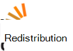

<properties
  pageTitle="DocumentDB Communauté et actualités | Microsoft Azure"
  description="Rejoignez la Communauté DocumentDB d’Azure pour créer des relations, présenter votre travail et approfondissez vos connaissances."
  services="documentdb"
  documentationCenter=""
  authors="aliuy"
  manager="johnmac"
  editor="mimig"/>

<tags
  ms.service="documentdb"
  ms.devlang="na"
  ms.topic="article"
  ms.tgt_pltfrm="na"
  ms.workload="data-services"
  ms.date="09/26/2016"
  ms.author="andrl"/>

# Portail de communauté

## Actualités de la Communauté

Nous promouvoir votre projet ! Indiquent le projet Isard, que vous travaillez avec des DocumentDB, et nous aidera à partager votre génie avec le monde entier. Pour envoyer votre projet, envoyez-nous un courrier électronique à : [askdocdb@microsoft.com](mailto:askdocdb@microsoft.com).

### documentdb-lumenize

*par Larry Maccherone*

Agrégations (Group-by-tableau croisé dynamique et le Cube de dimension N) et l’heure des Transformations de série comme des procédures stockées dans DocumentDB.

Extraire sur [Github](https://github.com/lmaccherone/documentdb-lumenize) et [npm](https://www.npmjs.com/package/lumenize).

### DocumentDB Studio

*par Ming Liu*

Un client Gestion Observateur/Explorateur Microsoft Azure DocumentDB service.

Extraire sur [Github](https://github.com/mingaliu/DocumentDBStudio).

### DoQmentDB

*en Arial Mashraki*

DoQmentDB est un client basé sur les promesses de Node.js, qui fournit une couche de type MongoDB sur DocumentDB.

Extraire sur [Github](https://github.com/a8m/doqmentdb) et [npm](https://www.npmjs.com/package/doqmentdb).

### API REST de swagger pour DocumentDB

*par Howard Edidin*

Un fichier de Swagger de DocumentDB autres API qui peut être facilement déployé comme une application API.

Extraire sur [Github](https://github.com/HEDIDIN/DocumentDB-REST/tree/master/DocumentDBRestApi).

### Fluent plug-in-documentdb

*par Yoichi Kawasaki*

Fluent plug-in-documentdb est un plug-in Fluentd pour la sortie de DocumentDB d’Azure.

Extraire sur [Github](https://github.com/yokawasa/fluent-plugin-documentdb) et [rubygems](https://rubygems.org/gems/fluent-plugin-documentdb).

*Rechercher des projets DocumentDB sur [GitHub](https://github.com/search?p=4&q=documentdb&type=Repositories)plus ouvrir la source.*

## Actualités, blogs et articles

Vous pouvez rester à jour avec les dernières nouvelles de DocumentDB et les fonctionnalités en suivant [notre blog](https://azure.microsoft.com/blog/tag/documentdb/).

**Postes de la Communauté :**

- [**Allez sociale avec DocumentDB**](https://blogs.msdn.microsoft.com/mvpawardprogram/2016/03/15/going-social-with-documentdb/) - *par Matias Quarantaas*

- [**Soupe de DocumentDB, les Services d’application Azure et UWP : une application de partage de photos**](https://blogs.windows.com/buildingapps/2016/03/17/uwp-azure-app-services-and-documentdb-soup-a-photo-sharing-app/) - *par Eric Langland*

- [**Notifications pour les ressources DocumentDB nouvelles ou modifiées à l’aide de la logique d’applications**](documentdb-change-notification.md) - *en Edidin de Howard*

- [**Collecter les journaux dans à DocumentDB Azure à l’aide de fluent plug-in-documentdb**](http://unofficialism.info/posts/collecting-logs-into-azure-documentdb-using-fluent-plugin-documentdb/) - *par Yoichi Kawasaki*

- [**DocumentDB revisitée partie 1/2 – la théorie**](https://peterintheazuresky.wordpress.com/2016/02/19/documentdb-revisited-part-12-the-theory/) - *par Peter Mannerhult*

- [**Que d’amour et déteste sur DocumentDB de Azure**](http://blog.falafel.com/4-what-to-love-and-hate-about-azures-documentdb/) - *par George Saadeh*

- [**Azure DocumentDB script côté serveur et**](https://www.simple-talk.com/cloud/cloud-data/azure-documentdb-server-side-scripting/) - *par Robert Sheldon*

- [**DocumentDB comme données de récepteur pour Azure flux Analytique**](http://janatdevelopment.com/2015/12/11/documentdb-as-a-data-sink-for-azure-stream-analytics/?utm_source=twitterfeed&utm_medium=twitter) - *par Jan Hentschel*

- [**DocumentDB Azure en production !** ](http://blog.nexapp.ca/2015/11/30/azure-documentdb-in-production/)  -  *par Alexandre Walsh et Marc-Olivier Duval*

- [**Les indexeurs recherche Azure – DocumentDB requêtes (espagnol)**](http://www.ealsur.com.ar/wp/index.php/2015/11/19/azure-search-indexers-documentdb-queries/) - *par Quaranta de conférence*

- [**Bases de requête DocumentDB SQL Azure (japonais)**](http://beachside.hatenablog.com/entry/2015/12/06/000045) - *par Atsushi Yokohama*

- [**Les Points de données - Aurelia répond aux DocumentDB : Le voyage d’un Matchmaker**](https://msdn.microsoft.com/magazine/mt620011.aspx) - *par Julie Lerman*

- [**Infrastructure en tant que Code et déploiement continue de Node.js + Azure Solution de DocumentDB**](http://www.talmeida.net/blog/2015/10/26/infrastructure-as-code-and-continuous-deployment-of-a-nodejs-azure-documentdb-solution) - *par Thiago Almedia*

- [**Pourquoi DocumentDb fait un choix judicieux pour certains projets**](http://www.iquestllc.com/blogs/read/405/why-documentdb-makes-good-business-sense-for-some-projects) - *par une Samuel Uresin*

- [**Azure DocumentDB développement passer – développement de la classe cliente (1 sur 2) (japonais)**](http://beachside.hatenablog.com/entry/2015/10/01/202734) - *par Atsushi Yokohama*

- [**Choses à savoir lors de l’utilisation d’Azure DocumentDB (japonais)**](http://beachside.hatenablog.com/entry/2015/10/01/202734) - *par Atsushi Yokohama*

- [**Traitement des erreurs RequestRateTooLarge dans Azure DocumentDB et de test des performances de**](http://blogs.msdn.com/b/bigdatasupport/archive/2015/09/02/dealing-with-requestratetoolarge-errors-in-azure-documentdb-and-testing-documentdb-performance.aspx) - *par Azim Uddin*

- [**Les Points de données - une vue d’ensemble de Microsoft Azure DocumentDB**](https://msdn.microsoft.com/magazine/mt147238.aspx) - *par Julie Lerman*

- [**L’utilisation de DocumentDB avec F#**](https://jamessdixon.wordpress.com/2014/12/30/using-documentdb-with-f/) - *par Marie Dixon*

- [**Ouvre une Application analyse avec DocumentDB**](http://vincentlauzon.com/2015/09/06/analysing-application-logs-with-documentdb/) - *par Vincent-Philippe Lauzon*

- [**DocumentDB Azure – sauvegardes**](http://softwarejuancarlos.com/2015/09/06/azure-documentdb-point-in-time-backups/) - *par Juan Carlos Sanchez*

*Vous avez un billet de blog, des exemples de code ou étude de cas que vous voulez partager ? [Faites-le nous savoir](mailto:askdocdb@microsoft.com)!*

## Les événements et les enregistrements

### Événements récents et à venir

| Nom de l’événement                                                                                                                 | Haut-parleur                                                     | Emplacement             | Date                     | Hashtag |
| -------------------------------------------------------------------------------------------------------------------------- | ----------------------------------------------------------- | -------------------- | ------------------------ | ------- |
| [Enflammer 2016](https://myignite.microsoft.com/sessions?q=documentdb)  [Discours d’ouverture : Transformation numérique avec efficacité déraisonnable de A.C.I.D Joseph Sirosh activer le](https://myignite.microsoft.com/sessions/34953)  [Session : Les DocumentDB Azure à grande échelle : modèles de conception et de la réussite client avec Syam Kumar Nair et Andrew Liu](https://myignite.microsoft.com/sessions/3066)  [Session : Gestion des ressources de IoT Node.js et DocumentDB avec Joshua Davis](https://myignite.microsoft.com/sessions/39704)  [Session : Créer des applications plus intelligentes et évolutives à l’aide des Services de base de données Microsoft Azure avec Tara Jana et Moshe Gutman](https://myignite.microsoft.com/sessions/2633)| Andrew Liu, Syam Kumar Nair et Jana de Tara | Atlanta, GA | Du 26 au 30 septembre 2016 | [#MSIgnite](https://twitter.com/MS_Ignite) |
| [Meetup à Ignite : DocumentDB : fonctionnalités avancées pour les applications à grande échelle](http://www.meetup.com/Azure-in-the-ATL/events/234252070/) | Andrew Liu, Syam Kumar Nair |  Atlanta, GA | 27 septembre 2016 | [#MSIgnite](https://twitter.com/MS_Ignite)[@FlatironCity](https://twitter.com/FlatironCity) |
| [Strates + Hadoop World](http://conferences.oreilly.com/strata/hadoop-big-data-ny/?cmp=kn-data-confreg-home-stny16_bing_branded) | Venez visiter notre stand ! | New York, NY | Du 26 au 29 septembre 2016 | [#StrataConf](https://twitter.com/strataconf) |
| [Groupe d’utilisateurs .NET capital ville](http://www.meetup.com/tally-dot-net/events/233768568/) | Hari de Santosh | Tallahassee, Floride | 3 novembre 2016 | n/a |

*Vous parler à ou hébergement d’un événement ? [Faites-nous savoir](mailto:askdocdb@microsoft.com) comment nous pouvons aider !*

### Enregistrements et événements précédents

| Nom de l’événement                                                                                                                 | Haut-parleur                                                     | Emplacement             | Date                   | Enregistrement |
| -------------------------------------------------------------------------------------------------------------------------- | ----------------------------------------------------------- | -------------------- | ---------------------- | --------- |
| [DevTeach](http://devteach.com/) | Ken Cenerelli  | Montréal, Canada | Du 4 au 8 juillet 2016 | [NoSQL, aucun problème, à l’aide de DocumentDB Azure](http://www.slideshare.net/KenCenerelli) |
| [Intégration et IoT](http://www.btug.be/events) | Eldert Grootenboer | Kontich, Belgique | 30 juin 2016 | n/a |
| [MongoDB World 2016](https://www.mongodb.com/world16) | Kirill Gavrylyuk | New York, États-Unis | 28-29 juin 2016 | n/a |
| [Intégration de groupe d’utilisateurs](http://www.integrationusergroup.com/do-logic-apps-support-error-handling/) | Howard S. Edidin | Présentation technique en ligne | 20 juin 2016 | [Logique d’applications prennent-ils en charge la gestion des erreurs ?](http://www.integrationusergroup.com/do-logic-apps-support-error-handling/) |
| [Meetup : Groupe d’utilisateurs Azure Royaume-Uni](http://www.meetup.com/UKAzureUserGroup/events/229673468/)| Andrew Liu  | Londres, Royaume-Uni | 12 mai 2016 | n/a
|[Meetup : ONETUG - groupe d’utilisateurs .NET à Orlando](http://www.meetup.com/ONETUG/events/230797164/)| Hari de Santosh| Orlando, FL| 12 mai 2016| n/a 
| [SQLBits XV](https://sqlbits.com/)                                                                                         | Andrew Liu, Aravind Ramachandran                            | Liverpool, RU        | 4 au 7 mai 2016            | n/a| 
| [Meetup : Groupe de développeurs .NET NYC](http://www.meetup.com/NYC-NET-Developers/events/230396260/)                            | Georges Lobel                                               | Ville de New York, NY    | 21 avril 2016           | n/a |
| [Intégration de groupe d’utilisateurs](http://www.integrationusergroup.com/#)                                                            | Howard Edidin                                               | Conférence Web              | 25 avril 2016           | n/a |
| [Cours d’initiation sur Azure global : SoCal](http://xprs.imcreator.com/free/vishalishere/gab2016)                                        | Georges Lobel                                               | Orange, autorité de certification           | 16 avril 2016           | n/a |
| [Cours d’initiation sur Azure global : Redmond](https://www.eventbrite.com/e/2016-global-azure-bootcamp-redmond-wa-tickets-21387752343)   | David Makogon                                               | Redmond, WA          | 16 avril 2016           | n/a |
| [SQL samedi #481 - Israël 2016](http://www.sqlsaturday.com/481/Sessions/Details.aspx?sid=40912)                          | Georges Lobel                                               | HaMerkaz, Israël     | 04 avril 2016         | n/a |
| [Build 2016](https://build.microsoft.com/)                                                                                 | John Macintyre                                              | San Francisco, CA    | 31 mars 2016         | [Distribuer des Applications à grande échelle avec DocumentDB, base de données de documents NoSQL d’Azure](https://channel9.msdn.com/Events/Build/2016/B840)
| [SQL samedi #505 - Belgique 2016](http://www.sqlsaturday.com/505/Sessions/Details.aspx?sid=44217)                         | Mihail Mateev                                               | Anvers, Belgique     | 19 mars 2016         | n/a |
| [Meetup : CloudTalk](http://www.meetup.com/CloudTalk/events/227963695/)                                                     | Kirat Pandya                                                | Bellevue, WA         | 3 mars 2016          | n/a |
| [Meetup : Austin Azure](http://www.meetup.com/azureaustin/events/228209275/)                                                | Merwan Chinta                                               | Austin, Texas, États-Unis           | 28 janvier 2016       | n/a |
| [Meetup : msdevmtl](http://www.meetup.com/msdevmtl/events/223839818/)                                                       | Vincent-Philippe Lauzon                                     | Montréal, QC, Canada | 1er décembre 2015.       | n/a |
| [Meetup : SeattleJS](http://www.meetup.com/seattlejs/events/220102664/)                                                     | David Makogon                                               | Seattle, WA          | 12 novembre 2015      | n/a |
| [PASSER le sommet 2015](http://www.sqlpass.org/summit/2015/)                                                                    | Jeff Renz, Andrew Hoh, Aravind Ramachandran, John Macintyre | Seattle, WA          | 27-30 octobre 2015    | [Développement d’Applications modernes sur Azure](https://www.youtube.com/watch?v=k5Z24HX-RyQ) |
| [CloudDevelop 2015](http://www.clouddevelop.org/)                                                                          | David Makogon, Ryan Crawcour                                | Columbus, OH         | 23 octobre 2015.       | n/a |
| [SQL samedi #454 - Turin 2015](http://www.sqlsaturday.com/454/Sessions/Details.aspx?sid=40130)                           | Marco De Nittis                                             | Turin, Italie         | 10 octobre 2015.       | n/a |
| [SQL samedi #430 - Sofia 2015](http://www.sqlsaturday.com/430/Sessions/Details.aspx?sid=36090)                           | Georges Lobel                                               | Sofia, Bulgarie      | 10 octobre 2015.       | n/a |
| [SQL samedi #444-2015 de Kansas City](http://www.sqlsaturday.com/444/Sessions/Details.aspx?sid=38576)                     | Jeff Renz                                                   | Kansas City, MO      | 3 octobre 2015.        | n/a |
| [SQL samedi #429 - Porto 2015](http://www.sqlsaturday.com/429/Sessions/Details.aspx?sid=36089)                          | Georges Lobel                                               | Porto, Portugal     | 3 octobre 2015.        | n/a |
| [AzureCon](https://azure.microsoft.com/azurecon/)                                                                          | David Makogon, Ryan Crawcour, John Macintyre                | Événement virtuel        | 29 septembre 2015     | [Plate-forme de données et analytique Azure](https://channel9.msdn.com/events/Microsoft-Azure/AzureCon-2015/ACON207) [Utilisation de données NoSQL dans DocumentDB](https://channel9.msdn.com/Events/Microsoft-Azure/AzureCon-2015/ACON338) |
| [SQL samedi #434 - Holland 2015](http://www.sqlsaturday.com/434/Sessions/Details.aspx?sid=36413)                         | Georges Lobel                                               | Utrecht, pays-bas | 26 septembre 2015     | [Introduction à DocumentDB Azure](https://channel9.msdn.com/Blogs/Windows-Azure/SQL-Saturday-Holland-2015-Introduction-to-Azure-DocumentDB) |
| [SQL samedi #441 - Denver 2015](http://www.sqlsaturday.com/441/Sessions/Details.aspx?sid=39191)                          | Jeff Renz                                                   | Denver, CO           | 19 septembre 2015     | n/a |
| [Meetup : Zone de San Francisco Bay les développeurs Azure](http://www.meetup.com/bayazure/events/223943785/)                        | Andrew Liu                                                  | San Francisco, CA    | 15 septembre 2015     | n/a |
| [Groupe d’utilisateurs du Belarus Azure à distance répondent aux](https://www.facebook.com/events/786540124800276/)                                       | Alex Zyl                                                    | Minsk, Belarus       | 9 septembre 2015.      | [Présentation de la vue d’ensemble du concept de DocumentDB, les niveaux de cohérence, les stratégies d’ont](https://www.youtube.com/watch?v=Uc_qwWzJKH8) |
| [NoSQL tout de suite !](http://nosql2015.dataversity.net/)                                                                            | David Makogon, Ryan Crawcour                                | San Jose, Californie         | 18-20 août 2015     | n/a |
| [@ScaleSeattle](http://www.atscaleconference.com/)                                                                        | Dharma Shukla                                               | Seattle, WA          | 17 juin 2015          | [Indépendant du schéma d’indexation avec Azure DocumentDB](https://www.youtube.com/watch?v=VJQ_5qFFVP4) |
| [Actualisation technique 2015](https://channel9.msdn.com/Events/DXPortugal/Tech-Refresh-2015)                                         | Bruno Lopes                                                 | Lisbonne, Portugal     | 15 juin 2015          | [DocumentDB 101](https://channel9.msdn.com/Events/DXPortugal/Tech-Refresh-2015/DPDEV01) |
| [SQL samedi #417 - Sri Lanka 2015](http://www.sqlsaturday.com/417/Sessions/Details.aspx?sid=21415)                       | Mihail Mateev                                               | COLOMBO, Sri Lanka   | 06 juin 2015          | n/a |
| [Meetup : Seattle évolutivité Meetup](http://www.meetup.com/Seattle-Scalability-Meetup/events/204010442/)                    | Dharma Shukla                                               | Seattle, WA          | 27 mai 2015           | n/a |
| [SQL samedi #377 - Kiev 2015](http://www.sqlsaturday.com/377/Sessions/Details.aspx?sid=20322)                            | Mihail Mateev                                               | Kiev, Ukraine        | 23 mai 2015           | n/a |
| [Mois de la base de données](http://www.databasemonth.com/database/azure-documentdb)                                                   | Dharma Shukla                                               | New York, NY         | 19 mai 2015           | [DocumentDB Azure : Service de base de données de Document hautement évolutives, mutualisée](https://www.youtube.com/watch?v=iZsqBc3Dkbk) |
| [Meetup : Groupe d’utilisateurs SQL Server Londres](http://www.meetup.com/London-SQL-Server-User-Group/events/221525058/)               | Allan Mitchell                                              | Londres, Royaume-Uni           | 19 mai 2015           | n/a |
| [DevIntersection](https://devintersection.com/)                                                                            | Andrew Liu                                                  | Scottsdale, AZ       | 18-21 mai 2015        | n/a |
| [Meetup : Groupe de développeurs Seattle Web App](http://www.meetup.com/Seattle-Web-App-Developers-Group/events/220591071/)       | Andrew Liu                                                  | Seattle, WA          | 14 mai 2015           | n/a |
| [Enflammer](http://ignite.microsoft.com/)                                                                                     | Andrew Hoh, John Macintyre                                  | Chicago, IL          | 4-8 mai 2015          | [Sélectionnez plus récente à partir de DocumentDB vidéo](https://azure.microsoft.com/documentation/videos/microsoft-ignite-2015-select-latest-from-microsoft-azure-documentdb/) [DocumentDB et HDInsight d’Azure : Better Together vidéo](https://azure.microsoft.com/documentation/videos/microsoft-ignite-2015-microsoft-azure-documentdb-and-azure-hdinsight-better-together/) |
| [Génération 2015](http://www.buildwindows.com/)                                                                                 | Ryan Crawcour                                               | San Francisco, CA    | Le 29 avril - 1er mai 2015 | [Générer la prochaine grande révolution d’Azure NoSQL service : DocumentDB](https://channel9.msdn.com/Events/Build/2015/2-729) |
| [Global 2015 cours d’initiation sur Azure - Espagne](http://azurebootcamp.es/)                                                             | Luis Lefaure Pavon, Roberto Gonzalez                           | Madrid, Espagne        | 25 avril 2015         | [#DEAN DocumentDB + Express + AngularJS + NodeJS en cours d’exécution sur Azure](https://channel9.msdn.com/events/Developers-Spain-Events/Global-Azure-Bootcamp-2015/DEAN-DocumentDB--Express--AngularJS--NodeJS-running-on-Azure) |
| [Meetup : Usergroup Azure Danemark](http://www.meetup.com/Azure-Usergroup-Denmark/events/221026670/)                         | Christian Holm Diget                                        | Copenhague, Danemark  | 16 avril 2015         | n/a |
| [Meetup : Charlotte Microsoft Cloud](http://www.meetup.com/Charlotte-Microsoft-Cloud/events/221503519/)                     | Marie Rance                                                 | Charlotte, NC        | 8 avril 2015          | n/a |
| [SQL samedi #375 - Silicon Valley 2015](http://www.sqlsaturday.com/375/Sessions/Details.aspx?sid=15289)                  | IKE Ellis                                                   | Mountain View, CA    | 28 mars 2015         | n/a |
| [Meetup : Istanbul Azure Meetup](http://www.meetup.com/istanbul-azure-meetup/events/220325538/)                             | Yondem de Daron                                                | Istanbul, Turquie     | 7 mars 2015          | n/a |
| [Meetup : groupe d’utilisateurs .net grands lacs zone](http://www.meetup.com/Great-Lakes-Area-NET-User-Group-MIGANG/events/220364576/) | Collier de Michael                                             | Southfield, MI       | 18 février 2015      | n/a |
| [TechX Azure](https://www.youtube.com/channel/UCDRlI2E4z5qmHsBXTrFOE2Q)                                                    | GENERATEUR D’ENERGIE OLIENNE Mårtensson                                           | Stockholm, Suède    | 28-29 janvier 2015    | [DocumentDB dans Azure le NoSQL nouvelle option pour le nuage](https://www.youtube.com/watch?v=Hw7hDYoChNI) |

### Vidéos et Podcasts

| Afficher                                        | Haut-parleur                     | Date               | Épisode |
| ------------------------------------------- | --------------------------- | ------------------ | ------- |
| Channel 9 : Microsoft + Open Source          | Jose Miguel Parrella         | 14 avril 2016    | [À partir de la moyenne de DEAN dans Azure avec Bitnami, jeux d’échelle de machine virtuelle et DocumentDB](https://channel9.msdn.com/Blogs/Open/From-MEAN-to-DEAN-in-Azure-with-Bitnami-VM-Scale-Sets-and-DocumentDB) |
| Wired2WinWebinar                            | Sai Sankar Kunnathukuzhiyil | 9 mars 2016      | [Développement de Solutions avec Azure DocumentDB](https://www.youtube.com/watch?v=xKttEwXv_bs)
| Intégration de groupe d’utilisateurs                      | Han Wong                    | 17 février 2016  | [Analyser et visualiser des données non relationnelles avec DocumentDB + BI de puissance](http://www.integrationusergroup.com/analyze-visualize-non-relational-data-documentdb-power-bi/) |
| Le Podcast Azure                           | Chanceler de cale                 | 14 janvier 2016   | [Épisode 110 : À l’aide de le DocumentDB & recherche](http://azpodcast.azurewebsites.net/post/Episode-110-Using-DocumentDB-Search) |
| Channel 9 : Les Applications modernes              | Tara Shankar Jana           | 13 décembre 2016  | [Adopter une approche moderne de données dans vos applications](https://channel9.msdn.com/Series/Modern-Applications/Take-a-modern-approach-to-data-in-your-apps) |
| NinjaTips                                   | Miguel Quintero             | 10 décembre 2015  | [DocumentDB - vistazo des Nations unies général](https://channel9.msdn.com/Series/Ninja-Tips/31-NinjaTips-Desarrollo-DocumentDB-1-Vistazo-general) |
| Intégration de groupe d’utilisateurs                      | Howard Edidin               | 9 novembre 2015   | [DocumentDB Azure pour l’intégration de soins de santé – partie 2](http://www.integrationusergroup.com/azure-documentdb-for-healthcare-integration-part-2/) |
| Intégration de groupe d’utilisateurs                      | Howard Edidin               | 5 octobre 2015.    | [DocumentDB Azure pour l’intégration de soins de santé](http://www.integrationusergroup.com/?event=azure-documentdb-and-biztalk) |
| DX Italie - #TecHeroes                       | Alessandro Melchiori        | 2 octobre 2015.    | [#TecHeroes - DocumentDB](https://channel9.msdn.com/Shows/TecHeroes/TecHeroes-DocumentDB) |
| Diaporama de nuage de Microsoft - Podcast              | Andrew Liu                  | 30 septembre 2015. | [Épisode 099 - DocumentDB Azure avec Andrew Liu](http://www.microsoftcloudshow.com/podcast/Episodes/099-azure-documentdb-with-andrew-liu) |
| .NET rocks !  -Podcast                      | Ryan Crawcour               | 29 septembre 2015 | [Données sur DocumentDB avec Ryan CrawCour](https://www.dotnetrocks.com/?show=1197) |
| Données exposées                                | Ryan Crawcour               | 28 septembre 2015 | [Nouveautés de DocumentDB Azure depuis GA](https://channel9.msdn.com/Shows/Data-Exposed/Whats-New-with-Azure-DocumentDB-Since-GA) |
| Le Podcast Azure                           | Chanceler de cale                 | 17 septembre 2015 | [94 de l’épisode : re-architecture azpodcast.com](http://azpodcast.azurewebsites.net/post/Episode-94-azpodcastcom-re-architecture) |
| Couverture de nuage                                 | Ryan Crawcour               | 4 septembre 2015  | [Épisode 185 : Mises à jour de DocumentDB avec Ryan CrawCour](https://channel9.msdn.com/Shows/Cloud+Cover/Episode-185-DocDB-Updates-with-Ryan-CrawCour) |
| CodeChat 033                                | Greg Doerr                  | 28 juillet 2015      | [Doerr de Greg sur Azure DocumentDB](https://channel9.msdn.com/Shows/codechat/033) |
| NoSql Central                               | ROI Wilder                 | 25 mai 2015       | [Suivi de golf - une vidéo de présentation sur la façon de créer une application web sur AngularJS, WebApi 2 et DocumentDB.](http://www.nosqlcentral.net/Story/Details/videos/kahanu/1-documentdb-golf-tracker-overview) |
| Chapitre de virtuel passe de Technologies en mémoire | Stephen Baron               | 25 mai 2015       | [Hello DocumentDB](https://www.youtube.com/watch?v=itFXQCd9-dI) |
| Données exposées                                | Ryan Crawcour               | 8 avril 2015      | [Disponibilité générale de DocumentDB et quelles sont les nouveautés !](https://channel9.msdn.com/Shows/Data-Exposed/DocumentDB-General-Availability-and-Whats-New) |
| Données exposées                                | Andrew Liu                  | 17 mars 2015     | [Java SDK pour DocumentDB](https://channel9.msdn.com/Shows/Data-Exposed/Java-SDK-for-DocumentDB) |
| #DevHangout                                 | Gustave Alzate Sandoval     | 11 mars 2015     | [DocumentDB, de la base de datos NoSql de Microsoft Azure](https://www.youtube.com/watch?v=8Ud3jB8KOBA) |
| Données Architecture virtuelle chapitre PASS      | IKE Ellis                   | 25 février 2015  | [Introduction aux DocumentDB](https://www.youtube.com/watch?v=7BQYdFUkz6s) |

### Classes en ligne

| Partenaires de formation                                                                                                                                                                      | Description |
| ------------------------------------------------------------------------------------------------------------------------------------------------------------------------------------- | ----------- |
|  | [**Académie virtuelle Microsoft**](https://mva.microsoft.com/en-US/training-courses/deploying-web-apps-to-azure-app-service-16629) vous offre la formation des personnes qui vous aident à créer des DocumentDB d’Azure. |
|                                                       | [**Pluralsight**](http://www.pluralsight.com/courses/azure-documentdb-introduction) est un partenaire clé de Microsoft offre une formation Azure. Si vous êtes un abonné MSDN, utilisez vos avantages pour accéder aux formations de Microsoft Azure. |
|                                                  | [**OpsGility**](https://www.opsgility.com/courses/player/introduction_to_azure_documentdb) propose des formations techniques approfondies sur Microsoft Azure. Obtenir un instructeur formation sur site ou à une salle de classe à distance par leurs formateurs reconnus par l’industrie. |

## Discussion

### Twitter

Suivez-nous sur twitter [@DocumentDB](https://twitter.com/DocumentDB) et restez à jour avec la dernière conversation sur le hashtag [#DocumentDB](https://twitter.com/hashtag/DocumentDB) .

### Forums en ligne

| Fournisseur de forum                                                                                                                  | Description |
| ------------------------------------------------------------------------------------------------------------------------------- | ----------- |
|  | Indépendant du langage modifié en collaboration question et le site de réponses pour les programmeurs. Suivez notre balise : [azure-documentdb](http://stackoverflow.com/questions/tagged/azure-documentdb) |
|                                 | Un bon emplacement pour les commentaires sur les fonctionnalités de Microsoft Azure et des services, tels que des Sites Web, DocumentDB, etc. et de support. |

## Contacter l’équipe

Avez-vous besoin d’aide technique ? Des questions ? Vous vous demandez si NoSQL est une bonne solution pour vous ? Vous pouvez [planifier une conversation de 1:1 directement avec l’équipe d’ingénierie DocumentDB](http://www.askdocdb.com/). Vous pouvez également nous filmer un [courrier électronique](mailto:askdocdb@microsoft.com) ou tweet à [@DocumentDB](https://twitter.com/DocumentDB). 

## Projets Open source

Ces projets sont activement développées par l’équipe Azure DocumentDB en collaboration avec notre communauté open source.

### Kits de développement logiciel

| Plate-forme | Github                                                                      | Package |
| -------- | --------------------------------------------------------------------------- | ------- |
| Node.js  | [Azure-documentdb-nœud](https://github.com/Azure/azure-documentdb-node)     | [npm](https://www.npmjs.com/package/documentdb) |
| Java     | [Azure-documentdb-java](https://github.com/Azure/azure-documentdb-java)     | [Maven](http://search.maven.org/#search%7Cga%7C1%7Ca%3A%22azure-documentdb%22) |
| Python   | [Azure-documentdb-python](https://github.com/Azure/azure-documentdb-python) | [PyPI](https://pypi.python.org/pypi/pydocumentdb) |

### Autres projets

| Nom                | Github                                                                                            | Site Web |
| ------------------- | ------------------------------------------------------------------------------------------------- | ------- |
| Documentation       | [Azure-contenu](https://github.com/Azure/azure-content/tree/master/articles/documentdb)           | [Site Web de documentation](https://azure.microsoft.com/documentation/services/documentdb/) |
| Connecteur d’Hadoop    | [Azure-documentdb-hadoop](https://github.com/Azure/azure-documentdb-hadoop)                       | [Maven](http://search.maven.org/#search%7Cga%7C1%7Ca%3A%22azure-documentdb-hadoop%22) |
| Outil de migration de données | [Azure-documentdb-datamigrationtool](https://github.com/Azure/azure-documentdb-datamigrationtool) | [Centre de téléchargement Microsoft](http://www.microsoft.com/en-us/download/details.aspx?id=46436) |

## Assistants DocumentDB

Les Assistants de DocumentDB sont les leaders de communauté qui avez montré un engagement exemplaire en vous permettant d’obtenir le meilleur parti de leur expérience avec Azure DocumentDB. Ils partagent leur passion exceptionnelle, connaissances du monde réel et expertise technique avec la Communauté et l’équipe DocumentDB.

Assistant | Image 
 --- | --- 
 [Allan Mitchell](https://twitter.com/allansqlis) |  
 [Étrier de Jen](https://twitter.com/jenstirrup) |             
 [Lenni Lobel](https://twitter.com/lennilobel) |  |          
 [Mihail Mateev](https://twitter.com/mihailmateev) |  |
 [Larry Maccherone](https://twitter.com/lmaccherone) |  
 [Howard Edidin](https://twitter.com/hsedidin) |  
 [Hari de Santosh](https://twitter.com/_s_hari) |  

Vous souhaitez devenir un Assistant de DocumentDB ? Il n’existe aucune valeur de référence pour devenir un Assistant de DocumentDB, les critères que nous évaluons parmi l’impact des contributions d’un mandataire à des forums en ligne comme StackOverflow et MSDN ; wikis et contenu en ligne ; conférences et groupes d’utilisateurs ; podcasts, sites Web, blogs et réseaux sociaux ; articles et livres. Vous pouvez désigner vous-même ou quelqu'un d’autre en [nous envoyant un courrier électronique](mailto:askdocdb@microsoft.com).
