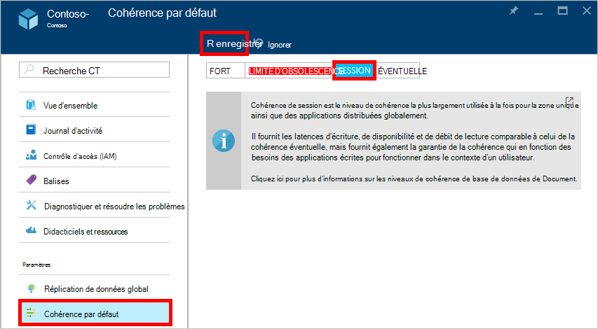

<properties
    pageTitle="Niveaux de cohérence dans DocumentDB | Microsoft Azure"
    description="DocumentDB a quatre niveaux de cohérence pour aider la cohérence éventuelle du solde, la disponibilité et la latence des compromis."
    keywords="cohérence éventuelle, documentdb, azure, Microsoft azure"
    services="documentdb"
    authors="syamkmsft"
    manager="jhubbard"
    editor="cgronlun"
    documentationCenter=""/>

<tags
    ms.service="documentdb"
    ms.workload="data-services"
    ms.tgt_pltfrm="na"
    ms.devlang="na"
    ms.topic="article"
    ms.date="08/24/2016"
    ms.author="syamk"/>

# Niveaux de cohérence dans les DocumentDB

DocumentDB Azure est conçu dès le départ avec la distribution globale à l’esprit. Il est conçu pour offrir des garanties de prévisibles de faible latence, un SLA de disponibilité de 99,99 % et plusieurs modèles bien défini de cohérence relâchée. Actuellement, DocumentDB propose quatre niveaux de cohérence : session forte de péremption délimitée, et une éventuelle. Outre le **fort** et la **cohérence éventuelle** modèles est couramment offertes par les autres bases de données NoSQL, DocumentDB est également propose deux modèles de cohérence soigneusement codifiée et operationalized – **délimitée d’obsolescence** et de la **session**et a validé leur utilité par rapport à des cas d’utilisation réels. Collectivement ces niveaux de quatre cohérence permettre de rendre dûment motivée des compromis entre la cohérence, la disponibilité et la latence. 

## Champ d’application de la cohérence

La granularité de la cohérence est portée à la demande d’un utilisateur unique. Une demande d’écriture peut correspondent à une insertion, de remplacer, d’upsert, ou supprimer des transactions (avec ou sans l’exécution d’un déclencheur pre ou post associé). Ou une demande d’écriture peut correspondre à l’exécution de transactions d’une procédure stockée de JavaScript fonctionnant sur plusieurs documents dans une partition. Comme avec les écritures, une opération de lecture/requête est également portée à la demande d’un utilisateur unique. L’utilisateur peut être obligé à paginer sur un grand jeu de résultats, réparties sur plusieurs partitions, mais chaque lecture transaction est portée à une seule page et servie à partir d’une seule partition.

## Niveaux de cohérence

Vous pouvez configurer un niveau de cohérence par défaut sur votre compte de base de données qui s’applique à toutes les collections (sur l’ensemble des bases de données) sous votre compte de base de données. Par défaut, toutes les lectures et les requêtes exécutées sur les ressources définies par l’utilisateur utilise le niveau de cohérence par défaut spécifié sur le compte de base de données. Toutefois, le niveau de cohérence d’une demande de lecture/requête spécifique peut plus en spécifiant l’en-tête de requête [[x-ms--niveau de cohérence]](https://msdn.microsoft.com/library/azure/mt632096.aspx) . Il existe quatre types de niveaux de cohérence pris en charge par le protocole de réplication DocumentDB qui fournissent un compromis clair entre la garantie de la cohérence des performances et, comme décrit ci-dessous.

![DocumentDB propose plusieurs bien définie de modèles à partir de cohérence (souple)][1]

**Fort**: 

- Forte cohérence offre une garantie de [linearizability](https://aphyr.com/posts/313-strong-consistency-models) avec les lectures garanties pour retourner la version la plus récente d’un document. 
- Forte cohérence garantit qu’une écriture est visible uniquement lorsqu’il est validée durablement par le quorum de la majorité des réplicas. Une écriture est validée soit synchrone durablement par le serveur principal et le quorum de serveurs secondaires ou qu’elle est abandonnée. Une lecture est toujours reconnue par la majorité lire le quorum, un client ne peut jamais voir une écriture partielle ou non validée et est toujours à lire la dernière écriture reconnue. 
- DocumentDB les comptes qui sont configurés pour utiliser la cohérence forte ne peut pas associer plusieurs régions Azure avec leur compte DocumentDB. 
- Le coût d’une opération de lecture (en termes d' [unités de demande](documentdb-request-units.md) consommées) avec cohérence renforcée est supérieure à la session et éventuelle, mais celle d’obsolescence délimitée.
 

**DELIMITEE obsolescence**: 

- Délimitée de garantie de la cohérence de son obsolescence que les lectures peuvent retard écrit par au maximum les versions *K* ou de préfixes d’un document ou d’un *t* -intervalle de temps. 
- Par conséquent, lors de la sélection délimitée obsolescence, l’inefficacité « » peut être configurée de deux façons : 
    - Nombre de versions *K* du document à laquelle les lectures de souffrir les écritures
    - Intervalle de temps *t* 
- Délimitée d’obsolescence des offres total global de la commande, à l’exception dans la « fenêtre de péremption ». Notez que la lecture monotone garantit existe au sein d’une région à l’intérieur et l’extérieur « obsolescence fenêtre ». 
- Limite d’obsolescence fournit une meilleure garantie de cohérence que la session ou la cohérence éventuelle. Pour les applications distribuées globalement, nous vous recommandons de que vous utilisez obsolescence limitée pour les scénarios où vous souhaitez qu’une cohérence renforcée, mais également la disponibilité de 99,99 % et une faible latence. 
- DocumentDB les comptes qui sont configurés avec la cohérence de son obsolescence délimitée peuvent associer n’importe quel nombre de régions Azure avec leur compte DocumentDB. 
- Le coût d’une opération de lecture (en termes de service RUs consommée) avec l’obsolescence limitée est supérieure à la session et la cohérence éventuelle, mais la même que la cohérence renforcée.

**Session**: 

- Contrairement aux modèles de la cohérence globale offertes par les niveaux de cohérence d’obsolescence fort et limité, la cohérence de session est portée à une session du client. 
- Cohérence de la session est idéale pour tous les scénarios où une session utilisateur ou périphérique est impliquée dans la mesure où il garantit des lectures monotone, monotone écrit et lecture garantit de votre propre écriture (RYW). 
- Cohérence de session cohérence prévisibles pour une session, et le débit de lecture maximale tout en offrant la lecture et l’écriture de latence plus faible. 
- DocumentDB les comptes qui sont configurés avec la cohérence de la session peuvent associer n’importe quel nombre de régions Azure avec leur compte DocumentDB. 
- Le coût d’une opération de lecture (en termes de service RUs consommée) avec un niveau de cohérence de session est obsolescence moins fort et limité, mais la cohérence éventuelle de plus de
 

**Éventuelle**: 

- La cohérence éventuelle garantit qu’en l’absence de toutes les autres écritures, les réplicas au sein du groupe peuvent converger. 
- La cohérence éventuelle est la forme la plus faible de la cohérence dans lequel un client peut obtenir les valeurs qui sont plus anciens que ceux qu’il avait vu avant.
- La cohérence éventuelle fournit la cohérence de lecture plus faible, mais offre la latence la plus faible à la fois des lectures et des écritures.
- DocumentDB les comptes qui sont configurés avec cohérence éventuelle peuvent associer n’importe quel nombre de régions Azure avec leur compte DocumentDB. 
- Le coût d’une opération de lecture (en termes de service RUs consommée) avec la cohérence éventuelle niveau est le plus petit de tous les niveaux de cohérence DocumentDB.

## Garantie de la cohérence

Le tableau suivant capture correspondant aux niveaux de quatre cohérence différents garantie de la cohérence.

| Garantie                                                         |    Fort                                       |    Limite d’obsolescence                                                                           |    Session                                       |    Éventuelle                                 |
|----------------------------------------------------------|-------------------------------------------------|------------------------------------------------------------------------------------------------|--------------------------------------------------|--------------------------------------------------|
|    **Total de la commande global**                                |    Oui                                          |    Oui, à l’extérieur de la « fenêtre de péremption »                                                      |    Non, l’ordre de « session » partielle                   |    N°                                            |
|    **Garantie de la cohérence de préfixe**                       |    Oui                                          |    Oui                                                                                         |    Oui                                           |    Oui                                           |
|    **Lectures monolithique**                                   |    Oui                                          |    Oui, dans les régions à l’extérieur de la fenêtre d’obsolescence et dans une région tout le temps.     |    Oui, pour la session donnée                    |    N°                                            |
|    **Écritures monolithique**                                  |    Oui                                          |    Oui                                                                                         |    Oui                                           |    Oui                                           |
|    **Lire vos écritures**                                  |    Oui                                          |    Oui                                                                                         |    Oui (dans la zone d’écriture)                      |    N°                                            |

## Configuration du niveau de cohérence par défaut

1.  Dans le [portail Azure](https://portal.azure.com/), dans le Jumpbar, cliquez sur **DocumentDB (NoSQL)**.

2. Dans la lame **DocumentDB (NoSQL)** , sélectionnez le compte de base de données à modifier.

3. De la lame de compte, cliquez sur **par défaut de la cohérence**.

4. La lame de **Cohérence par défaut** , sélectionnez le nouveau niveau de cohérence et cliquez sur **Enregistrer**.

    

## Niveaux de cohérence pour les requêtes

Par défaut, pour les ressources définies par l’utilisateur, le niveau de cohérence pour les requêtes est le même que le niveau de cohérence pour les lectures. Par défaut, l’index est mis à jour simultanément sur chaque insertion, remplacer ou supprimer d’un document à la collection. Ainsi, les requêtes d’honorer le même niveau de cohérence que celui de la lecture du document. Lorsque DocumentDB est optimisé en écriture et prend en charge les volumes soutenues de document écrit, maintenance des index synchrone et de traiter les requêtes cohérentes, vous pouvez configurer certaines collections pour mettre à jour leur index de tardivement. Indexation différée plus stimule les performances en écriture et est idéal pour les scénarios de réception en bloc lorsque la charge de travail est principalement en lecture lourdes.  

Mode d’indexation|  Lit|  Requêtes  
-------------|-------|---------
Cohérent (par défaut)|   Sélectionnez obsolescence fort, délimité, session, ou éventuelle|    Sélectionnez obsolescence fort, délimité, session, ou éventuelle|
Différée|   Sélectionnez obsolescence fort, délimité, session, ou éventuelle|    Éventuelle  

Comme avec les requêtes de lecture, vous pouvez réduire le niveau de cohérence d’une demande de requête spécifique en spécifiant l’en-tête de demande de [x-ms--niveau de cohérence](https://msdn.microsoft.com/library/azure/mt632096.aspx) .

## Étapes suivantes

Si vous souhaitez faire une lecture plus sur les niveaux de la cohérence et de compromis, nous vous recommandons les ressources suivantes :

-   Doug bouclés du genre éponge. La cohérence des données répliquées sont expliquées par le biais de baseball (vidéo).   
[https://www.YouTube.com/watch?v=gluIh8zd26I](https://www.youtube.com/watch?v=gluIh8zd26I)
-   Doug bouclés du genre éponge. La cohérence des données répliquées sont expliquées par le biais de baseball.   
[http://Research.Microsoft.com/pubs/157411/ConsistencyAndBaseballReport.PDF](http://research.microsoft.com/pubs/157411/ConsistencyAndBaseballReport.pdf)
-   Doug bouclés du genre éponge. Garanties de session pour les données répliquées faiblement cohérentes.   
[http://DL.ACM.org/citation.cfm?id=383631](http://dl.acm.org/citation.cfm?id=383631)
-   Abadi de Daniel. Cohérence des compromis dans la conception de systèmes de base de données distribuée moderne : embout n'est qu’une partie de l’histoire ».   
[http://Computer.org/CSDL/mags/co/2012/02/mco2012020037-ABS.HTML](http://computer.org/csdl/mags/co/2012/02/mco2012020037-abs.html)
-   Peter Bailis, Shivaram Venkataraman, Michael J. Franklin, Joseph M. Hellerstein, Stoica d’ions. PROBABILISTE délimitée obsolescence (PBS) pour pratiques Quorums partielles.   
[http://VLDB.org/pvldb/vol5/p776_peterbailis_vldb2012.PDF](http://vldb.org/pvldb/vol5/p776_peterbailis_vldb2012.pdf)
-   Vogels de Werner. Éventuelle cohérente - revisitée.    
[http://allthingsdistributed.com/2008/12/eventually_consistent.HTML](http://allthingsdistributed.com/2008/12/eventually_consistent.html)

[1]: ./media/documentdb-consistency-levels/consistency-tradeoffs.png
