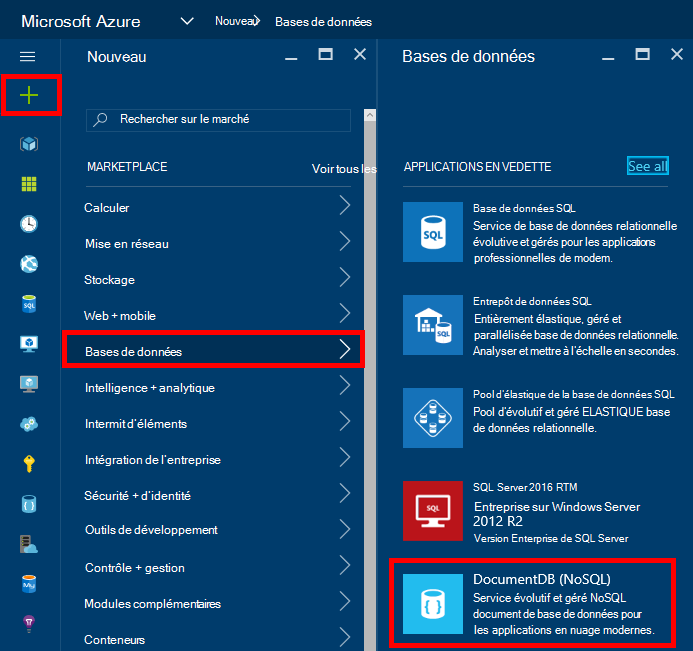
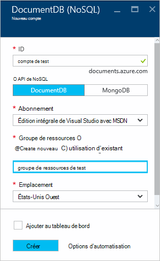
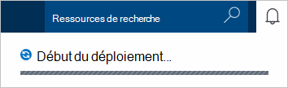
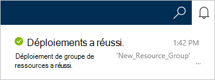
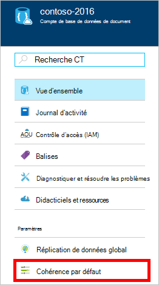
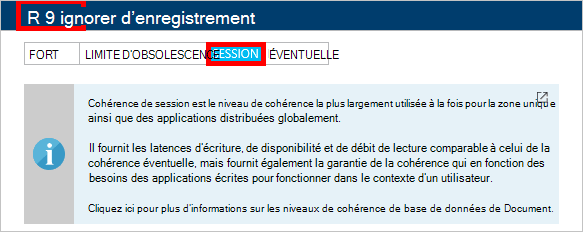

<properties
    pageTitle="Comment faire pour créer un compte DocumentDB | Microsoft Azure"
    description="Créer une base de données NoSQL Azure DocumentDB. Suivez ces instructions pour créer un compte DocumentDB et commencer à construire votre extrêmement rapide, à l’échelle globale NoSQL de base de données." 
    keywords="créer une base de données"
    services="documentdb"
    documentationCenter=""
    authors="mimig1"
    manager="jhubbard"
    editor="monicar"/>

<tags
    ms.service="documentdb"
    ms.workload="data-services"
    ms.tgt_pltfrm="na"
    ms.devlang="na"
    ms.topic="get-started-article"
    ms.date="10/17/2016"
    ms.author="mimig"/>

# Comment faire pour créer un compte DocumentDB NoSQL via le portail Azure

> [AZURE.SELECTOR]
- [Azure portal](documentdb-create-account.md)
- [CLI Azure et Azure Resource Manager](documentdb-automation-resource-manager-cli.md)

Pour créer une base de données avec Microsoft Azure DocumentDB, vous devez :

- Posséder un compte Azure. Vous pouvez obtenir un [compte Azure gratuit](https://azure.microsoft.com/free) si vous n’en avez pas déjà. 
- Créer un compte DocumentDB.  

Vous pouvez créer un compte DocumentDB à l’aide la Azure portal, modèles du Gestionnaire de ressources Azure ou Azure interface de ligne de commande (CLI). Cet article explique comment créer un compte DocumentDB de via le portail Azure. Pour créer un compte en utilisant le Gestionnaire de ressources Azure ou Azure CLI, reportez-vous à la section [Création de compte de base de données DocumentDB d’automatiser](documentdb-automation-resource-manager-cli.md).

Vous êtes novice dans DocumentDB ? Regardez [cette](https://azure.microsoft.com/documentation/videos/create-documentdb-on-azure/) vidéo de quatre minutes par Scott Hanselman pour voir comment effectuer les tâches les plus courantes dans le portail en ligne.

1.  Connectez-vous au [portail Azure](https://portal.azure.com/).
2.  Dans le Jumpbar, cliquez sur **Nouveau**, cliquez sur **bases de données**, puis cliquez sur **DocumentDB (NoSQL)**. 

      

3. Dans la lame de **nouveau compte** , spécifiez la configuration souhaitée pour le compte DocumentDB.

    

    - Dans la zone **ID** , entrez un nom pour identifier le compte DocumentDB.  Lorsque l' **ID** est validée, une coche verte s’affiche dans la zone **ID** . La valeur **ID** devient le nom d’hôte dans l’URI. L' **ID** peut contenir uniquement des lettres minuscules, de nombres et '-' caractères et doit être comprise entre 3 et 50 caractères. Notez que *documents.azure.com* est ajouté au nom du point de terminaison que vous le choisissez, dont le résultat devient votre point de terminaison du compte DocumentDB.

    - Dans la zone de **l’API de NoSQL** , sélectionnez le modèle de programmation à utiliser :
        - **DocumentDB**: l’API DocumentDB est disponible par l’intermédiaire de .NET, Java, Node.js, Python et JavaScript [SDK](documentdb-sdk-dotnet.md), ainsi HTTP [reste](https://msdn.microsoft.com/library/azure/dn781481.aspx)et offre un accès par programme à toutes les fonctionnalités de la DocumentDB. 
       
        - **MongoDB**: DocumentDB propose également [la prise en charge au niveau du protocole](documentdb-protocol-mongodb.md) de **MongoDB** API. Lorsque vous choisissez l’option MongoDB API, vous pouvez utiliser les [Outils](documentdb-mongodb-mongochef.md) et les kits de développement logiciel existant MongoDB de communiquer avec DocumentDB. Vous pouvez [déplacer](documentdb-import-data.md) vos applications MongoDB existantes pour utiliser DocumentDB, [aucune modification de code nécessaire](documentdb-connect-mongodb-account.md)et profitez d’une base de données entièrement géré en tant que service, avec échelle illimitée, la réplication globale et d’autres fonctionnalités.

    - Pour l' **abonnement**, sélectionnez l’abonnement Azure que vous souhaitez utiliser pour le compte DocumentDB. Si votre compte n’a qu’un seul abonnement, ce compte est sélectionné par défaut.

    - Dans le **Groupe de ressources**, sélectionnez ou créez un groupe de ressources pour votre compte de DocumentDB.  Par défaut, un nouveau groupe de ressources est créé. Pour plus d’informations, consultez [l’aide du portail Azure pour gérer vos ressources Azure](../articles/azure-portal/resource-group-portal.md).

    - **Emplacement** permet de spécifier l’emplacement géographique dans lequel vous souhaitez héberger votre compte DocumentDB. 

4.  Une fois les nouvelles options de compte DocumentDB sont configurées, cliquez sur **créer**. Pour vérifier l’état du déploiement, consultez le concentrateur de Notifications.  

      

    

5.  Après avoir créé le compte DocumentDB, il est prêt à être utilisé avec les paramètres par défaut. La cohérence par défaut du compte DocumentDB est définie pour la **Session**.  Vous pouvez ajuster la cohérence par défaut en cliquant sur **Cohérence par défaut** dans le menu ressources. Pour en savoir plus sur les niveaux de cohérence offerts par DocumentDB, consultez [niveaux de cohérence dans DocumentDB](documentdb-consistency-levels.md).

      

      

[How to: Create a DocumentDB account]: #Howto
[Next steps]: #NextSteps
[documentdb-manage]:../articles/documentdb/documentdb-manage.md

## Étapes suivantes

Maintenant que vous avez un compte DocumentDB, l’étape suivante consiste à créer une collection de DocumentDB et de la base de données. 

Vous pouvez créer une nouvelle collection et la base de données en utilisant l’une des opérations suivantes :

- Le portail d’Azure, comme décrit dans [Création d’une collection de DocumentDB l’aide du portail Azure](documentdb-create-collection.md).
- Les didacticiels exhaustives, qui incluent des exemples de données : [.NET](documentdb-get-started.md), [.NET MVC](documentdb-dotnet-application.md), [Java](documentdb-java-application.md), [Node.js](documentdb-nodejs-application.md)ou [Python](documentdb-python-application.md).
- Le [.NET](documentdb-dotnet-samples.md#database-examples), [Node.js](documentdb-nodejs-samples.md#database-examples)ou [Python,](documentdb-python-samples.md#database-examples) exemples de code disponibles dans GitHub.
- Le [.NET](documentdb-sdk-dotnet.md), [Node.js](documentdb-sdk-node.md), [Java](documentdb-sdk-java.md), [Python](documentdb-sdk-python.md)et [autres](https://msdn.microsoft.com/library/azure/mt489072.aspx) kits de développement logiciel.

Après avoir créé votre base de données et de la collection, vous devez [Ajouter des documents](documentdb-view-json-document-explorer.md) à des collections.

Une fois que vous avez des documents dans une collection, vous pouvez utiliser [DocumentDB SQL](documentdb-sql-query.md) pour [exécuter des requêtes](documentdb-sql-query.md#executing-queries) par rapport à vos documents. Vous pouvez exécuter des requêtes à l’aide de l' [Explorateur de la requête](documentdb-query-collections-query-explorer.md) dans le portail, l' [API REST](https://msdn.microsoft.com/library/azure/dn781481.aspx)ou des [Kits de développement logiciel](documentdb-sdk-dotnet.md).

### Pour en savoir plus

Pour en savoir plus sur DocumentDB, Explorez ces ressources :

-   [Voies de formation pour DocumentDB](https://azure.microsoft.com/documentation/learning-paths/documentdb/)
-   [Concepts et le modèle de ressource hiérarchique de DocumentDB](documentdb-resources.md)
