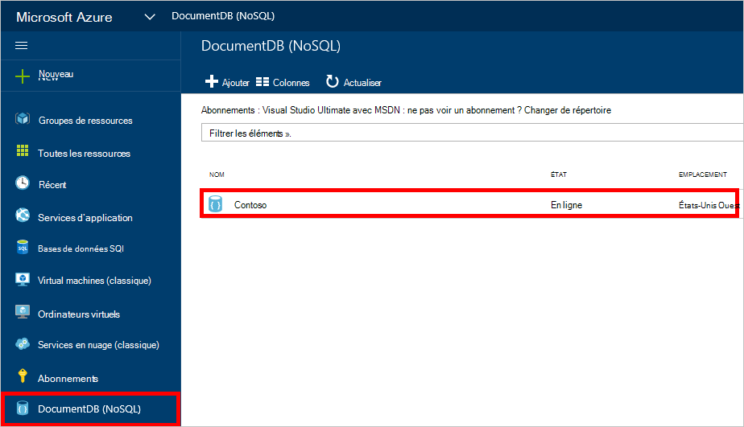
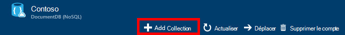
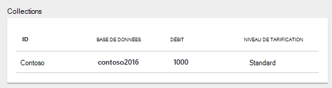
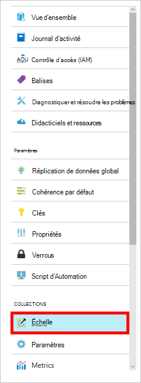

<properties 
    pageTitle="Créer une base de données de DocumentDB et de la collection | Microsoft Azure" 
    description="Apprenez à créer des bases de données NoSQL et collections de document JSON à l’aide en ligne service portal pour Azure DocumentDB, un nuage de base de données du document. Obtenez une version d’évaluation gratuite dès aujourd'hui." 
    services="documentdb" 
    authors="mimig1" 
    manager="jhubbard" 
    editor="monicar" 
    documentationCenter=""/>

<tags 
    ms.service="documentdb" 
    ms.workload="data-services" 
    ms.tgt_pltfrm="na" 
    ms.devlang="na" 
    ms.topic="article" 
    ms.date="10/17/2016" 
    ms.author="mimig"/>

# Comment faire pour créer une collection de DocumentDB et de la base de données à l’aide du portail Azure

Pour utiliser Microsoft Azure DocumentDB, vous devez disposer d’un [compte de DocumentDB](documentdb-create-account.md), une base de données, une collection et les documents. Cette rubrique décrit comment créer une collection de DocumentDB dans le portail Azure. 

Ne savez pas quelle collection est ? Consultez [ce qu’est une collection de DocumentDB ?](#what-is-a-documentdb-collection)

1.  Dans le [portail Azure](https://portal.azure.com/), dans le Jumpbar, cliquez sur **DocumentDB (NoSQL)**et puis dans la lame **DocumentDB (NoSQL)** , sélectionnez le compte dans lequel vous souhaitez ajouter une collection. Si vous ne disposez pas des comptes répertoriés, vous devrez [créer un compte DocumentDB](documentdb-create-account.md).

    
    
    Si **DocumentDB (NoSQL)** n’est pas visible dans le Jumpbar, cliquez sur **Plus de Services** , puis sur **DocumentDB (NoSQL)**. Si vous ne disposez pas des comptes répertoriés, vous devrez [créer un compte DocumentDB](documentdb-create-account.md).

2. Dans la lame **DocumentDB compte** pour le compte sélectionné, cliquez sur **Ajouter la Collection**.

    

3. De la lame **d’Ajouter la Collection** , dans la zone **ID** , entrez l’ID pour votre nouvelle collection. Les noms de collection doit être compris entre 1 et 255 caractères et ne peut pas contenir `/ \ # ?` ou un espace de fin. Lorsque le nom est validé, une coche verte s’affiche dans la zone ID.

    

4. **Niveau de prix** est la valeur **Standard** par défaut, afin que vous puissiez personnaliser le débit et le stockage pour votre collection de. Pour plus d’informations sur le niveau de tarification, voir [les niveaux de Performance dans DocumentDB](documentdb-performance-levels.md).  

5. Sélectionnez un **mode de partitionnement** de la collection, une **Seule Partition** ou **partitionnées**. 

    Une **partition unique** a une capacité de stockage réservée de 10 Go et peut avoir des niveaux de débit de 10-400 000 d’unités demande/seconde (RU/s). Un RU correspond au débit de lecture d’un document de 1 Ko. Pour plus d’informations sur les unités de la demande, voir [unités de demande](documentdb-request-units.md). 

    Une **collection partitionnée** peut évoluer pour gérer une quantité illimitée de stockage sur plusieurs partitions et peut avoir des niveaux de débit commençant à 10,100 RU/s. Dans le portail, le stockage plus grand, que vous pouvez réserver est de 250 Go et le débit de la plupart des que vous pouvez réserver est de 250 000 RU/s. Pour augmenter un quota, introduire une demande comme indiqué dans la [demande accrue de quotas du compte DocumentDB](documentdb-increase-limits.md). Pour plus d’informations sur les collections partitionnées, voir [Partition unique et des Collections partitionnées](documentdb-partition-data.md#single-partition-and-partitioned-collections).

    Par défaut, le débit pour une nouvelle collection de partition unique est défini à 1000 RU/s avec une capacité de stockage de 10 Go. Pour une collection partitionnée, le débit de la collection est défini à 10100 RU/s avec une capacité de stockage de 250 Go. Une fois la collection créée, vous pouvez modifier le débit et le stockage de la collection. 

6. Si vous créez une collection partitionnée, sélectionnez la **Clé de Partition** pour la collection. Sélection de la clé de partition correcte est importante dans la création d’un ensemble performant. Pour plus d’informations sur la sélection d’une clé de partition, consultez [conception de partitionnement](documentdb-partition-data.md#designing-for-partitioning).

7. Dans la lame de la **base de données** , créez une nouvelle base de données ou utiliser une existante. Les noms de base de données doit être comprise entre 1 et 255 caractères et ne peut pas contenir `/ \ # ?` ou un espace de fin. Pour valider le nom, cliquez en dehors de la zone de texte. Lorsque le nom est validé, une coche verte apparaît dans la zone.

8. Cliquez sur **OK** au bas de l’écran pour créer la nouvelle collection. 

9. La nouvelle collection maintenant apparaît dans l’objectif de **Collections** sur la lame de **vue d’ensemble** .
 
    

10. **Facultatif :** Pour modifier le débit de la collection dans le portail, cliquez sur **Ajuster** dans le menu ressources. 

    

## Ce qui est une collection de DocumentDB ? 

Une collection est un conteneur de documents JSON et la logique d’application JavaScript associée. Une collection est une entité facturable, où le [coût](documentdb-performance-levels.md) est déterminé par le débit de mise en service de la collection. Les collections peuvent couvrir une ou plusieurs partitions et des serveurs et peuvent évoluer pour gérer pratiquement illimité de volumes de stockage ou de débit.

Collections sont automatiquement répartis dans un ou plusieurs serveurs physiques en DocumentDB. Lorsque vous créez une collection, vous pouvez spécifier le débit mis en service en termes d’unités de demande par seconde et une propriété de clé de partition. La valeur de cette propriété servira par DocumentDB pour distribuer des documents entre des partitions et de router les requêtes comme des requêtes. La valeur de clé de partition est également la limite de transaction des procédures stockées et des déclencheurs. Chaque collection a un montant réservé spécifique à cette collection, qui n’est pas partagée avec les autres collections dans le même compte de débit. Par conséquent, vous pouvez évoluer votre application en termes de stockage et de débit. 

Les collections ne sont pas identiques en tant que tables dans les bases de données relationnelles. Collections n’appliquent pas le schéma, en fait DocumentDB n’applique pas de tous les schémas, il s’agit d’une base de données exempt de schéma. Par conséquent, vous pouvez stocker différents types de documents avec des schémas différents dans la même collection. Vous pouvez choisir d’utiliser des collections pour stocker des objets d’un type unique, comme vous le feriez avec des tables. Le meilleur modèle ne dépend que de la façon dont les données s’affichent ensemble dans les requêtes et les transactions.

## Autres méthodes pour créer une collection de DocumentDB

Collections n’ont pas à être créés via le portail, vous pouvez également les créer à l’aide du [SDK de DocumentDB](documentdb-sdk-dotnet.md) et l’API REST. 

- Pour un exemple de code C#, consultez les [exemples de collection C#](documentdb-dotnet-samples.md#collection-examples). 
- Pour obtenir un exemple de code Node.js, consultez les [exemples de collection Node.js](documentdb-nodejs-samples.md#collection-examples).
- Pour obtenir un exemple de code Python, consultez [exemples de collection de Python](documentdb-python-samples.md#collection-examples).
- Pour obtenir un exemple de l’API REST, voir [Création d’une Collection](https://msdn.microsoft.com/library/azure/mt489078.aspx).

## Résolution des problèmes

Si vous **Ajoutez la collecte** est désactivée dans Azure portal, cela signifie que votre compte est actuellement désactivé, qui se produit normalement lorsque tous les crédits de prestations pour le mois sont utilisés.   

## Étapes suivantes

Maintenant que vous disposez d’une collection, l’étape suivante consiste à ajouter des documents ou d’importer des documents dans la collection. Lorsqu’il s’agit de l’ajout de documents à une collection, vous avez le choix :

- Vous pouvez [Ajouter des documents](documentdb-view-json-document-explorer.md) à l’aide de l’Explorateur de documents dans le portail.
- Vous pouvez [Importer les documents et les données](documentdb-import-data.md) à l’aide de l’outil de Migration de données DocumentDB, qui vous permet d’importer des fichiers JSON et CSV, ainsi que les données à partir de SQL Server, MongoDB, stockage par Table Azure et autres collections DocumentDB. 
- Ou bien, vous pouvez ajouter des documents à l’aide d’un des [Kits de développement logiciel DocumentDB](documentdb-sdk-dotnet.md). DocumentDB a .NET, Java, Python, Node.js et kits de développement API JavaScript. Pour des exemples de code C# qui montre comment travailler avec des documents à l’aide du Kit de développement .NET DocumentDB, consultez les [exemples de documents de C#](documentdb-dotnet-samples.md#document-examples). Pour Node.js des exemples de code montrant comment utiliser des documents à l’aide du Kit de développement de Node.js DocumentDB, consultez les [exemples de documents Node.js](documentdb-nodejs-samples.md#document-examples).

Une fois que vous avez des documents dans une collection, vous pouvez utiliser [DocumentDB SQL](documentdb-sql-query.md) pour [exécuter des requêtes](documentdb-sql-query.md#executing-queries) par rapport à vos documents à l’aide de l' [Explorateur de la requête](documentdb-query-collections-query-explorer.md) dans le portail, l' [API REST](https://msdn.microsoft.com/library/azure/dn781481.aspx)ou des [Kits de développement logiciel](documentdb-sdk-dotnet.md). 
