<properties 
    pageTitle="Déploiement DocumentDB et Azure Application Service Web Apps à l’aide d’un modèle de gestionnaire de ressources Azure | Microsoft Azure" 
    description="Découvrez comment déployer un exemple d’application web à l’aide d’un modèle de gestionnaire de ressources Azure, Azure Application Service Web Apps et un compte DocumentDB." 
    services="documentdb, app-service\web" 
    authors="h0n" 
    manager="jhubbard" 
    editor="monicar" 
    documentationCenter=""/>

<tags 
    ms.service="documentdb" 
    ms.workload="data-services" 
    ms.tgt_pltfrm="na" 
    ms.devlang="na" 
    ms.topic="article" 
    ms.date="08/02/2016" 
    ms.author="hawong"/>

# Déploiement DocumentDB et Azure Application Service Web Apps à l’aide d’un modèle de gestionnaire de ressources Azure

Ce didacticiel vous montre comment utiliser un modèle de gestionnaire de ressources Azure à déployer et à intégrer [Microsoft Azure DocumentDB](https://azure.microsoft.com/services/documentdb/), une application web de [Service d’application Azure](http://go.microsoft.com/fwlink/?LinkId=529714) et un exemple d’application web.

À l’aide des modèles du Gestionnaire de ressources Azure, vous pouvez facilement automatiser le déploiement et la configuration de vos ressources d’Azure.  Ce didacticiel montre comment déployer une application web et de configurer automatiquement les informations de connexion de compte DocumentDB.

À la fin de ce didacticiel, vous serez en mesure de répondre aux questions suivantes :  

-   Comment puis-je utiliser un modèle de gestionnaire de ressources Azure à déployer et à intégrer un compte de DocumentDB et d’une application web dans le Service d’application Azure ?
-   Comment puis-je utiliser un modèle de gestionnaire de ressources Azure à déployer et à intégrer une application Webdeploy, une application web dans l’application de Service Web Apps et un compte DocumentDB ?

## Conditions préalables
> [AZURE.TIP] Bien que ce didacticiel ne suppose pas l’expérience préalable avec le Gestionnaire de ressources Azure modèles ou JSON, si vous souhaitez modifier les modèles référencés ou les options de déploiement, puis les connaissances de chacun de ces domaines sera nécessaire.

Avant de suivre les instructions de ce didacticiel, vous assurer que vous disposez des éléments suivants :

- Un abonnement Azure. Azure est une plateforme basée sur abonnement.  Pour plus d’informations sur l’obtention d’un abonnement, consultez les [Options d’achat](https://azure.microsoft.com/pricing/purchase-options/), [L’offre de membre](https://azure.microsoft.com/pricing/member-offers/)ou [Version d’évaluation gratuite](https://azure.microsoft.com/pricing/free-trial/).

##Étape 1 : Télécharger les fichiers de modèle ##
Nous allons commencer en téléchargeant les fichiers de modèle que nous utiliserons dans ce didacticiel.

1. Télécharger le modèle de [Création d’un compte DocumentDB, applications Web et déployer un exemple d’application de démonstration](https://portalcontent.blob.core.windows.net/samples/DocDBWebsiteTodo.json) dans un dossier local (par exemple, C:\DocumentDBTemplates). Ce modèle de déployer une application web, une application web de Service de l’application et un compte DocumentDB.  Il va également automatiquement configurer l’application web pour se connecter au compte DocumentDB.

2. Télécharger le modèle de [Création d’un compte de DocumentDB et des exemples d’applications Web](https://portalcontent.blob.core.windows.net/samples/DocDBWebSite.json) dans un dossier local (par exemple, C:\DocumentDBTemplates). Ce modèle déploiera un compte DocumentDB, une application web du Service de l’application et va modifier les paramètres de l’application du site pour les informations de connexion DocumentDB de surface facilement, mais n’inclut pas une application web.  

##Étape 2 : Déployer le compte de le DocumentDB, l’application Service web app et démonstration application, exemple

Maintenant nous allons déployer notre premier modèle.

> [AZURE.TIP] Le modèle ne valide pas le nom de l’application web et le nom de compte DocumentDB entré ci-dessous sont un) valide et b) disponible.  Il est vivement recommandé de vérifier la disponibilité des noms que vous souhaitez fournir avant de soumettre le déploiement.

1. Connexion aux [Azure Portal](https://portal.azure.com), cliquez sur Nouveau et rechercher « Déploiement de modèles ».
    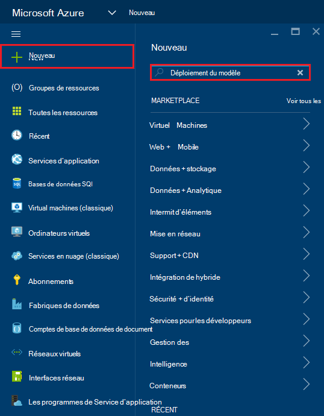

2. Sélectionnez l’élément de déploiement de modèle, puis cliquez sur **créer**
    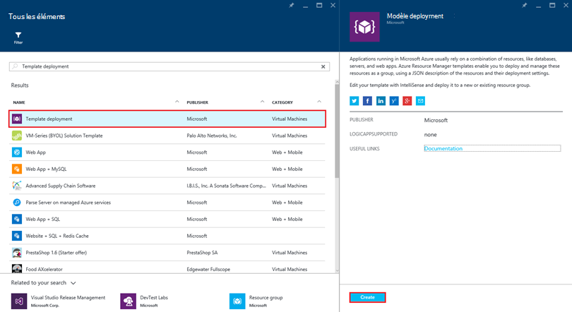

3.  Cliquez sur **Modifier le modèle**, collez le contenu du fichier de modèle DocDBWebsiteTodo.json et cliquez sur **Enregistrer**.
    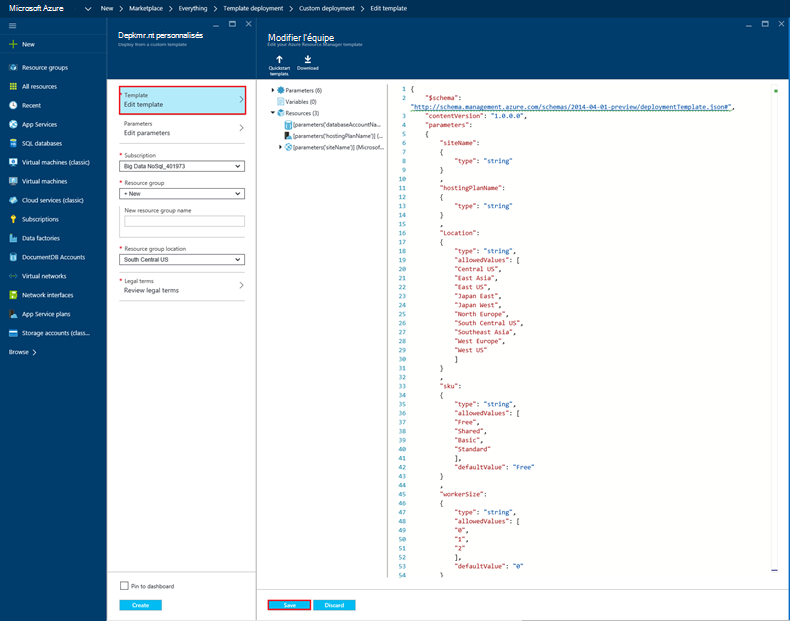

4. Cliquez sur **Modifier les paramètres**, fournir des valeurs pour chacun des paramètres obligatoires et cliquez sur **OK**.  Les paramètres sont les suivants :

    1. Nom du site : Spécifie le nom d’application de web Service de l’application et est utilisé pour construire l’URL que vous utiliserez pour accéder à l’application web (par exemple, si vous spécifiez « mydemodocdbwebapp », puis l’URL à laquelle vous accéderez à l’application web sera mydemodocdbwebapp.azurewebsites.net).

    2. HOSTINGPLANNAME : Spécifie le nom du plan hébergement de Service d’application à créer.

    3. EMPLACEMENT : Spécifie l’emplacement Azure dans lequel créer le web et DocumentDB ressources de l’application.

    4. DATABASEACCOUNTNAME : Spécifie le nom du compte pour créer DocumentDB.   

    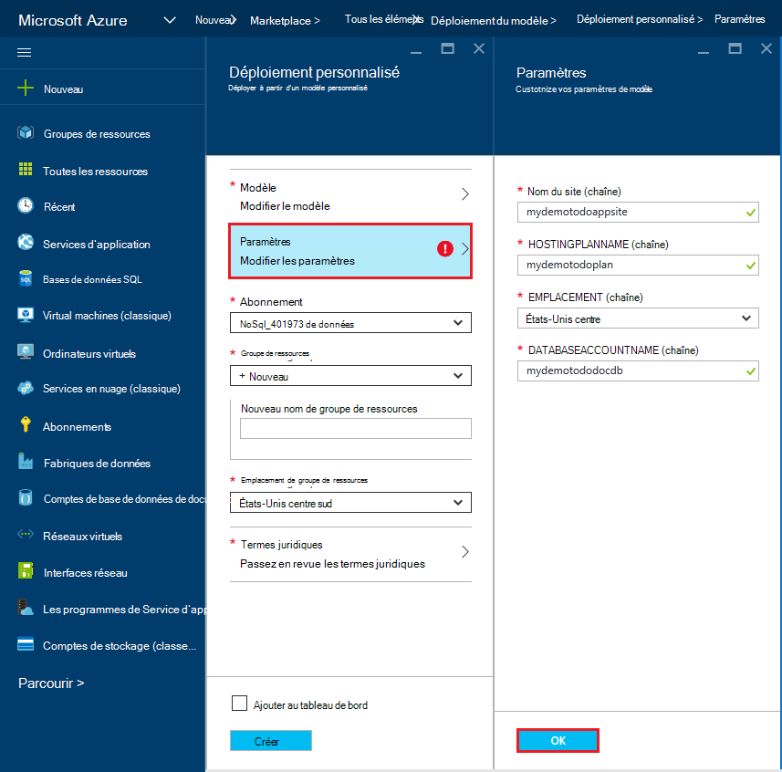

5. Choisir un groupe de ressources existant ou fournissez un nom pour un nouveau groupe de ressources et choisissez un emplacement pour le groupe de ressources.
    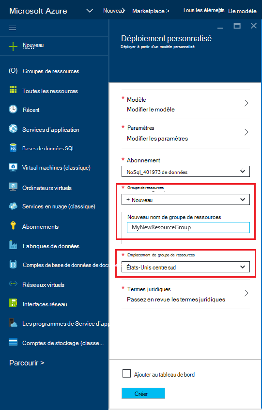
  
6.  Cliquez sur **termes juridiques de révision**, **d’achat**et puis cliquez sur **créer** pour commencer le déploiement.  Sélectionnez **Ajouter au tableau de bord** afin que le déploiement qui en résulte est facilement visible sur votre page d’accueil de portail Azure.
    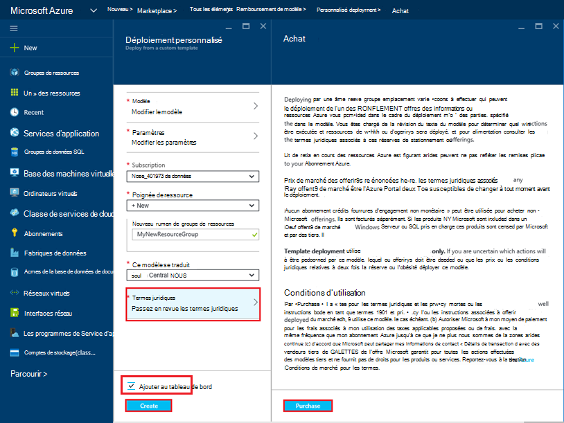

7.  Une fois le déploiement, la lame de groupe de ressources s’ouvre.
    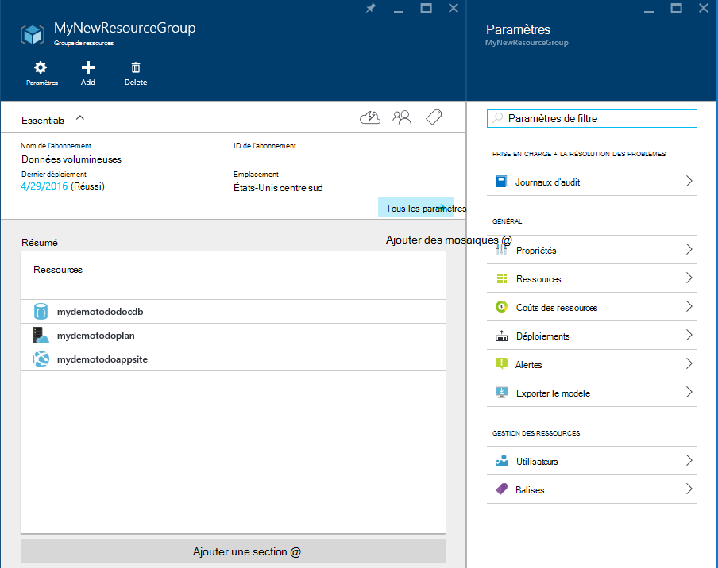  

8.  Pour utiliser l’application, il suffit d’accéder à l’URL d’application web (dans l’exemple ci-dessus, l’URL est http://mydemodocdbwebapp.azurewebsites.net).  Vous verrez l’application web suivante :

    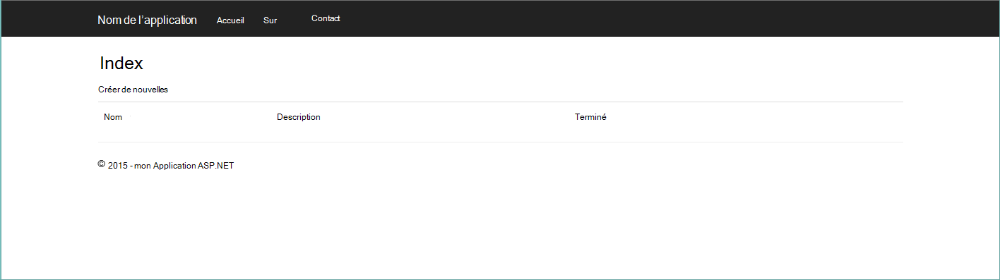

9. Continuez et créer un certain nombre de tâches dans l’application web et revenir ensuite à la lame de groupe de ressources dans le portail Azure. Cliquez sur la ressource de compte DocumentDB dans la liste de ressources, puis sur **Explorateur de la requête**.
    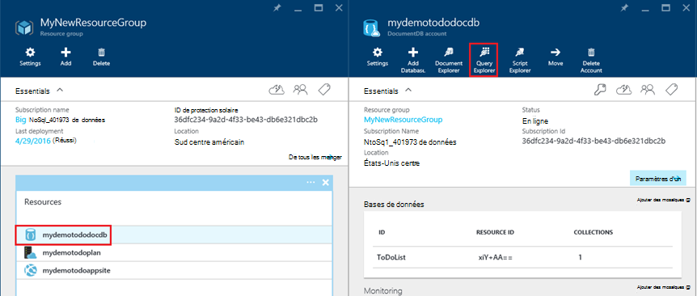  

10. Exécution de la requête par défaut, « SELECT *FROM c » et vérifier les résultats.  Notez que la requête a récupéré la représentation JSON des éléments todo créé à l’étape 7 ci-dessus.  N’hésitez pas à expérimenter des requêtes ; par exemple, essayez d’exécuter le SELECT* FROM c WHERE c.isComplete = true pour retourner tous les éléments todo qui ont été marqués comme terminés.

    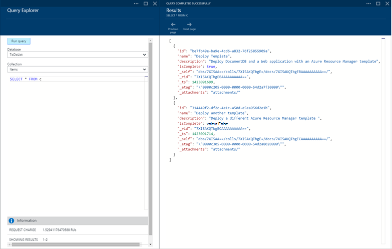

11. N’hésitez pas à étudier l’utilisation du portail DocumentDB ou modifier l’exemple d’application Todo.  Lorsque vous êtes prêt, nous allons déployer un autre modèle.
    
 
## Étape 3 : Déployer l’exemple d’application web et le compte de Document

Maintenant nous allons déployer notre deuxième modèle.  Ce modèle est utile pour indiquer comment vous pouvez injecter des DocumentDB les informations de connexion telles que compte le point de terminaison et de la clé principale dans une application web en tant que paramètres de l’application, ou sous la forme d’une chaîne de connexion personnalisée. Par exemple, vous disposez de votre propre application web que vous souhaitez déployer avec un compte de DocumentDB et que les informations de connexion remplies automatiquement pendant le déploiement.

> [AZURE.TIP] Le modèle ne valide pas le nom de l’application web et le nom de compte DocumentDB entré ci-dessous sont un) valide et b) disponible.  Il est vivement recommandé de vérifier la disponibilité des noms que vous souhaitez fournir avant de soumettre le déploiement.

1. Dans le [Portail Azure](https://portal.azure.com), cliquez sur Nouveau et rechercher « Déploiement de modèles ».
    

2. Sélectionnez l’élément de déploiement de modèle, puis cliquez sur **créer**
    

3.  Cliquez sur **Modifier le modèle**, collez le contenu du fichier de modèle DocDBWebSite.json et cliquez sur **Enregistrer**.
    

4. Cliquez sur **Modifier les paramètres**, fournir des valeurs pour chacun des paramètres obligatoires et cliquez sur **OK**.  Les paramètres sont les suivants :

    1. Nom du site : Spécifie le nom d’application de web Service de l’application et est utilisé pour construire l’URL que vous utiliserez pour accéder à l’application web (par exemple, si vous spécifiez « mydemodocdbwebapp », puis l’URL à laquelle vous accéderez à l’application web sera mydemodocdbwebapp.azurewebsites.net).

    2. HOSTINGPLANNAME : Spécifie le nom du plan hébergement de Service d’application à créer.

    3. EMPLACEMENT : Spécifie l’emplacement Azure dans lequel créer le web et DocumentDB ressources de l’application.

    4. DATABASEACCOUNTNAME : Spécifie le nom du compte pour créer DocumentDB.   

    

5. Choisir un groupe de ressources existant ou fournissez un nom pour un nouveau groupe de ressources et choisissez un emplacement pour le groupe de ressources.
    
  
6.  Cliquez sur **termes juridiques de révision**, **d’achat**et puis cliquez sur **créer** pour commencer le déploiement.  Sélectionnez **Ajouter au tableau de bord** afin que le déploiement qui en résulte est facilement visible sur votre page d’accueil de portail Azure.
    

7.  Une fois le déploiement, la lame de groupe de ressources s’ouvre.
      

8. Cliquez sur la ressource de l’application Web dans la liste de ressources et cliquez sur **paramètres de l’Application**
      

9. Notez que les paramètres de l’application présents pour le point de terminaison DocumentDB et chacune des clés de maître DocumentDB.
    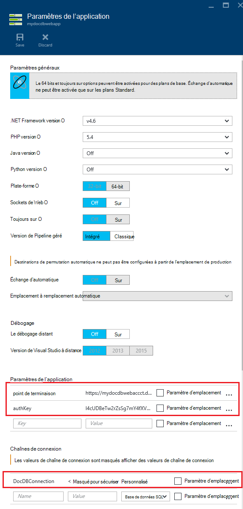  

10. N’hésitez pas à continuer à Explorer le portail Azure, ou suivez un des nos [exemples](http://go.microsoft.com/fwlink/?LinkID=402386) DocumentDB pour créer votre propre application de DocumentDB.

    
    

## Étapes suivantes

Félicitations ! Vous avez déployé les DocumentDB, application de Service de l’application web et un exemple d’application web à l’aide des modèles du Gestionnaire de ressources Azure.

- Pour en savoir plus sur DocumentDB, cliquez [ici](http://azure.com/docdb).
- Pour en savoir plus sur les applications Azure Application Service Web, cliquez [ici](http://go.microsoft.com/fwlink/?LinkId=325362).
- Pour en savoir plus sur les modèles du Gestionnaire de ressources Azure, cliquez [ici](https://msdn.microsoft.com/library/azure/dn790549.aspx).

## Ce qui a changé
* Pour obtenir un guide pour la modification de sites Web au Service de l’application voir : [Service d’application Azure et son Impact sur les Services Azure existants](http://go.microsoft.com/fwlink/?LinkId=529714)
* Pour un guide sur la modification de l’ancien portail au nouveau portail voir : [référence pour naviguer dans le portail classique Azure](http://go.microsoft.com/fwlink/?LinkId=529715)

>[AZURE.NOTE] Si vous souhaitez commencer avec le Service d’application Azure avant l’ouverture d’un compte Azure, accédez à [Essayer le Service application](http://go.microsoft.com/fwlink/?LinkId=523751), où vous pouvez créer une application web de courte durée starter immédiatement dans le Service d’application. Aucune carte de crédit obligatoire ; aucun des engagements.
 
