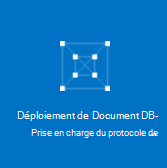

<properties 
    pageTitle="Créez un compte de DocumentDB avec prise en charge de protocole de MongoDB | Microsoft Azure" 
    description="Apprenez à créer un compte DocumentDB avec prise en charge de protocole de MongoDB, maintenant disponible pour l’aperçu." 
    services="documentdb" 
    authors="AndrewHoh" 
    manager="jhubbard" 
    editor="" 
    documentationCenter=""/>

<tags 
    ms.service="documentdb" 
    ms.workload="data-services" 
    ms.tgt_pltfrm="na" 
    ms.devlang="na" 
    ms.topic="article" 
    ms.date="10/20/2016" 
    ms.author="anhoh"/>

# Comment faire pour créer un compte DocumentDB avec prise en charge de protocole de MongoDB via le portail Azure

Pour créer un compte Azure DocumentDB avec prise en charge de protocole de MongoDB, vous devez :

- Posséder un compte Azure. Vous pouvez obtenir un [compte Azure gratuit](https://azure.microsoft.com/free/) si vous n’en avez pas déjà.

## Créer le compte  

Pour créer un compte DocumentDB avec prise en charge de protocole de MongoDB, effectuez les opérations suivantes.

1. Dans une nouvelle fenêtre, connectez-vous au [Portail Azure](https://portal.azure.com).
2. Cliquez sur **Nouveau**et cliquez sur **données + stockage**, cliquez sur **Afficher tout**, puis recherchez dans la catégorie **données + stockage** pour « DocumentDB protocol ». Cliquez sur **DocumentDB - prise en charge de protocole de MongoDB**.

    

3. Ou bien, dans la catégorie **données + stockage** , sous **stockage**, cliquez sur **plus**, puis cliquez sur **charger plus** une ou plusieurs fois pour afficher les **DocumentDB - prise en charge de protocole de MongoDB**. Cliquez sur **DocumentDB - prise en charge de protocole de MongoDB**.

    

4. Dans la lame **DocumentDB - prise en charge de protocole de MongoDB (aperçu)** , cliquez sur **créer** pour lancer le processus d’inscription de prévisualisation.

    

5. De la lame **DocumentDB compte** , cliquez sur **s’inscrire pour obtenir un aperçu**. Lisez les informations, puis cliquez sur **OK**.

    

6.  Après avoir accepté les termes de l’aperçu, vous revenez à la lame de créer.  Dans la lame **DocumentDB compte** , spécifiez la configuration souhaitée pour le compte.

    

    - Dans la zone **ID** , entrez un nom pour identifier le compte.  Lorsque l' **ID** est validée, une coche verte s’affiche dans la zone **ID** . La valeur **ID** devient le nom d’hôte dans l’URI. L' **ID** peut contenir uniquement des lettres minuscules, de nombres et '-' caractères et doit être comprise entre 3 et 50 caractères. Notez que *documents.azure.com* est ajouté au nom du point de terminaison que vous le choisissez, dont le résultat devient le point de terminaison de votre compte.

    - Pour l' **abonnement**, sélectionnez l’abonnement Azure que vous souhaitez utiliser pour le compte. Si votre compte n’a qu’un seul abonnement, ce compte est sélectionné par défaut.

    - Dans le **Groupe de ressources**, sélectionnez ou créez un groupe de ressources pour le compte.  Par défaut, un groupe de ressources existant sous l’abonnement Azure sera choisi.  Vous pouvez, toutefois, choisir de permet de créer un nouveau groupe de ressources auquel vous souhaitez ajouter le compte. Pour plus d’informations, consultez [l’aide du portail Azure pour gérer vos ressources Azure](resource-group-portal.md).

    - **Emplacement** permet de spécifier l’emplacement géographique dans lequel le compte de l’hôte.
    
    - Vérification de facultatif : **Fixer au tableau de bord**. Si fixé au tableau de bord, suivez l' **étape 8** ci-dessous pour afficher la navigation à gauche de votre nouveau compte.

7.  Une fois configurées, les nouvelles options de compte, cliquez sur **créer**.  Il peut prendre quelques minutes pour créer le compte.  Si épinglé dans le tableau de bord, vous pouvez surveiller la progression de mise en service sur le Startboard.  
      

    Si ne pas fixé au tableau de bord, vous pouvez surveiller la progression du concentrateur de Notifications.  

      

    

8.  Pour accéder à votre nouveau compte, cliquez sur **DocumentDB (NoSQL)** dans le menu de gauche. Dans votre liste de DocumentDB et de DocumentDB régulière avec des comptes de prise en charge du protocole Mongo, cliquez sur le nom de votre nouveau compte.

9.  Il est désormais prêt à être utilisé avec les paramètres par défaut. 

    
    

## Étapes suivantes

- Découvrez comment [vous connecter](documentdb-connect-mongodb-account.md) à un compte de DocumentDB avec le protocole prise en charge de MongoDB.

 
