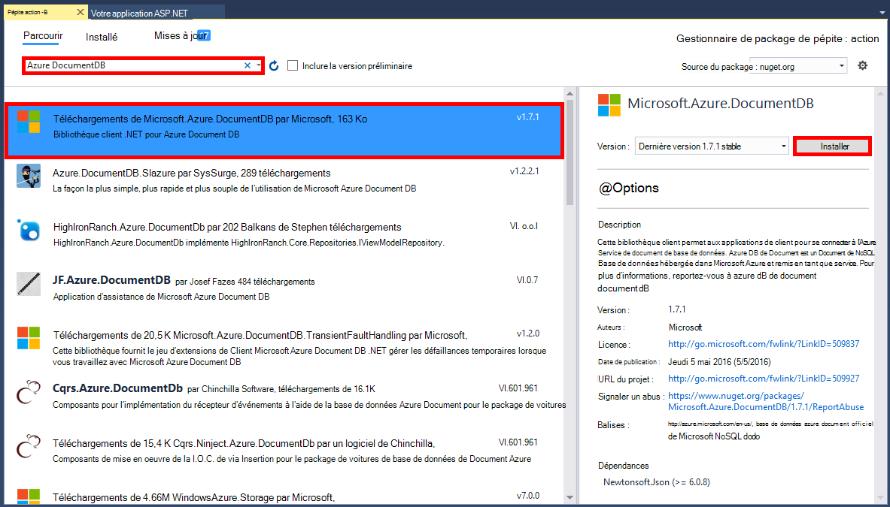

<properties 
    pageTitle="Didacticiel d’ASP.NET MVC pour DocumentDB : développement d’applications Web | Microsoft Azure" 
    description="Didacticiel d’ASP.NET MVC pour créer une application web MVC à l’aide de DocumentDB. Vous allez stocker JSON et accéder aux données à partir d’une application todo hébergée sur des sites Web d’Azure - le didacticiel ASP. NET MVC étape par étape." 
    keywords="didacticiel de mvc ASP.NET, développement d’applications web, application web mvc, didacticiel de mvc net asp étape par étape"
    services="documentdb" 
    documentationCenter=".net" 
    authors="syamkmsft" 
    manager="jhubbard" 
    editor="cgronlun"/>

<tags 
    ms.service="documentdb" 
    ms.workload="data-services" 
    ms.tgt_pltfrm="na" 
    ms.devlang="dotnet" 
    ms.topic="hero-article" 
    ms.date="08/25/2016" 
    ms.author="syamk"/>

# Didacticiel d’ASP.NET MVC : Développement d’applications Web avec DocumentDB

> [AZURE.SELECTOR]
- [.NET](documentdb-dotnet-application.md)
- [Node.js](documentdb-nodejs-application.md)
- [Java](documentdb-java-application.md)
- [Python](documentdb-python-application.md) 

Mettre en évidence la façon dont vous pouvez tirer efficacement parti de DocumentDB Azure pour stocker et interroger les documents JSON, cet article fournit une vue d’ensemble bout à bout vous montrant comment créer une application todo à l’aide de DocumentDB d’Azure. Les tâches sont stockées en tant que documents JSON dans Azure DocumentDB.

Cette procédure vous montre comment utiliser le service de DocumentDB fourni par Azure pour stocker et accéder aux données à partir d’une application web de ASP.NET MVC hébergée sur Azure. Si vous recherchez un didacticiel se concentre uniquement sur les DocumentDB et non les composants ASP.NET MVC, consultez [créer une application de console C# de DocumentDB](documentdb-get-started.md).

> [AZURE.TIP] Ce didacticiel suppose que vous disposez d’une expérience préalable à l’aide d’ASP.NET MVC et les sites Web d’Azure. Si vous êtes nouveau dans ASP.NET ou les [Outils requis](#_Toc395637760), nous vous recommandons de télécharger l’exemple complet de projet à partir de [GitHub][] et suivez les instructions dans cet exemple. Une fois que vous avez créé, vous pouvez consulter cet article pour obtenir des informations sur le code dans le contexte du projet.

## Conditions requises pour ce didacticiel de la base de données

Avant de suivre les instructions fournies dans cet article, vous devez vous assurer que vous disposez des éléments suivants :

- Un compte Azure actif. Si vous n’avez pas un compte, vous pouvez créer un compte d’essai gratuit dans quelques minutes. Pour plus d’informations, reportez-vous à la section [D’essai Azure](https://azure.microsoft.com/pricing/free-trial/).
- [Visual Studio 2015](http://www.visualstudio.com/) ou mise à jour de Visual Studio 2013 4 ou supérieur. Si vous utilisez Visual Studio 2013, vous devez installer le [package nuget de Microsoft.Net.Compilers](https://www.nuget.org/packages/Microsoft.Net.Compilers/) pour ajouter la prise en charge pour C# 6.0. 
- Azure SDK pour .NET version 2.5.1 ou version ultérieure, disponible par le biais du [Microsoft Web Platform Installer][].

Toutes les captures d’écran dans cet article ont été prises à l’aide de Visual Studio 2013 avec 4 mise à jour appliquée et le SDK Azure pour .NET version 2.5.1. Si votre système est configuré avec des versions différentes, il est possible que vos écrans et options ne correspondront pas entièrement, mais si vous remplissez les conditions requises ci-dessus cette solution devrait fonctionner.

## Étape 1 : Créer un compte de base de données DocumentDB

Commençons par créer un compte DocumentDB. Si vous avez déjà un compte, vous pouvez passer à [créer une application ASP.NET MVC](#_Toc395637762).

[AZURE.INCLUDE [documentdb-create-dbaccount](../../includes/documentdb-create-dbaccount.md)]

[AZURE.INCLUDE [documentdb-keys](../../includes/documentdb-keys.md)]

 
Nous allons maintenant par le biais de la création d’une application ASP.NET MVC dans le sol. 

## Étape 2 : Créer une application ASP.NET MVC

Maintenant que vous disposez d’un compte, nous allons créer notre nouveau projet ASP.NET.

1. Dans Visual Studio, dans le menu **fichier** , pointez sur **Nouveau**, puis cliquez sur **projet**.

    La boîte de dialogue **Nouveau projet** s’affiche.
2. Dans le volet **types de projets** , développez **modèles**, **Visual C#**, **Web**et puis sélectionnez **ASP.NET Web Application**.

    

3. Dans la zone **nom** , tapez le nom du projet. Ce didacticiel utilise le nom « todo ». Si vous choisissez d’utiliser une valeur autre que cela, puis chaque fois que ce didacticiel parle de l’espace de noms todo, vous devez régler les échantillons de code fourni pour utiliser ce que vous avez nommé votre application. 

4. Cliquez sur **Parcourir** pour rechercher le dossier où vous souhaitez créer le projet, puis cliquez sur **OK**.

    La boîte de dialogue **Nouveau projet ASP.NET** s’affiche.

    

5. Dans le volet Modèles, sélectionnez **MVC**.

6. Si vous prévoyez d’héberger votre application dans Azure puis sélectionnez **hôte dans le nuage** sur la partie inférieure droite d’héberger l’application Azure. Nous avons sélectionné pour héberger dans le nuage et exécutez l’application hébergée dans un site Web d’Azure. Cette option sera preprovision un site Web d’Azure pour vous et durée de vie beaucoup plus facile en matière de temps de déployer l’application finale de travail. Si vous souhaitez héberger cette ailleurs ou que vous ne souhaitez pas configurer Azure dès le départ, désactivez tout **hôte dans le nuage**.

7. Cliquez sur **OK** et Visual Studio vous permettent de faire son travail autour de l’échafaudage le modèle ASP.NET MVC vide. 

8. Si vous avez choisi d’héberger cette dans le nuage, que vous devez voir au moins un écran supplémentaire vous invitant à vous connecter à votre compte Azure et fournir des valeurs pour votre nouveau site Web. Fournir toutes les valeurs supplémentaires et continuer. 

    Je n’ai pas choisi un serveur de base de données « » ici, car nous n’allons pas ici utiliser un serveur de base de données SQL Azure, nous allons créer un nouveau compte Azure DocumentDB plus tard dans le portail Azure.

    Pour plus d’informations sur le choix d’un **plan de Service de l’application** et le **groupe de ressources**, reportez-vous à la section [présentation approfondie des plans de Service d’application Azure](../app-service/azure-web-sites-web-hosting-plans-in-depth-overview.md).

    

9. Une fois que Visual Studio a terminé la création de code application MVC, vous avez une application ASP.NET vide que vous pouvez exécuter localement.

    Nous allons ignorer le projet en cours d’exécution localement, car je suis sûr que nous avons tous vu l’ASP.NET « Hello World » application. Passons directement à l’ajout de DocumentDB à ce projet et la création de notre application.

## Étape 3 : Ajoutez DocumentDB à votre projet d’application web MVC

Maintenant que nous avons la plupart de la plomberie ASP.NET MVC dont nous avons besoin pour cette solution, nous allons vous apprendre au véritable but de ce didacticiel, ajout d’Azure DocumentDB à notre application de web MVC.

1. Le Kit de développement .NET DocumentDB est proposé et distribué sous la forme d’un package NuGet. Pour obtenir le package NuGet dans Visual Studio, utilisez le Gestionnaire de package NuGet dans Visual Studio, avec le bouton droit sur le projet dans **L’Explorateur de solutions** puis cliquez sur **Gérer les Packages NuGet**.

    

    La boîte de dialogue **Manage NuGet Packages** s’affiche.

2. Dans la zone NuGet **Parcourir** , tapez ***DocumentDB d’Azure***.
    
    Dans les résultats, installez le package de la **Bibliothèque de Client Microsoft Azure DocumentDB** . Cela télécharger et installer le package DocumentDB, ainsi que toutes les dépendances, telles que Newtonsoft.Json. Cliquez sur **OK** dans la fenêtre **d’Aperçu** , **accepter** dans la fenêtre de **l’Acceptation de la licence** pour terminer l’installation.

    

    Vous pouvez également vous servir de la Console du Gestionnaire de package pour installer le package. Pour ce faire, dans le menu **Outils** , cliquez sur **Gestionnaire de package de NuGet**, puis cliquez sur **Console de Gestionnaire de package**. À l’invite de commandes, tapez ce qui suit.

        Install-Package Microsoft.Azure.DocumentDB

3. Une fois le package installé, votre solution Visual Studio doit ressembler à ce qui suit avec deux nouvelles références ajoutées, Microsoft.Azure.Documents.Client et Newtonsoft.Json.

    

##Étape 4 : Configurer l’application ASP.NET MVC
 
Maintenant nous allons ajouter les modèles, vues et contrôleurs à cette application MVC :

- [Ajouter un modèle](#_Toc395637764).
- [Ajouter un contrôleur](#_Toc395637765).
- [Ajouter des vues](#_Toc395637766).

### Ajouter un modèle de données JSON

Commençons par créer le **M** dans MVC, le modèle. 

1. Dans l' **Explorateur de solutions**, cliquez sur le dossier **modèles** , cliquez sur **Ajouter**, puis cliquez sur **classe**.

    La boîte de dialogue **Ajouter un nouvel élément** s’affiche.

2. Nom de votre nouvelle classe **Item.cs** et cliquez sur **Ajouter**. 

3. Dans ce nouveau fichier **Item.cs** , ajoutez ce qui suit après dernière *instruction*.
        
        using Newtonsoft.Json;
    
4. Maintenant remplacer ce code 
        
        public class Item
        {
        }

    avec le code suivant.

        public class Item
        {
            [JsonProperty(PropertyName = "id")]
            public string Id { get; set; }
             
            [JsonProperty(PropertyName = "name")]
            public string Name { get; set; }

            [JsonProperty(PropertyName = "description")]
            public string Description { get; set; }

            [JsonProperty(PropertyName = "isComplete")]
            public bool Completed { get; set; }
        }

    Toutes les données de DocumentDB est transmis sur le réseau et stockés en tant que JSON. Pour contrôler la manière dont vos objets sont sérialisés/désérialisé par JSON.NET, vous pouvez utiliser l’attribut **JsonProperty** comme indiqué dans la classe **d’élément** que nous venons de créer. Vous **n’avez** à faire ce mais je veux assurer que mes propriétés respectent les conventions d’affectation de noms de camelCase JSON. 
    
    Ne peut contrôler le format du nom de la propriété lorsqu’elle passe en JSON, mais vous pouvez renommer entièrement de vos propriétés .NET comme je l’ai fait avec la propriété **Description** . 
    

### Ajouter un contrôleur

Qui s’occupe de la **M**, maintenant nous allons créer le **C** dans MVC, une classe de contrôleur.

1. Dans l' **Explorateur de solutions**, cliquez sur le dossier **Controllers** , cliquez sur **Ajouter**, puis cliquez sur **contrôleur**.

    La boîte de dialogue **Ajouter un ECHAFAUDAGE** s’affiche.

2. Sélectionnez **Contrôleur de MVC 5 - vide** , puis sur **Ajouter**.

    

3. Nom de votre nouveau contrôleur, **ItemController.**

    

    Une fois que le fichier est créé, votre solution Visual Studio doit ressembler à ce qui suit avec le nouveau fichier ItemController.cs dans **L’Explorateur de solutions**. Le nouveau fichier Item.cs créé précédemment est également affiché.

    

    Vous pouvez fermer ItemController.cs, nous allons y revenir plus tard. 

### Ajouter des vues

Maintenant, nous allons créer le **V** dans MVC, les vues :

- [Ajouter une vue de l’Index de l’élément](#AddItemIndexView).
- [Ajouter un nouvel élément de vue](#AddNewIndexView).
- [Ajouter une vue de modifier l’élément](#_Toc395888515).

#### Ajouter une vue de l’Index de l’élément

1. Dans l' **Explorateur de solutions**, développez le dossier **Views** droit le dossier **élément** vide Visual Studio créés pour vous lorsque vous avez ajouté **ItemController** précédemment et cliquez sur **Ajouter**, puis cliquez sur **Afficher**.

    

2. Dans la boîte de dialogue **Ajouter une vue** , effectuez le des opérations suivantes :
    - Dans la zone **nom de la vue** , tapez ***Index***.
    - Dans la zone **modèle** , sélectionnez ***liste***.
    - Dans la zone **classe de modèle** , sélectionnez ***élément (todo. Modèles)***.
    - Laissez vide la zone **classe de contexte de données** . 
    - Dans la zone de page mise en page, tapez ***~/Views/Shared/_Layout.cshtml***.
    
    

3. Une fois toutes ces valeurs sont définies, cliquez sur **Ajouter** et Visual Studio vous permettent de créer une nouvelle vue du modèle. Une fois que l’opération est terminée, il ouvre le fichier cshtml qui a été créé. Nous pouvons fermer ce fichier dans Visual Studio que nous vous y revenir plus tard.

#### Ajouter une nouvel élément de vue

Semblable à comment nous avons créé une vue de **l’Index de l’élément** , nous allons maintenant créer une nouvelle vue pour créer de nouveaux **éléments**.

1. Dans l' **Explorateur de solutions**, cliquez avec bouton droit **l’élément** à nouveau, cliquez sur **Ajouter**, puis cliquez sur **Afficher**.

2. Dans la boîte de dialogue **Ajouter une vue** , effectuez le des opérations suivantes :
    - Dans la zone **nom de la vue** , tapez ***créer***.
    - Dans la zone **modèle** , sélectionnez ***créer***.
    - Dans la zone **classe de modèle** , sélectionnez ***élément (todo. Modèles)***.
    - Laissez vide la zone **classe de contexte de données** .
    - Dans la zone de page mise en page, tapez ***~/Views/Shared/_Layout.cshtml***.
    - Cliquez sur **Ajouter**.

#### Ajouter une vue de modifier l’élément

Et enfin, ajoutez une dernière vue de modification d’un **élément** de la même façon comme avant.

1. Dans l' **Explorateur de solutions**, cliquez avec bouton droit **l’élément** à nouveau, cliquez sur **Ajouter**, puis cliquez sur **Afficher**.

2. Dans la boîte de dialogue **Ajouter une vue** , effectuez le des opérations suivantes :
    - Dans la zone **nom de la vue** , tapez ***Edit***.
    - Dans la zone **modèle** , sélectionnez ***Modifier***.
    - Dans la zone **classe de modèle** , sélectionnez ***élément (todo. Modèles)***.
    - Laissez vide la zone **classe de contexte de données** . 
    - Dans la zone de page mise en page, tapez ***~/Views/Shared/_Layout.cshtml***.
    - Cliquez sur **Ajouter**.

Une fois cette opération effectuée, fermez tous les documents de cshtml dans Visual Studio que va renvoyer ultérieurement à ces vues.

## Étape 5 : Mettre en place des DocumentDB

Maintenant que les choses MVC standard est prise en charge, passons maintenant à ajouter le code pour DocumentDB. 

Dans cette section, nous allons ajouter le code pour gérer les éléments suivants :

- [Liste des éléments incomplets](#_Toc395637770).
- [Ajout d’éléments](#_Toc395637771).
- [Modification d’éléments](#_Toc395637772).

### Liste des éléments dans votre application de web MVC incomplets

La première chose à faire est d’ajouter une classe qui contient toute la logique pour se connecter à et utiliser DocumentDB. Pour ce didacticiel nous allez encapsuler cette logique dans à une classe de référentiel appelée DocumentDBRepository. 

1. Dans l' **Explorateur de solutions**, avec le bouton droit sur le projet, cliquez sur **Ajouter**, puis cliquez sur **classe**. Nommez la nouvelle classe **DocumentDBRepository** et cliquez sur **Ajouter**.
 
2. Dans la nouvelle **DocumentDBRepository** la classe et ajoutez la suivante *à l’aide d’instructions* au-dessus de la déclaration *d’espace de noms*
        
        using Microsoft.Azure.Documents; 
        using Microsoft.Azure.Documents.Client; 
        using Microsoft.Azure.Documents.Linq; 
        using System.Configuration;
        using System.Linq.Expressions;
        using System.Threading.Tasks;

    Maintenant remplacer ce code 

        public class DocumentDBRepository
        {
        }

    avec le code suivant.

        public static class DocumentDBRepository<T> where T : class
        {
            private static readonly string DatabaseId = ConfigurationManager.AppSettings["database"];
            private static readonly string CollectionId = ConfigurationManager.AppSettings["collection"];
            private static DocumentClient client;
    
            public static void Initialize()
            {
                client = new DocumentClient(new Uri(ConfigurationManager.AppSettings["endpoint"]), ConfigurationManager.AppSettings["authKey"]);
                CreateDatabaseIfNotExistsAsync().Wait();
                CreateCollectionIfNotExistsAsync().Wait();
            }
    
            private static async Task CreateDatabaseIfNotExistsAsync()
            {
                try
                {
                    await client.ReadDatabaseAsync(UriFactory.CreateDatabaseUri(DatabaseId));
                }
                catch (DocumentClientException e)
                {
                    if (e.StatusCode == System.Net.HttpStatusCode.NotFound)
                    {
                        await client.CreateDatabaseAsync(new Database { Id = DatabaseId });
                    }
                    else
                    {
                        throw;
                    }
                }
            }
    
            private static async Task CreateCollectionIfNotExistsAsync()
            {
                try
                {
                    await client.ReadDocumentCollectionAsync(UriFactory.CreateDocumentCollectionUri(DatabaseId, CollectionId));
                }
                catch (DocumentClientException e)
                {
                    if (e.StatusCode == System.Net.HttpStatusCode.NotFound)
                    {
                        await client.CreateDocumentCollectionAsync(
                            UriFactory.CreateDatabaseUri(DatabaseId),
                            new DocumentCollection { Id = CollectionId },
                            new RequestOptions { OfferThroughput = 1000 });
                    }
                    else
                    {
                        throw;
                    }
                }
            }
        }

    > [AZURE.TIP] Lors de la création d’une nouveau DocumentCollection, vous pouvez fournir un paramètre facultatif de la RequestOptions de OfferType, ce qui vous permet de spécifier le niveau de performance de la nouvelle collection. Si ce paramètre n’est pas passé le type d’offre par défaut servira. Pour plus d’informations sur les types d’offre DocumentDB [DocumentDB des niveaux de performances](documentdb-performance-levels.md) , consultez

3. Nous allons lire donc, certaines valeurs de configuration, ouvrez le fichier **Web.config** de votre application et ajoutez les lignes suivantes dans le `<AppSettings>` section.
    
        <add key="endpoint" value="enter the URI from the Keys blade of the Azure Portal"/>
        <add key="authKey" value="enter the PRIMARY KEY, or the SECONDARY KEY, from the Keys blade of the Azure  Portal"/>
        <add key="database" value="ToDoList"/>
        <add key="collection" value="Items"/>
    
4. Maintenant, mettre à jour les valeurs de *point de terminaison* et *authKey* à l’aide de la lame de clés du portail Azure. Utilisez l' **URI** de la lame de clés comme la valeur du paramètre de point de terminaison et la **Clé primaire**ou une **Clé secondaire** à partir de la blade de clés comme la valeur du paramètre authKey.

    Prend en charge de mettre en place le référentiel DocumentDB, maintenant nous allons ajouter notre logique d’application.

5. La première chose que nous voulons pouvoir faire avec une application de liste todo est pour afficher les éléments incomplets.  Copiez et collez l’extrait de code suivant n’importe où dans la classe **DocumentDBRepository** .

        public static async Task<IEnumerable<T>> GetItemsAsync(Expression<Func<T, bool>> predicate)
        {
            IDocumentQuery<T> query = client.CreateDocumentQuery<T>(
                UriFactory.CreateDocumentCollectionUri(DatabaseId, CollectionId))
                .Where(predicate)
                .AsDocumentQuery();

            List<T> results = new List<T>();
            while (query.HasMoreResults)
            {
                results.AddRange(await query.ExecuteNextAsync<T>());
            }

            return results;
        }

6. Ouvrez **ItemController** nous avons ajouté précédemment et que vous ajoutez la suivante *à l’aide d’instructions* au-dessus de la déclaration d’espace de noms.

        using System.Net;
        using System.Threading.Tasks;
        using todo.Models;

    Si votre projet n’est pas nommé « todo », vous devez mettre à jour à l’aide de « todo. Modèles » ; pour refléter le nom de votre projet.

    Maintenant remplacer ce code

        //GET: Item
        public ActionResult Index()
        {
            return View();
        }

    avec le code suivant.

        [ActionName("Index")]
        public async Task<ActionResult> IndexAsync()
        {
            var items = await DocumentDBRepository<Item>.GetItemsAsync(d => !d.Completed);
            return View(items);
        }
    
7. Ouvrir **Global.asax.cs** et ajoutez la ligne suivante dans la méthode **Application_Start** 
 
        DocumentDBRepository<todo.Models.Item>.Initialize();
    
À ce stade, votre solution doit être en mesure de générer sans erreurs.

Si vous avez exécuté l’application maintenant, vous devez atteindre le **HomeController** et l’affichage de **l’Index** de ce contrôleur. C’est le comportement par défaut pour le modèle de projet MVC que nous avons choisi au début, mais nous ne voulons pas que ! Nous allons maintenant changer le routage sur cette application MVC pour modifier ce comportement.

Ouvrir ***App\_Start\RouteConfig.cs*** et recherchez la ligne commençant par « valeurs par défaut : » et le modifier pour avoir l’aspect suivant.

        defaults: new { controller = "Item", action = "Index", id = UrlParameter.Optional }

Est désormais indique à ASP.NET MVC que si vous n’avez pas spécifié une valeur dans l’URL pour contrôler le comportement de routage qu’au lieu d' **accueil**, utilisez **élément** en tant que le contrôleur et l’utilisateur **Index** comme étant la vue.

Maintenant si vous exécutez l’application, il appelle votre **ItemController** qui appellent la classe de référentiel et la méthode GetItems permet de renvoyer tous les éléments incomplets pour les **vues**\\**article**\\vue**d’Index** . 

Si vous créez et que vous exécutez ce projet maintenant, vous devez maintenant voir quelque chose qui ressemble à ceci.    

### Ajout d’éléments

Mettons certains éléments dans notre base de données afin de nous avoir quelque chose de plus qu’une grille vide à examiner.

Nous allons ajouter du code à DocumentDBRepository et ItemController pour conserver l’enregistrement de DocumentDB.

1.  Ajoutez la méthode suivante à votre classe **DocumentDBRepository** .

        public static async Task<Document> CreateItemAsync(T item)
        {
            return await client.CreateDocumentAsync(UriFactory.CreateDocumentCollectionUri(DatabaseId, CollectionId), item);
        }

    Cette méthode prend un objet passé simplement et l’enregistre dans DocumentDB.

2. Ouvrez le fichier ItemController.cs et ajouter l’extrait de code suivant dans la classe. Voici comment ASP.NET MVC sait comment procéder pour l’action de **Création** . Dans ce cas restituent juste la vue associée de Create.cshtml créée précédemment.

        [ActionName("Create")]
        public async Task<ActionResult> CreateAsync()
        {
            return View();
        }

    Nous devons maintenant encore du code dans ce contrôleur acceptant l’envoi à partir de la vue à **créer** .

2. Ajoutez le bloc de code suivant à la classe ItemController.cs qui indique à ASP.NET MVC que faire avec un POST de formulaire pour ce contrôleur.
    
        [HttpPost]
        [ActionName("Create")]
        [ValidateAntiForgeryToken]
        public async Task<ActionResult> CreateAsync([Bind(Include = "Id,Name,Description,Completed")] Item item)
        {
            if (ModelState.IsValid)
            {
                await DocumentDBRepository<Item>.CreateItemAsync(item);
                return RedirectToAction("Index");
            }

            return View(item);
        }

    Ce code appelle la DocumentDBRepository et utilise la méthode CreateItemAsync pour rendre persistant le nouvel élément todo de la base de données. 
 
    **Note de sécurité**: l’attribut **ValidateAntiForgeryToken** est utilisé ici pour aider à protéger cette application contre les attaques de contrefaçon de demande entre sites. Il existe plus que le simple ajout de cet attribut, les vues doivent travailler avec ce jeton anti-contrefaçon ainsi. Pour plus d’informations sur le sujet et comment implémenter correctement, consultez [Empêchant le Cross-Site Request falsification][]. Le code source fourni sur [GitHub][] a la mise en oeuvre intégrale en place.

    **Note de sécurité**: nous avons également d’utiliser l’attribut de **liaison** pour vous protéger contre une validation les attaques sur le paramètre de la méthode. Pour plus d’informations, consultez [Opérations CRUD de base dans ASP.NET MVC][].

Le code requis pour ajouter des éléments à notre base de données est terminée.

### Modification d’éléments

Il existe une dernière chose pour nous, et c’est pour ajouter la possibilité de modifier des **éléments** dans la base de données et de les marquer comme étant terminée. La vue de modification a déjà été ajoutée au projet, afin que nous avons juste besoin d’ajouter du code à notre contrôleur et à la classe **DocumentDBRepository** à nouveau.

1. Ajoutez les éléments suivants à la classe **DocumentDBRepository** .

        public static async Task<Document> UpdateItemAsync(string id, T item)
        {
            return await client.ReplaceDocumentAsync(UriFactory.CreateDocumentUri(DatabaseId, CollectionId, id), item);
        }

        public static async Task<T> GetItemAsync(string id)
        {
            try
            {
                Document document = await client.ReadDocumentAsync(UriFactory.CreateDocumentUri(DatabaseId, CollectionId, id));
                return (T)(dynamic)document;
            }
            catch (DocumentClientException e)
            {
                if (e.StatusCode == HttpStatusCode.NotFound)
                {
                    return null;
                }
                else
                {
                    throw;
                }
            }
        }
    
    La première de ces méthodes, extractions **GetItem** un élément à partir de DocumentDB qui est passé à **ItemController** , puis sur **Modifier** l’affichage.
    
    La seconde des méthodes nous venons d’ajouter remplace que le **Document** dans un DocumentDB avec la version du **Document** est transmis à partir de **ItemController**.

2. Ajoutez les éléments suivants à la classe **ItemController** .

        [HttpPost]
        [ActionName("Edit")]
        [ValidateAntiForgeryToken]
        public async Task<ActionResult> EditAsync([Bind(Include = "Id,Name,Description,Completed")] Item item)
        {
            if (ModelState.IsValid)
            {
                await DocumentDBRepository<Item>.UpdateItemAsync(item.Id, item);
                return RedirectToAction("Index");
            }

            return View(item);
        }

        [ActionName("Edit")]
        public async Task<ActionResult> EditAsync(string id)
        {
            if (id == null)
            {
                return new HttpStatusCodeResult(HttpStatusCode.BadRequest);
            }

            Item item = await DocumentDBRepository<Item>.GetItemAsync(id);
            if (item == null)
            {
                return HttpNotFound();
            }

            return View(item);
        }
    
    La première méthode traite la demande Http GET qui se produit lorsque l’utilisateur clique sur le lien **Modifier** à partir de la vue **Index** . Cette méthode lit un [**Document**](http://msdn.microsoft.com/library/azure/microsoft.azure.documents.document.aspx) à partir de DocumentDB et le passe à la vue **Edition** .

    La vue **Modifier** puis fera un Http POST à **IndexController**. 
    
    La deuxième méthode, que nous avons ajouté des poignées en passant l’objet mis à jour à DocumentDB pour être rendues persistantes dans la base de données.

C’est tout, qui est tout ce dont nous avons besoin pour exécuter notre application incomplète **les éléments**de liste, ajouter de nouveaux **éléments**et modifier des **éléments**.

## Étape 6 : Exécuter l’application localement

Pour tester l’application sur votre ordinateur local, procédez comme suit :

1. Appuyez sur F5 dans Visual Studio pour générer l’application en mode débogage. Il doit générer l’application et lancer un navigateur avec la page de grille vide que nous avons vu avant :

    

    Si vous utilisez Visual Studio 2013 et le message d’erreur « Ne peut pas vous attendent dans le corps d’une clause catch. » Vous devez installer le [package nuget de Microsoft.Net.Compilers](https://www.nuget.org/packages/Microsoft.Net.Compilers/). Vous pouvez également comparer votre code par rapport à l’exemple de projet sur [GitHub][]. 

2. Cliquez sur le lien **Créer un nouveau** et ajouter des valeurs pour les champs **nom** et **Description** . **Terminé** la case à cocher désactivée dans le cas contraire le nouvel **élément** sera ajoutée dans un état terminé et n’apparaisse pas dans la liste initiale.

    

3. Cliquez sur **créer** votre **élément** apparaît dans la liste et vous êtes redirigé vers la vue **Index** .

    

    N’hésitez pas à ajouter quelques autres **éléments** à votre liste todo.

3. Cliquez sur **Modifier** en regard d’un **élément** de la liste et vous accédez à la vue **Edition** dans laquelle vous pouvez mettre à jour n’importe quelle propriété de l’objet, y compris l’indicateur **terminé** . Si vous activez l’indicateur de **fin** et que vous cliquez sur **Enregistrer**, l' **élément** est supprimé de la liste des tâches incomplètes.

    

4. Une fois vous avez testé l’application, appuyez sur Ctrl + F5 pour arrêter le débogage de l’application. Vous êtes prêt à déployer.

## Étape 7 : Déployer l’application sur les sites Web d’Azure

Maintenant que vous avez l’application complète fonctionne correctement avec DocumentDB, nous allons déployer cette application web à des sites Web d’Azure. Si vous avez sélectionné **l’hôte dans le nuage** , lorsque vous avez créé le projet ASP.NET MVC vide Visual Studio facilite vraiment et effectue la plupart du travail pour vous. 

1. Pour la publication de cette application, tout ce que vous devez faire est avec le bouton droit sur le projet dans **L’Explorateur de solutions** et cliquez sur **Publier**.

    

2. Tout doit déjà être configuré en fonction de vos informations d’identification ; en fait le site Web a déjà été créé dans Azure pour vous à l' **URL de Destination** indiqué, il vous suffit de faire est de cliquer sur **Publier**.

    

En quelques secondes, Visual Studio va terminer la publication de votre application web et lancer un navigateur où vous pouvez voir votre travail pratique exécute dans Azure !

## Étapes suivantes

Félicitations ! Vous venez de construit votre MVC ASP.NET première application web à l’aide de DocumentDB d’Azure et publiée sur les sites Web d’Azure. Le code source de l’application complète, y compris les fonctionnalités qui n’ont pas été inclus dans ce didacticiel en détail et delete peut être téléchargé ou cloné à partir de [GitHub][]. Ainsi, si vous êtes intéressé par l’ajout de qui à votre application, saisissez le code et l’ajouter à cette application.

Pour ajouter des fonctionnalités supplémentaires à votre application, passez en revue les API disponibles dans la [Bibliothèque de .NET DocumentDB](https://msdn.microsoft.com/library/azure/dn948556.aspx) et n’hésitez pas à contribuer à la bibliothèque de .NET DocumentDB sur [GitHub][]. 

[\*]: https://microsoft.sharepoint.com/teams/DocDB/Shared%20Documents/Documentation/Docs.LatestVersions/PicExportError
[Visual Studio Express]: http://www.visualstudio.com/products/visual-studio-express-vs.aspx
[Microsoft Web Platform Installer]: http://www.microsoft.com/web/downloads/platform.aspx
[Empêchant la falsification de Cross-Site Request]: http://go.microsoft.com/fwlink/?LinkID=517254
[Opérations de base dans ASP.NET MVC]: http://go.microsoft.com/fwlink/?LinkId=317598
[GitHub]: https://github.com/Azure-Samples/documentdb-net-todo-app
