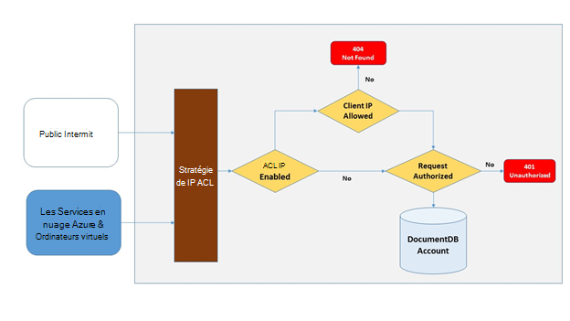
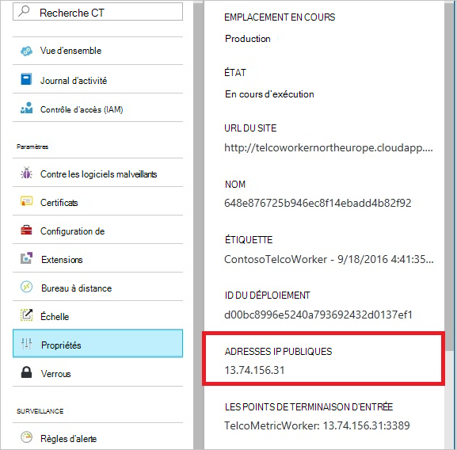
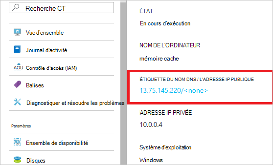
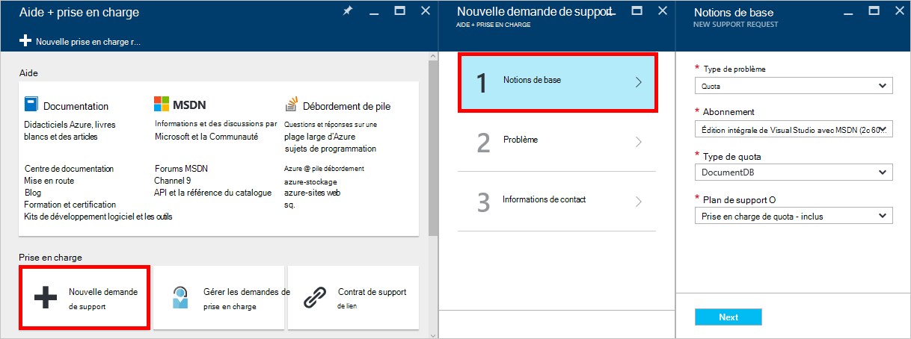
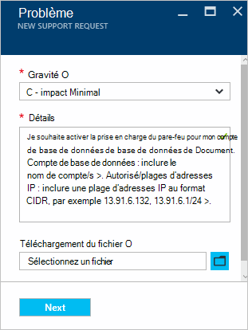

<properties
    pageTitle="Prise en charge de pare-feu DocumentDB | Microsoft Azure"
    description="Découvrez comment utiliser les stratégies de contrôle d’accès IP pour la prise en charge de pare-feu sur les comptes de base de données Azure DocumentDB."
    keywords="Contrôle d’accès IP, prise en charge du pare-feu"
    services="documentdb"
    authors="shahankur11"
    manager="jhubbard"
    editor=""
    tags="azure-resource-manager"
    documentationCenter=""/>

<tags 
    ms.service="documentdb" 
    ms.workload="data-services" 
    ms.tgt_pltfrm="na" 
    ms.devlang="na" 
    ms.topic="article" 
    ms.date="10/17/2016" 
    ms.author="ankshah; kraman"/>

# Prise en charge de pare-feu DocumentDB

Pour sécuriser les données stockées dans un compte de base de données Azure DocumentDB, DocumentDB a fourni la prise en charge pour un secret en fonction de [modèle d’autorisation](https://msdn.microsoft.com/library/azure/dn783368.aspx) utilise un code d’authentification forte de message basé sur hachage (HMAC). Maintenant, en plus du modèle d’autorisations secrète, DocumentDB prend en charge les politiques de contrôles d’accès IP pour la prise en charge de pare-feu entrant. Ce modèle est très similaire aux règles de pare-feu d’un système de base de données traditionnelles et fournit un niveau supplémentaire de sécurité pour le compte de base de données DocumentDB. Avec ce modèle, vous pouvez maintenant configurer un compte de base de données DocumentDB pour être accessibles uniquement à partir d’un ensemble agréé de machines ou de services en nuage. Accès aux ressources de DocumentDB à partir de ces jeux approuvés des ordinateurs et des services nécessitent toujours l’appelant à présenter un jeton d’autorisation valide.

## Vue d’ensemble du contrôle d’accès IP

Par défaut, un compte de base de données DocumentDB est accessible à partir de l’internet public, tant que la demande est accompagnée d’un jeton d’autorisation valide. Pour configurer le contrôle d’accès basé sur la stratégie IP, l’utilisateur doit fournir le jeu d’adresses IP ou des plages d’adresses IP sous forme CIDR pour être inclus comme la liste autorisée du client IPs pour un compte de base de données spécifiée. Une fois que cette configuration est appliquée, toutes les demandes provenant d’ordinateurs à l’extérieur de cette liste autorisée seront bloqués par le serveur.  La traitement de flux pour le contrôle d’accès sur IP de connexion est décrite dans le diagramme suivant.

## Connexions à partir des services en nuage

Dans Azure, les services en nuage sont une façon très commune pour héberger la logique de service de niveau intermédiaire à l’aide de DocumentDB. Pour activer l’accès à un compte de base de données DocumentDB à partir d’un service en nuage, l’adresse IP publique du service nuage doit être ajouté à la liste autorisée des adresses IP associées à votre compte de base de données DocumentDB en [contactant le support Azure](#configure-ip-policy).  Cela garantit que toutes les instances de rôle des services en nuage ont accès à votre compte de base de données DocumentDB. Vous pouvez récupérer les adresses IP de vos services de cloud dans le portail Azure, comme illustré dans la capture d’écran suivante. 

Lorsque vous faites évoluer votre service cloud en ajoutant des instances de rôle supplémentaires, ces nouvelles instances auront automatiquement accès au compte de base de données DocumentDB dans la mesure où ils font partie du même service nuage.

## Connexions à partir d’ordinateurs virtuels

[Machines virtuelles](https://azure.microsoft.com/services/virtual-machines/) ou [définit de l’échelle de l’ordinateur virtuel](../virtual-machine-scale-sets/virtual-machine-scale-sets-overview.md) peut également servir pour héberger les services de couche intermédiaire à l’aide de DocumentDB.  Pour configurer le DocumentDB compte de base de données pour autoriser l’accès à partir d’ordinateurs virtuels, les adresses IP publiques de machine virtuelle et/ou de machine virtuelle échelle jeu doit être configuré en tant qu’une des adresses IP autorisées de votre compte de base de données DocumentDB en [contactant le support Azure](#configure-ip-policy). Vous pouvez récupérer les adresses IP des ordinateurs virtuels dans le portail Azure, comme illustré dans la capture d’écran suivante.

Lorsque vous ajoutez des instances de l’ordinateur virtuel supplémentaire pour le groupe, ils sont fournis automatiquement l’accès à votre compte de base de données DocumentDB.

## Connexions à partir d’internet

Lorsque vous accédez à un compte de base de données DocumentDB à partir d’un ordinateur sur internet, l’adresse IP ou plage d’adresses IP de l’ordinateur doit être ajouté à la liste autorisée de l’adresse IP pour le compte de base de données DocumentDB. 

## Configuration de la stratégie de contrôle d’accès IP

Le portail Azure permet d’introduire une demande de prise en charge [d’Azure](https://portal.azure.com/?#blade/Microsoft_Azure_Support/HelpAndSupportBlade) pour activer la stratégie de contrôle d’accès IP sur votre compte de base de données.

1. De la lame [aide + support](https://portal.azure.com/?#blade/Microsoft_Azure_Support/HelpAndSupportBlade) , sélectionnez **nouvelle demande d’assistance**.
2. Dans la lame **Nouveau prend en charge la demande** , sélectionnez **bases**.
3. De la lame de **Notions de base** , sélectionnez les options suivantes :
    - **Type de problème**: Quota
    - **Abonnement**: l’abonnement associé au compte dans lequel vous souhaitez ajouter la stratégie de contrôle d’accès IP.
    - **Type de quota**: DocumentDB
    - **Plan de support**: prise en charge de Quota - inclus.
4. De la lame du **problème** , effectuez les opérations suivantes :
    - **Gravité**: sélectionnez C - impact Minimal
    - **Détails**: copiez le texte suivant dans la zone et inclure votre nom de compte/s et les IP adresse/es : « je souhaite activer la prise en charge du pare-feu pour mon compte de base de données DocumentDB. Compte de base de données : *nom de compte Include/s*. Autorisé/plages d’adresses IP : *plage d’adresses IP d’inclure au format CIDR, par exemple 13.91.6.132, 13.91.6.1/24*. »
    - Cliquez sur **suivant**. 
5. De la lame **d’informations de Contact** , renseignez vos détails de contact, puis cliquez sur **créer**. 

Une fois reçue, votre demande de contrôle d’accès IP doit être activé dans les 24 heures. Vous serez averti une fois la demande terminée.

## Résolution des problèmes liés à la stratégie de contrôle d’accès IP

### Opérations de portail

Grâce à une stratégie de contrôle d’accès IP pour votre compte de base de données DocumentDB, tous les accès à votre compte de base de données DocumentDB à partir d’ordinateurs à l’extérieur de la configuration autorisée liste des plages d’adresses IP sont bloqués. Du fait de ce modèle, l’opération du plan de données à partir du portail de navigation est également bloquée pour assurer l’intégrité de contrôle d’accès. 

### API du Kit de développement logiciel et reste

Pour des raisons de sécurité, l’accès via le SDK ou des API REST de machines pas sur la liste autorisée renverra une réponse de 404 introuvable générique sans aucun détail supplémentaire. Vérifiez que l’adresse IP configurée pour votre compte de base de données DocumentDB de liste autorisé pour vérifier que la configuration de la stratégie appropriée est appliquée à votre compte de base de données DocumentDB.

## Étapes suivantes

Pour plus d’informations sur le réseau de conseils de performance associés, reportez-vous à [optimiser les performances](documentdb-performance-tips.md).