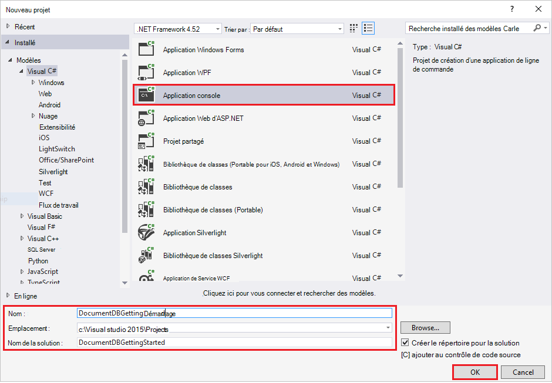
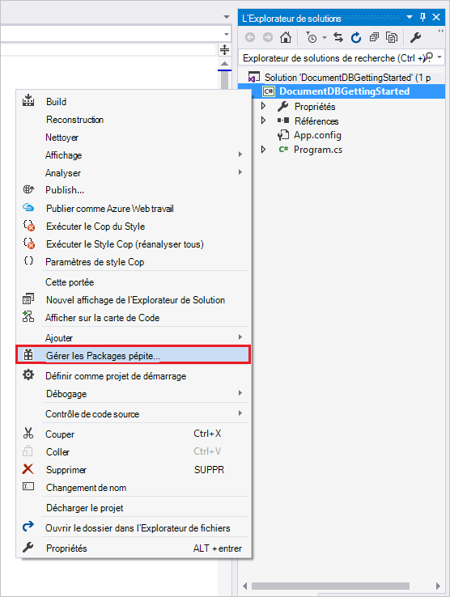
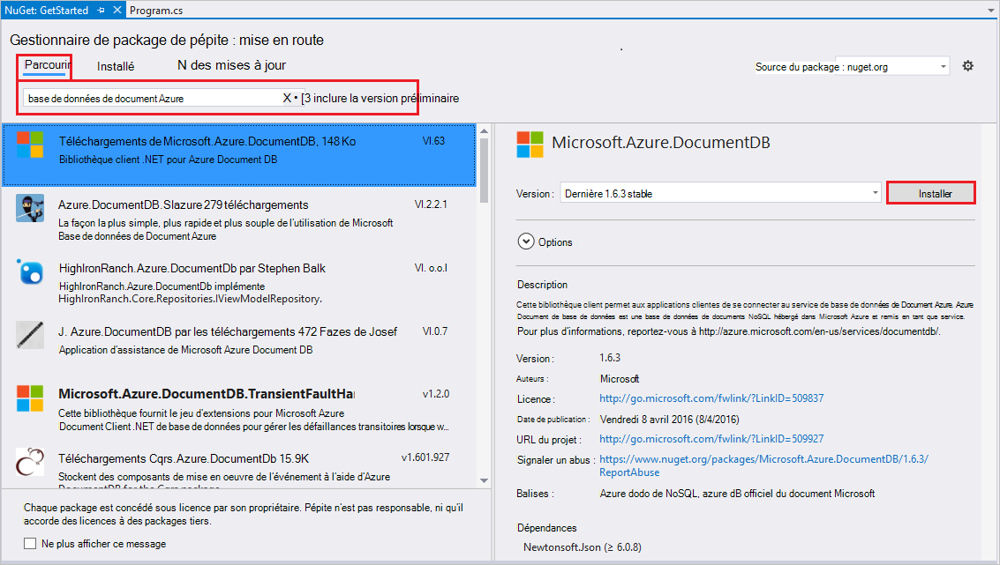
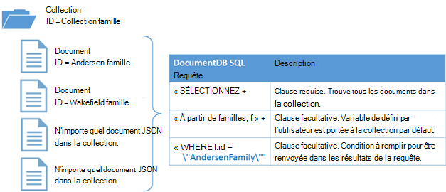

<properties
    pageTitle="Didacticiel de NoSQL : Kit de développement .NET DocumentDB | Microsoft Azure"
    description="Un didacticiel de NoSQL qui crée une base de données en ligne et l’application console C# à l’aide du Kit de développement .NET DocumentDB. DocumentDB est une base de données NoSQL JSON."
    keywords="didacticiel de NoSQL, base de données en ligne, application console c#"
    services="documentdb"
    documentationCenter=".net"
    authors="AndrewHoh"
    manager="jhubbard"
    editor="monicar"/>

<tags
    ms.service="documentdb"
    ms.workload="data-services"
    ms.tgt_pltfrm="na"
    ms.devlang="dotnet"
    ms.topic="hero-article"
    ms.date="08/29/2016"
    ms.author="anhoh"/>

# Didacticiel de NoSQL : générer un C# DocumentDB application console

> [AZURE.SELECTOR]
- [.NET](documentdb-get-started.md)
- [Node.js](documentdb-nodejs-get-started.md)

Bienvenue dans le didacticiel de NoSQL pour Azure DocumentDB .NET SDK ! À la fin de ce didacticiel, vous avez une application console qui crée et les requêtes des ressources de DocumentDB.

Nous aborderons :

- Création et connexion à un compte DocumentDB
- Configuration de votre Solution Visual Studio
- Création d’une base de données en ligne
- Création d’une collection
- Création de documents JSON
- Interrogation de la collection
- Remplacement d’un document
- Suppression d’un document
- Suppression de la base de données

Vous n’avez à temps ? Ne vous inquiétez pas ! La solution complète est disponible sur [GitHub](https://github.com/Azure-Samples/documentdb-dotnet-getting-started). Accéder à [obtenir la section de la solution complète](#GetSolution) pour les instructions rapides.

Par la suite, utilisez les boutons de vote en haut ou au bas de cette page pour nous donner vos commentaires. Si vous souhaitez que nous vous contacter directement, n’hésitez pas à inclure votre adresse de courriel dans vos commentaires.

Désormais c’est parti !

## Conditions préalables

Vérifiez que vous disposez des éléments suivants :

- Un compte Azure actif. Si vous n’en avez pas, vous pouvez vous inscrire pour un [compte gratuit](https://azure.microsoft.com/free/).
- [Visual Studio 2013 / Visual Studio 2015](http://www.visualstudio.com/).
- .NET Framework 4.6

## Étape 1 : Créer un compte DocumentDB

Nous allons créer un compte DocumentDB. Si vous avez déjà un compte que vous souhaitez utiliser, vous pouvez passer à [l’installation de votre Solution Visual Studio](#SetupVS).

[AZURE.INCLUDE [documentdb-create-dbaccount](../../includes/documentdb-create-dbaccount.md)]

## Étape 2 : Le programme d’installation de votre solution Visual Studio

1. Ouvrez **Visual Studio 2015** sur votre ordinateur.
2. Dans le menu **fichier** , sélectionnez **Nouveau**, puis cliquez sur **projet**.
3. Dans la boîte de dialogue **Nouveau projet** , sélectionnez **les modèles** / **Visual C#** / **Application Console**, nommez votre projet, puis cliquez sur **OK**.

4. Dans l' **Explorateur de solutions**, cliquez avec le bouton droit sur votre nouvelle application de console, qui se trouve sous votre solution Visual Studio.
5. Sans quitter le menu, cliquez sur **Gérer les Packages NuGet...** 
 
6. Dans l’onglet **Nuget** , cliquez sur **Parcourir**, puis tapez **documentdb azure** dans la zone de recherche.
7. Dans les résultats de la recherche **Microsoft.Azure.DocumentDB** et cliquez sur **installer**.
L’ID de package de la bibliothèque Client de DocumentDB est [Microsoft.Azure.DocumentDB](https://www.nuget.org/packages/Microsoft.Azure.DocumentDB)

Très bien ! Maintenant que nous avons terminé l’installation, commençons à écrire du code. Vous trouverez un projet de code terminé ce didacticiel à [GitHub](https://github.com/Azure-Samples/documentdb-dotnet-getting-started/blob/master/src/Program.cs).

## Étape 3 : Se connecter à un compte DocumentDB

Tout d’abord, ajoutez ces références au début de votre application C#, dans le fichier Program.cs :

    using System;
    using System.Linq;
    using System.Threading.Tasks;

    // ADD THIS PART TO YOUR CODE
    using System.Net;
    using Microsoft.Azure.Documents;
    using Microsoft.Azure.Documents.Client;
    using Newtonsoft.Json;

> [AZURE.IMPORTANT] Pour terminer ce didacticiel NoSQL, veillez à qu'ajouter les dépendances ci-dessus.

Maintenant, ajoutez ces deux constantes et votre variable *client* en dessous de votre *programme*de classe publique.

    public class Program
    {
        // ADD THIS PART TO YOUR CODE
        private const string EndpointUri = "<your endpoint URI>";
        private const string PrimaryKey = "<your key>";
        private DocumentClient client;

Tête de suivant, sur le [Portail Azure](https://portal.azure.com) pour récupérer votre URI et une clé primaire. L’URI de DocumentDB et de la clé primaire sont nécessaires pour votre application à comprendre où se connecter et DocumentDB à la connexion de votre application de confiance.

Dans le portail d’Azure, accédez à votre compte de DocumentDB, puis cliquez sur **les clés**.

Copier l’URI à partir du portail et collez-le dans `<your endpoint URI>` dans le fichier program.cs. Copiez la clé primaire à partir du portail, puis collez-le dans `<your key>`.

![Capture d’écran du portail Azure permet de créer une application de console C# dans le didacticiel de NoSQL. Indique un compte DocumentDB, avec les valeurs d’URI, clé primaire et clé secondaire apparaît en surbrillance sur la lame de clés, le bouton touches apparaît en surbrillance sur la lame de compte DocumentDB et le concentrateur actif en surbrillance][keys]

Nous allons commencer l’application démarrée lors de l’obtention en créant une nouvelle instance de la **DocumentClient**.

Sous la méthode **Main** , ajoutez cette nouvelle tâche asynchrone appelée **GetStartedDemo**, laquelle instancie notre nouvelle **DocumentClient**.

    static void Main(string[] args)
    {
    }

    // ADD THIS PART TO YOUR CODE
    private async Task GetStartedDemo()
    {
        this.client = new DocumentClient(new Uri(EndpointUri), PrimaryKey);
    }

Ajoutez le code suivant pour exécuter votre tâche asynchrone à partir de votre méthode **principale** . La méthode **Main** intercepter les exceptions et les écrire dans la console.

    static void Main(string[] args)
    {
            // ADD THIS PART TO YOUR CODE
            try
            {
                    Program p = new Program();
                    p.GetStartedDemo().Wait();
            }
            catch (DocumentClientException de)
            {
                    Exception baseException = de.GetBaseException();
                    Console.WriteLine("{0} error occurred: {1}, Message: {2}", de.StatusCode, de.Message, baseException.Message);
            }
            catch (Exception e)
            {
                    Exception baseException = e.GetBaseException();
                    Console.WriteLine("Error: {0}, Message: {1}", e.Message, baseException.Message);
            }
            finally
            {
                    Console.WriteLine("End of demo, press any key to exit.");
                    Console.ReadKey();
            }

Appuyez sur **F5** pour exécuter votre application.

Félicitations ! Vous êtes connecté à un compte DocumentDB, jetons maintenant un œil à l’utilisation des ressources de DocumentDB.  

## Étape 4 : Créer une base de données
Avant d’ajouter le code pour la création d’une base de données, ajouter une méthode d’assistance pour écrire dans la console.

Copiez et collez la méthode **WriteToConsoleAndPromptToContinue** , en dessous de la méthode **GetStartedDemo** .

    // ADD THIS PART TO YOUR CODE
    private void WriteToConsoleAndPromptToContinue(string format, params object[] args)
    {
            Console.WriteLine(format, args);
            Console.WriteLine("Press any key to continue ...");
            Console.ReadKey();
    }

Votre [base de données](documentdb-resources.md#databases) de DocumentDB peut être créés à l’aide de la méthode [CreateDatabaseAsync](https://msdn.microsoft.com/library/microsoft.azure.documents.client.documentclient.createdatabaseasync.aspx) de la classe **DocumentClient** . Une base de données est le conteneur logique du stockage des documents JSON partitionnée entre les collections.

Copiez et collez la méthode **CreateDatabaseIfNotExists** , en dessous de la méthode **WriteToConsoleAndPromptToContinue** .

    // ADD THIS PART TO YOUR CODE
    private async Task CreateDatabaseIfNotExists(string databaseName)
    {
            // Check to verify a database with the id=FamilyDB does not exist
            try
            {
                    await this.client.ReadDatabaseAsync(UriFactory.CreateDatabaseUri(databaseName));
                    this.WriteToConsoleAndPromptToContinue("Found {0}", databaseName);
            }
            catch (DocumentClientException de)
            {
                    // If the database does not exist, create a new database
                    if (de.StatusCode == HttpStatusCode.NotFound)
                    {
                            await this.client.CreateDatabaseAsync(new Database { Id = databaseName });
                            this.WriteToConsoleAndPromptToContinue("Created {0}", databaseName);
                    }
                    else
                    {
                            throw;
                    }
            }
    }

Copiez et collez le code suivant à la méthode **GetStartedDemo** en dessous de la création de clients. Cela crée une base de données nommée *FamilyDB*.

    private async Task GetStartedDemo()
    {
        this.client = new DocumentClient(new Uri(EndpointUri), PrimaryKey);

        // ADD THIS PART TO YOUR CODE
        await this.CreateDatabaseIfNotExists("FamilyDB_oa");

Appuyez sur **F5** pour exécuter votre application.

Félicitations ! Vous avez créé une base de données DocumentDB.  

## Étape 5 : Créer une collection  

> [AZURE.WARNING] **CreateDocumentCollectionAsync** crée une nouvelle collection avec débit réservé, ce qui a des conséquences sur la tarification. Pour plus d’informations, visitez notre [page de tarification](https://azure.microsoft.com/pricing/details/documentdb/).

Une [collection](documentdb-resources.md#collections) peut être créé à l’aide de la méthode [CreateDocumentCollectionAsync](https://msdn.microsoft.com/library/microsoft.azure.documents.client.documentclient.createdocumentcollectionasync.aspx) de la classe **DocumentClient** . Une collection est un conteneur de documents JSON et logique de l’application JavaScript associé.

Copiez et collez la méthode **CreateDocumentCollectionIfNotExists** sous votre méthode **CreateDatabaseIfNotExists** .

    // ADD THIS PART TO YOUR CODE
    private async Task CreateDocumentCollectionIfNotExists(string databaseName, string collectionName)
    {
        try
        {
            await this.client.ReadDocumentCollectionAsync(UriFactory.CreateDocumentCollectionUri(databaseName, collectionName));
            this.WriteToConsoleAndPromptToContinue("Found {0}", collectionName);
        }
        catch (DocumentClientException de)
        {
            // If the document collection does not exist, create a new collection
            if (de.StatusCode == HttpStatusCode.NotFound)
            {
                DocumentCollection collectionInfo = new DocumentCollection();
                collectionInfo.Id = collectionName;

                // Configure collections for maximum query flexibility including string range queries.
                collectionInfo.IndexingPolicy = new IndexingPolicy(new RangeIndex(DataType.String) { Precision = -1 });

                // Here we create a collection with 400 RU/s.
                await this.client.CreateDocumentCollectionAsync(
                    UriFactory.CreateDatabaseUri(databaseName),
                    collectionInfo,
                    new RequestOptions { OfferThroughput = 400 });

                this.WriteToConsoleAndPromptToContinue("Created {0}", collectionName);
            }
            else
            {
                throw;
            }
        }
    }

Copiez et collez le code suivant à la méthode **GetStartedDemo** , en dessous de la création de la base de données. Cette opération crée une collection de document nommée *FamilyCollection_oa*.

        this.client = new DocumentClient(new Uri(EndpointUri), PrimaryKey);

        await this.CreateDatabaseIfNotExists("FamilyDB_oa");

        // ADD THIS PART TO YOUR CODE
        await this.CreateDocumentCollectionIfNotExists("FamilyDB_oa", "FamilyCollection_oa");

Appuyez sur **F5** pour exécuter votre application.

Félicitations ! Vous avez créé une collection de documents DocumentDB.  

## Étape 6 : Créer des documents JSON
Un [document](documentdb-resources.md#documents) peut être créé à l’aide de la méthode [CreateDocumentAsync](https://msdn.microsoft.com/library/microsoft.azure.documents.client.documentclient.createdocumentasync.aspx) de la classe **DocumentClient** . Les documents sont définies par l’utilisateur du contenu JSON (arbitraire). Nous pouvons maintenant insérer un ou plusieurs documents. Si vous avez déjà des données que vous souhaitez stocker dans la base de données, vous pouvez utiliser l' de DocumentDB [l’outil de Migration de données](documentdb-import-data.md).

Tout d’abord, nous devons créer une classe de **famille** qui représentera les objets stockés dans DocumentDB dans cet exemple. Nous allons également créer **Parent**, **enfant**, **Pet**, **adresse** les sous-classes qui sont utilisées dans la **famille**. Notez que les documents doivent avoir une propriété **Id** sérialisée en tant qu' **id** dans JSON. Créer ces classes en ajoutant les sous-classes internes suivants après la méthode **GetStartedDemo** .

Copiez et collez la **famille** **Parent**, **enfant**, **Pet**et classes **d’adresses** sous la méthode **WriteToConsoleAndPromptToContinue** .

    private void WriteToConsoleAndPromptToContinue(string format, params object[] args)
    {
        Console.WriteLine(format, args);
        Console.WriteLine("Press any key to continue ...");
        Console.ReadKey();
    }

    // ADD THIS PART TO YOUR CODE
    public class Family
    {
        [JsonProperty(PropertyName = "id")]
        public string Id { get; set; }
        public string LastName { get; set; }
        public Parent[] Parents { get; set; }
        public Child[] Children { get; set; }
        public Address Address { get; set; }
        public bool IsRegistered { get; set; }
        public override string ToString()
        {
                return JsonConvert.SerializeObject(this);
        }
    }

    public class Parent
    {
        public string FamilyName { get; set; }
        public string FirstName { get; set; }
    }

    public class Child
    {
        public string FamilyName { get; set; }
        public string FirstName { get; set; }
        public string Gender { get; set; }
        public int Grade { get; set; }
        public Pet[] Pets { get; set; }
    }

    public class Pet
    {
        public string GivenName { get; set; }
    }

    public class Address
    {
        public string State { get; set; }
        public string County { get; set; }
        public string City { get; set; }
    }

Copiez et collez la méthode **CreateFamilyDocumentIfNotExists** sous votre méthode **CreateDocumentCollectionIfNotExists** .

    // ADD THIS PART TO YOUR CODE
    private async Task CreateFamilyDocumentIfNotExists(string databaseName, string collectionName, Family family)
    {
        try
        {
            await this.client.ReadDocumentAsync(UriFactory.CreateDocumentUri(databaseName, collectionName, family.Id));
            this.WriteToConsoleAndPromptToContinue("Found {0}", family.Id);
        }
        catch (DocumentClientException de)
        {
            if (de.StatusCode == HttpStatusCode.NotFound)
            {
                await this.client.CreateDocumentAsync(UriFactory.CreateDocumentCollectionUri(databaseName, collectionName), family);
                this.WriteToConsoleAndPromptToContinue("Created Family {0}", family.Id);
            }
            else
            {
                throw;
            }
        }
    }

Et insérez les deux documents, pour la famille Andersen et de la famille des Wakefield.

Copiez et collez le code suivant à la méthode **GetStartedDemo** en dessous de la création de la collection Documents.

    await this.CreateDatabaseIfNotExists("FamilyDB_oa");

    await this.CreateDocumentCollectionIfNotExists("FamilyDB_oa", "FamilyCollection_oa");

    // ADD THIS PART TO YOUR CODE
    Family andersenFamily = new Family
    {
            Id = "Andersen.1",
            LastName = "Andersen",
            Parents = new Parent[]
            {
                    new Parent { FirstName = "Thomas" },
                    new Parent { FirstName = "Mary Kay" }
            },
            Children = new Child[]
            {
                    new Child
                    {
                            FirstName = "Henriette Thaulow",
                            Gender = "female",
                            Grade = 5,
                            Pets = new Pet[]
                            {
                                    new Pet { GivenName = "Fluffy" }
                            }
                    }
            },
            Address = new Address { State = "WA", County = "King", City = "Seattle" },
            IsRegistered = true
    };

    await this.CreateFamilyDocumentIfNotExists("FamilyDB_oa", "FamilyCollection_oa", andersenFamily);

    Family wakefieldFamily = new Family
    {
            Id = "Wakefield.7",
            LastName = "Wakefield",
            Parents = new Parent[]
            {
                    new Parent { FamilyName = "Wakefield", FirstName = "Robin" },
                    new Parent { FamilyName = "Miller", FirstName = "Ben" }
            },
            Children = new Child[]
            {
                    new Child
                    {
                            FamilyName = "Merriam",
                            FirstName = "Jesse",
                            Gender = "female",
                            Grade = 8,
                            Pets = new Pet[]
                            {
                                    new Pet { GivenName = "Goofy" },
                                    new Pet { GivenName = "Shadow" }
                            }
                    },
                    new Child
                    {
                            FamilyName = "Miller",
                            FirstName = "Lisa",
                            Gender = "female",
                            Grade = 1
                    }
            },
            Address = new Address { State = "NY", County = "Manhattan", City = "NY" },
            IsRegistered = false
    };

    await this.CreateFamilyDocumentIfNotExists("FamilyDB_oa", "FamilyCollection_oa", wakefieldFamily);

Appuyez sur **F5** pour exécuter votre application.

Félicitations ! Vous avez créé deux documents DocumentDB.  

##Étape 7 : Demander des ressources de DocumentDB

DocumentDB prend en charge des [requêtes](documentdb-sql-query.md) sur JSON les documents stockés dans chaque collection.  L’exemple de code suivant montre différentes requêtes - à l’aide de la syntaxe DocumentDB SQL et LINQ - que nous pouvons exécuter contre les documents nous avons inséré à l’étape précédente.

Copiez et collez la méthode **ExecuteSimpleQuery** sous votre méthode **CreateFamilyDocumentIfNotExists** .

    // ADD THIS PART TO YOUR CODE
    private void ExecuteSimpleQuery(string databaseName, string collectionName)
    {
        // Set some common query options
        FeedOptions queryOptions = new FeedOptions { MaxItemCount = -1 };

            // Here we find the Andersen family via its LastName
            IQueryable<Family> familyQuery = this.client.CreateDocumentQuery<Family>(
                    UriFactory.CreateDocumentCollectionUri(databaseName, collectionName), queryOptions)
                    .Where(f => f.LastName == "Andersen");

            // The query is executed synchronously here, but can also be executed asynchronously via the IDocumentQuery<T> interface
            Console.WriteLine("Running LINQ query...");
            foreach (Family family in familyQuery)
            {
                    Console.WriteLine("\tRead {0}", family);
            }

            // Now execute the same query via direct SQL
            IQueryable<Family> familyQueryInSql = this.client.CreateDocumentQuery<Family>(
                    UriFactory.CreateDocumentCollectionUri(databaseName, collectionName),
                    "SELECT * FROM Family WHERE Family.LastName = 'Andersen'",
                    queryOptions);

            Console.WriteLine("Running direct SQL query...");
            foreach (Family family in familyQueryInSql)
            {
                    Console.WriteLine("\tRead {0}", family);
            }

            Console.WriteLine("Press any key to continue ...");
            Console.ReadKey();
    }

Copiez et collez le code suivant à la méthode **GetStartedDemo** en dessous de la création d’un deuxième document.

    await this.CreateFamilyDocumentIfNotExists("FamilyDB_oa", "FamilyCollection_oa", wakefieldFamily);

    // ADD THIS PART TO YOUR CODE
    this.ExecuteSimpleQuery("FamilyDB_oa", "FamilyCollection_oa");

Appuyez sur **F5** pour exécuter votre application.

Félicitations ! Vous avez interrogé avec succès par rapport à une collection de DocumentDB.

Le diagramme suivant illustre comment le SQL DocumentDB syntaxe de requête est appelée sur la collection que vous avez créé et la même logique s’applique à la requête LINQ ainsi.

Le mot clé [FROM](documentdb-sql-query.md#from-clause) est facultatif dans la requête, car DocumentDB requêtes sont déjà associées à une collection unique. Par conséquent, « De familles, f » peut être remplacée par « De r racine », ou toute autre variable nom que vous choisissez. DocumentDB va déduire que familles, racine ou le nom de variable que vous avez choisi, faire référence à la collection actuelle par défaut.

##Étape 8 : Remplacer les document JSON

DocumentDB prend en charge les documents JSON remplacement.  

Copiez et collez la méthode **ReplaceFamilyDocument** sous votre méthode **ExecuteSimpleQuery** .

    // ADD THIS PART TO YOUR CODE
    private async Task ReplaceFamilyDocument(string databaseName, string collectionName, string familyName, Family updatedFamily)
    {
        try
        {
            await this.client.ReplaceDocumentAsync(UriFactory.CreateDocumentUri(databaseName, collectionName, familyName), updatedFamily);
            this.WriteToConsoleAndPromptToContinue("Replaced Family {0}", familyName);
        }
        catch (DocumentClientException de)
        {
            throw;
        }
    }

Copiez et collez le code suivant à la méthode **GetStartedDemo** en dessous de l’exécution de la requête. Une fois le document, il s’exécutera la même requête pour afficher le document modifié.

    await this.CreateFamilyDocumentIfNotExists("FamilyDB_oa", "FamilyCollection_oa", wakefieldFamily);

    this.ExecuteSimpleQuery("FamilyDB_oa", "FamilyCollection_oa");

    // ADD THIS PART TO YOUR CODE
    // Update the Grade of the Andersen Family child
    andersenFamily.Children[0].Grade = 6;

    await this.ReplaceFamilyDocument("FamilyDB_oa", "FamilyCollection_oa", "Andersen.1", andersenFamily);

    this.ExecuteSimpleQuery("FamilyDB_oa", "FamilyCollection_oa");

Appuyez sur **F5** pour exécuter votre application.

Félicitations ! Vous avez correctement remplacé un document DocumentDB.

##Étape 9 : Supprimer le document JSON

DocumentDB prend en charge les documents suppression de JSON.  

Copiez et collez la méthode **DeleteFamilyDocument** sous votre méthode **ReplaceFamilyDocument** .

    // ADD THIS PART TO YOUR CODE
    private async Task DeleteFamilyDocument(string databaseName, string collectionName, string documentName)
    {
        try
        {
            await this.client.DeleteDocumentAsync(UriFactory.CreateDocumentUri(databaseName, collectionName, documentName));
            Console.WriteLine("Deleted Family {0}", documentName);
        }
        catch (DocumentClientException de)
        {
            throw;
        }
    }

Copiez et collez le code suivant à la méthode **GetStartedDemo** , en dessous de la seconde exécution de la requête.

    await this.ReplaceFamilyDocument("FamilyDB_oa", "FamilyCollection_oa", "Andersen.1", andersenFamily);

    this.ExecuteSimpleQuery("FamilyDB_oa", "FamilyCollection_oa");

    // ADD THIS PART TO CODE
    await this.DeleteFamilyDocument("FamilyDB_oa", "FamilyCollection_oa", "Andersen.1");

Appuyez sur **F5** pour exécuter votre application.

Félicitations ! Vous avez supprimé avec succès d’un document DocumentDB.

##Étape 10 : Supprimer la base de données

La base de données supprimer la base de données et toutes les ressources d’enfants (collections, documents, etc.).

Copiez et collez le code suivant à votre méthode de **GetStartedDemo** sous le document à supprimer pour supprimer l’intégralité de la base de données et toutes les ressources enfants.

    this.ExecuteSimpleQuery("FamilyDB_oa", "FamilyCollection_oa");

    await this.DeleteFamilyDocument("FamilyDB_oa", "FamilyCollection_oa", "Andersen.1");

    // ADD THIS PART TO CODE
    // Clean up/delete the database
    await this.client.DeleteDatabaseAsync(UriFactory.CreateDatabaseUri("FamilyDB_oa"));

Appuyez sur **F5** pour exécuter votre application.

Félicitations ! Vous avez supprimé avec succès d’une base de données DocumentDB.

##Étape 11 : Exécuter votre C# console application ensemble !

Appuyez sur F5 dans Visual Studio pour générer l’application en mode débogage.

Vous devez voir la sortie de votre application démarré get. La sortie affiche les résultats des requêtes, nous avons ajouté et doit correspondre à l’exemple de texte ci-dessous.

    Created FamilyDB_oa
    Press any key to continue ...
    Created FamilyCollection_oa
    Press any key to continue ...
    Created Family Andersen.1
    Press any key to continue ...
    Created Family Wakefield.7
    Press any key to continue ...
    Running LINQ query...
        Read {"id":"Andersen.1","LastName":"Andersen","District":"WA5","Parents":[{"FamilyName":null,"FirstName":"Thomas"},{"FamilyName":null,"FirstName":"Mary Kay"}],"Children":[{"FamilyName":null,"FirstName":"Henriette Thaulow","Gender":"female","Grade":5,"Pets":[{"GivenName":"Fluffy"}]}],"Address":{"State":"WA","County":"King","City":"Seattle"},"IsRegistered":true}
    Running direct SQL query...
        Read {"id":"Andersen.1","LastName":"Andersen","District":"WA5","Parents":[{"FamilyName":null,"FirstName":"Thomas"},{"FamilyName":null,"FirstName":"Mary Kay"}],"Children":[{"FamilyName":null,"FirstName":"Henriette Thaulow","Gender":"female","Grade":5,"Pets":[{"GivenName":"Fluffy"}]}],"Address":{"State":"WA","County":"King","City":"Seattle"},"IsRegistered":true}
    Replaced Family Andersen.1
    Press any key to continue ...
    Running LINQ query...
        Read {"id":"Andersen.1","LastName":"Andersen","District":"WA5","Parents":[{"FamilyName":null,"FirstName":"Thomas"},{"FamilyName":null,"FirstName":"Mary Kay"}],"Children":[{"FamilyName":null,"FirstName":"Henriette Thaulow","Gender":"female","Grade":6,"Pets":[{"GivenName":"Fluffy"}]}],"Address":{"State":"WA","County":"King","City":"Seattle"},"IsRegistered":true}
    Running direct SQL query...
        Read {"id":"Andersen.1","LastName":"Andersen","District":"WA5","Parents":[{"FamilyName":null,"FirstName":"Thomas"},{"FamilyName":null,"FirstName":"Mary Kay"}],"Children":[{"FamilyName":null,"FirstName":"Henriette Thaulow","Gender":"female","Grade":6,"Pets":[{"GivenName":"Fluffy"}]}],"Address":{"State":"WA","County":"King","City":"Seattle"},"IsRegistered":true}
    Deleted Family Andersen.1
    End of demo, press any key to exit.

Félicitations ! Vous avez terminé ce didacticiel NoSQL et que vous disposez d’une application de console C# de travail !

##Obtenir la solution du didacticiel NoSQL complète
Pour générer la solution GetStarted qui contient tous les exemples de cet article, vous devrez les éléments suivants :

- Un compte Azure actif. Si vous n’en avez pas, vous pouvez vous inscrire pour un [compte gratuit](https://azure.microsoft.com/free/).
-   Un [compte de DocumentDB][documentdb-create-account].
-   La solution [GetStarted](https://github.com/Azure-Samples/documentdb-dotnet-getting-started) disponible sur GitHub.

Pour restaurer les références pour le Kit de développement .NET DocumentDB dans Visual Studio, avec le bouton droit de la solution **GetStarted** dans l’Explorateur de solutions, puis cliquez sur **Activer la restauration du Package NuGet**. Ensuite, dans le fichier App.config, mettre à jour les valeurs EndpointUrl et AuthorizationKey comme indiqué dans [se connecter à un compte DocumentDB](#Connect).

## Étapes suivantes

- Utiliser un didacticiel ASP.NET MVC NoSQL plus complexe ? Reportez-vous à la section [créer une application web avec MVC ASP.NET à l’aide de DocumentDB](documentdb-dotnet-application.md).
- Vous souhaitez effectuer une échelle et des tests de performances avec DocumentDB ? Consultez les [performances et évolutivité avec Azure DocumentDB de test](documentdb-performance-testing.md)
-   Découvrez comment le [moniteur un compte DocumentDB](documentdb-monitor-accounts.md).
-   Permet d’exécuter des requêtes sur notre exemple de dataset dans le [Laboratoire de la requête](https://www.documentdb.com/sql/demo).
-   Pour en savoir plus sur le modèle de programmation dans la section développement de la [page de documentation de DocumentDB](https://azure.microsoft.com/documentation/services/documentdb/).

[documentdb-create-account]: documentdb-create-account.md
[documentdb-manage]: documentdb-manage.md
[keys]: media/documentdb-get-started/nosql-tutorial-keys.png
