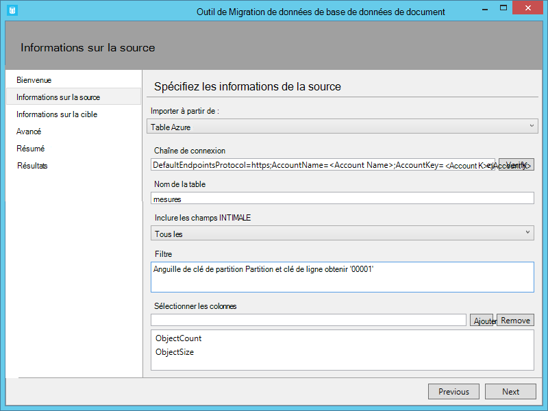

<properties
    pageTitle="Outil de migration de base de données pour DocumentDB | Microsoft Azure"
    description="Apprenez à utiliser les outils de migration de données open source DocumentDB pour importer des données provenant de diverses sources, y compris les fichiers MongoDB, SQL Server, Table de stockage, DynamoDB d’Amazon, CSV et JSON pour DocumentDB. CSV pour conversion de JSON."
    keywords="CSV vers json, les outils de migration de base de données, convertir csv json"
    services="documentdb"
    authors="andrewhoh"
    manager="jhubbard"
    editor="monicar"
    documentationCenter=""/>

<tags
    ms.service="documentdb"
    ms.workload="data-services"
    ms.tgt_pltfrm="na"
    ms.devlang="na"
    ms.topic="article"
    ms.date="10/06/2016"
    ms.author="anhoh"/>

# Importer des données à DocumentDB avec l’outil de Migration de base de données

Cet article vous montre comment utiliser l’outil de migration de données DocumentDB ouvrir la source officielle pour importer des données à [Microsoft Azure DocumentDB](https://azure.microsoft.com/services/documentdb/) à partir de diverses sources, y compris de JSON des fichiers CSV, SQL, MongoDB, stockage par Table Azure, Amazon DynamoDB et les collections DocumentDB.

Après avoir lu cet article, vous serez en mesure de répondre aux questions suivantes :  

-   Comment puis-je importer fichier JSON, fichier CSV, les données de SQL Server ou des données de MongoDB à DocumentDB ?
-   Comment puis-je importer des données de stockage Azure Table, Amazon DynamoDB et HBase à DocumentDB ?
-   Comment puis-je migrer les données entre les collections de DocumentDB ?

##Conditions préalables

Avant de suivre les instructions fournies dans cet article, assurez-vous d’avoir les éléments suivants :

- [Microsoft.NET Framework 4.51](https://www.microsoft.com/download/developer-tools.aspx) ou ultérieur.

##Vue d’ensemble de l’outil de Migration de données de DocumentDB

L’outil de Migration de données de DocumentDB est une solution open source qui importe des données à partir de diverses sources, y compris à DocumentDB :

- Fichiers JSON
- MongoDB
- SQL Server
- Fichiers CSV
- Stockage par Table Azure
- DynamoDB d’Amazon
- HBase
- Collections de DocumentDB

Tandis que l’outil d’importation inclut une interface utilisateur graphique (dtui.exe), il peut également être piloté à partir de la ligne de commande (dt.exe). En fait, est une option de sortie de la commande associée après avoir configuré une importation via l’interface utilisateur. Données de source sous forme de tableau (par exemple, les fichiers de SQL Server ou CSV) peuvent être transformées, telles que des relations hiérarchiques (sous-documents) peuvent être créées lors de l’importation. Poursuivez votre lecture pour en savoir plus sur les options de source, exemples de lignes de commande pour importer à partir de chaque source, la cible et l’importation de l’affichage des résultats.

##L’installation de l’outil de Migration de données DocumentDB

Le code source d’outil migration est disponible sur GitHub dans [ce référentiel](https://github.com/azure/azure-documentdb-datamigrationtool) et une version compilée est disponible à partir du [Centre de téléchargement Microsoft](http://www.microsoft.com/downloads/details.aspx?FamilyID=cda7703a-2774-4c07-adcc-ad02ddc1a44d). Vous pouvez compiler la solution ou simplement télécharger et extraire la version compilée dans un répertoire de votre choix. Ensuite, exécutez une ou l’autre :

- **Dtui.exe**: version de l’interface graphique de l’outil
- **DT.exe**: une version de ligne de commande de l’outil

##Importer des fichiers JSON

L’option d’importateur JSON fichier source vous permet d’importer un ou plusieurs document unique JSON fichiers ou JSON qui contiennent chacun un tableau de documents JSON. Lors de l’ajout des dossiers qui contiennent les fichiers JSON à importer, vous avez la possibilité de rechercher des fichiers dans les sous-dossiers de manière récursive.

Voici certains exemples de ligne de commande pour importer des fichiers JSON :

    #Import a single JSON file
    dt.exe /s:JsonFile /s.Files:.\Sessions.json /t:DocumentDBBulk /t.ConnectionString:"AccountEndpoint=<DocumentDB Endpoint>;AccountKey=<DocumentDB Key>;Database=<DocumentDB Database>;" /t.Collection:Sessions /t.CollectionThroughput:2500

    #Import a directory of JSON files
    dt.exe /s:JsonFile /s.Files:C:\TESessions\*.json /t:DocumentDBBulk /t.ConnectionString:" AccountEndpoint=<DocumentDB Endpoint>;AccountKey=<DocumentDB Key>;Database=<DocumentDB Database>;" /t.Collection:Sessions /t.CollectionThroughput:2500

    #Import a directory (including sub-directories) of JSON files
    dt.exe /s:JsonFile /s.Files:C:\LastFMMusic\**\*.json /t:DocumentDBBulk /t.ConnectionString:" AccountEndpoint=<DocumentDB Endpoint>;AccountKey=<DocumentDB Key>;Database=<DocumentDB Database>;" /t.Collection:Music /t.CollectionThroughput:2500

    #Import a directory (single), directory (recursive), and individual JSON files
    dt.exe /s:JsonFile /s.Files:C:\Tweets\*.*;C:\LargeDocs\**\*.*;C:\TESessions\Session48172.json;C:\TESessions\Session48173.json;C:\TESessions\Session48174.json;C:\TESessions\Session48175.json;C:\TESessions\Session48177.json /t:DocumentDBBulk /t.ConnectionString:"AccountEndpoint=<DocumentDB Endpoint>;AccountKey=<DocumentDB Key>;Database=<DocumentDB Database>;" /t.Collection:subs /t.CollectionThroughput:2500

    #Import a single JSON file and partition the data across 4 collections
    dt.exe /s:JsonFile /s.Files:D:\\CompanyData\\Companies.json /t:DocumentDBBulk /t.ConnectionString:"AccountEndpoint=<DocumentDB Endpoint>;AccountKey=<DocumentDB Key>;Database=<DocumentDB Database>;" /t.Collection:comp[1-4] /t.PartitionKey:name /t.CollectionThroughput:2500

##Importer à partir de MongoDB

La MongoDB source importateur vous permet d’importer à partir d’une collection de MongoDB individuels et éventuellement de filtrer les documents à l’aide d’une requête ou modifier la structure du document à l’aide d’une projection.  

La chaîne de connexion est au format standard de MongoDB :

    mongodb://<dbuser>:<dbpassword>@<host>:<port>/<database>

> [AZURE.NOTE] Utilisez la commande vérifier pour vous assurer que l’instance de MongoDB spécifiée dans le champ de chaîne de connexion est accessible.

Entrez le nom de la collection à partir duquel les données seront importées. Vous pouvez éventuellement spécifier ou fournir un fichier pour une requête (par exemple, {pop : {$gt : 5000}}) et/ou de projection (par exemple, {loc:0}) pour les filtrer et d’importer les données de forme.

Voici certains exemples de ligne de commande pour importer à partir de MongoDB :

    #Import all documents from a MongoDB collection
    dt.exe /s:MongoDB /s.ConnectionString:mongodb://<dbuser>:<dbpassword>@<host>:<port>/<database> /s.Collection:zips /t:DocumentDBBulk /t.ConnectionString:"AccountEndpoint=<DocumentDB Endpoint>;AccountKey=<DocumentDB Key>;Database=<DocumentDB Database>;" /t.Collection:BulkZips /t.IdField:_id /t.CollectionThroughput:2500

    #Import documents from a MongoDB collection which match the query and exclude the loc field
    dt.exe /s:MongoDB /s.ConnectionString:mongodb://<dbuser>:<dbpassword>@<host>:<port>/<database> /s.Collection:zips /s.Query:{pop:{$gt:50000}} /s.Projection:{loc:0} /t:DocumentDBBulk /t.ConnectionString:"AccountEndpoint=<DocumentDB Endpoint>;AccountKey=<DocumentDB Key>;Database=<DocumentDB Database>;" /t.Collection:BulkZipsTransform /t.IdField:_id/t.CollectionThroughput:2500

##Importer des fichiers d’exportation MongoDB

La MongoDB exportation JSON fichier source importateur vous permet d’importer un ou plusieurs fichiers JSON produites à partir de l’utilitaire mongoexport.  

Lorsque vous ajoutez des dossiers qui contiennent les fichiers d’exportation de MongoDB JSON pour l’importation, vous avez la possibilité de rechercher des fichiers dans les sous-dossiers de manière récursive.

Voici un exemple de ligne de commande pour importer à partir des fichiers d’exportation de MongoDB JSON :

    dt.exe /s:MongoDBExport /s.Files:D:\mongoemployees.json /t:DocumentDBBulk /t.ConnectionString:"AccountEndpoint=<DocumentDB Endpoint>;AccountKey=<DocumentDB Key>;Database=<DocumentDB Database>;" /t.Collection:employees /t.IdField:_id /t.Dates:Epoch /t.CollectionThroughput:2500

##Importer à partir de SQL Server

L’option importateur de source SQL vous permet d’importer à partir d’une base de données SQL Server et vous pouvez également filtrer les enregistrements à importer à l’aide d’une requête. En outre, vous pouvez modifier la structure du document en spécifiant un séparateur d’imbrication (plus dans un instant).  

Le format de la chaîne de connexion est le format de chaîne de connexion SQL standard.

> [AZURE.NOTE] Utilisez la commande vérifier pour vous assurer que l’instance SQL Server spécifiée dans le champ de chaîne de connexion est accessible.

La propriété de séparateur d’imbrication est utilisée pour créer des relations hiérarchiques (documents secondaire) lors de l’importation. Considérez la requête SQL suivante :

*Sélectionnez CAST (BusinessEntityID AS varchar) comme Id, nom, AddressType en tant que [Address.AddressType], AddressLine1 en tant que [Address.AddressLine1], ville sous la forme [Address.Location.City], StateProvinceName en tant que [Address.Location.StateProvinceName], code postal sous la forme [Address.PostalCode], CountryRegionName en tant que [Address.CountryRegionName] à partir de Sales.vStoreWithAddresses où AddressType = 'Bureau de Main'*

Qui retourne les résultats (partiels) suivants :

Notez les alias tels que Address.AddressType et Address.Location.StateProvinceName. En spécifiant un séparateur d’imbrication de '.', l’outil d’importation crée des sous-documents adresse et Address.Location lors de l’importation. Voici un exemple d’un document qui en résulte dans DocumentDB :

*{« id » : « 956 », « nom » : « Plus précis et Service de vente », « Adresse » : {« AddressType » : « Bureau principal », « AddressLine1 » : « rue du O'Connor #500-75 », « Emplacement » : {« Ville » : « Ottawa », « StateProvinceName » : « Ontario »}, « Code postal » : « K4B 1S2 », « CountryRegionName » : « Canada »}}*

Voici quelques exemples de ligne de commande pour importer à partir de SQL Server :

    #Import records from SQL which match a query
    dt.exe /s:SQL /s.ConnectionString:"Data Source=<server>;Initial Catalog=AdventureWorks;User Id=advworks;Password=<password>;" /s.Query:"select CAST(BusinessEntityID AS varchar) as Id, * from Sales.vStoreWithAddresses WHERE AddressType='Main Office'" /t:DocumentDBBulk /t.ConnectionString:" AccountEndpoint=<DocumentDB Endpoint>;AccountKey=<DocumentDB Key>;Database=<DocumentDB Database>;" /t.Collection:Stores /t.IdField:Id /t.CollectionThroughput:2500

    #Import records from sql which match a query and create hierarchical relationships
    dt.exe /s:SQL /s.ConnectionString:"Data Source=<server>;Initial Catalog=AdventureWorks;User Id=advworks;Password=<password>;" /s.Query:"select CAST(BusinessEntityID AS varchar) as Id, Name, AddressType as [Address.AddressType], AddressLine1 as [Address.AddressLine1], City as [Address.Location.City], StateProvinceName as [Address.Location.StateProvinceName], PostalCode as [Address.PostalCode], CountryRegionName as [Address.CountryRegionName] from Sales.vStoreWithAddresses WHERE AddressType='Main Office'" /s.NestingSeparator:. /t:DocumentDBBulk /t.ConnectionString:" AccountEndpoint=<DocumentDB Endpoint>;AccountKey=<DocumentDB Key>;Database=<DocumentDB Database>;" /t.Collection:StoresSub /t.IdField:Id /t.CollectionThroughput:2500

##Importation de fichiers CSV - CSV de convertir en JSON

L’option importateur de source du fichier CSV vous permet d’importer un ou plusieurs fichiers CSV. Lors de l’ajout de dossiers contenant des fichiers CSV pour importation, vous avez la possibilité de rechercher des fichiers dans les sous-dossiers de manière récursive.

Similaire à la source de SQL, la propriété de séparateur d’imbrication peut servir à créer des relations hiérarchiques (documents secondaire) lors de l’importation. Examinez l’en-tête CSV suivant les lignes de données et de la ligne :

Notez les alias tels que DomainInfo.Domain_Name et RedirectInfo.Redirecting. En spécifiant un séparateur d’imbrication de '.', l’outil d’importation créera les sous-documents DomainInfo et RedirectInfo lors de l’importation. Voici un exemple d’un document qui en résulte dans DocumentDB :

*{« DomainInfo » : {« Nom_domaine » : « ACUS.GOV », « Domain_Name_Address » : « http://www.ACUS.GOV »}, « Agence fédérale » : « administration conférence des États-Unis », « RedirectInfo » : {« Redirection » : « 0 », « Redirect_Destination » : « »}, « id » : « 9cc565c5-ebcd-1c03-ebd3-cc3e2ecd814d »}*

L’outil d’importation va tenter de déduire les informations de type pour des valeurs sans guillemets dans les fichiers CSV (valeurs entre guillemets sont toujours traités en tant que chaînes).  Les types sont identifiés dans l’ordre suivant : nombre, datetime, boolean.  

Il existe deux autres points à noter à propos de l’importation CSV :

1.  Par défaut, des valeurs sans guillemets sont toujours supprimés pour les tabulations et les espaces, tandis que les valeurs entre guillemets sont conservées en tant que-est. Ce comportement peut être substitué avec la case à cocher Ajustement des valeurs entre guillemets ou l’option de ligne de commande /s.TrimQuoted.

2.  Par défaut, une valeur null sans guillemets est considérée comme une valeur null. Ce comportement peut être substitué (c'est-à-dire traiter une null sans guillemets sous la forme d’une chaîne « null ») avec le traitement non cotées NULL en tant que la case à cocher de la chaîne ou l’option de ligne de commande /s.NoUnquotedNulls.

Voici un exemple de ligne de commande pour importation CSV :

    dt.exe /s:CsvFile /s.Files:.\Employees.csv /t:DocumentDBBulk /t.ConnectionString:"AccountEndpoint=<DocumentDB Endpoint>;AccountKey=<DocumentDB Key>;Database=<DocumentDB Database>;" /t.Collection:Employees /t.IdField:EntityID /t.CollectionThroughput:2500

##Importer à partir de stockage Azure Table

La Table d’Azure stockage source importateur vous permet d’importer à partir d’une table de stockage Azure Table individuelle et vous pouvez également filtrer les entités de table à importer.  

Le format de la chaîne de connexion de stockage Azure Table est :

    DefaultEndpointsProtocol=<protocol>;AccountName=<Account Name>;AccountKey=<Account Key>;

> [AZURE.NOTE] Utilisez la commande vérifier pour vous assurer que l’instance de stockage Azure Table spécifiée dans le champ de chaîne de connexion est accessible.

Entrez le nom de la table Azure à partir duquel les données seront importées. Vous pouvez éventuellement spécifier un [filtre](https://msdn.microsoft.com/library/azure/ff683669.aspx).

L’option de Table d’Azure storage source importateur comprend les options supplémentaires suivantes :

1. Inclure les champs internes
    2. Tout : inclut tous les champs internes (PartitionKey, RowKey et Timestamp)
    3. Aucun - exclure tous les champs internes
    4. RowKey - inclure uniquement le champ de RowKey
3. Sélectionner les colonnes
    1. Filtres de stockage Azure Table ne supportent pas les prévisions. Si vous souhaitez importer uniquement les propriétés d’entité Azure Table spécifiques, ajoutez-les à la liste de sélection des colonnes. Toutes les autres propriétés de l’entité seront ignorées.

Voici un exemple de ligne de commande pour importer à partir de stockage Azure Table :

    dt.exe /s:AzureTable /s.ConnectionString:"DefaultEndpointsProtocol=https;AccountName=<Account Name>;AccountKey=<Account Key>" /s.Table:metrics /s.InternalFields:All /s.Filter:"PartitionKey eq 'Partition1' and RowKey gt '00001'" /s.Projection:ObjectCount;ObjectSize  /t:DocumentDBBulk /t.ConnectionString:" AccountEndpoint=<DocumentDB Endpoint>;AccountKey=<DocumentDB Key>;Database=<DocumentDB Database>;" /t.Collection:metrics /t.CollectionThroughput:2500

##Importer à partir d’Amazon DynamoDB

La DynamoDB d’Amazon source importateur vous permet d’importer à partir d’une table de DynamoDB d’Amazon individuelle et vous pouvez également filtrer les entités à importer. Plusieurs modèles sont fournis pour que le paramétrage d’une importation est aussi simple que possible.

Le format de la chaîne de connexion DynamoDB d’Amazon est :

    ServiceURL=<Service Address>;AccessKey=<Access Key>;SecretKey=<Secret Key>;

> [AZURE.NOTE] Utilisez la commande vérifier pour vous assurer que l’instance de DynamoDB d’Amazon spécifiée dans le champ de chaîne de connexion est accessible.

Voici un exemple de ligne de commande pour importer à partir d’Amazon DynamoDB :

    dt.exe /s:DynamoDB /s.ConnectionString:ServiceURL=https://dynamodb.us-east-1.amazonaws.com;AccessKey=<accessKey>;SecretKey=<secretKey> /s.Request:"{   """TableName""": """ProductCatalog""" }" /t:DocumentDBBulk /t.ConnectionString:"AccountEndpoint=<DocumentDB Endpoint>;AccountKey=<DocumentDB Key>;Database=<DocumentDB Database>;" /t.Collection:catalogCollection /t.CollectionThroughput:2500

##Importer des fichiers de stockage des objets Blob Azure

Le fichier JSON, les options d’importateur CSV fichier source et le fichier d’exportation MongoDB permettent d’importer un ou plusieurs fichiers de stockage des objets Blob Azure. Après avoir spécifié une URL de Blob conteneur et d’une clé de compte, fournissez simplement une expression régulière pour sélectionner les fichiers à importer.

Voici un exemple de ligne de commande pour importer des fichiers JSON à partir de stockage des objets Blob Azure :

    dt.exe /s:JsonFile /s.Files:"blobs://<account key>@account.blob.core.windows.net:443/importcontainer/.*" /t:DocumentDBBulk /t.ConnectionString:"AccountEndpoint=<DocumentDB Endpoint>;AccountKey=<DocumentDB Key>;Database=<DocumentDB Database>;" /t.Collection:doctest

##Importer à partir de DocumentDB

La DocumentDB source importateur vous permet d’importer des données à partir d’une ou plusieurs collections de DocumentDB et vous pouvez également filtrer les documents à l’aide d’une requête.  

Le format de la chaîne de connexion DocumentDB est :

    AccountEndpoint=<DocumentDB Endpoint>;AccountKey=<DocumentDB Key>;Database=<DocumentDB Database>;

La chaîne de connexion de compte peut être extraites de la lame de clés du portail Azure DocumentDB, comme décrit dans [la gestion d’un compte DocumentDB](documentdb-manage-account.md), cependant le nom de la base de données doit être ajouté à la chaîne de connexion dans le format suivant :

    Database=<DocumentDB Database>;

> [AZURE.NOTE] Utilisez la commande vérifier pour vous assurer que l’instance de DocumentDB spécifiée dans le champ de chaîne de connexion est accessible.

Pour importer à partir d’une collection unique de DocumentDB, entrez le nom de la collection à partir duquel les données seront importées. Pour importer à partir de plusieurs collections de DocumentDB, fournit une expression régulière pour le correspond à un ou plusieurs noms de collection (par exemple collection01 | collection02 | collection03). Vous pouvez éventuellement spécifier ou fournir un fichier pour une requête de filtre et de forme les données à importer.

> [AZURE.NOTE] Étant donné que le champ accepte des expressions régulières, si vous importez à partir d’une collection unique dont le nom contient des caractères d’expressions régulières, ces caractères doivent être échappés en conséquence.

L’option d’importateur de source DocumentDB comprend les options avancées suivantes :

1. Inclure les champs internes : Spécifie d’inclure les propriétés système du document DocumentDB dans l’exportation (par exemple, _rid, DTS) ou non.
2. Nombre de tentatives en cas d’échec : Spécifie le nombre de tentatives de connexion à DocumentDB en cas de défaillance transitoire (par exemple, aux coupure de connectivité de réseau).
3. L’intervalle avant nouvelle tentative : Spécifie la durée d’attente entre la nouvelle tentative de la connexion à DocumentDB en cas de défaillance transitoire (par exemple, aux coupure de connectivité de réseau).
4. Mode de connexion : Spécifie le mode de connexion à utiliser avec DocumentDB. Les choix disponibles sont DirectTcp, DirectHttps et la passerelle. Les modes de connexion directe sont plus rapides, tandis que le mode passerelle est pare-feu plus convivial, comme il utilise seulement le port 443.

> [AZURE.TIP] L’outil d’importation par défaut, le mode de connexion DirectTcp. Si vous rencontrez des problèmes de pare-feu, basculez vers le mode de connexion passerelle, car elle ne requiert que le port 443.

Voici certains exemples de ligne de commande pour importer à partir de DocumentDB :

    #Migrate data from one DocumentDB collection to another DocumentDB collections
    dt.exe /s:DocumentDB /s.ConnectionString:"AccountEndpoint=<DocumentDB Endpoint>;AccountKey=<DocumentDB Key>;Database=<DocumentDB Database>;" /s.Collection:TEColl /t:DocumentDBBulk /t.ConnectionString:" AccountEndpoint=<DocumentDB Endpoint>;AccountKey=<DocumentDB Key>;Database=<DocumentDB Database>;" /t.Collection:TESessions /t.CollectionThroughput:2500

    #Migrate data from multiple DocumentDB collections to a single DocumentDB collection
    dt.exe /s:DocumentDB /s.ConnectionString:"AccountEndpoint=<DocumentDB Endpoint>;AccountKey=<DocumentDB Key>;Database=<DocumentDB Database>;" /s.Collection:comp1|comp2|comp3|comp4 /t:DocumentDBBulk /t.ConnectionString:"AccountEndpoint=<DocumentDB Endpoint>;AccountKey=<DocumentDB Key>;Database=<DocumentDB Database>;" /t.Collection:singleCollection /t.CollectionThroughput:2500

    #Export a DocumentDB collection to a JSON file
    dt.exe /s:DocumentDB /s.ConnectionString:"AccountEndpoint=<DocumentDB Endpoint>;AccountKey=<DocumentDB Key>;Database=<DocumentDB Database>;" /s.Collection:StoresSub /t:JsonFile /t.File:StoresExport.json /t.Overwrite /t.CollectionThroughput:2500

##Importer à partir de HBase

La HBase source importateur vous permet d’importer des données à partir d’une table HBase et éventuellement de filtrer les données. Plusieurs modèles sont fournis pour que le paramétrage d’une importation est aussi simple que possible.

Le format de la chaîne de connexion HBase Stargate est :

    ServiceURL=<server-address>;Username=<username>;Password=<password>

> [AZURE.NOTE] Utilisez la commande vérifier pour vous assurer que l’instance de HBase spécifiée dans le champ de chaîne de connexion est accessible.

Voici un exemple de ligne de commande pour importer à partir de HBase :

    dt.exe /s:HBase /s.ConnectionString:ServiceURL=<server-address>;Username=<username>;Password=<password> /s.Table:Contacts /t:DocumentDBBulk /t.ConnectionString:"AccountEndpoint=<DocumentDB Endpoint>;AccountKey=<DocumentDB Key>;Database=<DocumentDB Database>;" /t.Collection:hbaseimport

##Importation de DocumentDB (importation en bloc)

L’importateur en bloc de DocumentDB vous permet d’importer à partir de toutes les options de source disponibles, à l’aide d’une procédure stockée de DocumentDB pour plus d’efficacité. L’outil prend en charge l’importation à une collection de DocumentDB partitionnée unique, ainsi qu’importer sharded par laquelle les données sont partitionnées sur plusieurs collections de DocumentDB partitionnée unique. Pour plus d’informations sur le partitionnement des données, consultez le [partitionnement et la mise à l’échelle dans Azure DocumentDB](documentdb-partition-data.md). L’outil va créer, exécuter et puis supprimer la procédure stockée de regroupements de la cible.  

Le format de la chaîne de connexion DocumentDB est :

    AccountEndpoint=<DocumentDB Endpoint>;AccountKey=<DocumentDB Key>;Database=<DocumentDB Database>;

La chaîne de connexion de compte peut être extraites de la lame de clés du portail Azure DocumentDB, comme décrit dans [la gestion d’un compte DocumentDB](documentdb-manage-account.md), cependant le nom de la base de données doit être ajouté à la chaîne de connexion dans le format suivant :

    Database=<DocumentDB Database>;

> [AZURE.NOTE] Utilisez la commande vérifier pour vous assurer que l’instance de DocumentDB spécifiée dans le champ de chaîne de connexion est accessible.

Pour importer dans une collection unique, entrez le nom de la collection à laquelle les données seront importées et cliquez sur le bouton Ajouter. Pour importer dans plusieurs collections, entrez le nom de chaque collection individuellement ou utiliser la syntaxe suivante pour spécifier plusieurs collections : *collection_prefix*[index de début - index de fin]. Lorsque vous spécifiez plusieurs collections via la syntaxe précitée, gardez les éléments suivants à l’esprit :

1. Seuls les modèles de noms de plage entier sont pris en charge. Par exemple, la spécification de collection [0-3] produira les collections suivantes : collection0, collection1, collection2, collection3.
2. Vous pouvez utiliser une syntaxe abrégée : [3] de collection émettra le même jeu de collections mentionné à l’étape 1.
3. Plus d’une substitution peut être fournie. Par exemple, la collection [0-1] [0-9] génère des 20 noms de collection avec des zéros non significatifs (collection01,... 02... 03).

Une fois que le nom de collection (s) ont été spécifiés, sélectionnez le débit souhaité de la collections Databases (400 RUs pour 10 000 RUs). Pour meilleures performances, choisissez un débit plus élevé. Pour plus d’informations sur les niveaux de performances, consultez [niveaux de Performance dans DocumentDB](documentdb-performance-levels.md).

> [AZURE.NOTE] Le paramètre de débit des performances s’applique uniquement à la création de la collection. Si la collection spécifiée existe, son débit ne sera pas modifié.

Lors de l’importation de plusieurs collections, le hachage de prise en charge d’outil importation basé ont. Dans ce scénario, spécifiez la propriété de document que vous souhaitez utiliser comme clé de Partition (si la clé de Partition est vide, documents sera sharded au hasard entre les groupes cibles).

Vous pouvez éventuellement spécifier quel champ de la source d’importation doit être utilisé en tant que la propriété d’id de document DocumentDB lors de l’importation (Notez que si les documents ne contiennent pas cette propriété, puis l’outil d’importation génère un GUID en tant que la valeur de la propriété id).

Il existe un certain nombre d’options avancées lors de l’importation. Tout d’abord, tandis que l’outil inclut un bloc par défaut importer une procédure stockée (BulkInsert.js), vous pouvez choisir de spécifier votre propre procédure stockée d’importation :

 

En outre, lors de l’importation de types de date (par exemple, à partir de SQL Server ou MongoDB), vous pouvez choisir entre trois options d’importation :

 

-   Chaîne : Rendre persistant sous la forme d’une valeur de chaîne
-   Époque : Rendre persistant sous la forme d’une valeur de numéro de version
-   Les deux : Conserver la chaîne et valeurs de numéro de version. Cette option permet de créer un sous-document, par exemple : « date_joined » : {« Valeur » : « 2013-10-21T21:17:25.2410000Z », « époque » : 1382390245}

L’importateur en masse de DocumentDB a les options avancées supplémentaires suivantes :

1. Taille de lot : L’outil par défaut une taille de lot de 50.  Si les documents doivent être importées sont volumineux, envisagez de réduire la taille du lot. À l’inverse, si les documents doivent être importées sont de petite taille, envisagez d’augmenter la taille du lot.
2. Taille de Script maximale (octets) : valeur par défaut est l’outil à une taille de script maximale de 512 Ko
3. Désactiver la génération automatique de code : Si chaque document soit importé contient un champ id, puis la sélection de cette option peut améliorer les performances. Documents manquants d’un champ unique ne seront pas importés.
4. Documents existants de mise à jour : L’outil est par défaut ne pas remplacer les documents existants avec des conflits d’id. La sélection de cette option permettra de remplacer les documents existants avec ID de rapprochement. Cette fonctionnalité est utile pour les migrations de données planifiées qui mettent à jour les documents existants.
5. Nombre de tentatives en cas d’échec : Spécifie le nombre de tentatives de connexion à DocumentDB en cas de défaillance transitoire (par exemple, aux coupure de connectivité de réseau).
6. L’intervalle avant nouvelle tentative : Spécifie la durée d’attente entre la nouvelle tentative de la connexion à DocumentDB en cas de défaillance transitoire (par exemple, aux coupure de connectivité de réseau).
7. Mode de connexion : Spécifie le mode de connexion à utiliser avec DocumentDB. Les choix disponibles sont DirectTcp, DirectHttps et la passerelle. Les modes de connexion directe sont plus rapides, tandis que le mode passerelle est pare-feu plus convivial, comme il utilise seulement le port 443.

> [AZURE.TIP] L’outil d’importation par défaut, le mode de connexion DirectTcp. Si vous rencontrez des problèmes de pare-feu, basculez vers le mode de connexion passerelle, car elle ne requiert que le port 443.

##Importation de DocumentDB (enregistrement séquentiel d’importation)

L’importateur d’enregistrement séquentiel DocumentDB vous permet d’importer à partir de toutes les options de source disponibles sur une base d’enregistrement par enregistrement. Vous pouvez choisir cette option si vous importez dans un regroupement existant qui a atteint son quota de procédures stockées. L’outil prend en charge l’importation à une seule collection de DocumentDB, sharded ainsi qu’importer selon laquelle les données sont partitionnées sur plusieurs collections de DocumentDB à partition unique ou plusieurs partition (partition unique et plusieurs partition). Pour plus d’informations sur le partitionnement des données, consultez le [partitionnement et la mise à l’échelle dans Azure DocumentDB](documentdb-partition-data.md).

Le format de la chaîne de connexion DocumentDB est :

    AccountEndpoint=<DocumentDB Endpoint>;AccountKey=<DocumentDB Key>;Database=<DocumentDB Database>;

La chaîne de connexion de compte peut être extraites de la lame de clés du portail Azure DocumentDB, comme décrit dans [la gestion d’un compte DocumentDB](documentdb-manage-account.md), cependant le nom de la base de données doit être ajouté à la chaîne de connexion dans le format suivant :

    Database=<DocumentDB Database>;

> [AZURE.NOTE] Utilisez la commande vérifier pour vous assurer que l’instance de DocumentDB spécifiée dans le champ de chaîne de connexion est accessible.

Pour importer dans une collection unique, entrez le nom de la collection à laquelle les données seront importées et cliquez sur le bouton Ajouter. Pour importer dans plusieurs collections, entrez le nom de chaque collection individuellement ou utiliser la syntaxe suivante pour spécifier plusieurs collections : *collection_prefix*[index de début - index de fin]. Lorsque vous spécifiez plusieurs collections via la syntaxe précitée, gardez les éléments suivants à l’esprit :

1. Seuls les modèles de noms de plage entier sont pris en charge. Par exemple, la spécification de collection [0-3] produira les collections suivantes : collection0, collection1, collection2, collection3.
2. Vous pouvez utiliser une syntaxe abrégée : [3] de collection émettra le même jeu de collections mentionné à l’étape 1.
3. Plus d’une substitution peut être fournie. Par exemple, la collection [0-1] [0-9] génère des 20 noms de collection avec des zéros non significatifs (collection01,... 02... 03).

Une fois que le nom de collection (s) ont été spécifiés, sélectionnez le débit souhaité de la collections Databases (400 RUs à 250 000 RUs). Pour meilleures performances, choisissez un débit plus élevé. Pour plus d’informations sur les niveaux de performances, consultez [niveaux de Performance dans DocumentDB](documentdb-performance-levels.md). Toute importation de collections avec débit > 10 000 RUs nécessite une clé de partition. Si vous choisissez d’avoir plus de 250 000 RUs, voir [augmenter les limites de compte DocumentDB](documentdb-increase-limits.md).

> [AZURE.NOTE] Le paramètre débit s’applique uniquement à la création de la collection. Si la collection spécifiée existe, son débit ne sera pas modifié.

Lors de l’importation de plusieurs collections, le hachage de prise en charge d’outil importation basé ont. Dans ce scénario, spécifiez la propriété de document que vous souhaitez utiliser comme clé de Partition (si la clé de Partition est vide, documents sera sharded au hasard entre les groupes cibles).

Vous pouvez éventuellement spécifier quel champ de la source d’importation doit être utilisé en tant que la propriété d’id de document DocumentDB lors de l’importation (Notez que si les documents ne contiennent pas cette propriété, puis l’outil d’importation génère un GUID en tant que la valeur de la propriété id).

Il existe un certain nombre d’options avancées lors de l’importation. Tout d’abord, lors de l’importation de types de date (par exemple, à partir de SQL Server ou MongoDB), vous pouvez choisir entre trois options d’importation :

 

-   Chaîne : Rendre persistant sous la forme d’une valeur de chaîne
-   Époque : Rendre persistant sous la forme d’une valeur de numéro de version
-   Les deux : Conserver la chaîne et valeurs de numéro de version. Cette option permet de créer un sous-document, par exemple : « date_joined » : {« Valeur » : « 2013-10-21T21:17:25.2410000Z », « époque » : 1382390245}

Le DocumentDB - importateur d’enregistrement séquentiel comprend les options avancées suivantes :

1. Nombre de requêtes parallèles : par défaut, l’outil 2 des requêtes parallèles. Si les documents doivent être importées sont de petite taille, envisagez d’augmenter le nombre de requêtes parallèles. Notez que si ce nombre est déclenché trop, l’importation peut rencontrer la limitation.
2. Désactiver la génération automatique de code : Si chaque document soit importé contient un champ id, puis la sélection de cette option peut améliorer les performances. Documents manquants d’un champ unique ne seront pas importés.
3. Documents existants de mise à jour : L’outil est par défaut ne pas remplacer les documents existants avec des conflits d’id. La sélection de cette option permettra de remplacer les documents existants avec ID de rapprochement. Cette fonctionnalité est utile pour les migrations de données planifiées qui mettent à jour les documents existants.
4. Nombre de tentatives en cas d’échec : Spécifie le nombre de tentatives de connexion à DocumentDB en cas de défaillance transitoire (par exemple, aux coupure de connectivité de réseau).
5. L’intervalle avant nouvelle tentative : Spécifie la durée d’attente entre la nouvelle tentative de la connexion à DocumentDB en cas de défaillance transitoire (par exemple, aux coupure de connectivité de réseau).
6. Mode de connexion : Spécifie le mode de connexion à utiliser avec DocumentDB. Les choix disponibles sont DirectTcp, DirectHttps et la passerelle. Les modes de connexion directe sont plus rapides, tandis que le mode passerelle est pare-feu plus convivial, comme il utilise seulement le port 443.

> [AZURE.TIP] L’outil d’importation par défaut, le mode de connexion DirectTcp. Si vous rencontrez des problèmes de pare-feu, basculez vers le mode de connexion passerelle, car elle ne requiert que le port 443.

##Définir une politique d’indexation lors de la création de collections de la DocumentDB

Lorsque vous autorisez l’outil de migration créer des collections lors de l’importation, vous pouvez spécifier la stratégie d’indexation de la collection. Dans les options avancées de l’importation de section de l’ensemble de le DocumentDB et séquentiel DocumentDB options d’enregistrement, accédez à la section de la stratégie de l’indexation.

À l’aide de la stratégie d’indexation option avancée, vous pouvez sélectionner un fichier de stratégie d’indexation, manuellement Entrez une politique d’indexation ou sélectionnez à partir d’un ensemble de modèles par défaut (en cliquant avec le bouton droit dans la zone de texte de stratégie d’indexation).

L’outil fournit les modèles de stratégie sont :

- La valeur par défaut. Cette stratégie est préférable lorsque vous êtes exécuter des requêtes de l’égalité sur les chaînes et pour les nombres à l’aide de ORDER BY, range et les requêtes d’égalité. Cette stratégie a une surcharge de stockage index inférieure à la plage.
- Plage. Cette stratégie est préférable que vous utilisez des requêtes ORDER BY, range et d’égalité sur les nombres et les chaînes. Cette stratégie a un index stockage temps système plus élevé par défaut ou de hachage.

> [AZURE.NOTE] Si vous ne spécifiez pas une politique d’indexation, la stratégie par défaut s’appliquera. Pour plus d’informations sur les stratégies d’indexation, voir [DocumentDB des stratégies d’indexation](documentdb-indexing-policies.md).

## Exporter vers fichier JSON

L’exportateur DocumentDB JSON vous permet d’exporter les options source disponibles dans un fichier JSON qui contient un tableau des documents JSON. L’outil prendra en charge l’exportation pour vous, ou vous pouvez choisir d’afficher la commande résultant de la migration et l’exécution de la commande. Le fichier résultant de JSON peut-être être stocké localement ou dans le stockage des objets Blob Azure.

Vous pouvez éventuellement choisir de prettify le JSON résultante, ce qui augmente la taille du document obtenu tout en rendant le contenu plus lisible.

    Standard JSON export
    [{"id":"Sample","Title":"About Paris","Language":{"Name":"English"},"Author":{"Name":"Don","Location":{"City":"Paris","Country":"France"}},"Content":"Don's document in DocumentDB is a valid JSON document as defined by the JSON spec.","PageViews":10000,"Topics":[{"Title":"History of Paris"},{"Title":"Places to see in Paris"}]}]

    Prettified JSON export
    [
    {
    "id": "Sample",
    "Title": "About Paris",
    "Language": {
      "Name": "English"
    },
    "Author": {
      "Name": "Don",
      "Location": {
        "City": "Paris",
        "Country": "France"
      }
    },
    "Content": "Don's document in DocumentDB is a valid JSON document as defined by the JSON spec.",
    "PageViews": 10000,
    "Topics": [
      {
        "Title": "History of Paris"
      },
      {
        "Title": "Places to see in Paris"
      }
    ]
    }]

## Configuration avancée

Dans l’écran configuration avancée, spécifiez l’emplacement du fichier journal dans lequel vous souhaitez que toutes les erreurs. Les règles suivantes s’appliquent à cette page :

1.  Si un nom de fichier n’est pas fourni, puis toutes les erreurs apparaîtront sur la page de résultats.
2.  Si un nom de fichier est fourni sans un répertoire, puis le fichier est créé (ou remplacé) dans le répertoire d’environnement en cours.
3.  Si vous sélectionnez un fichier, fichier, puis le fichier est remplacé, aucune option append.

Ensuite, choisissez s’il faut enregistrer toutes les, critiques, ou aucun message d’erreur. Enfin, déterminer la fréquence à laquelle le message du transfert sur écran sera mis à jour sa progression.

    

## Confirmer les paramètres d’importation et d’afficher la ligne de commande

1. Une fois les informations de la source, les informations de la cible et configuration avancée, passez en revue le résumé de la migration et, éventuellement, affichage/copier la commande de migration qui en résulte (la copie de la commande est utile pour automatiser les opérations d’importation) :

    

    

2. Une fois que vous êtes satisfait de vos options de source et cible, cliquez sur **Importer**. Le temps écoulé, nombre transféré et informations d’échec (si vous n’avez pas fourni un nom de fichier dans la configuration avancée) mettra à jour que l’importation est en cours. Une fois terminé, vous pouvez exporter les résultats (par exemple, pour faire face à des échecs d’importation).

    

3. Vous pouvez également démarrer une nouvelle importation, réinitialiser toutes les valeurs ou conserver les paramètres existants (par exemple, choix de source et de cible d’informations de chaîne de connexion, etc.).

    

## Étapes suivantes

- Pour en savoir plus sur DocumentDB, consultez le [Cursus](https://azure.microsoft.com/documentation/learning-paths/documentdb/).
