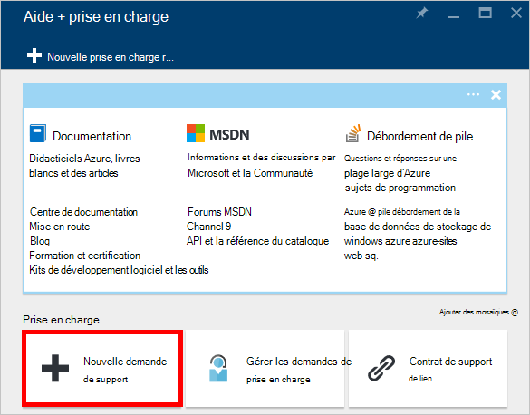

<properties
    pageTitle="Demande accrue de quotas du compte DocumentDB | Microsoft Azure"
    description="Découvrez comment demander un ajustement aux contingents de base de données DocumentDB comme stockage de documents et de débit par collection."
    services="documentdb"
    authors="AndrewHoh"
    manager="jhubbard"
    editor="monicar"
    documentationCenter=""/>

<tags
    ms.service="documentdb"
    ms.workload="data-services"
    ms.tgt_pltfrm="na"
    ms.devlang="na"
    ms.topic="article"
    ms.date="08/25/2016"
    ms.author="anhoh"/>

# Demande accrue des limites de compte DocumentDB

[Microsoft Azure DocumentDB](https://azure.microsoft.com/services/documentdb/) possède un ensemble de quotas par défaut qui peuvent être ajustées en contactant le support Azure.  Cet article montre comment demander une augmentation des quotas.

Après avoir lu cet article, vous serez en mesure de répondre aux questions suivantes :  

-   Les quotas de base de données DocumentDB peuvent être ajustés en contactant le support Azure ?
-   Comment puis-je demander un ajustement de quota du compte DocumentDB ?

##Compte les quotas de DocumentDB

Le tableau suivant décrit les quotas de DocumentDB. Les contingents qui ont un astérisque (*) peuvent être ajustés en contactant le support Azure :

[AZURE.INCLUDE [azure-documentdb-limits](../../includes/azure-documentdb-limits.md)]

##Demande un ajustement de quota
Les étapes suivantes indiquent comment demander un ajustement de quota.

1. Dans le [portail Azure](https://portal.azure.com), cliquez sur **Plus de Services**, puis cliquez sur **aide + prise en charge**.

    

2. De la lame **aide + prise en charge** , cliquez sur **nouvelle demande d’assistance**.

    

3. Dans la lame **nouvelle demande d’assistance** , cliquez sur **Notions de base**. Suivant, définissez **type de problème** pour le **Quota**, l' **abonnement** à votre abonnement qui héberge vos DocumentDB de compte, **type de Quota** à **DocumentDB**et le **plan de Support** pour la **Prise en charge de Quota - inclus**. Ensuite, cliquez sur **suivant**.

    

4. De la lame de **problème** , choisissez un niveau de gravité et incluent des informations sur votre augmentation des quotas dans le **Détail**. Cliquez sur **suivant**.

    

5. Enfin, renseignez vos informations de contact de la lame **d’informations de Contact** et cliquez sur **créer**.

Une fois le ticket de la prise en charge a été créé, vous devez recevoir le numéro de demande de support par courrier électronique.  Vous pouvez également afficher la demande de prise en charge en cliquant sur **demande de prise en charge de la gestion** de la lame **aide + prise en charge** .

##Étapes suivantes
- Pour en savoir plus sur DocumentDB, cliquez [ici](http://azure.com/docdb).
