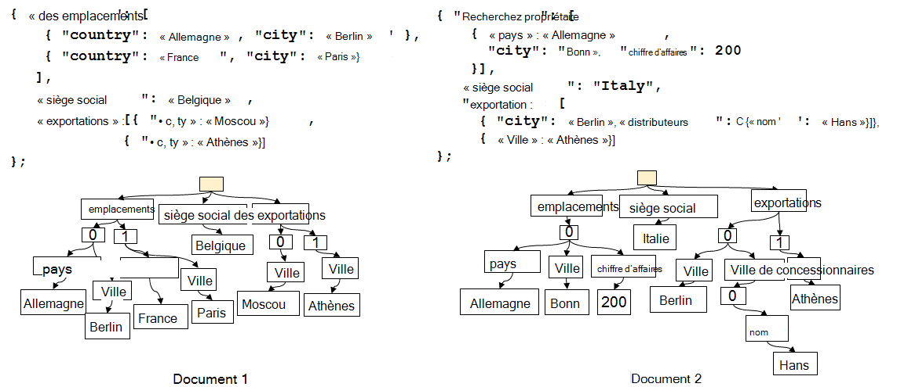
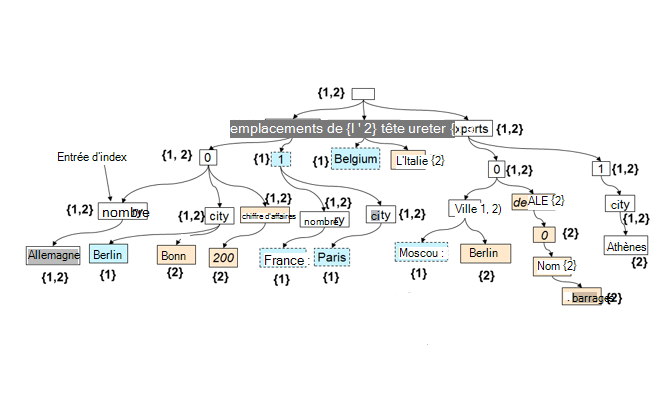

<properties 
    pageTitle="L’indexation automatique de DocumentDB | Microsoft Azure" 
    description="Obtenir des informations sur les travaux d’indexation automatiques dans Azure DocumentDB." 
    services="documentdb" 
    authors="arramac" 
    manager="jhubbard" 
    editor="mimig" 
    documentationCenter=""/>

<tags 
    ms.service="documentdb" 
    ms.workload="data-services" 
    ms.tgt_pltfrm="na" 
    ms.devlang="na" 
    ms.topic="article" 
    ms.date="10/27/2016" 
    ms.author="arramac"/>
    
# Automatique l’indexation dans Azure DocumentDB

Cet article est extrait du livre [« indépendant du schéma d’indexation avec Azure DocumentDB »](http://www.vldb.org/pvldb/vol8/p1668-shukla.pdf) , qui sera présenté à la [Conférence d’interne 41st sur très grandes bases de données](http://www.vldb.org/2015/) entre le 31 août - 4 septembre 2015, et est une introduction à la façon dont l’indexation fonctionne dans Azure DocumentDB. 

Après avoir lu cette, vous répondra aux questions suivantes :

- Comment DocumentDB déduit le schéma à partir d’un document JSON ?
- Comment DocumentDB créer un index dans les différents documents ?
- Comment DocumentDB effectue l’indexation automatiques à grande échelle ?

##Fonctionne de l’indexation de DocumentDB

[Microsoft Azure DocumentDB](https://azure.microsoft.com/services/documentdb/) est une vrai exempt de schéma de base de données orientée JSON. Il ne pas attendre ou exiger n’importe quel schéma ou les définitions d’index secondaire pour indexer les données à grande échelle. Cela vous permet de définir rapidement et d’itérer sur les modèles de données d’application à l’aide de DocumentDB. Lorsque vous ajoutez des documents à une collection, DocumentDB indexe automatiquement toutes les propriétés de document pour qu’ils soient disponibles pour la requête. L’indexation automatique vous permet de stocker des documents appartenant à des schémas complètement arbitraires sans vous soucier des schémas ou des index secondaires.

Dans le but d’éliminer les différences d’impédance entre la base de données et les modèles de programmation d’application, DocumentDB exploite la simplicité de JSON et l’absence d’une spécification de schéma. Il n’émet aucune hypothèse sur les documents et les documents dans une collection de DocumentDB pour faire varier dans le schéma, en plus des valeurs instance spécifique. Contrairement à d’autres bases de données de document, le moteur de base de données de DocumentDB fonctionne directement au niveau de la grammaire de JSON, restant agnostique de la notion d’un schéma de document et le flou de la bordure entre les valeurs de structure et d’instance de documents. Cette option, tour, permet à index automatiquement des documents sans nécessiter de schéma ou les index secondaires.

L’indexation dans DocumentDB exploite le fait que grammaire JSON permet d’être **représenté sous la forme d’arborescences**de documents. Pour un document JSON être représentée sous la forme d’une arborescence, un nœud fictif de racine doit être créé qui comporte le reste des nœuds dans le document sous réels. Chaque étiquette, y compris les index de tableau dans un document JSON devienne un nœud de l’arborescence. La figure ci-dessous illustre un exemple de document JSON et sa représentation sous forme d’arborescence correspondante.

>[AZURE.NOTE] Étant donné que JSON est auto-descriptif c'est-à-dire chaque document inclut le schéma (métadonnées) et les données, par exemple, `{"locationId": 5, "city": "Moscow"}` révèle qu’il existe deux propriétés `locationId` et `city`, et qu’ils ont une valeur de propriété numériques et de chaîne. DocumentDB est en mesure de déduire le schéma des documents et de les indexer lorsqu’ils sont insérés ou remplacés, sans que vous ayez jamais de définir des schémas ou des index secondaires.

**Documents JSON sous forme d’arborescences :**

Par exemple, dans l’exemple ci-dessus :

- La propriété JSON `{"headquarters": "Belgium"}` propriété dans l’exemple ci-dessus correspond au chemin d’accès/siège/Belgique.
- Le tableau JSON `{"exports": [{"city": “Moscow"}`, `{"city": Athens"}]}` correspond aux chemins `/exports/[]/city/Moscow` et `/exports/[]/city/Athens`.

Automatique (1), indexation chaque chemin d’accès dans une arborescence de document est indexé (à moins que le développeur a explicitement configuré la stratégie d’indexation pour exclure certains modèles de chemin d’accès). (2), chaque mise à jour d’un document à une collection de DocumentDB permet de mettre à jour de la structure de l’index (par exemple, ajout de causes ou la suppression de nœuds). Une des exigences principales de l’indexation automatique de documents est de s’assurer que le coût pour indexer et interroger un document avec structure profondément imbriqué, disons 10 niveaux, est le même que celui d’un document JSON plat comprenant des paires clé-valeur juste un niveau de profondeur. Par conséquent, une représentation sous forme de chemin d’accès normalisé est la Fondation sur laquelle reposent les deux sous-systèmes de requête et d’indexation automatiques.

Une implication importante de traiter à la fois les valeurs de schéma et d’instance uniformément en termes de chemins d’accès est que logiquement, comme les documents, un index des deux documents indiqué qui effectue un mappage entre les chemins d’accès et les ID de document contenant ce chemin d’accès peuvent également être représentées sous forme d’arborescence. DocumentDB utilise ce fait pour générer une arborescence d’index qui est créée à partir de l’union de tous les arbres représentant les documents individuels dans la collection. L’arborescence de l’index dans les collections de DocumentDB augmente dans le temps, comme l’ajout ou de la mise à jour à la collection de nouveaux documents.

**Index de DocumentDB sous forme d’arborescence :**

Bien qu’étant exempt de schéma, SQL et JavaScript de DocumentDB langages de requête fournissent des projections relationnelles et de filtres, de navigation hiérarchique entre les documents, les opérations spatiales et l’appel de FDU entièrement écrit en JavaScript. Exécution de requête de la DocumentDB est en mesure de prendre en charge ces requêtes dans la mesure où elle peut fonctionner directement sur cette arborescence d’index des données.

La stratégie d’indexation par défaut indexe toutes les propriétés de tous les documents automatiquement et fournit des requêtes cohérentes (c'est-à-dire l’index est mis à jour de façon synchrone avec l’écriture du document). Comment DocumentDB prend en charge les mises à jour cohérentes à l’arborescence de l’index à grande échelle ? DocumentDB utilise l’écriture optimisé, verrou libre et journal structuré des techniques de gestion des index. Cela signifie que DocumentDB peut prendre en charge un volume constant des écritures rapides tout en continuant d’adresser des requêtes cohérentes. 

DocumentDB indexation est conçu pour l’efficacité du stockage et de gérer l’architecture mutualisée. Pour le rapport coût/efficacité, la surcharge de stockage sur disque de l’index est faible et prévisible. Mises à jour de l’index sont également exécutés dans le budget des ressources du système affectée par DocumentDB collection.

##Étapes suivantes
- Télécharger [« indépendant du schéma d’indexation avec Azure DocumentDB »](http://www.vldb.org/pvldb/vol8/p1668-shukla.pdf), à présenter à la conférence 41st interne sur très grandes bases de données, le 31 août - 4 septembre 2015.
- [Requête avec DocumentDB SQL](documentdb-sql-query.md)
- En savoir plus sur la personnalisation de l’index DocumentDB [ici](documentdb-indexing-policies.md)
 
