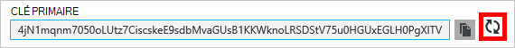

<properties
    pageTitle="Gérer un compte DocumentDB de via le portail Azure | Microsoft Azure"
    description="Apprenez à gérer votre compte DocumentDB de via le portail Azure. Trouver un guide sur l’utilisation du portail Azure à afficher, de copier, de supprimer et d’accéder aux comptes."
    keywords="Azure Portal, documentdb, azure, Microsoft azure"
    services="documentdb"
    documentationCenter=""
    authors="kirillg"
    manager="jhubbard"
    editor="cgronlun"/>

<tags
    ms.service="documentdb"
    ms.workload="data-services"
    ms.tgt_pltfrm="na"
    ms.devlang="na"
    ms.topic="article"
    ms.date="10/14/2016"
    ms.author="kirillg"/>

# Comment faire pour gérer un compte DocumentDB

Apprenez à définir la cohérence globale, travailler avec les clés et supprimer un compte de DocumentDB dans le portail Azure.

## Gérer les paramètres de la cohérence des DocumentDB

Sélection du niveau de cohérence droite dépend de la sémantique de votre application. Vous devez vous familiariser avec les niveaux de cohérence disponible dans DocumentDB par la lecture [à l’aide des niveaux de cohérence pour optimiser la disponibilité et les performances de DocumentDB] [consistency]. DocumentDB fournit des garanties de performances, à chaque niveau de cohérence disponible pour votre compte de base de données, la disponibilité et la cohérence. Configuration de votre compte de base de données avec un niveau de cohérence de fort nécessite que vos données sont restreints à une seule région Azure et non globalement disponible. D’autre part, les niveaux de cohérence relâchée - obsolescence délimitée, de session ou d’activer une éventuelle vous permet d’associer n’importe quel nombre de régions Azure avec votre compte de base de données. Les étapes suivantes vous montrent comment sélectionner le niveau de cohérence par défaut de votre compte de base de données. 

### Pour spécifier la cohérence par défaut pour un compte DocumentDB

1. Dans le [portail Azure](https://portal.azure.com/), accédez à votre compte de DocumentDB.
2. De la lame de compte, cliquez sur **par défaut de la cohérence**.
3. La lame de **Cohérence par défaut** , sélectionnez le nouveau niveau de cohérence et cliquez sur **Enregistrer**.
    ![Session de cohérence par défaut][5]

## Permet d’afficher, de copier et de régénérer les touches d’accès rapide
Lorsque vous créez un compte DocumentDB, le service génère deux clés d’accès principal qui peuvent être utilisés pour l’authentification lors de l’accès du compte DocumentDB. En fournissant deux touches d’accès rapide, DocumentDB vous permet de régénérer les clés sans interruption à votre compte de DocumentDB. 

Dans le [portail Azure](https://portal.azure.com/), accéder à la lame de **clés** à partir du menu de la ressource sur la lame **DocumentDB compte** permet d’afficher, de copier et de régénérer les touches d’accès rapide qui sont utilisés pour accéder à votre compte de DocumentDB.

> [AZURE.NOTE] La lame de **clés** inclut également les chaînes de connexion primaire et secondaire qui peuvent être utilisés pour se connecter à votre compte à partir de l' [Outil de Migration de données](documentdb-import-data.md).

Clés en lecture seule sont également disponibles sur cette blade. Les lectures et les requêtes sont des opérations en lecture seule, alors que crée, supprime, et remplace pas.

### Copier une touche d’accès rapide dans le portail Azure

Sur la lame de **clés** , cliquez sur le bouton **Copier** vers la droite de la touche que vous souhaitez copier.

### Régénérer les touches d’accès rapide

Vous devez modifier les touches d’accès à votre compte de DocumentDB régulièrement afin de renforcer la sécurité de vos connexions. Deux touches d’accès rapide sont affectées pour vous permettent de mettre à jour les connexions au compte DocumentDB à l’aide d’une touche d’accès rapide pendant que vous régénérez l’autre touche d’accès rapide.

> [AZURE.WARNING] Régénération des touches d’accès rapide affecte toutes les applications qui dépendent de la clé actuelle. Tous les clients qui utilisent la touche d’accès rapide pour accéder au compte de DocumentDB doivent être mis à jour pour utiliser la nouvelle clé.

Si vous avez des applications ou des services en nuage en utilisant le compte DocumentDB, vous perdrez les connexions si vous régénérez clés, sauf si vous avez restauré vos clés. Les étapes suivantes décrivent le processus de transfert de vos clés.

1. Mettre à jour la clé d’accès dans votre code d’application pour faire référence à la clé d’accès secondaire du compte DocumentDB.
2. Régénérer la clé d’accès principal pour votre compte de DocumentDB. Dans le [Portail Azure](https://portal.azure.com/), accédez à votre compte de DocumentDB.
3. De la lame **DocumentDB compte** , cliquez sur **les clés**.
4. Sur la lame de **clés** , cliquez sur le bouton Régénérer, puis cliquez sur **Ok** pour confirmer que vous souhaitez générer une nouvelle clé.
    

5. Une fois que vous avez vérifié que la nouvelle clé est disponible (environ 5 minutes après la régénération), mettre à jour la touche d’accès rapide dans le code de votre application pour faire référence à la nouvelle clé d’accès principal.
6. Régénérer la clé d’accès secondaire.

    

> [AZURE.NOTE] Elle peut prendre plusieurs minutes avant de pouvoir utiliser une nouvelle clé pour accéder à votre compte de DocumentDB.

## Obtenir la chaîne de connexion

Pour récupérer votre chaîne de connexion, effectuez les opérations suivantes : 

1. Dans le [portail Azure](https://portal.azure.com), accédez à votre compte de DocumentDB.
2. Dans le menu de la ressource, cliquez sur **les clés**.
3. Cliquez sur le bouton **Copier** la **Chaîne de connexion principal** ou **Secondaire de chaîne de connexion** . 

Si vous utilisez la chaîne de connexion dans l' [Outil de Migration de base de données DocumentDB](documentdb-import-data.md), ajoutez le nom de la base de données à la fin de la chaîne de connexion. `AccountEndpoint=< >;AccountKey=< >;Database=< >`.

## Supprimer un compte DocumentDB
Pour supprimer un compte de DocumentDB à partir du portail Azure que vous n’utilisez plus, utilisez la commande **Supprimer le compte** sur la lame **DocumentDB compte** .

1. Dans le [portail Azure](https://portal.azure.com/), accéder au compte de DocumentDB que vous souhaitez supprimer.
2. Sur la lame **DocumentDB compte** , cliquez sur **plus**, puis cliquez sur **Supprimer le compte**. Ou, double-cliquez sur le nom de la base de données et cliquez sur **Supprimer le compte**.
3. Sur la lame de confirmation qui en résulte, tapez le nom du compte DocumentDB pour confirmer que vous souhaitez supprimer le compte.
4. Cliquez sur le bouton **Supprimer** .

## Étapes suivantes

Découvrez comment [commencer à utiliser votre compte de DocumentDB](http://go.microsoft.com/fwlink/p/?LinkId=402364).

Pour en savoir plus sur DocumentDB, consultez la documentation de Azure DocumentDB sur [azure.com](http://go.microsoft.com/fwlink/?LinkID=402319&clcid=0x409).

<!--Image references-->
[1]: ./media/documentdb-manage-account/documentdb_add_region-1.png
[2]: ./media/documentdb-manage-account/documentdb_add_region-2.png
[3]: ./media/documentdb-manage-account/documentdb_change_write_region-1.png
[4]: ./media/documentdb-manage-account/documentdb_change_write_region-2.png
[5]: ./media/documentdb-manage-account/documentdb_change_consistency-1.png
[6]: ./media/documentdb-manage-account/chooseandsaveconsistency.png

<!--Reference style links - using these makes the source content way more readable than using inline links-->
[bcdr]: https://azure.microsoft.com/documentation/articles/best-practices-availability-paired-regions/
[consistency]: https://azure.microsoft.com/documentation/articles/documentdb-consistency-levels/
[azureregions]: https://azure.microsoft.com/en-us/regions/#services
[offers]: https://azure.microsoft.com/en-us/pricing/details/documentdb/
