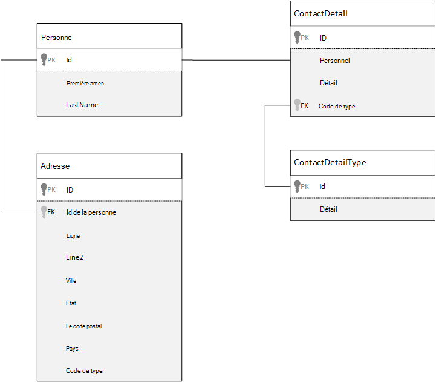
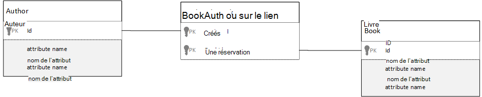

<properties 
    pageTitle="Modélisation des données dans Azure DocumentDB | Microsoft Azure" 
    description="Obtenir des informations sur la modélisation de données pour DocumentDB, une base de données de documents NoSQL." 
    keywords="modélisation des données"
    services="documentdb" 
    authors="kiratp" 
    manager="jhubbard" 
    editor="mimig1" 
    documentationCenter=""/>

<tags 
    ms.service="documentdb" 
    ms.workload="data-services" 
    ms.tgt_pltfrm="na" 
    ms.devlang="na" 
    ms.topic="article" 
    ms.date="08/05/2016" 
    ms.author="kipandya"/>

#Données de modélisation dans DocumentDB#
Alors que les bases de données exempt de schéma, comme DocumentDB d’Azure, rendent très facile d’adopter les modifications apportées à votre modèle de données vous devez toujours réfléchir sur vos données. 

Comment données va être stockés ? Comment votre application va récupérer et interroger des données ? Votre application épais de lecture ou écriture est lourd ? 

Après avoir lu cet article, vous serez en mesure de répondre aux questions suivantes :

- Comment dois je pense que sur un document dans une base de données de document ?
- Quelle est la modélisation des données et pourquoi dois-je y faire attention ? 
- Quelle est la modélisation des données dans une base de données de document différent pour une base de données relationnelle ?
- Comment faire pour express les relations entre les données dans une base de données non relationnelles ?
- Lorsque incorporer les données et lorsque lier à des données ?

##Incorporation de données##
Lorsque vous commencez à décrire les données dans une banque de documents, tels que DocumentDB, tenter de traiter vos entités en tant que **documents autonomes** , représenté dans JSON.

Avant de nous plonger trop plus loin, nous ramène quelques étapes et regardez comment nous pourrions modèle quelque chose dans une base de données relationnelle, un sujet que bon nombre d'entre nous sont déjà familiers. L’exemple suivant montre comment une personne peut être stockée dans une base de données relationnelle. 

Lorsque vous travaillez avec des bases de données relationnelles, nous avons appris dans les années à normaliser, normaliser, normaliser.

Généralement la normalisation de vos données consiste à prendre une entité, comme une personne et décomposer pour des éléments discrets de données. Dans l’exemple ci-dessus, une personne peut avoir plusieurs enregistrements de détail de contact ainsi que plusieurs enregistrements d’adresse. Nous même aller plus loin et de décomposer les détails du contact en extrayant plus courantes champs comme un type. Même adresse, chaque enregistrement ici a un type comme *Édition familiale* ou *Professionnel* 

Le guidage premise, lors de la normalisation des données est d' **éviter de stocker des données redondantes** sur chaque enregistrement et plutôt faire référence aux données. Dans cet exemple, pour lire une personne, avec tous leurs coordonnées et des adresses, vous devez utiliser des jointures de regrouper efficacement des vos données au moment de l’exécution.

    SELECT p.FirstName, p.LastName, a.City, cd.Detail
    FROM Person p
    JOIN ContactDetail cd ON cd.PersonId = p.Id
    JOIN ContactDetailType on cdt ON cdt.Id = cd.TypeId
    JOIN Address a ON a.PersonId = p.Id

Mise à jour d’une seule personne avec leurs coordonnées et leurs adresses nécessite des opérations d’écriture sur plusieurs tables individuelles. 

Maintenant examinons à présent comment nous serait modèle les mêmes données sous la forme d’une entité autonome dans une base de données du document.
        
    {
        "id": "1",
        "firstName": "Thomas",
        "lastName": "Andersen",
        "addresses": [
            {            
                "line1": "100 Some Street",
                "line2": "Unit 1",
                "city": "Seattle",
                "state": "WA",
                "zip": 98012
            }
        ],
        "contactDetails": [
            {"email: "thomas@andersen.com"},
            {"phone": "+1 555 555-5555", "extension": 5555}
        ] 
    }

À l’aide de l’approche ci-dessus, nous avons maintenant **dénormalisées** son enregistrement où nous avons **incorporé** toutes les informations relatives à cette personne, comme leurs coordonnées et des adresses dans à un seul document JSON.
En outre, étant donné que nous n’allons pas limités à un schéma fixe, nous avons la possibilité de faire les choses comme ayant des coordonnées des formes différentes entièrement. 

Récupération d’un enregistrement de personne complète à partir de la base de données est désormais une seule opération par rapport à une collection unique et d’un document unique de lecture. Mise à jour d’un enregistrement de personne, avec leurs coordonnées et leurs adresses, est également une opération d’écriture unique par rapport à un seul document.

Par la dénormalisation des données, votre application peut avoir besoin émettre moins de requêtes et de mises à jour pour effectuer les opérations courantes. 

###Et incorporation

En règle générale, utilisez des données modèles lorsque :

- Il existe **contient des** relations entre les entités.
- Il existe des relations de **un-à-plusieurs** entre les entités.
- Sont incorporé des données qui **changent rarement**.
- Il incorporé données ne sont pas croître **sans limite**.
- Il existe des données incorporées qui sont **intégré** aux données dans un document.

> [AZURE.NOTE] Généralement dénormalisé des modèles offrent les meilleures performances de **lecture** .

###Quand ne pas incorporer

Alors que la règle de base dans une base de données de document est à dénormaliser tout et incorporer toutes les données dans un seul document, cela peut conduire à certaines situations qui doivent être évitées.

Prendre cet extrait de JSON.

    {
        "id": "1",
        "name": "What's new in the coolest Cloud",
        "summary": "A blog post by someone real famous",
        "comments": [
            {"id": 1, "author": "anon", "comment": "something useful, I'm sure"},
            {"id": 2, "author": "bob", "comment": "wisdom from the interwebs"},
            …
            {"id": 100001, "author": "jane", "comment": "and on we go ..."},
            …
            {"id": 1000000001, "author": "angry", "comment": "blah angry blah angry"},
            …
            {"id": ∞ + 1, "author": "bored", "comment": "oh man, will this ever end?"},
        ]
    }

Il peut s’agir d’une entité de post avec commentaires incorporés aspect si nous étions modélisation un blog classique ou CMS, système. Le problème de cet exemple est que le tableau commentaires est **illimité**, c'est-à-dire qu’il n’existe aucun () limite concernant le nombre de commentaires d’une seule publication peut avoir. Cela devient un problème qu’augmente considérablement la taille du document.

> [AZURE.TIP] Documents de DocumentDB ont une taille maximale. Pour plus d’informations, reportez-vous à [DocumentDB limites](documentdb-limits.md).

À mesure que la taille du document augmente la possibilité de transmettre les données sur le câble ainsi que lecture et mise à jour du document, à grande échelle, seront affectées.

Dans ce cas, il serait préférable de considérer le modèle suivant.
        
    Post document:
    {
        "id": "1",
        "name": "What's new in the coolest Cloud",
        "summary": "A blog post by someone real famous",
        "recentComments": [
            {"id": 1, "author": "anon", "comment": "something useful, I'm sure"},
            {"id": 2, "author": "bob", "comment": "wisdom from the interwebs"},
            {"id": 3, "author": "jane", "comment": "....."}
        ]
    }

    Comment documents:
    {
        "postId": "1"
        "comments": [
            {"id": 4, "author": "anon", "comment": "more goodness"},
            {"id": 5, "author": "bob", "comment": "tails from the field"},
            ...
            {"id": 99, "author": "angry", "comment": "blah angry blah angry"}
        ]
    },
    {
        "postId": "1"
        "comments": [
            {"id": 100, "author": "anon", "comment": "yet more"},
            ...
            {"id": 199, "author": "bored", "comment": "will this ever end?"}
        ]
    }

Ce modèle présente les trois derniers commentaires incorporés dans le message lui-même, qui est un tableau avec une liste fixe lié à ce moment. Les autres commentaires sont regroupées en lots de 100 commentaires et stockées dans des documents séparés. La taille du lot a été choisie comme 100, car notre application fictive permet à l’utilisateur de charger 100 commentaires à la fois.  

Un autre cas où l’incorporation de données ne sont pas une bonne idée est lorsque les données sont souvent utilisées dans les documents et changent fréquemment. 

Prendre cet extrait de JSON.

    {
        "id": "1",
        "firstName": "Thomas",
        "lastName": "Andersen",
        "holdings": [
            {
                "numberHeld": 100,
                "stock": { "symbol": "zaza", "open": 1, "high": 2, "low": 0.5 }
            },
            {
                "numberHeld": 50,
                "stock": { "symbol": "xcxc", "open": 89, "high": 93.24, "low": 88.87 }
            }
        ]
    }

Cela pourrait représenter le portefeuille d’actions d’une personne. Nous avons choisi d’incorporer les informations de stock pour chaque document de portefeuille. Dans un environnement où les données liées changent fréquemment, comme une action de négociation des applications, l’incorporation des données qui changent fréquemment va signifie que vous sont constamment à jour chaque document portefeuille chaque fois qu’une action est échangée.

*Zaza* de stock peuvent être échangés à plusieurs centaines de fois en une seule journée et des milliers d’utilisateurs peuvent avoir *zaza* sur leur portefeuille. Avec un modèle de données comme ci-dessus, nous devons mettre à jour des milliers de documents de portefeuille autant de fois chaque jour conduisant à un système qui n’évoluent pas très bien. 

##Référence à des données##

Ainsi, l’incorporation de données fonctionne bien pour la plupart des cas, mais il est clair qu’il existe des scénarios lorsque provoque plus de problèmes qu’il convient de dénormalisation de vos données. Ainsi que nous faire maintenant ? 

Bases de données relationnelles ne sont pas le seul endroit où vous pouvez créer des relations entre les entités. Dans une base de données de document, vous pouvez avoir des informations dans un document qui en réalité est liée aux données dans d’autres documents. Maintenant, je suis préconisent pas pendant une minute même que nous construisons des systèmes qui seraient mieux à une base de données relationnelle dans DocumentDB, ou toute autre base de données de document, mais que des relations simples sont en bon état et qu’il peuvent être très utiles. 

Dans le JSON ci-dessous, nous avons choisi d’utiliser l’exemple d’un portefeuille d’actions à partir de versions antérieures, mais cette fois, nous faisons référence l’article de stock sur le portefeuille au lieu de l’incorporer. Ainsi, lorsque l’élément de stock change fréquemment au cours de la journée, le seul document qui doit être mise à jour est le seul document de stock. 

    Person document:
    {
        "id": "1",
        "firstName": "Thomas",
        "lastName": "Andersen",
        "holdings": [
            { "numberHeld":  100, "stockId": 1},
            { "numberHeld":  50, "stockId": 2}
        ]
    }
    
    Stock documents:
    {
        "id": "1",
        "symbol": "zaza",
        "open": 1,
        "high": 2,
        "low": 0.5,
        "vol": 11970000,
        "mkt-cap": 42000000,
        "pe": 5.89
    },
    {
        "id": "2",
        "symbol": "xcxc",
        "open": 89,
        "high": 93.24,
        "low": 88.87,
        "vol": 2970200,
        "mkt-cap": 1005000,
        "pe": 75.82
    }
    

Un inconvénient immédiat de cette approche est cependant de si votre application est nécessaire pour afficher les informations concernant chaque action est conservée lors de l’affichage du portefeuille d’une personne ; Dans ce cas, vous devrez effectuer des déplacements multiples à la base de données à charger les informations pour chaque document de stock. Ici, nous avons apporté une décision afin d’améliorer l’efficacité des opérations d’écriture, qui se produisent fréquemment tout au long de la journée, mais le compromis à son tour sur les opérations de lecture potentiellement ont moins d’impact sur les performances de ce système en particulier.

> [AZURE.NOTE] Normalisée des données modèles **peut exiger plusieurs allers-retours** au serveur.

### Qu’en est-il des clés étrangères ?
Car il n’existe actuellement aucun concept d’une contrainte, clé étrangère dans le cas contraire, toutes les relations entre documents dont vous disposez dans les documents sont en fait des « liaisons faibles » et ne seront pas vérifiées par la base de données elle-même. Si vous souhaitez vous assurer que les données de qu'un document fait référence existe réellement, vous devez effectuer cette opération dans votre application, soit à l’aide de déclencheurs côté serveur ou des procédures stockées sur DocumentDB.

###Lorsque, pour faire référence à
En règle générale, utilisez les données normalisées modélise lorsque :

- Qui représente les relations de **type un-à-plusieurs** .
- Qui représente les relations **plusieurs-à-plusieurs** .
- Concernant les données **changent fréquemment**.
- Données référencées peuvent être **illimitée**.

> [AZURE.NOTE] En général la normalisation offre de meilleures performances **d’écriture** .

###Où placer la relation ?
La croissance de la relation pour déterminer dans quel document pour stocker la référence.

Si nous considérons le JSON ci-dessous qui modélise les livres et les éditeurs.

    Publisher document:
    {
        "id": "mspress",
        "name": "Microsoft Press",
        "books": [ 1, 2, 3, ..., 100, ..., 1000]
    }

    Book documents:
    {"id": "1", "name": "DocumentDB 101" }
    {"id": "2", "name": "DocumentDB for RDBMS Users" }
    {"id": "3", "name": "Taking over the world one JSON doc at a time" }
    ...
    {"id": "100", "name": "Learn about Azure DocumentDB" }
    ...
    {"id": "1000", "name": "Deep Dive in to DocumentDB" }

Si le nombre de livres par éditeur est petit avec une croissance limitée, puis stocker la référence de livre à l’intérieur du document publisher peut être utile. Toutefois, si le nombre de livres par éditeur est illimité, ce modèle de données aboutirait à des tableaux mutables en pleine croissance, comme dans l’exemple de document publisher ci-dessus. 

Quelques éléments de commutation créerait un modèle qui représente toujours les mêmes données, mais évite désormais ces grandes collections mutables.

    Publisher document: 
    {
        "id": "mspress",
        "name": "Microsoft Press"
    }
    
    Book documents: 
    {"id": "1","name": "DocumentDB 101", "pub-id": "mspress"}
    {"id": "2","name": "DocumentDB for RDBMS Users", "pub-id": "mspress"}
    {"id": "3","name": "Taking over the world one JSON doc at a time"}
    ...
    {"id": "100","name": "Learn about Azure DocumentDB", "pub-id": "mspress"}
    ...
    {"id": "1000","name": "Deep Dive in to DocumentDB", "pub-id": "mspress"}

Dans l’exemple ci-dessus, nous avons supprimé de la collection illimitée sur le document de l’éditeur. Au lieu de cela nous n’en avons une référence à l’éditeur de chaque document du livre.

###Comment modéliser les relations n : n ?
Dans une base de données relationnelle, relations *n : n* sont souvent modélisées avec les tables de jointure, simplement joindre les enregistrements à partir d’autres tables. 

Vous pouvez être tenté de répliquer la même chose à l’aide de documents et de produire un modèle de données qui ressemble à ce qui suit.

    Author documents: 
    {"id": "a1", "name": "Thomas Andersen" }
    {"id": "a2", "name": "William Wakefield" }
    
    Book documents:
    {"id": "b1", "name": "DocumentDB 101" }
    {"id": "b2", "name": "DocumentDB for RDBMS Users" }
    {"id": "b3", "name": "Taking over the world one JSON doc at a time" }
    {"id": "b4", "name": "Learn about Azure DocumentDB" }
    {"id": "b5", "name": "Deep Dive in to DocumentDB" }
    
    Joining documents: 
    {"authorId": "a1", "bookId": "b1" }
    {"authorId": "a2", "bookId": "b1" }
    {"authorId": "a1", "bookId": "b2" }
    {"authorId": "a1", "bookId": "b3" }

Cette méthode fonctionne. Toutefois, chargement soit un auteur avec leurs livres ou le chargement d’un livre par son auteur, toujours nécessite au moins deux requêtes supplémentaires par rapport à la base de données. Une seule requête au document joint et puis d’une autre requête pour extraire le document à joindre. 

Si toutes les effectue cette table de jointure est collant les deux éléments de données, pourquoi ne pas supprimez-le complètement ?
Considérez les points suivants.

    Author documents:
    {"id": "a1", "name": "Thomas Andersen", "books": ["b1, "b2", "b3"]}
    {"id": "a2", "name": "William Wakefield", "books": ["b1", "b4"]}
    
    Book documents: 
    {"id": "b1", "name": "DocumentDB 101", "authors": ["a1", "a2"]}
    {"id": "b2", "name": "DocumentDB for RDBMS Users", "authors": ["a1"]}
    {"id": "b3", "name": "Learn about Azure DocumentDB", "authors": ["a1"]}
    {"id": "b4", "name": "Deep Dive in to DocumentDB", "authors": ["a2"]}

Maintenant, si j’avais un auteur, savoir immédiatement quels livres qu’ils ont écrits et inversement si j’avais un document comptable chargé doit savoir les ID du ou des auteurs. Cela enregistre cette requête intermédiaire à la table de jointure réduisant le nombre de serveurs de boucles votre application doit effectuer. 

##Modèles de données hybride##
Nous savons maintenant l’incorporation (ou la dénormalisation) et les données de références (ou la normalisation), ont chacun leurs avantages que représenterait et chacun avoir compromis, comme nous l’avons vu. 

Il ne doit toujours être soit, ou ne pas être effrayé de mélanger choses un peu. 

Basé sur des modèles d’utilisation spécifique de votre application et les charges de travail il peut y avoir des cas où la combinaison incorporé et données référencées sont logique et pourrait conduire à la logique de l’application plus simple avec moins de serveur allers-retours tout en conservant un bon niveau de performances.

Envisagez le JSON suivant. 

    Author documents: 
    {
        "id": "a1",
        "firstName": "Thomas",
        "lastName": "Andersen",     
        "countOfBooks": 3,
        "books": ["b1", "b2", "b3"],
        "images": [
            {"thumbnail": "http://....png"}
            {"profile": "http://....png"}
            {"large": "http://....png"}
        ]
    },
    {
        "id": "a2",
        "firstName": "William",
        "lastName": "Wakefield",
        "countOfBooks": 1,
        "books": ["b1"],
        "images": [
            {"thumbnail": "http://....png"}
        ]
    }
    
    Book documents:
    {
        "id": "b1",
        "name": "DocumentDB 101",
        "authors": [
            {"id": "a1", "name": "Thomas Andersen", "thumbnailUrl": "http://....png"},
            {"id": "a2", "name": "William Wakefield", "thumbnailUrl": "http://....png"}
        ]
    },
    {
        "id": "b2",
        "name": "DocumentDB for RDBMS Users",
        "authors": [
            {"id": "a1", "name": "Thomas Andersen", "thumbnailUrl": "http://....png"},
        ]
    }

Ici nous avons suivi (principalement) du modèle incorporé, où les données à partir d’autres entités sont incorporées dans le document de niveau supérieur, mais les autres données sont référencées. 

Si vous examinez le document du livre, nous pouvons voir quelques exemples intéressants de champs lorsque nous observons le tableau des auteurs. Il existe un champ *id* , qui est le champ que nous utilisons pour référer à un document d’auteur, une pratique standard dans un modèle normalisé, mais ensuite nous également des *nom* et *thumbnailUrl*. Nous pourrions avoir simplement bloqué avec *l’id* et gauche de l’application pour obtenir des informations supplémentaires, qu'il est nécessaire à partir du document d’auteur respectives à l’aide de la » liaison «, mais étant donné que notre application affiche le nom de l’auteur et une image miniature avec chaque livre, nous pouvons enregistrer un aller-retour vers le serveur par livre dans une liste par la dénormalisation **des** données de l’auteur.

Bien sûr, si le nom de l’auteur est modifié ou qu’ils souhaitaient mettre à jour leur photo, que nous aurions dû à une mise à jour chaque livre qu’ils publiée mais pour notre application, basée sur l’hypothèse que les auteurs ne changent pas leurs noms très souvent, il s’agit d’une décision de conception acceptables.  

Dans l’exemple **de calcul des agrégats** de valeurs est d’enregistrer le traitement coûteux sur une opération de lecture. Dans l’exemple, une partie des données incorporées dans le document d’auteur donnée est calculée au moment de l’exécution. Chaque fois qu’un nouveau livre est publié, cela provoque la création d’un document de livre **et** que le champ countOfBooks est défini sur une valeur calculée en fonction du nombre de documents d’un livre pour un auteur particulier. Cette optimisation est bonne lecture systèmes lourdes où nous pouvons vous permettre d’effectuer des calculs sur des écritures pour optimiser les lectures.

La possibilité d’avoir un modèle avec des champs pré calculés est possible parce que DocumentDB prend en charge les **transactions de plusieurs documents**. De nombreux magasins de NoSQL ne peut pas faire des transactions dans tous les documents et par conséquent préconisent des décisions de conception, tel que « toujours incorporer tout », en raison de cette limitation. Avec DocumentDB, vous pouvez utiliser les déclencheurs côté serveur ou des procédures stockées qui insèrent des livres et de mettre à jour les auteurs tout au sein d’une transaction ACID. Maintenant vous **n’avez** à incorporer tous les éléments dans un document juste pour être sûr que vos données restent cohérentes.

##Étapes suivantes

Les principaux points de cet article est de comprendre que la modélisation des données dans un environnement exempt de schéma sont tout aussi importantes que jamais. 

Comme il n’y a aucun moyen de représenter un élément de données sur un écran unique, il n’existe aucun moyen simple pour modéliser vos données. Vous avez besoin pour comprendre votre application et comment il produira, consommer et traiter les données. Ensuite, en appliquant des instructions présentées ici, vous pouvez définir sur la création d’un modèle qui répond aux besoins immédiats de votre application. Vos applications doivent être modifiés, vous pouvez exploiter la flexibilité d’un exempt de schéma de base de données à utiliser qui changent et évoluent facilement de votre modèle de données. 

Pour en savoir plus sur les DocumentDB d’Azure, reportez-vous à la page de la [documentation](https://azure.microsoft.com/documentation/services/documentdb/) du service. 

Pour obtenir des informations sur le réglage des index dans Azure DocumentDB, reportez-vous à l’article politique [d’indexation](documentdb-indexing-policies.md).

Comprendre comment éclater vos données sur plusieurs partitions, font référence aux [Données de partitionnement dans DocumentDB](documentdb-partition-data.md). 

Et enfin, pour obtenir des conseils sur la modélisation des données et ont pour applications de mutualisée, consultez [mise à l’échelle d’une Application partagée avec DocumentDB d’Azure](http://blogs.msdn.com/b/documentdb/archive/2014/12/03/scaling-a-multi-tenant-application-with-azure-documentdb.aspx).
 
