<properties 
    pageTitle="Utiliser MongoChef avec un compte DocumentDB avec prise en charge de protocole de MongoDB | Microsoft Azure" 
    description="Apprenez à utiliser MongoChef avec un compte DocumentDB avec prise en charge de protocole de MongoDB, désormais disponible pour l’aperçu." 
    keywords="mongochef"
    services="documentdb" 
    authors="AndrewHoh" 
    manager="jhubbard" 
    editor="" 
    documentationCenter=""/>

<tags 
    ms.service="documentdb" 
    ms.workload="data-services" 
    ms.tgt_pltfrm="na" 
    ms.devlang="na" 
    ms.topic="article" 
    ms.date="08/25/2016" 
    ms.author="anhoh"/>

# Utiliser MongoChef avec un compte DocumentDB avec prise en charge de protocole de MongoDB

Pour vous connecter à un compte Azure DocumentDB avec prise en charge de protocole de MongoDB à l’aide de MongoChef, vous devez :

- Téléchargez et installez [MongoChef](http://3t.io/mongochef)
- Votre compte de DocumentDB avec prise en charge du protocole d’informations de [chaîne de connexion](documentdb-connect-mongodb-account.md) de MongoDB

## Créer la connexion dans MongoChef  

Pour ajouter votre compte DocumentDB avec prise en charge de protocole de MongoDB dans le Gestionnaire de connexion MongoChef, effectuez les opérations suivantes.

1. Récupérer votre DocumentDB avec prise en charge du protocole MongoDB informations de connexion en suivant les instructions [ici](documentdb-connect-mongodb-account.md).

    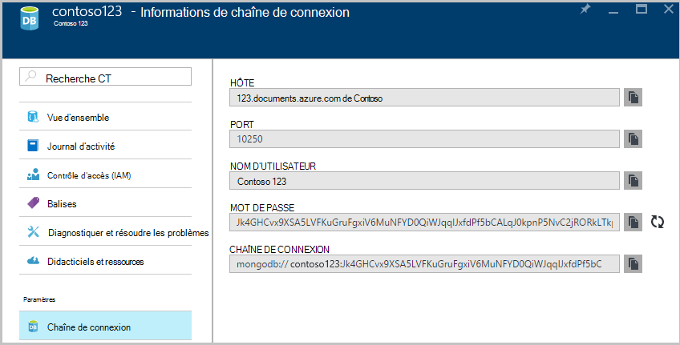

2. Cliquez sur **se connecter** pour ouvrir le Gestionnaire de connexion, puis cliquez sur **Nouvelle connexion**

    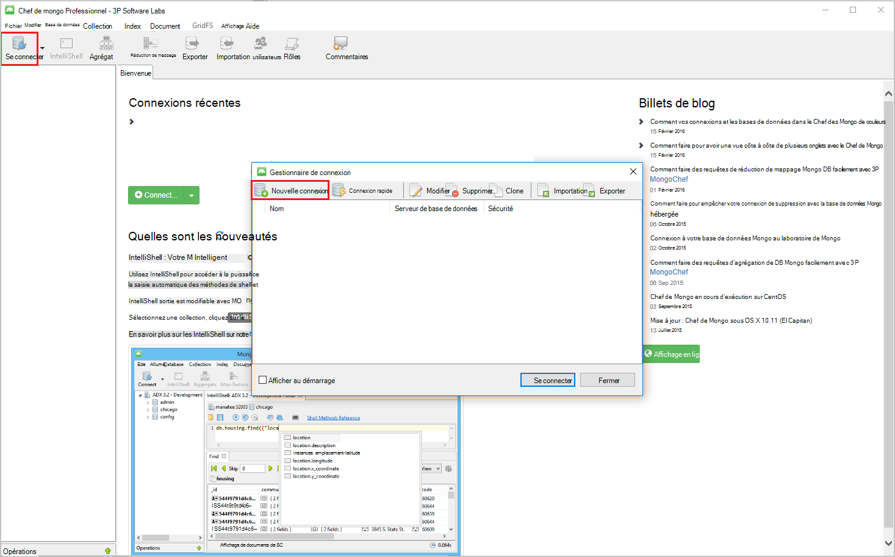
    
2. Dans la fenêtre **Nouvelle connexion** , sous l’onglet **serveur** , entrez l’hôte (FQDN) du compte DocumentDB avec prise en charge de protocoles pour MongoDB et le PORT.
    
    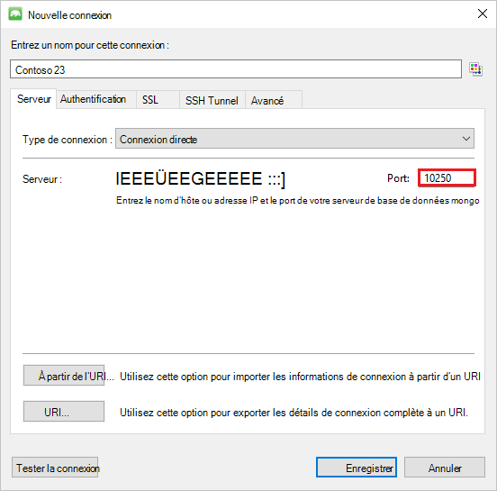

3. Dans la fenêtre **Nouvelle connexion** , sous l’onglet **authentification** , choisissez le Mode d’authentification **Standard (MONGODB-CR ou SCARM-SHA-1)** et entrez le nom d’utilisateur et le mot de passe.  Accepter la base de données d’authentification par défaut (admin) ou fournir votre propre valeur.

    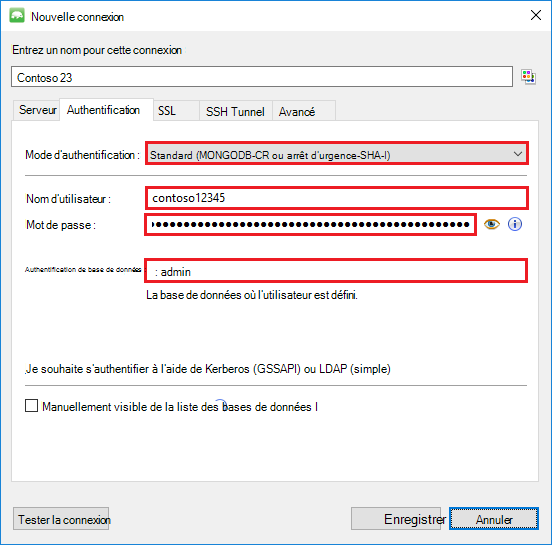

4. Dans la fenêtre **Nouvelle connexion** , sous l’onglet **SSL** , cochez la case à cocher **protocole d’utiliser SSL pour se connecter** et **accepter des certificats SSL auto-signés** option.

    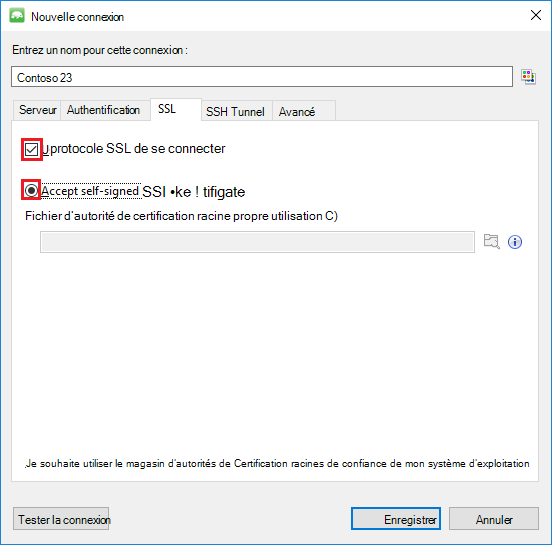

5. Cliquez sur le bouton **Tester la connexion** pour valider les informations de connexion et cliquez sur **OK** pour revenir à la fenêtre Nouvelle connexion, puis cliquez sur **Enregistrer**.

    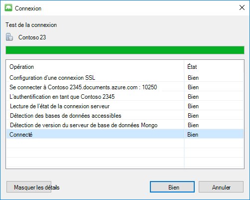

## Utilisez MongoChef pour créer une base de données et collection documents  

Pour créer une base de données, la collecte et à l’aide de MongoChef de documents, procédez comme suit.

1. Dans le **Gestionnaire de connexion**, sélectionnez la connexion, puis cliquez sur **se connecter**.

    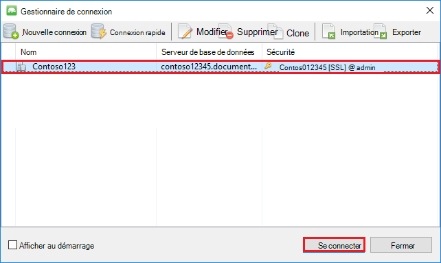

2. Cliquez avec le bouton droit sur l’hôte et choisissez **Ajouter une base de données**.  Fournissez un nom de base de données, puis cliquez sur **OK**.
    
    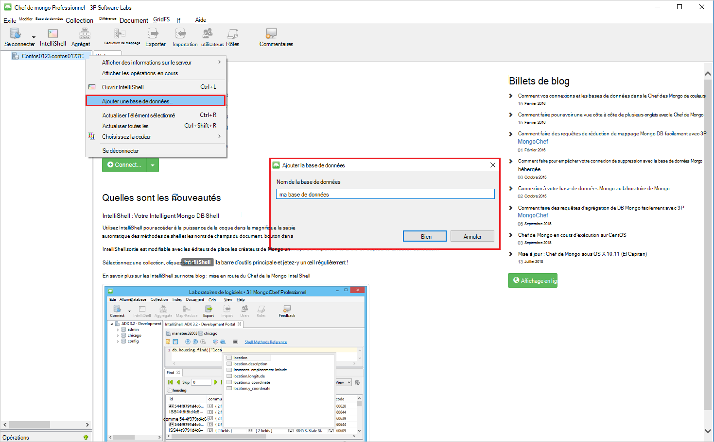

3. Cliquez avec le bouton droit sur la base de données et choisissez **Ajouter une Collection**.  Indiquez un nom de collection, cliquez sur **créer**.

    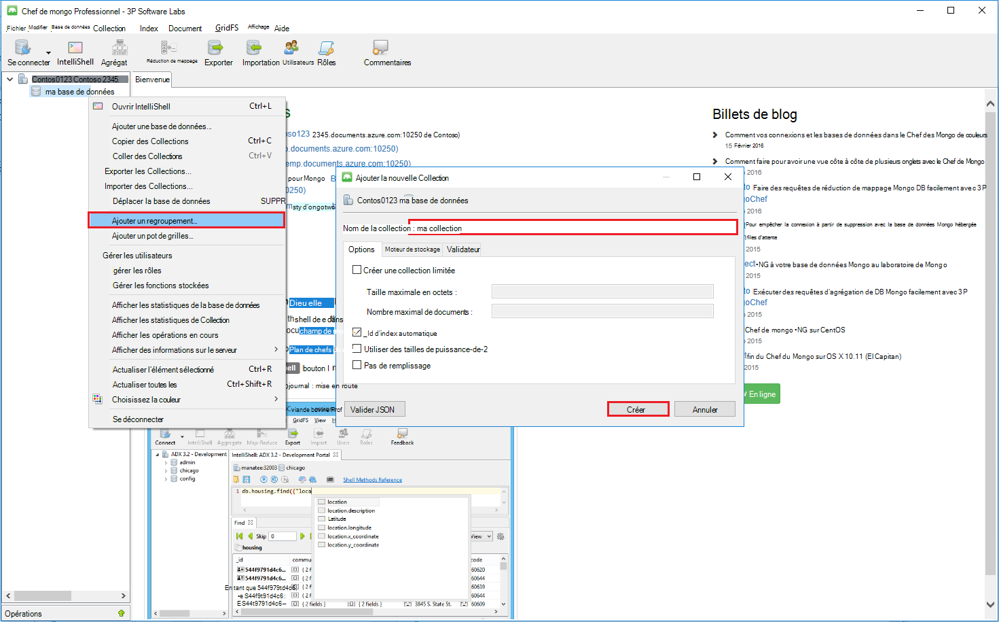

4. Cliquez sur l’élément de menu de la **Collection** , puis cliquez sur **Ajouter un Document**.

    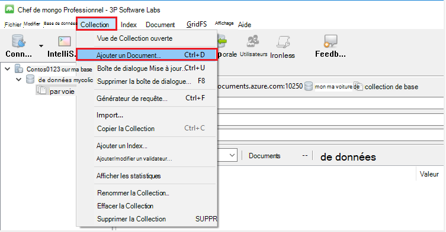

5. Dans la boîte de dialogue Ajouter un Document, collez les éléments suivants et puis cliquez sur **Ajouter un Document**.

        {
        "_id": "AndersenFamily",
        "lastName": "Andersen",
        "parents": [
            { "firstName": "Thomas" },
            { "firstName": "Mary Kay"}
        ],
        "children": [
        {
            "firstName": "Henriette Thaulow", "gender": "female", "grade": 5,
            "pets": [{ "givenName": "Fluffy" }]
        }
        ],
        "address": { "state": "WA", "county": "King", "city": "seattle" },
        "isRegistered": true
        }

    
6. Ajouter un autre document, cette fois avec le contenu suivant.

        {
        "_id": "WakefieldFamily",
        "parents": [
            { "familyName": "Wakefield", "givenName": "Robin" },
            { "familyName": "Miller", "givenName": "Ben" }
        ],
        "children": [
            {
                "familyName": "Merriam", 
                "givenName": "Jesse", 
                "gender": "female", "grade": 1,
                "pets": [
                    { "givenName": "Goofy" },
                    { "givenName": "Shadow" }
                ]
            },
            { 
                "familyName": "Miller", 
                "givenName": "Lisa", 
                "gender": "female", 
                "grade": 8 }
        ],
        "address": { "state": "NY", "county": "Manhattan", "city": "NY" },
        "isRegistered": false
        }

7. Exécuter une requête de l’exemple. Par exemple, rechercher des familles avec le nom « Andersen » et les parents et les champs d’état de retour.

    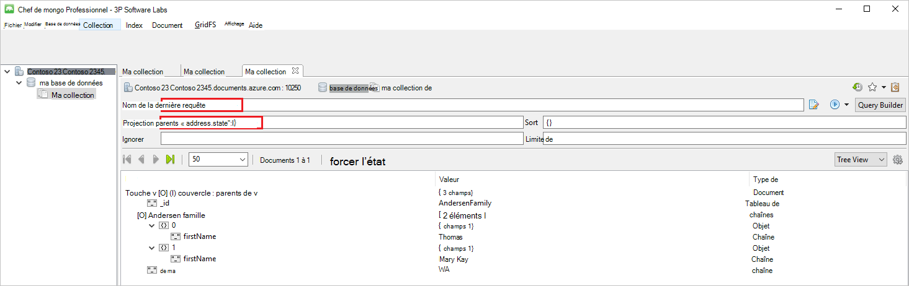
    

## Étapes suivantes

- Explorez le DocumentDB avec prise en charge de protocole de MongoDB [échantillons](documentdb-mongodb-samples.md).

 
