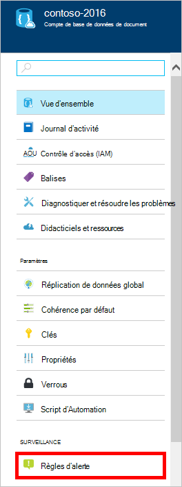

<properties
    pageTitle="Surveiller les demandes de DocumentDB et de stockage | Microsoft Azure"
    description="Apprenez à surveiller votre compte DocumentDB pour des mesures de performances, tels que les demandes et les erreurs de serveur et les mesures d’utilisation, telles que la consommation du stockage."
    services="documentdb"
    documentationCenter=""
    authors="mimig1"
    manager="jhubbard"
    editor="cgronlun"/>

<tags
    ms.service="documentdb"
    ms.workload="data-services"
    ms.tgt_pltfrm="na"
    ms.devlang="na"
    ms.topic="article"
    ms.date="10/17/2016"
    ms.author="mimig"/>

# Surveiller les demandes de DocumentDB, utilisation et stockage

Vous pouvez surveiller vos comptes DocumentDB d’Azure dans [Azure portal](https://portal.azure.com/). Pour chaque compte de DocumentDB, les deux mesures de performances, les demandes et les erreurs de serveur, des mesures d’utilisation, telles que la consommation du stockage, sont disponibles.

Les mesures peuvent être consultées sur la lame de compte ou sur la nouvelle blade de mesures.

## Affichage des mesures de performances sur la lame de mesures

1. Dans une nouvelle fenêtre, ouvrez le [portail Azure](https://portal.azure.com/)et cliquez sur **Plus de Services**, cliquez sur **DocumentDB (NoSQL)**, puis cliquez sur le nom du compte DocumentDB pour lequel vous souhaitez afficher les mesures de performances.
2. Dans le menu de la ressource, cliquez sur **mesures**.

La lame de mesures s’ouvre et vous pouvez sélectionner la collection à passer en revue. Vous pouvez passer en revue les mesures de disponibilité, de demandes, de débit et de stockage et les comparer aux SLA de le DocumentDB.

## Affichage des mesures de performances sur la lame de compte
1.  Dans une nouvelle fenêtre, ouvrez le [portail Azure](https://portal.azure.com/)et cliquez sur **Plus de Services**, cliquez sur **DocumentDB (NoSQL)**, puis cliquez sur le nom du compte DocumentDB pour lequel vous souhaitez afficher les mesures de performances.

2.  L’objectif de **l’analyse** affiche des mosaïques suivantes par défaut :
    *   Nombre total de demandes pour le jour actuel.
    *   Espace de stockage utilisé.

    Si votre table n’affiche **aucune donnée disponible** et que vous pensez qu’il existe des données dans votre base de données, consultez la section [dépannage](#troubleshooting) .

    

3.  En cliquant sur les **demandes** ou les **stockage** mosaïque ouvre une lame de **mesure** détaillée.
4.  La lame de **mesure** vous montre les détails sur les mesures que vous avez sélectionné.  Dans la partie supérieure de la lame est un graphique des requêtes affichées sous forme graphique toutes les heures, et ci-dessous qui est le tableau qui présente les valeurs d’agrégation pour les demandes accélérées et total.  La lame métrique indique également la liste des alertes qui ont été définis, filtré pour les mesures qui apparaissent sur la lame de mesure en cours (de cette façon, si vous disposez d’un nombre d’alertes, vous seulement verrez pertinentes celles présentées ici).   

    

## Personnaliser les vues de métriques de performances dans le portail

1.  Pour personnaliser les mesures qui s’affichent dans un graphique en particulier, cliquez sur le graphique pour l’ouvrir dans la lame de **mesure** , puis cliquez sur **Modifier le graphique**.  
    

2.  Sur la lame de **Modifier un graphique** , il existe options permettant de modifier les mesures qui s’affichent dans le graphique, ainsi que leur plage de temps.  
    

3.  Pour modifier les mesures affichées dans la partie, il suffit de sélectionner ou effacer les métriques de performances disponibles, puis cliquez sur **OK** au bas de la lame.  
4.  Pour modifier la plage de temps, choisissez une plage différente (par exemple, **personnalisé**), puis cliquez sur **OK** au bas de la lame.  

    

## Créer des graphiques de côte-à-côte dans le portail
Le portail Azure vous permet de créer des graphiques de métriques côte-à-côte.  

1.  Tout d’abord, avec le bouton droit sur le graphique que vous souhaitez copier et sélectionnez **Personnaliser**.

    

2.  Dans le menu pour copier la partie et puis cliquez sur **terminé la personnalisation**, cliquez sur **cloner** .

      

Vous pouvez maintenant traiter cette partie comme toute autre partie métrique, personnalisation de la plage de mesures et l’heure affichée dans la partie.  En procédant ainsi, vous pouvez voir deux différentes mesures graphique côte-à-côte en même temps.  
      

## Configurer des alertes dans le portail
1.  Dans le [portail Azure](https://portal.azure.com/), cliquez sur **Plus de Services**et cliquez sur **DocumentDB (NoSQL)**puis cliquez sur le nom du compte DocumentDB pour lequel vous souhaitez configurer des alertes de métriques de performances.

2.  Dans le menu de la ressource, cliquez sur **Règles d’alerte** pour ouvrir la lame de règles d’alerte.  
    

3.  De la lame de **règles d’alerte** , cliquez sur **Ajouter une alerte**.  
    

4.  Dans la lame **Ajouter une règle d’alerte** , spécifiez :
    *   Le nom de la règle d’alerte que vous configurez.
    *   Description de la nouvelle règle d’alerte.
    *   La mesure de la règle d’alerte.
    *   La condition de seuil et période qui déterminent quand l’alerte active. Par exemple, une erreur de serveur compter supérieure à 5 sur les 15 dernières minutes.
    *   Si l’administrateur du service et coadministrators sont envoyés par courrier électronique lorsque l’alerte se déclenche.
    *   Autres adresses e-mail pour les notifications d’alerte.  
    

## Contrôler par programmation les DocumentDB
Les mesures de niveau de compte disponibles sur le portail, telles que des demandes total et de l’utilisation du stockage compte, ne sont pas disponibles via la APIs de DocumentDB. Toutefois, vous pouvez récupérer des données d’utilisation au niveau de la collection à l’aide de la APIs DocumentDB. Pour récupérer des données au niveau de collection, effectuez le des opérations suivantes :

- Pour utiliser l’API REST, [exécuter une commande GET sur la collection](https://msdn.microsoft.com/library/mt489073.aspx). Les informations de quota et de l’utilisation de la collection sont retournées dans les en-têtes x-ms-ressource-quota et x-ms--utilisation des ressources dans la réponse.
- Pour utiliser le Kit de développement .NET, utilisez la méthode [DocumentClient.ReadDocumentCollectionAsync](https://msdn.microsoft.com/library/microsoft.azure.documents.client.documentclient.readdocumentcollectionasync.aspx) , qui retourne un [ResourceResponse](https://msdn.microsoft.com/library/dn799209.aspx) qui contient un certain nombre de propriétés d’utilisation telles que **CollectionSizeUsage**, **DatabaseUsage**, **DocumentUsage**et bien plus encore.

Pour accéder à des mesures supplémentaires, utilisez le [Moniteur de Azure SDK](https://www.nuget.org/packages/Microsoft.Azure.Insights). Définitions de mesure disponibles peuvent être récupérées en appelant :

    https://management.azure.com/subscriptions/{SubscriptionId}/resourceGroups/{ResourceGroup}/providers/Microsoft.DocumentDb/databaseAccounts/{DocumentDBAccountName}/metricDefinitions?api-version=2015-04-08

Requêtes pour récupérer des mesures individuelles utilisent le format suivant :

    https://management.azure.com/subscriptions/{SubecriptionId}/resourceGroups/{ResourceGroup}/providers/Microsoft.DocumentDb/databaseAccounts/{DocumentDBAccountName}/metrics?api-version=2015-04-08&$filter=%28name.value%20eq%20%27Total%20Requests%27%29%20and%20timeGrain%20eq%20duration%27PT5M%27%20and%20startTime%20eq%202016-06-03T03%3A26%3A00.0000000Z%20and%20endTime%20eq%202016-06-10T03%3A26%3A00.0000000Z

Pour plus d’informations, consultez [Extraction des métriques de ressources via l’API REST de moniteur Azure](https://blogs.msdn.microsoft.com/cloud_solution_architect/2016/02/23/retrieving-resource-metrics-via-the-azure-insights-api/). Notez que « Azure Inights » a été renommé « Moniteur Azure ».  Cette entrée de blog fait référence à l’ancien nom.

## Résolution des problèmes
Si votre contrôle mosaïques affichent le message de **données non disponibles** , et récemment effectué des demandes ou ajouté de données à la base de données, vous pouvez modifier la mosaïque pour refléter l’activité récente.

### Modifier une mosaïque pour actualiser les données en cours
1.  Pour personnaliser les mesures qui s’affichent dans une section spécifique, cliquez sur le graphique pour ouvrir la lame de **mesure** , puis cliquez sur **Modifier le graphique**.  
    

2.  Sur la lame de **Modifier un graphique** , dans la section de la **Plage de temps** , cliquez sur **après heure**, puis cliquez sur **OK**.  
    

3.  Actualisez maintenant votre mosaïque illustrant votre utilisation et des données en cours.  
    

## Étapes suivantes
Pour en savoir plus sur la capacité de DocumentDB, voir la [capacité de gérer les DocumentDB](documentdb-manage.md).
