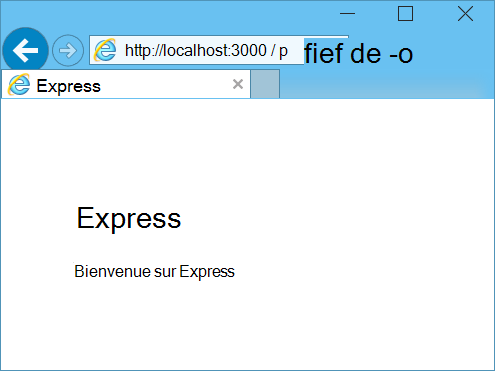

<properties 
    pageTitle="Découvrez Node.js - didacticiel de Node.js DocumentDB | Microsoft Azure" 
    description="Découvrez Node.js ! Didacticiel étudie comment Microsoft Azure DocumentDB permet de stocker et accéder aux données d’une application web de Node.js Express hébergée sur des sites Web d’Azure." 
    keywords="Développement d’applications, didacticiel de la base de données, découvrez node.js, node.js didacticiel, documentdb, azure, Microsoft azure"
    services="documentdb" 
    documentationCenter="nodejs" 
    authors="syamkmsft" 
    manager="jhubbard" 
    editor="cgronlun"/>

<tags 
    ms.service="documentdb" 
    ms.workload="data-services" 
    ms.tgt_pltfrm="na" 
    ms.devlang="nodejs" 
    ms.topic="hero-article" 
    ms.date="08/25/2016" 
    ms.author="syamk"/>

# Créer une application web de Node.js à l’aide de DocumentDB

> [AZURE.SELECTOR]
- [.NET](documentdb-dotnet-application.md)
- [Node.js](documentdb-nodejs-application.md)
- [Java](documentdb-java-application.md)
- [Python](documentdb-python-application.md)

Ce didacticiel Node.js vous montre comment utiliser le service de DocumentDB d’Azure pour stocker et accéder aux données à partir d’une application Node.js Express hébergée sur des sites Web d’Azure.

Nous vous recommandons de mise en route en regardant la vidéo suivante, où vous allez apprendre à configurer un compte de base de données Azure DocumentDB et de stocker des documents JSON dans votre application Node.js. 

> [AZURE.VIDEO azure-demo-getting-started-with-azure-documentdb-on-nodejs-in-linux]

Ensuite, revenir à ce didacticiel Node.js, où vous découvrirez les réponses aux questions suivantes :

- Comment fonctionnent avec DocumentDB à l’aide du module de npm documentdb ?
- Comment pour déployer l’application web pour les sites Web d’Azure ?

En suivant ce didacticiel, vous allez générer une application simple basée sur le web-gestion des tâches qui permet la création, la récupération et à la fin des tâches. Les tâches sont stockées en tant que documents JSON dans Azure DocumentDB.

N’avez le temps de terminer le didacticiel et que vous souhaitez simplement obtenir une solution complète ? Pas de problème, vous pouvez obtenir la solution complète à partir de [GitHub][].

## Conditions préalables

> [AZURE.TIP] Ce didacticiel Node.js suppose que vous avez une certaine expérience préalable à l’aide de Node.js et les sites Web d’Azure.

Avant de suivre les instructions fournies dans cet article, vous devez vous assurer que vous disposez des éléments suivants :

- Un compte Azure actif. Si vous n’avez pas un compte, vous pouvez créer un compte d’essai gratuit dans quelques minutes. Pour plus d’informations, reportez-vous à la section [D’essai Azure](https://azure.microsoft.com/pricing/free-trial/).
- [Node.js][] version v0.10.29 ou ultérieure.
- [Générateur de Express](http://www.expressjs.com/starter/generator.html) (vous pouvez l’installer via `npm install express-generator -g`)
- [Git][].

## Étape 1 : Créer un compte de base de données DocumentDB

Commençons par créer un compte DocumentDB. Si vous avez déjà un compte, vous pouvez passer à [étape 2 : créer une nouvelle application Node.js](#_Toc395783178).

[AZURE.INCLUDE [documentdb-create-dbaccount](../../includes/documentdb-create-dbaccount.md)]

[AZURE.INCLUDE [documentdb-keys](../../includes/documentdb-keys.md)]

## Étape 2 : Apprenez à créer une nouvelle application Node.js

Maintenant nous allons apprendre à créer un projet Node.js Hello World de base à l’aide de l’infrastructure [Express](http://expressjs.com/) .

1. Ouvrez votre terminal préféré.

2. Utiliser le Générateur rapide pour générer une nouvelle application appelée **todo**.

        express todo

3. Ouvrez votre nouveau répertoire **todo** et installer des dépendances.

        cd todo
        npm install

4. Exécuter votre nouvelle application.

        npm start

5. Vous pouvez afficher votre nouvelle application en naviguant dans votre navigateur pour [http://localhost:3000](http://localhost:3000).

    

## Étape 3 : Installation des modules complémentaires

Le fichier **package.json** est un des fichiers créés à la racine du projet. Ce fichier contient une liste des modules complémentaires qui sont nécessaires pour votre application Node.js. Ultérieurement, lorsque vous déployez cette application sur un sites Web d’Azure, ce fichier est utilisé pour déterminer quels modules doivent être installés sur Azure pour prendre en charge votre application. Nous devons toujours installer les deux packages plus pour ce didacticiel.

1. Dans le terminal, installez le module **asynchrone** via npm.

        npm install async --save

1. Installez le module **documentdb** de via npm. C’est le module où la magie DocumentDB se produit.

        npm install documentdb --save

3. Une vérification rapide du fichier **package.json** de l’application doit afficher les modules complémentaires. Ce fichier indiquera Azure des packages pour télécharger et installer lors de l’exécution de votre application. Il doit ressembler à l’exemple ci-dessous.

    

    Cette option indique à nœud (et Azure ultérieurement) que votre application dépend de ces modules complémentaires.

## Étape 4 : À l’aide du service de DocumentDB dans une application de nœud

Qui s’occupe de tout l’installation initiale et la configuration, maintenant nous allons get vers le bas à la raison pour laquelle nous sommes ici, et qui est d’écrire du code à l’aide de DocumentDB d’Azure.

### Créer le modèle

1. Dans le répertoire du projet, créez un nouveau répertoire nommé **modèles**.
2. Dans le répertoire de **modèles** , créez un nouveau fichier nommé **taskDao.js**. Ce fichier contient le modèle pour les tâches créées par notre application.
3. Dans le même répertoire de **modèles** , créez un nouveau fichier nommé **docdbUtils.js**. Ce fichier contiendra un code utile et réutilisable, que nous utiliserons dans notre application. 
4. Copiez le code suivant dans à **docdbUtils.js**

        var DocumentDBClient = require('documentdb').DocumentClient;
            
        var DocDBUtils = {
            getOrCreateDatabase: function (client, databaseId, callback) {
                var querySpec = {
                    query: 'SELECT * FROM root r WHERE r.id= @id',
                    parameters: [{
                        name: '@id',
                        value: databaseId
                    }]
                };
        
                client.queryDatabases(querySpec).toArray(function (err, results) {
                    if (err) {
                        callback(err);
        
                    } else {
                        if (results.length === 0) {
                            var databaseSpec = {
                                id: databaseId
                            };
        
                            client.createDatabase(databaseSpec, function (err, created) {
                                callback(null, created);
                            });
        
                        } else {
                            callback(null, results[0]);
                        }
                    }
                });
            },
        
            getOrCreateCollection: function (client, databaseLink, collectionId, callback) {
                var querySpec = {
                    query: 'SELECT * FROM root r WHERE r.id=@id',
                    parameters: [{
                        name: '@id',
                        value: collectionId
                    }]
                };             
                
                client.queryCollections(databaseLink, querySpec).toArray(function (err, results) {
                    if (err) {
                        callback(err);
        
                    } else {        
                        if (results.length === 0) {
                            var collectionSpec = {
                                id: collectionId
                            };
                            
                            client.createCollection(databaseLink, collectionSpec, function (err, created) {
                                callback(null, created);
                            });
        
                        } else {
                            callback(null, results[0]);
                        }
                    }
                });
            }
        };
                
        module.exports = DocDBUtils;

    > [AZURE.TIP] createCollection prend un paramètre facultatif requestOptions qui peut être utilisé pour spécifier le Type d’offre pour la Collection. Si aucune valeur de requestOptions.offerType n’est fourni ensuite la Collection sera créée à l’aide du proposer le Type par défaut.
    >
    > Pour plus d’informations sur les Types de proposer des DocumentDB reportez-vous à [des niveaux de Performance dans DocumentDB](documentdb-performance-levels.md) 
        
3. Enregistrez et fermez le fichier **docdbUtils.js** .

4. Au début du fichier **taskDao.js** , ajoutez le code suivant pour faire référence à la **DocumentDBClient** et l' **docdbUtils.js** , que nous avons créés ci-dessus :

        var DocumentDBClient = require('documentdb').DocumentClient;
        var docdbUtils = require('./docdbUtils');

4. Ensuite, vous ajouterez du code pour définir et exporter l’objet de la tâche. Il est responsable de l’initialisation de notre objet de la tâche et la configuration de la base de données et la Collection de documents, nous utiliserons.

        function TaskDao(documentDBClient, databaseId, collectionId) {
          this.client = documentDBClient;
          this.databaseId = databaseId;
          this.collectionId = collectionId;
        
          this.database = null;
          this.collection = null;
        }
        
        module.exports = TaskDao;

5. Ensuite, ajoutez le code suivant pour définir d’autres méthodes sur l’objet de la tâche, qui permettent des interactions avec les données stockées dans DocumentDB.

        TaskDao.prototype = {
            init: function (callback) {
                var self = this;
        
                docdbUtils.getOrCreateDatabase(self.client, self.databaseId, function (err, db) {
                    if (err) {
                        callback(err);
                    } else {
                        self.database = db;
                        docdbUtils.getOrCreateCollection(self.client, self.database._self, self.collectionId, function (err, coll) {
                            if (err) {
                                callback(err);
        
                            } else {
                                self.collection = coll;
                            }
                        });
                    }
                });
            },
        
            find: function (querySpec, callback) {
                var self = this;
        
                self.client.queryDocuments(self.collection._self, querySpec).toArray(function (err, results) {
                    if (err) {
                        callback(err);
        
                    } else {
                        callback(null, results);
                    }
                });
            },
        
            addItem: function (item, callback) {
                var self = this;
        
                item.date = Date.now();
                item.completed = false;
        
                self.client.createDocument(self.collection._self, item, function (err, doc) {
                    if (err) {
                        callback(err);
        
                    } else {
                        callback(null, doc);
                    }
                });
            },
        
            updateItem: function (itemId, callback) {
                var self = this;
        
                self.getItem(itemId, function (err, doc) {
                    if (err) {
                        callback(err);
        
                    } else {
                        doc.completed = true;
        
                        self.client.replaceDocument(doc._self, doc, function (err, replaced) {
                            if (err) {
                                callback(err);
        
                            } else {
                                callback(null, replaced);
                            }
                        });
                    }
                });
            },
        
            getItem: function (itemId, callback) {
                var self = this;
        
                var querySpec = {
                    query: 'SELECT * FROM root r WHERE r.id = @id',
                    parameters: [{
                        name: '@id',
                        value: itemId
                    }]
                };
        
                self.client.queryDocuments(self.collection._self, querySpec).toArray(function (err, results) {
                    if (err) {
                        callback(err);
        
                    } else {
                        callback(null, results[0]);
                    }
                });
            }
        };

6. Enregistrez et fermez le fichier **taskDao.js** . 

### Création du contrôleur

1. Dans le répertoire **d’itinéraires** de votre projet, créez un nouveau fichier nommé **tasklist.js**. 
2. Ajoutez le code suivant à **tasklist.js**. Il charge les modules DocumentDBClient et asynchrone, qui sont utilisés par **tasklist.js**. Cela également défini la fonction de **liste des tâches** , qui est passée à une instance de l’objet de **tâche** que nous avons défini plus haut :

        var DocumentDBClient = require('documentdb').DocumentClient;
        var async = require('async');
        
        function TaskList(taskDao) {
          this.taskDao = taskDao;
        }
        
        module.exports = TaskList;

3. Continuez à ajouter au fichier **tasklist.js** en ajoutant les méthodes utilisées pour **showTasks, addTask**et **completeTasks**:
        
        TaskList.prototype = {
            showTasks: function (req, res) {
                var self = this;
        
                var querySpec = {
                    query: 'SELECT * FROM root r WHERE r.completed=@completed',
                    parameters: [{
                        name: '@completed',
                        value: false
                    }]
                };
        
                self.taskDao.find(querySpec, function (err, items) {
                    if (err) {
                        throw (err);
                    }
        
                    res.render('index', {
                        title: 'My ToDo List ',
                        tasks: items
                    });
                });
            },
        
            addTask: function (req, res) {
                var self = this;
                var item = req.body;
        
                self.taskDao.addItem(item, function (err) {
                    if (err) {
                        throw (err);
                    }
        
                    res.redirect('/');
                });
            },
        
            completeTask: function (req, res) {
                var self = this;
                var completedTasks = Object.keys(req.body);
        
                async.forEach(completedTasks, function taskIterator(completedTask, callback) {
                    self.taskDao.updateItem(completedTask, function (err) {
                        if (err) {
                            callback(err);
                        } else {
                            callback(null);
                        }
                    });
                }, function goHome(err) {
                    if (err) {
                        throw err;
                    } else {
                        res.redirect('/');
                    }
                });
            }
        };

4. Enregistrez et fermez le fichier **tasklist.js** .
 
### Ajouter config.js

1. Dans le répertoire de votre projet, créez un nouveau fichier nommé **config.js**.
2. Ajoutez le code suivant **config.js**. Définit les paramètres de configuration et les valeurs nécessaires pour notre application.

        var config = {}
        
        config.host = process.env.HOST || "[the URI value from the DocumentDB Keys blade on http://portal.azure.com]";
        config.authKey = process.env.AUTH_KEY || "[the PRIMARY KEY value from the DocumentDB Keys blade on http://portal.azure.com]";
        config.databaseId = "ToDoList";
        config.collectionId = "Items";
        
        module.exports = config;

3. Dans le fichier **config.js** , mettre à jour les valeurs d’hôte et de AUTH_KEY en utilisant les valeurs contenues dans la lame de clés de votre compte de DocumentDB sur le [Portail de Microsoft Azure](https://portal.azure.com):

4. Enregistrez et fermez le fichier **config.js** .
 
### Modifier app.js

1. Dans le répertoire du projet, ouvrez le fichier **app.js** . Ce fichier a été créé précédemment lors de la création de l’application de web Express.
2. Ajoutez le code suivant en haut de la **app.js**
    
        var DocumentDBClient = require('documentdb').DocumentClient;
        var config = require('./config');
        var TaskList = require('./routes/tasklist');
        var TaskDao = require('./models/taskDao');

3. Ce code définit le fichier de configuration à utiliser et continue de lire les valeurs de certaines variables que nous utiliserons dès ce fichier dans.
4. Remplacez les deux lignes suivantes dans le fichier de **app.js** :

        app.use('/', routes);
        app.use('/users', users); 

      avec l’extrait de code suivant :

        var docDbClient = new DocumentDBClient(config.host, {
            masterKey: config.authKey
        });
        var taskDao = new TaskDao(docDbClient, config.databaseId, config.collectionId);
        var taskList = new TaskList(taskDao);
        taskDao.init();
        
        app.get('/', taskList.showTasks.bind(taskList));
        app.post('/addtask', taskList.addTask.bind(taskList));
        app.post('/completetask', taskList.completeTask.bind(taskList));
        app.set('view engine', 'jade');

6. Ces lignes définissent une nouvelle instance de l’objet de notre **TaskDao** , avec une nouvelle connexion à DocumentDB (en utilisant les valeurs lues à partir de l' **config.js**), initialiser l’objet de la tâche et puis de lier les actions de formulaire aux méthodes sur notre contrôleur **TaskList** . 

7. Enfin, enregistrez et fermez le fichier **app.js** , nous avons pratiquement terminé.
 
## Étape 5 : Créer une interface utilisateur

Maintenant portons notre attention sur la création de l’interface utilisateur et en fait l’utilisateur peut interagir avec notre application. L’application Express créés utilise **Jade** comme le moteur d’affichage. Pour plus d’informations sur Jade reportez-vous à [http://jade-lang.com/](http://jade-lang.com/).

1. Le fichier **layout.jade** dans le répertoire **views** est utilisé en tant que modèle global pour les autres fichiers **.jade** . Dans cette étape, vous allez modifier pour utiliser [Twitter des données d’amorçage](https://github.com/twbs/bootstrap), qui est un jeu d’outils qui permet de concevoir un site Web de qualité bon. 
2. Ouvrir le fichier **layout.jade** situé dans le dossier **vues** et remplacez le contenu par le suivant :
    
        doctype html
        html
          head
            title= title
            link(rel='stylesheet', href='//ajax.aspnetcdn.com/ajax/bootstrap/3.3.2/css/bootstrap.min.css')
            link(rel='stylesheet', href='/stylesheets/style.css')
          body
            nav.navbar.navbar-inverse.navbar-fixed-top
              div.navbar-header
                a.navbar-brand(href='#') My Tasks
            block content
            script(src='//ajax.aspnetcdn.com/ajax/jQuery/jquery-1.11.2.min.js')
            script(src='//ajax.aspnetcdn.com/ajax/bootstrap/3.3.2/bootstrap.min.js')

    Cela indique au moteur de **Jade** à restituer du code HTML de notre application et crée un **bloc** appelé **contenu** où nous pouvons indiquer la disposition de nos pages de contenu.
    Enregistrez et fermez ce fichier **layout.jade** .

4. Maintenant, ouvrez le fichier **index.jade** , et la vue qui sera utilisé par votre application et remplace le contenu du fichier par le texte suivant :

        extends layout
        
        block content
          h1 #{title}
          br
        
          form(action="/completetask", method="post")
            table.table.table-striped.table-bordered
              tr
                td Name
                td Category
                td Date
                td Complete
              if (typeof tasks === "undefined")
                tr
                  td
              else
                each task in tasks
                  tr
                    td #{task.name}
                    td #{task.category}
                    - var date  = new Date(task.date);
                    - var day   = date.getDate();
                    - var month = date.getMonth() + 1;
                    - var year  = date.getFullYear();
                    td #{month + "/" + day + "/" + year}
                    td
                      input(type="checkbox", name="#{task.id}", value="#{!task.completed}", checked=task.completed)
            button.btn(type="submit") Update tasks
          hr
          form.well(action="/addtask", method="post")
            label Item Name:
            input(name="name", type="textbox")
            label Item Category:
            input(name="category", type="textbox")
            br
            button.btn(type="submit") Add item

    Cela étend la disposition et fournit du contenu à l’espace réservé de **contenu** que nous l’avons vu précédemment dans le fichier **layout.jade** .
    
    Dans cette présentation, nous avons créé deux formulaires HTML. 
    Le premier formulaire contient une table de données et un bouton qui nous permet de mettre à jour des éléments en effectuant une validation à la méthode **/completetask** de notre contrôleur.
    Le second formulaire contient deux champs d’entrée et un bouton qui permet de créer un nouvel élément de comptabilisation dans la méthode **/addtask** de notre contrôleur.
    
    Il doit s’agir de tout ce que nous avons besoin pour notre application de fonctionner.

5. Ouvrez le fichier **style.CSS que** dans le répertoire de **public\stylesheets** et remplacez le code par le texte suivant :

        body {
          padding: 50px;
          font: 14px "Lucida Grande", Helvetica, Arial, sans-serif;
        }
        a {
          color: #00B7FF;
        }
        .well label {
          display: block;
        }
        .well input {
          margin-bottom: 5px;
        }
        .btn {
          margin-top: 5px;
          border: outset 1px #C8C8C8;
        }

    Enregistrez et fermez ce fichier **style.css** .

## Étape 6 : Exécuter votre application localement

1. Pour tester l’application sur votre ordinateur local, exécutez `npm start` dans un terminal pour démarrer votre application, lancez un navigateur avec une page qui ressemble à l’illustration ci-dessous :

    

2. Les champs fournis pour l’article, nom de l’élément et la catégorie permet d’entrer des informations, puis cliquez sur **Ajouter un élément**.

3. La page doit mettre à jour pour afficher le nouvel élément dans la liste ToDo.

    

4. Pour effectuer une tâche, simplement cocher la case dans la colonne, puis cliquez sur **mettre à jour les tâches**.

## Étape 7 : Déployer votre projet de développement d’application à des sites Web d’Azure

1. Si vous ne l’avez pas déjà, activer un référentiel git pour votre site Web d’Azure. Vous trouverez des instructions sur la façon de faire cela dans la rubrique [Déploiement Local de Git au Service d’application Azure](../app-service-web/app-service-deploy-local-git.md) .

2. Ajoutez votre site Web d’Azure comme un git à distance.

        git remote add azure https://username@your-azure-website.scm.azurewebsites.net:443/your-azure-website.git

3. Déployer en poussant vers la base distante.

        git push azure master

4. En quelques secondes, git va terminer la publication de votre application web et lancer un navigateur où vous pouvez voir votre travail pratique exécute dans Azure !

## Étapes suivantes

Félicitations ! Vous avez seulement créé votre premier Node.js Express Application Web à l’aide de DocumentDB d’Azure et publiée sur les sites Web d’Azure.

Le code source de l’application de référence complète peut être téléchargé à partir de [GitHub][].

Pour plus d’informations, consultez le [Centre pour développeurs Node.js](https://azure.microsoft.com/develop/nodejs/).

[Node.js]: http://nodejs.org/
[GIT]: http://git-scm.com/
[Github]: https://github.com/Azure-Samples/documentdb-node-todo-app
 
