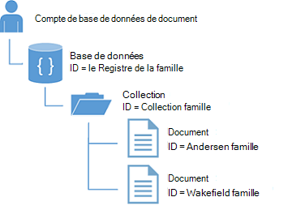
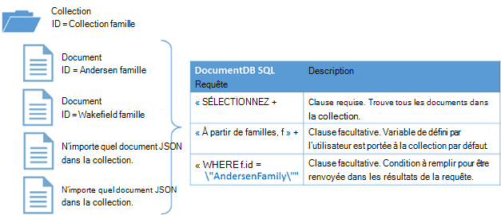

<properties
  pageTitle="Didacticiel de NoSQL Node.js pour DocumentDB | Microsoft Azure"
  description="Un didacticiel de NoSQL Node.js qui crée une application console et la base de données de nœud à l’aide du SDK Node.js DocumentDB. DocumentDB est une base de données NoSQL JSON."
    keywords="Node.js, didacticiel, base de données de nœud"
  services="documentdb"
  documentationCenter="node.js"
  authors="AndrewHoh"
  manager="jhubbard"
  editor="monicar"/>

<tags
  ms.service="documentdb"
  ms.workload="data-services"
  ms.tgt_pltfrm="na"
  ms.devlang="node"
  ms.topic="hero-article"
  ms.date="08/11/2016"
  ms.author="anhoh"/>

# <a name="nosql-nodejs-tutorial-documentdb-nodejs-console-application"></a>Didacticiel de NoSQL Node.js : application de console DocumentDB Node.js  

> [AZURE.SELECTOR]
- [.NET](documentdb-get-started.md)
- [Node.js](documentdb-nodejs-get-started.md)

Bienvenue dans le didacticiel Node.js pour le Kit de développement logiciel Node.js Azure DocumentDB ! À la fin de ce didacticiel, vous avez une application console qui crée et les requêtes de ressources DocumentDB, y compris une base de données de nœud.

Nous aborderons :

- Création et connexion à un compte DocumentDB
- Configuration de votre application.
- Création d’une base de données de nœud
- Création d’une collection
- Création de documents JSON
- Interrogation de la collection
- Remplacement d’un document
- Suppression d’un document
- Suppression de la base de données de nœud

Vous n’avez à temps ? Ne vous inquiétez pas ! La solution complète est disponible sur [GitHub](https://github.com/Azure-Samples/documentdb-node-getting-started). Pour obtenir des instructions rapides, consultez [obtenir une solution complète](#GetSolution) .

Une fois que vous avez terminé le didacticiel Node.js, utilisez les boutons de vote en haut et en bas de cette page nous donner votre avis. Si vous souhaitez que nous vous contacter directement, n’hésitez pas à inclure votre adresse de courriel dans vos commentaires.

Désormais c’est parti !

## <a name="prerequisites-for-the-nodejs-tutorial"></a>Conditions requises pour le didacticiel Node.js

Vérifiez que vous disposez des éléments suivants :

- Un compte Azure actif. Si vous n’en avez pas, vous pouvez vous inscrire à une [Version d’évaluation gratuite de Azure](https://azure.microsoft.com/pricing/free-trial/).
- [Node.js](https://nodejs.org/) version v0.10.29 ou ultérieure.

## <a name="step-1-create-a-documentdb-account"></a>Étape 1 : Créer un compte DocumentDB

Nous allons créer un compte DocumentDB. Si vous avez déjà un compte que vous souhaitez utiliser, vous pouvez passer à [l’installation de votre application Node.js](#SetupNode).

[AZURE.INCLUDE [documentdb-create-dbaccount](../../includes/documentdb-create-dbaccount.md)]

## <a id="SetupNode"></a>Étape 2 : Configurer votre application de Node.js

1. Ouvrez votre terminal préféré.
2. Recherchez le dossier ou le répertoire dans lequel vous souhaitez enregistrer votre application Node.js.
3. Créer deux fichiers JavaScript vides avec les commandes suivantes :
  - Windows :
      * ```fsutil file createnew app.js 0```
        * ```fsutil file createnew config.js 0```
  - / X : système d’exploitation Linux
      * ```touch app.js```
        * ```touch config.js```
4. Installez le module documentdb de via npm. Utilisez la commande suivante :
    * ```npm install documentdb --save```

Très bien ! Maintenant que vous avez terminé la configuration, commençons à écrire du code.

## <a id="Config"></a>Étape 3 : Définir les configurations de votre application

Ouvrir ```config.js``` dans un éditeur de texte.

Ensuite, copier et coller l’extrait de code ci-dessous et définir les propriétés ```config.endpoint``` et ```config.primaryKey``` votre uri de point de terminaison de DocumentDB et de la clé primaire. Vous trouverez ces deux configurations dans le [Portail Azure](https://portal.azure.com).

![Didacticiel Node.js - capture d’écran du portail Azure, affichant un compte DocumentDB, avec les valeurs d’URI, clé primaire et clé secondaire apparaît en surbrillance sur la lame de clés - base de données de nœud, le bouton touches apparaît en surbrillance sur la lame de compte DocumentDB et le concentrateur actif en surbrillance][keys]

    // ADD THIS PART TO YOUR CODE
    var config = {}

    config.endpoint = "~your DocumentDB endpoint uri here~";
    config.primaryKey = "~your primary key here~";

Copier et coller le ```database id```, ```collection id```, et ```JSON documents``` pour votre ```config``` objet ci-dessous, dans lequel vous définissez votre ```config.endpoint``` et ```config.authKey``` propriétés. Si vous avez déjà des données que vous souhaitez stocker dans la base de données, vous pouvez utiliser [l’outil de Migration de données](documentdb-import-data.md) de DocumentDB plutôt que d’ajouter les définitions de document.

    config.endpoint = "~your DocumentDB endpoint uri here~";
    config.primaryKey = "~your primary key here~";

    // ADD THIS PART TO YOUR CODE
    config.database = {
        "id": "FamilyDB"
    };

    config.collection = {
        "id": "FamilyColl"
    };

    config.documents = {
        "Andersen": {
            "id": "Anderson.1",
            "lastName": "Andersen",
            "parents": [{
                "firstName": "Thomas"
            }, {
                    "firstName": "Mary Kay"
                }],
            "children": [{
                "firstName": "Henriette Thaulow",
                "gender": "female",
                "grade": 5,
                "pets": [{
                    "givenName": "Fluffy"
                }]
            }],
            "address": {
                "state": "WA",
                "county": "King",
                "city": "Seattle"
            }
        },
        "Wakefield": {
            "id": "Wakefield.7",
            "parents": [{
                "familyName": "Wakefield",
                "firstName": "Robin"
            }, {
                    "familyName": "Miller",
                    "firstName": "Ben"
                }],
            "children": [{
                "familyName": "Merriam",
                "firstName": "Jesse",
                "gender": "female",
                "grade": 8,
                "pets": [{
                    "givenName": "Goofy"
                }, {
                        "givenName": "Shadow"
                    }]
            }, {
                    "familyName": "Miller",
                    "firstName": "Lisa",
                    "gender": "female",
                    "grade": 1
                }],
            "address": {
                "state": "NY",
                "county": "Manhattan",
                "city": "NY"
            },
            "isRegistered": false
        }
    };


La base de données, collection et les définitions de document jouera votre DocumentDB ```database id```, ```collection id```et les données des documents.

Enfin, exportez votre ```config``` objet, que vous pouvez référencer dans le ```app.js``` fichier.

            },
            "isRegistered": false
        }
    };

    // ADD THIS PART TO YOUR CODE
    module.exports = config;

##<a id="Connect"></a>Étape 4 : Se connecter à un compte DocumentDB

Ouvrez votre vide ```app.js``` le fichier dans l’éditeur de texte. Copiez et collez le code ci-dessous pour importer le ```documentdb``` module et votre nouvellement créé ```config``` module.

    // ADD THIS PART TO YOUR CODE
    "use strict";

    var documentClient = require("documentdb").DocumentClient;
    var config = require("./config");
    var url = require('url');

Copiez et collez le code pour utiliser enregistré précédemment ```config.endpoint``` et ```config.primaryKey``` pour créer un nouveau DocumentClient.

    var config = require("./config");
    var url = require('url');

    // ADD THIS PART TO YOUR CODE
    var client = new documentClient(config.endpoint, { "masterKey": config.primaryKey });

Maintenant que vous avez le code pour initialiser le client documentdb, jetons un œil à l’utilisation des ressources de DocumentDB.

## <a name="step-5-create-a-node-database"></a>Étape 5 : Créer une base de données de nœud
Copiez et collez le code ci-dessous pour définir l’état HTTP d’introuvable, l’url de base de données et l’url de la collection. Ces URL est comment le client DocumentDB trouverez droit et la collection.

    var client = new documentClient(config.endpoint, { "masterKey": config.primaryKey });

    // ADD THIS PART TO YOUR CODE
    var HttpStatusCodes = { NOTFOUND: 404 };
    var databaseUrl = `dbs/${config.database.id}`;
    var collectionUrl = `${databaseUrl}/colls/${config.collection.id}`;

Une [base de données](documentdb-resources.md#databases) peut être créé à l’aide de la fonction [createDatabase](https://azure.github.io/azure-documentdb-node/DocumentClient.html) de la classe **DocumentClient** . Une base de données est le conteneur logique du stockage de document partitionnée entre les collections.

Copiez et collez la fonction **getDatabase** pour la création de votre nouvelle base de données dans le fichier app.js avec le ```id``` spécifié dans le ```config``` objet. La fonction vérifie si la base de données avec le même ```FamilyRegistry``` id n’existe pas déjà. S’il n’existe pas, nous allons retourner au lieu de créer une nouvelle base de données.

    var collectionUrl = `${databaseUrl}/colls/${config.collection.id}`;

    // ADD THIS PART TO YOUR CODE
    function getDatabase() {
        console.log(`Getting database:\n${config.database.id}\n`);

        return new Promise((resolve, reject) => {
            client.readDatabase(databaseUrl, (err, result) => {
                if (err) {
                    if (err.code == HttpStatusCodes.NOTFOUND) {
                        client.createDatabase(config.database, (err, created) => {
                            if (err) reject(err)
                            else resolve(created);
                        });
                    } else {
                        reject(err);
                    }
                } else {
                    resolve(result);
                }
            });
        });
    }

Copiez et collez le code ci-dessous dans lequel vous définissez la fonction **getDatabase** pour ajouter l’application d’assistance fonction **Quitter** qui imprime le message de sortie et l’appel à la fonction de **getDatabase** .

                } else {
                    resolve(result);
                }
            });
        });
    }

    // ADD THIS PART TO YOUR CODE
    function exit(message) {
        console.log(message);
        console.log('Press any key to exit');
        process.stdin.setRawMode(true);
        process.stdin.resume();
        process.stdin.on('data', process.exit.bind(process, 0));
    }

    getDatabase()
    .then(() => { exit(`Completed successfully`); })
    .catch((error) => { exit(`Completed with error ${JSON.stringify(error)}`) });

Dans votre terminal, recherchez votre ```app.js``` et exécutez la commande :```node app.js```

Félicitations ! Vous avez créé une base de données DocumentDB.

##<a id="CreateColl"></a>Étape 6 : Créer une collection  

> [AZURE.WARNING] **CreateDocumentCollectionAsync** crée une nouvelle collection, ce qui a des conséquences sur la tarification. Pour plus d’informations, visitez notre [page de tarification](https://azure.microsoft.com/pricing/details/documentdb/).

Une [collection](documentdb-resources.md#collections) peut être créé à l’aide de la fonction [createCollection](https://azure.github.io/azure-documentdb-node/DocumentClient.html) de la classe **DocumentClient** . Une collection est un conteneur de documents JSON et logique de l’application JavaScript associé.

Copiez et collez la fonction **getCollection** en dessous de la fonction **getDatabase** pour la création de votre nouvelle collection avec la ```id``` spécifié dans le ```config``` objet. Là encore, nous allons vérifier pour vous assurer une collection avec la même ```FamilyCollection``` id n’existe pas déjà. S’il n’existe pas, nous allons retourner cette collection au lieu de créer un nouveau.

                } else {
                    resolve(result);
                }
            });
        });
    }

    // ADD THIS PART TO YOUR CODE
    function getCollection() {
        console.log(`Getting collection:\n${config.collection.id}\n`);

        return new Promise((resolve, reject) => {
            client.readCollection(collectionUrl, (err, result) => {
                if (err) {
                    if (err.code == HttpStatusCodes.NOTFOUND) {
                        client.createCollection(databaseUrl, config.collection, { offerThroughput: 400 }, (err, created) => {
                            if (err) reject(err)
                            else resolve(created);
                        });
                    } else {
                        reject(err);
                    }
                } else {
                    resolve(result);
                }
            });
        });
    }

Copiez et collez le code ci-dessous l’appel à **getDatabase** pour exécuter la fonction **getCollection** .

    getDatabase()

    // ADD THIS PART TO YOUR CODE
    .then(() => getCollection())
    // ENDS HERE

    .then(() => { exit(`Completed successfully`); })
    .catch((error) => { exit(`Completed with error ${JSON.stringify(error)}`) });

Dans votre terminal, recherchez votre ```app.js``` et exécutez la commande :```node app.js```

Félicitations ! Vous avez créé une collection de DocumentDB.

##<a id="CreateDoc"></a>Étape 7 : Créer un document
Un [document](documentdb-resources.md#documents) peut être créé à l’aide de la fonction [createDocument](https://azure.github.io/azure-documentdb-node/DocumentClient.html) de la classe **DocumentClient** . Les documents sont définies par l’utilisateur du contenu JSON (arbitraire). Vous pouvez maintenant insérer un document dans DocumentDB.

Copiez et collez la fonction **getFamilyDocument** en dessous de la fonction **getCollection** pour créer des documents contenant les données JSON enregistrées dans les ```config``` objet. Là encore, nous allons vérifier pour vous assurer qu'un document avec le même id n’existe pas déjà.

                } else {
                    resolve(result);
                }
            });
        });
    }

    // ADD THIS PART TO YOUR CODE
    function getFamilyDocument(document) {
        let documentUrl = `${collectionUrl}/docs/${document.id}`;
        console.log(`Getting document:\n${document.id}\n`);

        return new Promise((resolve, reject) => {
            client.readDocument(documentUrl, { partitionKey: document.district }, (err, result) => {
                if (err) {
                    if (err.code == HttpStatusCodes.NOTFOUND) {
                        client.createDocument(collectionUrl, document, (err, created) => {
                            if (err) reject(err)
                            else resolve(created);
                        });
                    } else {
                        reject(err);
                    }
                } else {
                    resolve(result);
                }
            });
        });
    };

Copiez et collez le code ci-dessous l’appel à **getCollection** pour exécuter la fonction **getFamilyDocument** .

    getDatabase()
    .then(() => getCollection())

    // ADD THIS PART TO YOUR CODE
    .then(() => getFamilyDocument(config.documents.Andersen))
    .then(() => getFamilyDocument(config.documents.Wakefield))
    // ENDS HERE

    .then(() => { exit(`Completed successfully`); })
    .catch((error) => { exit(`Completed with error ${JSON.stringify(error)}`) });

Dans votre terminal, recherchez votre ```app.js``` et exécutez la commande :```node app.js```

Félicitations ! Vous avez créé un document DocumentDB.



##<a id="Query"></a>Étape 8 : Demander des ressources de DocumentDB

DocumentDB prend en charge [des requêtes riches](documentdb-sql-query.md) sur des documents JSON stockés dans chaque collection. L’exemple de code suivant illustre une requête que vous pouvez exécuter sur les documents de votre collection.

Copiez et collez la fonction **queryCollection** en dessous de la fonction **getFamilyDocument** . DocumentDB prend en charge les requêtes de type SQL comme indiqué ci-dessous. Pour plus d’informations sur la création des requêtes complexes, consultez le [Site avant-première de requête](https://www.documentdb.com/sql/demo) et de la [documentation de la requête](documentdb-sql-query.md).

                } else {
                    resolve(result);
                }
            });
        });
    }

    // ADD THIS PART TO YOUR CODE
    function queryCollection() {
        console.log(`Querying collection through index:\n${config.collection.id}`);

        return new Promise((resolve, reject) => {
            client.queryDocuments(
                collectionUrl,
                'SELECT VALUE r.children FROM root r WHERE r.lastName = "Andersen"'
            ).toArray((err, results) => {
                if (err) reject(err)
                else {
                    for (var queryResult of results) {
                        let resultString = JSON.stringify(queryResult);
                        console.log(`\tQuery returned ${resultString}`);
                    }
                    console.log();
                    resolve(results);
                }
            });
        });
    };


Le diagramme suivant illustre comment la syntaxe DocumentDB SQL de la requête est appelée sur la collection vous créé.



Le mot clé [FROM](documentdb-sql-query.md#from-clause) est facultatif dans la requête, car DocumentDB requêtes sont déjà associées à une collection unique. Par conséquent, « De familles, f » peut être remplacée par « De r racine », ou toute autre variable nom que vous choisissez. DocumentDB va déduire que familles, racine ou le nom de variable que vous avez choisi, faire référence à la collection actuelle par défaut.

Copiez et collez le code ci-dessous l’appel à **getFamilyDocument** pour exécuter la fonction **queryCollection** .

    .then(() => getFamilyDocument(config.documents.Andersen))
    .then(() => getFamilyDocument(config.documents.Wakefield))

    // ADD THIS PART TO YOUR CODE
    .then(() => queryCollection())
    // ENDS HERE

    .then(() => { exit(`Completed successfully`); })
    .catch((error) => { exit(`Completed with error ${JSON.stringify(error)}`) });

Dans votre terminal, recherchez votre ```app.js``` et exécutez la commande :```node app.js```

Félicitations ! Vous avez été interrogé DocumentDB documents.

##<a id="ReplaceDocument"></a>Étape 9 : Remplacer un document
DocumentDB prend en charge les documents JSON remplacement.

Copiez et collez la fonction **replaceDocument** en dessous de la fonction **queryCollection** .

                    }
                    console.log();
                    resolve(result);
                }
            });
        });
    }

    // ADD THIS PART TO YOUR CODE
    function replaceFamilyDocument(document) {
        let documentUrl = `${collectionUrl}/docs/${document.id}`;
        console.log(`Replacing document:\n${document.id}\n`);
        document.children[0].grade = 6;

        return new Promise((resolve, reject) => {
            client.replaceDocument(documentUrl, document, (err, result) => {
                if (err) reject(err);
                else {
                    resolve(result);
                }
            });
        });
    };

Copiez et collez le code ci-dessous l’appel à **queryCollection** pour exécuter la fonction **replaceDocument** . En outre, ajoutez le code pour appeler **queryCollection** à nouveau pour vérifier que le document a été modifiée.

    .then(() => getFamilyDocument(config.documents.Andersen))
    .then(() => getFamilyDocument(config.documents.Wakefield))
    .then(() => queryCollection())

    // ADD THIS PART TO YOUR CODE
    .then(() => replaceFamilyDocument(config.documents.Andersen))
    .then(() => queryCollection())
    // ENDS HERE

    .then(() => { exit(`Completed successfully`); })
    .catch((error) => { exit(`Completed with error ${JSON.stringify(error)}`) });

Dans votre terminal, recherchez votre ```app.js``` et exécutez la commande :```node app.js```

Félicitations ! Vous avez correctement remplacé un document DocumentDB.

##<a id="DeleteDocument"></a>Étape 10 : Supprimer un document
DocumentDB prend en charge les documents suppression de JSON.

Copiez et collez la fonction **deleteDocument** en dessous de la fonction **replaceDocument** .

                else {
                    resolve(result);
                }
            });
        });
    };

    // ADD THIS PART TO YOUR CODE
    function deleteFamilyDocument(document) {
        let documentUrl = `${collectionUrl}/docs/${document.id}`;
        console.log(`Deleting document:\n${document.id}\n`);

        return new Promise((resolve, reject) => {
            client.deleteDocument(documentUrl, (err, result) => {
                if (err) reject(err);
                else {
                    resolve(result);
                }
            });
        });
    };

Copiez et collez le code ci-dessous l’appel de la seconde **queryCollection** pour exécuter la fonction **deleteDocument** .

    .then(() => queryCollection())
    .then(() => replaceFamilyDocument(config.documents.Andersen))
    .then(() => queryCollection())

    // ADD THIS PART TO YOUR CODE
    .then(() => deleteFamilyDocument(config.documents.Andersen))
    // ENDS HERE

    .then(() => { exit(`Completed successfully`); })
    .catch((error) => { exit(`Completed with error ${JSON.stringify(error)}`) });

Dans votre terminal, recherchez votre ```app.js``` et exécutez la commande :```node app.js```

Félicitations ! Vous avez supprimé avec succès d’un document DocumentDB.

##<a id="DeleteDatabase"></a>Étape 11 : Supprimer la base de données de nœud

La base de données supprimer la base de données et toutes les ressources d’enfants (collections, documents, etc.).

Copiez et collez l’extrait de code suivant (fonction de **nettoyage**) pour supprimer la base de données et toutes les ressources enfants.

                else {
                    resolve(result);
                }
            });
        });
    };

    // ADD THIS PART TO YOUR CODE
    function cleanup() {
        console.log(`Cleaning up by deleting database ${config.database.id}`);

        return new Promise((resolve, reject) => {
            client.deleteDatabase(databaseUrl, (err) => {
                if (err) reject(err)
                else resolve(null);
            });
        });
    }

Copiez et collez le code ci-dessous l’appel à **deleteDocument** pour exécuter la fonction de **nettoyage** .

    .then(() => deleteFamilyDocument(config.documents.Andersen))

    // ADD THIS PART TO YOUR CODE
    .then(() => cleanup())
    // ENDS HERE

    .then(() => { exit(`Completed successfully`); })
    .catch((error) => { exit(`Completed with error ${JSON.stringify(error)}`) });

##<a id="Run"></a>Étape 12 : Exécuter votre application Node.js ensemble !

Purement et simplement la séquence d’appel vos fonctions doit ressembler à ceci :

    getDatabase()
    .then(() => getCollection())
    .then(() => getFamilyDocument(config.documents.Andersen))
    .then(() => getFamilyDocument(config.documents.Wakefield))
    .then(() => queryCollection())
    .then(() => replaceFamilyDocument(config.documents.Andersen))
    .then(() => queryCollection())
    .then(() => deleteFamilyDocument(config.documents.Andersen))
    .then(() => cleanup())
    .then(() => { exit(`Completed successfully`); })
    .catch((error) => { exit(`Completed with error ${JSON.stringify(error)}`) });

Dans votre terminal, recherchez votre ```app.js``` et exécutez la commande :```node app.js```

Vous devez voir la sortie de votre application démarré get. La sortie doit correspondre à l’exemple de texte ci-dessous.

    Getting database:
    FamilyDB

    Getting collection:
    FamilyColl

    Getting document:
    Anderson.1

    Getting document:
    Wakefield.7

    Querying collection through index:
    FamilyColl
        Query returned [{"firstName":"Henriette Thaulow","gender":"female","grade":5,"pets":[{"givenName":"Fluffy"}]}]

    Replacing document:
    Anderson.1

    Querying collection through index:
    FamilyColl
        Query returned [{"firstName":"Henriette Thaulow","gender":"female","grade":6,"pets":[{"givenName":"Fluffy"}]}]

    Deleting document:
    Anderson.1

    Cleaning up by deleting database FamilyDB
    Completed successfully
    Press any key to exit

Félicitations ! Vous avez créée, vous avez terminé le didacticiel Node.js et avez votre première application de console DocumentDB !

## <a id="GetSolution"></a>Obtenir la solution du didacticiel Node.js complète
Pour générer la solution GetStarted qui contient tous les exemples de cet article, vous devrez les éléments suivants :

-   [Compte de DocumentDB][documentdb-create-account].
-   La solution [GetStarted](https://github.com/Azure-Samples/documentdb-node-getting-started) disponible sur GitHub.

Installez le module **documentdb** de via npm. Utilisez la commande suivante :
* ```npm install documentdb --save```

Ensuite, dans le ```config.js``` de fichiers, de mettre à jour les valeurs config.endpoint et config.authKey comme décrit dans [étape 3 : définir les configurations de votre application](#Config).

## <a name="next-steps"></a>Étapes suivantes

-   Choix d’un échantillon de Node.js plus complexe ? Reportez-vous à la section [créer une application web de Node.js à l’aide de DocumentDB](documentdb-nodejs-application.md).
-  Découvrez comment le [moniteur un compte DocumentDB](documentdb-monitor-accounts.md).
-  Permet d’exécuter des requêtes sur notre exemple de dataset dans le [Laboratoire de la requête](https://www.documentdb.com/sql/demo).
-  Pour en savoir plus sur le modèle de programmation dans la section développement de la [page de documentation de DocumentDB](https://azure.microsoft.com/documentation/services/documentdb/).

[documentdb-create-account]: documentdb-create-account.md
[documentdb-manage]: documentdb-manage.md

[keys]: media/documentdb-nodejs-get-started/node-js-tutorial-keys.png
