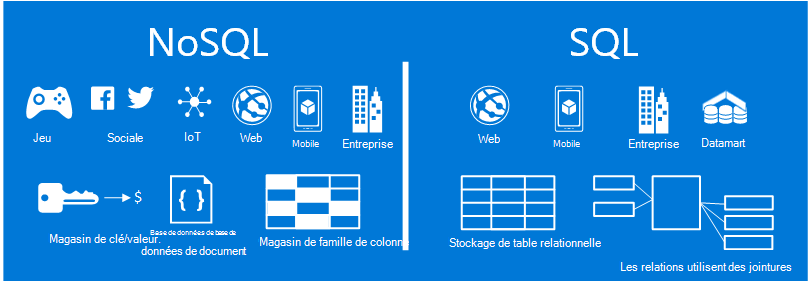
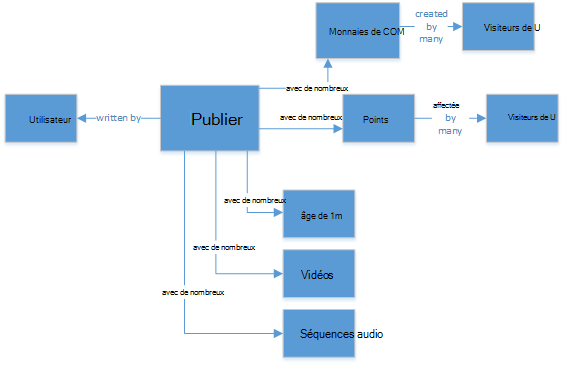
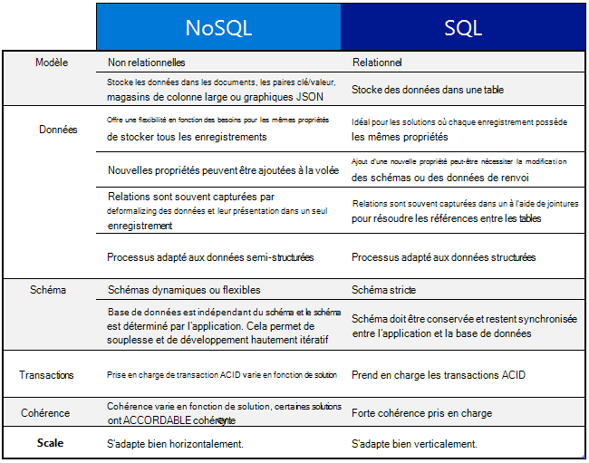
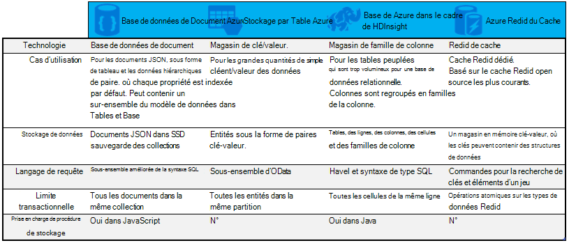

<properties
    pageTitle="Quand utiliser NoSQL vs SQL | Microsoft Azure"
    description="Comparez les avantages de l’utilisation de solutions non relationnelles de NoSQL par rapport aux solutions SQL. Savoir si un des services de Microsoft Azure NoSQL ou SQL Server de mieux adaptée à votre scénario."
    keywords="sql de vs NoSQL, quand utiliser NoSQL, sql vs nosql"
    services="documentdb"
    documentationCenter=""
    authors="mimig1"
    manager="jhubbard"
    editor=""/>

<tags
    ms.service="documentdb"
    ms.workload="data-services"
    ms.tgt_pltfrm="na"
    ms.devlang="dotnet"
    ms.topic="article" 
    ms.date="06/24/2016"
    ms.author="mimig"/>

# NoSQL vs SQL

SQL Server et les bases de données relationnelles (SGBDR) ont été les bases de données pour atteindre de plus de 20 ans. Toutefois, le besoin accru pour traiter le plus élevé des volumes et des variétés de données à un débit rapide a modifié la nature des besoins de stockage de données pour les développeurs d’applications. Pour permettre ce scénario, les bases de données NoSQL qui permettent de stocker des données non structurées et hétérogènes à l’échelle ont acquise en popularité. 

NoSQL constitue une catégorie de bases de données très différents à partir de bases de données SQL. NoSQL est souvent utilisé pour faire référence à des systèmes de gestion de données qui sont « Pas SQL » ou une approche de gestion de données qui inclut « SQL n’est pas seulement ». Il existe un certain nombre de technologies dans la catégorie de NoSQL, y compris les bases de données de document, magasins de la valeur de la clé, colonne famille stocke et bases de données de graphique qui sont les plus courants avec des jeux, sociale, et IoT apps.

L’objectif de cet article est de vous aider à en savoir plus sur les différences entre NoSQL et SQL et vous fournir une introduction sur les offres de NoSQL et SQL de Microsoft.  

## Quand utiliser NoSQL ?

Imaginons que vous créez un nouveau site d’engagement social. Les utilisateurs peuvent créer des publications et leur ajouter des images, de vidéos et de musique. Autres utilisateurs peuvent commenter les messages et offrent des points (aime) pour évaluer les messages. La page de lancement aura un flux de messages que les utilisateurs de partager et d’interagir avec. 

Comment stockez-vous ces données ? Si vous êtes familiarisé avec SQL, vous pouvez commencer à dessiner quelque chose comme ceci :

Jusqu'à présent, tout va bien, mais maintenant pensez à la structure d’une seule publication et comment l’afficher. Si vous souhaitez afficher la publication et les images associées, audio, vidéo, commentaires, points et les informations utilisateur sur un site Web ou une application, vous devrez exécuter une requête avec des jointures de table huit juste pour extraire le contenu. Imaginez maintenant un flux de données de publications qui dynamiquement charger et s’affichent à l’écran et vous pouvez facilement prévoir qu’il va demander des milliers de requêtes et de jointures pour effectuer la tâche.

Maintenant, vous pouvez utiliser une solution relationnelle telles que SQL Server pour stocker les données - mais il existe une autre option, une option de NoSQL qui simplifie l’approche. En transformant la publication dans un document JSON comme le suivant et stockage dans DocumentDB, un service de base de données de documents NoSQL d’Azure, vous pouvez augmenter les performances et récupérer la publication entière avec une requête et aucune jointure. Il est plus simple, plus simple et plus performant.

    {
        "id":"ew12-res2-234e-544f",
        "title":"post title",
        "date":"2016-01-01",
        "body":"this is an awesome post stored on NoSQL",
        "createdBy":User,
        "images":["http://myfirstimage.png","http://mysecondimage.png"],
        "videos":[
            {"url":"http://myfirstvideo.mp4", "title":"The first video"},
            {"url":"http://mysecondvideo.mp4", "title":"The second video"}
        ],
        "audios":[
            {"url":"http://myfirstaudio.mp3", "title":"The first audio"},
            {"url":"http://mysecondaudio.mp3", "title":"The second audio"}
        ]
    }

En outre, ces données peuvent être partitionnées par id de publication permettant les données évoluer naturellement et tirer parti des caractéristiques d’échelle NoSQL. NoSQL systèmes permettent également aux développeurs d’assouplir la cohérence et de proposer des applications hautement disponibles.  Enfin, cette solution ne nécessite pas aux développeurs de définir, de gérer et de mettre à jour le schéma dans la couche de données permettant d’itération rapide.

Vous pouvez ensuite créer cette solution à l’aide des autres services Azure :

- [Recherche d’Azure](https://azure.microsoft.com/services/search/) peut servir via l’application web pour permettre aux utilisateurs de rechercher des publications.
- [Services d’application de Azure](https://azure.microsoft.com/services/app-service/) peuvent être utilisés pour héberger les applications et les processus d’arrière-plan.
- [Le stockage Blob Azure](https://azure.microsoft.com/services/storage/) peut être utilisé pour stocker les profils utilisateur complet y compris les images.
- [Base de données de SQL Azure](https://azure.microsoft.com/services/sql-database/) peut être utilisé pour stocker des volumes considérables de données des informations de connexion et les données d’analytique de l’utilisation.
- [Formation de Machine Azure](https://azure.microsoft.com/services/machine-learning/) permet de développer les connaissances et intelligence qui peut fournir des commentaires sur le processus et aider à fournir le bon contenu aux utilisateurs appropriés.

Ce site d’engagement social est un seul un scénario dans lequel une base de données NoSQL est le modèle de données de droite de la tâche. Si vous souhaitez plus d’informations sur ce scénario et comment le modèle de vos données de DocumentDB dans les applications de médias sociaux de la lecture, consultez [va sociale avec DocumentDB](documentdb-social-media-apps.md). 

## Comparaison de NoSQL vs SQL

Le tableau suivant compare les principales différences entre NoSQL et SQL. 

Si une base de données NoSQL mieux adaptée à vos besoins, passez à la section suivante pour en savoir plus sur les services de NoSQL disponibles dans Azure. Sinon, si une base de données SQL mieux adapté à vos besoins, passez à le [Quelles sont les offres Microsoft SQL ?](#what-are-the-microsoft-sql-offerings)

## Quelles sont les offres de Microsoft Azure NoSQL ?

Azure a quatre services de NoSQL entièrement gérés : 

- [DocumentDB Azure](https://azure.microsoft.com/services/documentdb/)
- [Stockage par Table Azure](https://azure.microsoft.com/services/storage/)
- [HBase Azure dans le cadre de HDInsight](https://azure.microsoft.com/services/hdinsight/)
- [Cache d’Azure Redis](https://azure.microsoft.com/services/cache/)

Le tableau comparatif suivant mappe des atouts concurrentiels pour chaque service. Lequel décrit plus précisément les besoins de votre application ? 

Si un ou plusieurs de ces services peut répondre aux besoins de votre application, plus les ressources suivantes : 

- [Parcours de formation de DocumentDB](https://azure.microsoft.com/documentation/learning-paths/documentdb/) et de [DocumentDB des cas d’usage](documentdb-use-cases.md)
- [Mise en route avec le stockage par table Azure](../storage/storage-dotnet-how-to-use-tables.md)
- [Quel est HBase dans HDInsight](../hdinsight/hdinsight-hbase-overview.md)
- [Redis Cache cursus](https://azure.microsoft.com/documentation/learning-paths/redis-cache/)

Passez aux [étapes suivantes](#next-steps) pour les informations d’évaluation gratuites.

## Quelles sont les offres Microsoft SQL ?

Microsoft a cinq offres de SQL : 

- [Base de données SQL Azure](https://azure.microsoft.com/services/sql-database/)
- [SQL Server sur des Machines virtuelles Azure](https://azure.microsoft.com/services/virtual-machines/sql-server/)
- [SQL Server](https://www.microsoft.com/server-cloud/products/sql-server-2016/)
- [Entrepôt de données SQL Azure (aperçu)](https://azure.microsoft.com/services/sql-data-warehouse/)
- [Système de plate-forme Analytique (matériel sur site)](https://www.microsoft.com/en-us/server-cloud/products/analytics-platform-system/)

Si vous êtes intéressé par SQL Server sur un ordinateur virtuel ou d’une base de données de SQL, puis lire [Choisir un nuage option de SQL Server : le SQL Azure (PaaS) de base de données ou de SQL Server sur Azure VM (IaaS)](../sql-database/sql-database-paas-vs-sql-server-iaas.md) pour en savoir plus sur les différences entre les deux.

Si les sons SQL comme la meilleure option, puis passez à [SQL Server](https://www.microsoft.com/server-cloud/products/) pour en savoir plus sur nos produits de Microsoft SQL et les services qu’offre.

Puis passez aux [étapes suivantes](#next-steps) en libre liens d’essai et d’évaluation.

## Étapes suivantes

Nous vous invitons à en savoir plus sur nos produits SQL et NoSQL par la peine de les tester gratuitement. 

- Pour tous les services Azure, vous pouvez vous inscrire pour une [version d’évaluation d’un mois gratuite](https://azure.microsoft.com/pricing/free-trial/) et recevoir les 200 $ à dépenser dans un des services Azure.
    - [DocumentDB Azure](https://azure.microsoft.com/services/documentdb/)
    - [HBase Azure dans le cadre de HDInsight](https://azure.microsoft.com/services/hdinsight/)
    - [Cache d’Azure Redis](https://azure.microsoft.com/services/cache/)
    - [Entrepôt de données SQL Azure (aperçu)](https://azure.microsoft.com/services/sql-data-warehouse/)
    - [Base de données SQL Azure](https://azure.microsoft.com/services/sql-database/)
    - [Stockage par Table Azure](https://azure.microsoft.com/services/storage/)

- Vous pouvez faire tourner une [version d’évaluation de 2016 de SQL Server sur une machine virtuelle](https://azure.microsoft.com/marketplace/partners/microsoft/sqlserver2016ctp33evaluationwindowsserver2012r2/) ou télécharger une [version d’évaluation de SQL Server](https://www.microsoft.com/en-us/evalcenter/evaluate-sql-server-2016).
    - [SQL Server](https://www.microsoft.com/server-cloud/products/sql-server-2016/)
    - [SQL Server sur des Machines virtuelles Azure](https://azure.microsoft.com/services/virtual-machines/sql-server/)

