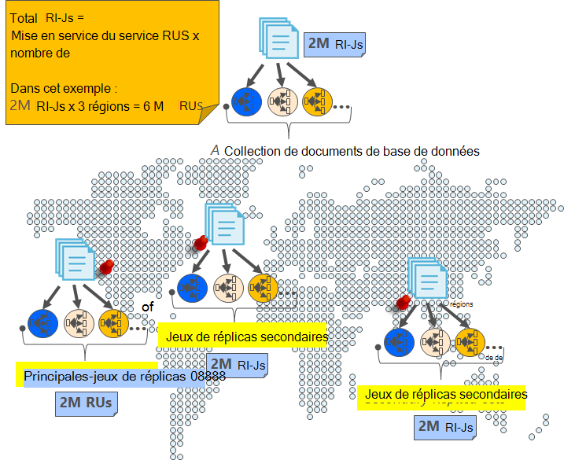
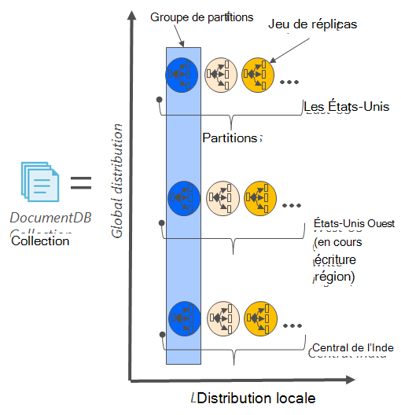
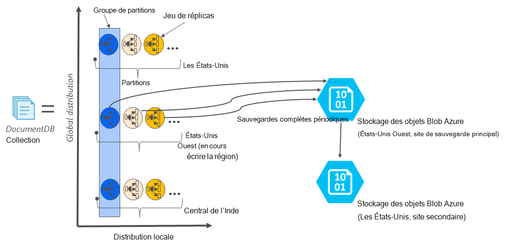

<properties
    pageTitle="Sauvegarde en ligne et restauration avec DocumentDB | Microsoft Azure"
    description="Apprenez à effectuer la sauvegarde automatique et restauration de bases de données NoSQL avec DocumentDB d’Azure."
    keywords="sauvegarde et restauration, sauvegarde en ligne"
    services="documentdb"
    documentationCenter=""
    authors="RahulPrasad16"
    manager="jhubbard"
    editor="monicar"/>

<tags
    ms.service="documentdb"
    ms.workload="data-services"
    ms.tgt_pltfrm="na"
    ms.devlang="multiple"
    ms.topic="article"
    ms.date="09/23/2016"
    ms.author="raprasa"/>

# Sauvegarde en ligne automatique et restauration avec DocumentDB 

DocumentDB Azure prend automatiquement des sauvegardes de toutes vos données à intervalles réguliers. Les sauvegardes automatiques sont prises sans affecter les performances ou la disponibilité de vos opérations de base de données NoSQL. Toutes vos sauvegardes sont stockées séparément dans un autre service de stockage, et ces sauvegardes sont global répliqués pour la résilience contre les sinistres distants. Lorsque vous supprimez par erreur votre collection DocumentDB et ultérieure nécessite la récupération de données ou d’une solution de reprise après sinistre, les sauvegardes automatiques sont prévues pour les scénarios.  

Cet article commence avec un bref récapitulatif de la redondance des données et de la disponibilité dans DocumentDB et puis traite des sauvegardes. 

## Haute disponibilité avec DocumentDB - un récapitulatif

DocumentDB est conçu pour être [globalement distribué](documentdb-distribute-data-globally.md) : il vous permet de mettre à l’échelle du débit dans plusieurs régions Azure ainsi que des politiques de basculement et les API d’hébergement multiple transparent. Comme un système de base de données offrant une [disponibilité de 99,99 % SLA](https://azure.microsoft.com/support/legal/sla/documentdb/v1_0/), toutes les écritures dans DocumentDB sont validées durablement sur des disques locaux par un quorum de réplicas au sein d’un centre de données local avant d’accuser réception au client. Notez que la haute disponibilité de DocumentDB repose sur le stockage local et ne dépend pas de toutes les technologies de stockage externe. En outre, si votre compte de base de données est associée à plus d’une région d’Azure, vos écritures sont répliquées dans les autres régions ainsi. Pour faire évoluer votre débit de données et d’accès à faible latence, vous pouvez disposer la plupart lire les régions associées à votre compte de base de données que vous le souhaitez. Dans chaque zone de lecture, les données (répliquées) sont rendue persistante durablement au sein d’un jeu de réplicas.  

Comme illustré dans le diagramme suivant, une collection de DocumentDB unique est [partitionnée horizontalement](documentdb-partition-data.md). Une « partition » est indiquée par un cercle dans le diagramme suivant, et chaque partition devient hautement disponible via un jeu de réplicas. Il s’agit de la distribution locale dans une région d’Azure unique (indiquée par l’axe des X). De plus, chaque partition (avec son ensemble de réplica correspondant) est ensuite globalement distribuée dans plusieurs régions associées à votre compte de base de données (par exemple, dans cette illustration, les trois régions – américains Extrême-Orient, ouest des États-Unis Central de l’Inde). Le « jeu de partition » est globalement distribué entité comprenant plusieurs copies de vos données dans chaque région (indiquée par l’axe des Y). Vous pouvez affecter la priorité aux régions associées à votre compte de base de données et DocumentDB basculent en toute transparence à la région suivante en cas de sinistre. Vous pouvez également simuler basculement pour vérifier la disponibilité de bout en bout de votre application.  

L’image suivante illustre le degré élevé de redondance avec DocumentDB.

## Sauvegardes en ligne complètes et automatiques,

Oups, j’ai supprimé mon collection ou la base de données ! Avec DocumentDB, non seulement vos données, mais les sauvegardes de vos données sont également apportées hautement redondant et résistant aux sinistres régionaux. Ces sauvegardes automatisées proviennent actuellement environ toutes les quatre heures. 

Les sauvegardes sont effectuées sans affecter les performances ou la disponibilité de vos opérations de base de données. DocumentDB prend la sauvegarde en arrière-plan sans consommer votre RUs mis en service ou affecter les performances et sans affecter la disponibilité de votre base de données NoSQL. 

Contrairement à vos données sont stockées à l’intérieur de DocumentDB, les sauvegardes automatiques sont stockés dans le service de stockage des objets Blob Azure. Pour garantir le chargement de latence faible/efficace, l’instantané de votre sauvegarde est téléchargé en une instance de stockage Azure Blob dans la même région, comme la zone d’écriture en cours de votre compte de base de données DocumentDB. De reprise sur sinistre régional, chaque capture instantanée de vos données de sauvegarde dans le stockage Blob Azure est à nouveau répliquée via stockage redondant geo (GRS) dans une autre région. Le diagramme suivant montre que l’ensemble de la collection DocumentDB (avec toutes les trois partitions principales aux Etats-Unis Ouest, dans cet exemple) est sauvegardé dans un compte de stockage des objets Blob Azure à distance dans l’ouest des États-Unis et ensuite GRS répliqués vers les États-Unis. 

L’image suivante illustre les sauvegardes périodiques complètes de toutes les entités DocumentDB dans le stockage Azure de GRS.

## Période de rétention d’un instantané donné

Comme indiqué plus haut, nous prendre régulièrement des instantanés de vos données et par les réglementations de conformité, nous conserver la dernière capture instantanée à 90 jours avant qu’il obtient éventuellement purgée. Si une collection ou un compte est supprimé, DocumentDB stocke la dernière sauvegarde pendant 90 jours.

## Restaurer la base de données à partir de la sauvegarde en ligne

En cas de suppression accidentelle de vos données, vous pouvez [le fichier un ticket de support](https://portal.azure.com/?#blade/Microsoft_Azure_Support/HelpAndSupportBlade) ou [appelez le support Azure](https://azure.microsoft.com/support/options/) pour restaurer les données à partir de la dernière sauvegarde automatique. Pour obtenir un instantané spécifique de la sauvegarde à restaurer, DocumentDB nécessite que les données étaient disponibles au moins avec nous pour la durée du cycle de sauvegarde de cet instantané.

## Étapes suivantes

Pour répliquer votre base de données NoSQL dans plusieurs centres de données, consultez [distribution de vos données globalement avec DocumentDB](documentdb-distribute-data-globally.md). 

Au contact de fichier prise en charge d’Azure, [fichier un ticket à partir du portail Azure](https://portal.azure.com/?#blade/Microsoft_Azure_Support/HelpAndSupportBlade).