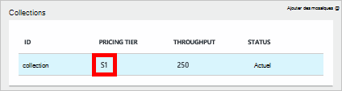
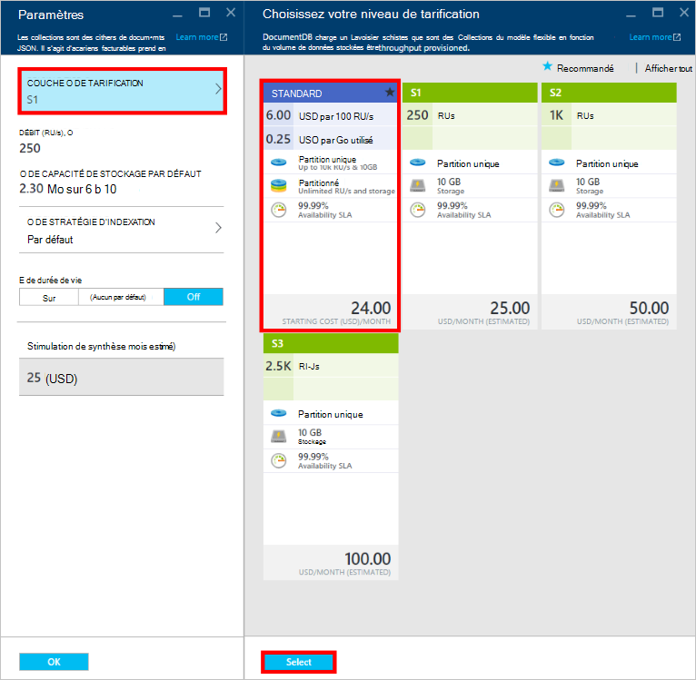
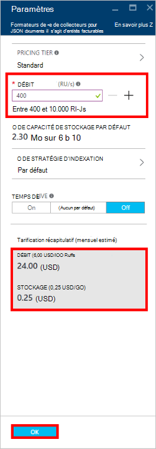
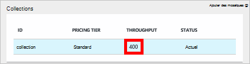

<properties
    pageTitle="Des niveaux de performance dans DocumentDB | Microsoft Azure"
    description="Découvrez comment dans DocumentDB des niveaux de performance permettent de réserver le débit sur une base par collection."
    services="documentdb"
    authors="mimig1"
    manager="jhubbard"
    editor="monicar"
    documentationCenter=""/>

<tags
    ms.service="documentdb"
    ms.workload="data-services"
    ms.tgt_pltfrm="na"
    ms.devlang="na"
    ms.topic="article"
    ms.date="08/26/2016"
    ms.author="mimig"/>

# Niveaux de performance dans DocumentDB

Cet article fournit une vue d’ensemble des niveaux de performances dans [Microsoft Azure DocumentDB](https://azure.microsoft.com/services/documentdb/).

Après avoir lu cet article, vous serez en mesure de répondre aux questions suivantes :  

-   Ce qui est d’un niveau de performances ?
-   Comment le débit est réservé pour un compte de base de données ?
-   Comment travailler avec des niveaux de performance ?
-   Mode de facturation pour les niveaux de performances ?

## Présentation des niveaux de performances

Chaque collection de DocumentDB créée sous un compte d’utilisateur Standard est configurée avec un niveau de performance associé. Chaque collection dans une base de données peut avoir un niveau de performance qui vous permet de désigner le débit pour les collections fréquemment consultées et moins de débit pour les collections rarement utilisées. DocumentDB prend en charge les deux niveaux de performances définis par l’utilisateur et prédéfinis sur des niveaux de performance.  

Chaque niveau de performance a une limite de fréquence des [unités de demande (RU)](documentdb-request-units.md) . Ceci est le débit qui sera réservé pour une collection en fonction de son niveau de performance et est disponible pour une utilisation par cette collection exclusivement.

<table border="0" cellspacing="0" cellpadding="0">
    <tbody>
        <tr>
            <td valign="top">

</td>
            <td valign="top">
Détails
</td>
            <td valign="top">
Limites du débit
</td>
            <td valign="top">
Limites de stockage
</td>
            <td valign="top">
Version
</td>
            <td valign="top">
API
</td>            
        </tr>
        <tr>
            <td valign="top">
Performances définis par l’utilisateur
</td>
            <td valign="top">
Stockage basé sur l’utilisation de Go est mesuré.

Débit en unités de 100 RU/s
</td>
            <td valign="top">
Un nombre illimité. 400 - 250 000 demande d’unités/s par défaut (supérieure à la demande)
</td>
            <td valign="top">
Un nombre illimité. 250 Go par défaut (supérieure à la demande) 
</td>
            <td valign="top">
V2
</td>
            <td valign="top">
16-12-API 2015 et ultérieures
</td>  
        </tr>
        <tr>
            <td valign="top">
Performances prédéfinis
</td>
            <td valign="top">
Stockage de 10 Go sont réservés.

S1 = 250 RU/s, S2 = 1000 RU/s, S3 = 2500 RU/s
</td>
            <td valign="top">
2500 RU/s
</td>
            <td valign="top">
10 GO
</td>
            <td valign="top">
V1
</td>
            <td valign="top">
Tout
</td>  
        </tr>        
    </tbody>
</table>                

DocumentDB permet un large éventail d’opérations de base de données, y compris des requêtes, des procédures de requêtes avec des fonctions définies par l’utilisateur (UDF), stockées et des déclencheurs. Le coût de traitement associé à chacune de ces opérations peuvent varier en fonction de l’UC, l’e/s et la mémoire requise pour terminer l’opération. À la place de penser et la gestion des ressources matérielles, vous pouvez considérer une unité demande sous la forme d’une seule mesure pour les ressources requises pour effectuer différentes opérations de base de données et la demande d’une application de service.

Collections peuvent être créées via le [portail Microsoft Azure](https://portal.azure.com), l' [API REST](https://msdn.microsoft.com/library/azure/mt489078.aspx) ou des [Kits de développement logiciel DocumentDB](https://msdn.microsoft.com/library/azure/dn781482.aspx). Les APIs de DocumentDB vous permettent de vous permet de spécifier le niveau de performance d’une collection.

> [AZURE.NOTE] Le niveau de performance d’une collection peut être ajusté par le biais de l’API ou le [portail Microsoft Azure](https://portal.azure.com/). Modifications au niveau des performances sont censées effectuer dans les 3 minutes.

## Définition des niveaux de performances pour les collections
Lorsqu’une collection est créé, la répartition complète du RUs basé sur le niveau de performance désignés sont réservés à la collection.

Notez qu’avec les deux niveaux de performances prédéfinis et définis par l’utilisateur, DocumentDB fonctionne en fonction de la réservation du débit. En créant une collection, une application a réservé et est facturée pour le débit réservé indépendamment de la quantité de ce débit est activement utilisée. Avec des niveaux de performances définis par l’utilisateur, le stockage est mesuré en fonction de la consommation, mais avec des niveaux de performances prédéfinis, 10 Go de stockage est réservé au moment de la création de la collection.  

Après avoir créé des collections, vous pouvez modifier le niveau de performance par le biais de kits de développement logiciel DocumentDB ou via le portail classique d’Azure.

> [AZURE.IMPORTANT] Les collections DocumentDB Standard sont facturées à un taux horaire et chaque collection que vous créez est facturée une inférieure à une heure d’utilisation.

Si vous ajustez le niveau de performance d’une collection en une heure, vous serez facturé pour le plus haut niveau de performances défini au cours de l’heure. Par exemple, si vous augmentez votre niveau de performance d’une collection à 08:53 vous sera facturé pour le nouveau niveau commençant à 8 h 00. De même, si vous diminuez le niveau de performances à 08:53, le nouveau taux s’appliquera à 9:00 am.

Unités de demande sont réservées pour chaque collection basée sur l’ensemble de niveau de performance. Demande de consommation d’unités est évaluée sous la forme d’un taux par seconde. Les applications qui dépassent le taux unitaire de demande de mise en service (ou le niveau de performances) sur une collection seront accélérées jusqu'à ce que la vitesse tombe sous le niveau réservé pour cette collection. Si votre application requiert un niveau de débit plus élevé, vous pouvez augmenter le niveau de performance pour chaque collection.

> [AZURE.NOTE] Lorsque votre application dépasse les niveaux de performance d’une ou de plusieurs collections, les demandes seront accélérés sur une base par collection. Cela signifie que certaines demandes d’application peuvent réussir tandis que d’autres utilisateurs peuvent être limitées. Il est recommandé d’ajouter un petit nombre de nouvelles tentatives lorsque accéléré pour gérer les pics de trafic de la requête.

## Utilisation des niveaux de performances
DocumentDB les collections vous permettent de regrouper vos données basées sur les modèles de requête et des besoins de performances de votre application. De DocumentDB l’indexation automatique et prise en charge de la requête, il est assez courant colocaliser des documents hétérogènes au sein de la même collection. Les considérations clés pour décider si les collections distinctes doivent être utilisées sont les suivantes :

- Une collection des requêtes est la portée pour l’exécution de la requête. Si vous avez besoin interroger un ensemble de documents, les modèles de lecture plus efficaces proviennent de cohabitation des documents dans une collection unique.
- Transactions – toutes les transactions ont une portée limitées à dans une collection unique. Si vous avez des documents qui doivent être mis à jour au sein d’une seule procédure stockée ou un déclencheur, ils doivent être stockés dans la même collection. Plus précisément, une clé de partition dans une collection est une limite de transaction. Consultez le [partitionnement dans DocumentDB](documentdb-partition-data.md) pour plus de détails.
- Isolation de performances – une collection a un niveau de performance associé. Cela garantit que chaque collection a des performances prévisibles à RUs réservés. Données peuvent être affectées à des collections différentes, avec les niveaux de performance différents, en fonction de la fréquence d’accès.

> [AZURE.IMPORTANT] Il est important de comprendre que vous sera facturée au taux standard complet basés sur le nombre de collections créées par votre application.

Il est recommandé que votre application fait utiliser d’un petit nombre de collections, à moins d’avoir des exigences importantes de stockage ou de débit. Vérifiez que vous avez bien compris les modèles d’application pour la création de nouvelles collections. Vous pouvez choisir de réserver la création de la collection comme une action de gestion gérée en dehors de votre application. De même, ajuster le niveau de performances pour une collection changera le taux horaire auquel la collection est facturée. Vous devez surveiller les niveaux de performance collection si votre application ces ajuste dynamiquement.

## Modification de S1, S2, S3 de performances définis par l’utilisateur

Procédez comme suit pour passer de l’utilisation des niveaux de débit prédéfinis à des niveaux de débit de défini par l’utilisateur dans le portail Azure. À l’aide des niveaux de débit de défini par l’utilisateur, vous pouvez adapter le débit à vos besoins. Et si vous utilisez toujours un compte S1, vous pouvez augmenter le débit par défaut à partir de 250 RU/s à 400 RU/s avec seulement quelques clics.

Pour plus d’informations sur le débit connexes prédéfinies et définies par l’utilisateur modifications tarifaires, consultez le blog de [DocumentDB : tout ce que vous devez savoir pour utiliser les nouvelles options de tarification](https://azure.microsoft.com/blog/documentdb-use-the-new-pricing-options-on-your-existing-collections/).

> [AZURE.VIDEO changedocumentdbcollectionperformance]

1. Dans votre navigateur, accédez au [**portail Azure**](https://portal.azure.com).
2. Cliquez sur **Parcourir** -> **DocumentDB comptes**, puis sélectionnez le compte de le DocumentDB à modifier.   
3. Dans l’objectif de **bases de données** , sélectionnez la base de données à modifier et puis dans la lame de la **base de données** , sélectionnez la collection à modifier. Les comptes à l’aide de débit prédéfini ont un niveau de tarification de S1, S2 ou S3.

      

4. De la lame de **Collections** , cliquez sur **plus**, puis les **paramètres** de la barre supérieure.   
5. Dans la lame de **paramètres** , cliquez sur le **Niveau de prix** et notez que l’estimation de coût mensuel pour chaque plan est affichée dans la lame de **Choisir votre niveau de tarification** . Pour modifier le débit des données définies par l’utilisateur, cliquez sur **Standard**, puis cliquez sur **Sélectionner** pour enregistrer vos modifications.

      

6. Dans la lame de **paramètres** , le **Niveau de prix** est modifié en **Standard** et le **débit (RU/s)** s’affiche avec une valeur par défaut de 400. Le débit entre 400 et 10 000 [unités de demander](documentdb-request-units.md)la valeur /second (RU/s). Le **Prix de résumé** en bas de la page met à jour automatiquement afin de fournir une estimation du coût mensuel. Cliquez sur **OK** pour enregistrer vos modifications.

    

7. Sur la lame de la **base de données** , vous pouvez vérifier le nouveau débit de la collection.

    

Si vous déterminez que vous avez besoin plus de débit (plus de 10 000 RU/s) ou plus de stockage (supérieur à 10 Go) vous pouvez créer une collection partitionnée. Pour créer une collection partitionnée, voir [Création d’une collection](documentdb-create-collection.md).

>[AZURE.NOTE] Modification des niveaux de performances d’une collection peut prendre jusqu'à 2 minutes.

## Modification des niveaux de performances à l’aide du Kit de développement .NET

Une autre option de modification des niveaux de performance de vos collections est par le biais de nos kits de développement logiciel. Cette section couvre uniquement la modification du niveau de performance d’une collection à l’aide de notre [Kit de développement .NET](https://msdn.microsoft.com/library/azure/dn948556.aspx), mais le processus est similaire pour nos autres [Kits de développement logiciel](https://msdn.microsoft.com/library/azure/dn781482.aspx). Si vous êtes nouveau sur notre kit de développement .NET, veuillez consulter notre [didacticiel mise en route](documentdb-get-started.md).

Voici un extrait de code pour modifier le débit de l’offre de 50 000 unités de demande par seconde :

    //Fetch the resource to be updated
    Offer offer = client.CreateOfferQuery()
                      .Where(r => r.ResourceLink == collection.SelfLink)    
                      .AsEnumerable()
                      .SingleOrDefault();

    // Set the throughput to 5000 request units per second
    offer = new OfferV2(offer, 5000);

    //Now persist these changes to the database by replacing the original resource
    await client.ReplaceOfferAsync(offer);

    // Set the throughput to S2
    offer = new Offer(offer);
    offer.OfferType = "S2";

    //Now persist these changes to the database by replacing the original resource
    await client.ReplaceOfferAsync(offer);

> [AZURE.NOTE] Collections dotées de moins de 10 000 unités de demande par seconde peuvent être migrées entre les offres avec débit de défini par l’utilisateur et débit prédéfini (S1, S2, S3) à tout moment. Collections qui sont mis en service avec au-dessus de 10 000 unités de demande par seconde Impossible de convertir en niveaux de débit prédéfinis.

Visitez [MSDN](https://msdn.microsoft.com/library/azure/microsoft.azure.documents.client.documentclient.aspx) pour afficher des exemples supplémentaires et en savoir plus sur nos méthodes offre :

- [**ReadOfferAsync**](https://msdn.microsoft.com/library/azure/microsoft.azure.documents.client.documentclient.readofferasync.aspx)
- [**ReadOffersFeedAsync**](https://msdn.microsoft.com/library/azure/microsoft.azure.documents.client.documentclient.readoffersfeedasync.aspx)
- [**ReplaceOfferAsync**](https://msdn.microsoft.com/library/azure/microsoft.azure.documents.client.documentclient.replaceofferasync.aspx)
- [**CreateOfferQuery**](https://msdn.microsoft.com/library/azure/microsoft.azure.documents.linq.documentqueryable.createofferquery.aspx)

## Modification du débit d’une collection

Si vous utilisez déjà des performances définis par l’utilisateur, vous pouvez modifier le débit de votre collection en procédant comme suit. Si vous avez besoin de passer d’un niveau de performance S1, S2 ou S3 (performances prédéfinis) à performances définis par l’utilisateur, voir la section [modification de S1, S2, S3 de performances définis par l’utilisateur](#changing-performance-levels-using-the-azure-portal).

1. Dans votre navigateur, accédez au [**portail Azure**](https://portal.azure.com).
2. Cliquez sur **Parcourir** -> **DocumentDB comptes**, puis sélectionnez le compte de le DocumentDB à modifier.   
3. Sur la lame **DocumentDB compte** , l’objectif de **bases de données** , sélectionnez la base de données à modifier et puis dans la lame de la **base de données** , sélectionnez la collection à modifier.
4. De la lame de **Collections** , cliquez sur **paramètres** de la barre supérieure.   
5. Dans la lame de **paramètres** , augmentez la valeur dans la zone de **débit (RU/s)** et puis cliquez sur **OK** pour enregistrer vos modifications. Le **Résumé de tarification** au bas de la lame mises à jour pour afficher le nouveau coût mensuel estimé de cette collection dans une seule région.

    

Si vous n’êtes pas sûr du combien d’augmenter le débit, reportez-vous à la section [a besoin d’estimer le débit](documentdb-request-units.md#estimating-throughput-needs) et la [Calculatrice des unités de la demande](https://www.documentdb.com/capacityplanner).

## Étapes suivantes

Pour plus d’informations sur la tarification et la gestion des données avec Azure DocumentDB, Explorez ces ressources :

- [Tarification de la DocumentDB](https://azure.microsoft.com/pricing/details/documentdb/)
- [Gestion de la capacité de DocumentDB](documentdb-manage.md)
- [Données de modélisation dans DocumentDB](documentdb-modeling-data.md)
- [Partitionnement de données dans DocumentDB](documentdb-partition-data.md)
- [Unités de la demande](http://go.microsoft.com/fwlink/?LinkId=735027)

Pour en savoir plus sur DocumentDB, consultez la [documentation](https://azure.microsoft.com/documentation/services/documentdb/)de DocumentDB d’Azure.

Pour vous familiariser avec l’échelle et de tests de performances avec DocumentDB, reportez-vous à la section [performances et tester l’évolutivité avec Azure DocumentDB](documentdb-performance-testing.md).

[1]: ./media/documentdb-performance-levels/documentdb-change-collection-performance7-9.png
[2]: ./media/documentdb-performance-levels/documentdb-change-collection-performance10-11.png
