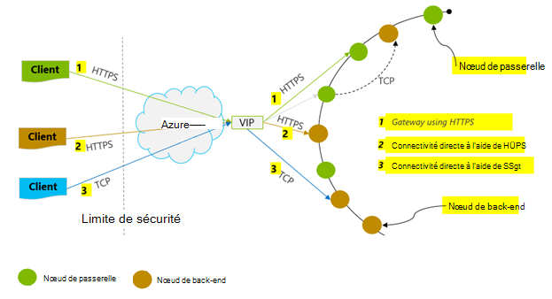
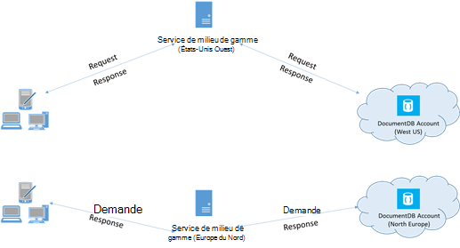

<properties 
    pageTitle="Conseils de performance DocumentDB | Microsoft Azure" 
    description="Découvrez les options de configuration de client pour améliorer les performances de base de données Azure DocumentDB"
    keywords="Comment faire pour améliorer les performances de la base de données"
    services="documentdb" 
    authors="mimig1" 
    manager="jhubbard" 
    editor="" 
    documentationCenter=""/>

<tags 
    ms.service="documentdb" 
    ms.workload="data-services" 
    ms.tgt_pltfrm="na" 
    ms.devlang="na" 
    ms.topic="article" 
    ms.date="10/17/2016" 
    ms.author="mimig"/>

# Conseils concernant le DocumentDB

DocumentDB Azure est un rapide et flexible base de données distribuée qui s’adapte en toute transparence avec garantie de latence et le débit. Vous n’avez pas à apporter des modifications de l’architecture principale ou écrire du code complexe pour faire évoluer votre base de données avec DocumentDB. Mise à l’échelle verticalement est aussi simple qu’un seul appel d’API ou d’une [méthode SDK appeler](documentdb-performance-levels.md#changing-performance-levels-using-the-net-sdk). Toutefois, étant donné que DocumentDB est accessible via des appels de réseau des optimisations côté client que vous permettent d’obtenir des performances optimales.

Donc si vous vous demandez « comment puis-je améliorer mes performances de la base de données ? » Envisagez les options suivantes :

## Mise en réseau

1. **Stratégie de connexion : utiliser le mode de connexion directe**
    
    Comment un client se connecte à DocumentDB d’Azure a des conséquences importantes sur les performances, en particulier en termes de temps de latence observée côté client. Il existe deux paramètres de configuration de la clé de configuration client stratégie de connexion – le *mode* de connexion et le [ *protocole*de la connexion](#connection-protocol).  Les deux modes disponibles sont les suivantes :

    1. Mode de passerelle (par défaut)
    2. Mode direct

    Étant donné que DocumentDB est un système de stockage distribué, DocumentDB des ressources comme des collections sont partitionnées sur plusieurs machines et chaque partition est répliquée pour une haute disponibilité. La logique à la traduction de l’adresse physique est conservé dans une table de routage, qui est également disponible en interne en tant que ressource.

    En Mode de passerelle, les ordinateurs de passerelle DocumentDB effectuent cette gamme, autorisant ainsi le code client être simple et compact. Une application cliente émet des requêtes sur les ordinateurs de passerelle DocumentDB, laquelle traduisent l’URI logique dans la demande à l’adresse physique du nœud principal et transmet la demande de manière appropriée.  À l’inverse, en Mode Direct clients doivent mettre à jour – et actualiser périodiquement – une copie de la table de routage et puis se connecter directement aux nœuds DocumentDB back-end.

    Mode de passerelle est pris en charge sur toutes les plates-formes de kit de développement logiciel et est configurée par défaut.  Si votre application s’exécute au sein d’un réseau d’entreprise avec des restrictions de pare-feu strict, Mode de passerelle constitue le meilleur choix, puisqu’il utilise le port HTTPS standard et un point de terminaison unique. Le compromis entre performances, est, toutefois, que le Mode passerelle implique un tronçon réseau supplémentaires chaque fois les données sont lues ou écrites dans DocumentDB.   De ce fait, le Mode Direct offre de meilleures performances en raison du nombre de tronçons.

2. **Stratégie de connexion : utilisent le protocole TCP**

    Lors de l’exploitation en Mode Direct, il existe deux options de protocole disponibles :

    - TCP
    - HTTPS

    DocumentDB offre un simple et ouvrez le modèle de programmation RESTful via HTTPS. En outre, il propose un protocole TCP efficace, également RESTful dans son modèle de communication et est disponible via le client .NET SDK. TCP directe et HTTPS utiliser SSL pour l’authentification initiale et le cryptage du trafic. Pour de meilleures performances, utilisez le protocole TCP lorsque cela est possible. 

    Lors de l’utilisation de TCP en Mode de passerelle, TCP Port 443 est le port DocumentDB et 10250 est le port de l’API de MongoDB. Lorsque vous utilisez TCP en Mode Direct, en plus des ports de passerelle, vous devrez vérifier le port est compris entre 10000 et 20000 est ouvert comme DocumentDB utilise des ports TCP dynamiques. Si ces ports ne sont pas ouverts et que vous essayez d’utiliser le protocole TCP, vous recevrez une erreur de 503 Service non disponible. 

    Le Mode de connexion est configuré lors de la construction de l’instance de DocumentClient avec le paramètre ConnectionPolicy. Si le Mode Direct est utilisé, le protocole peut également être défini dans le paramètre ConnectionPolicy.

        var serviceEndpoint = new Uri("https://contoso.documents.net");
        var authKey = new "your authKey from Azure Mngt Portal";
        DocumentClient client = new DocumentClient(serviceEndpoint, authKey, 
        new ConnectionPolicy
        {
            ConnectionMode = ConnectionMode.Direct,
            ConnectionProtocol = Protocol.Tcp
        });

    TCP est uniquement pris en charge en Mode Direct, si le Mode passerelle est utilisé, puis le protocole HTTPS est toujours utilisé pour communiquer avec la passerelle et la valeur de protocole dans la ConnectionPolicy est ignorée.

    

3. **Appelez OpenAsync pour éviter le démarrage de latence sur première demande**

    Par défaut, la première requête aura une latence plus élevée, car il a extraire la table de routage d’adresse. Pour éviter cette latence de démarrage lors de la première demande, vous devez appeler comme suit une fois au cours de l’initialisation de OpenAsync().

        await client.OpenAsync();

4. **Colocaliser des clients dans la même région Azure pour les performances**

    Lorsque cela est possible, placez toutes les applications appelant DocumentDB dans la même région, comme la base de données DocumentDB. Pour une comparaison approximative, les appels à DocumentDB dans la même région terminée dans 1-2 ms, mais la latence entre l’ouest et la côte est des États-Unis est > 50 ms. Cette latence peut probablement dépendent de demande afin de demander à l’itinéraire emprunté par la demande, lorsqu’il passe par le client à la limite de centre de données Azure. Latence minimale est obtenue en s’assurant de que l’application appelante est située dans la même région Azure comme point de terminaison DocumentDB mis en service. Pour obtenir une liste de régions disponibles, reportez-vous à la section [Régions d’Azure](https://azure.microsoft.com/regions/#services).

    

5. **Augmenter le nombre de threads/tâches**

    Les appels à DocumentDB sont effectuées sur le réseau, vous devrez peut-être faire varier le degré de parallélisme de vos demandes afin que l’application cliente passe très peu de temps d’attente entre les demandes. Par exemple, si vous utilisez. [Bibliothèque parallèle de tâches](https://msdn.microsoft.com//library/dd460717.aspx), du NET Créez l’ordre de 100 s des tâches de lecture ou d’écriture à DocumentDB.

## Utilisation du Kit de développement logiciel

1. **Installer le Kit de développement logiciel plus récent**

    Les kits de développement de DocumentDB sont sans cesse améliorées pour fournir les meilleures performances. Reportez-vous aux pages de [DocumentDB le Kit de développement](documentdb-sdk-dotnet.md) pour déterminer le Kit de développement logiciel plus récent et de revoir des améliorations. 

2. **Utilisez un client de DocumentDB de singleton pour la durée de vie de votre application**
  
    Notez que chaque instance de DocumentClient est thread-safe et effectue une gestion efficace et la mise en cache des adresses lors d’un fonctionnement en Mode Direct. Pour permettre une gestion efficace et améliorer les performances en DocumentClient, il est recommandé d’utiliser une seule instance de DocumentClient par AppDomain pour la durée de vie de l’application.

3. **Augmenter System.Net MaxConnections par hôte**

    DocumentDB requêtes sont effectuées via HTTPS/reste par défaut et sont soumis à la limite de connexion par défaut par le nom d’hôte ou l’adresse IP. Vous devrez peut-être définir les MaxConnections une valeur plus élevée (100-1000) afin que la bibliothèque cliente peut utiliser plusieurs connexions simultanées à DocumentDB. Dans le Kit de développement .NET SDK 1.8.0 ci-dessus, la valeur par défaut de [ServicePointManager.DefaultConnectionLimit](https://msdn.microsoft.com/library/system.net.servicepointmanager.defaultconnectionlimit.aspx) est 50 et pour modifier la valeur, vous pouvez définir le [Documents.Client.ConnectionPolicy.MaxConnectionLimit](https://msdn.microsoft.com/en-us/library/azure/microsoft.azure.documents.client.connectionpolicy.maxconnectionlimit.aspx) sur une valeur supérieure.  

4. **Optimisation des requêtes en parallèle pour les collections partitionnées**

     Kit de développement .NET DocumentDB version 1.9.0 et au-dessus de la prise en charge des requêtes parallèles, ce qui vous permettent d’interroger une collection partitionnée en parallèle (voir [utilisation des kits de développement logiciel](documentdb-partition-data.md#working-with-the-sdks) et les [exemples de code](https://github.com/Azure/azure-documentdb-dotnet/blob/master/samples/code-samples/Queries/Program.cs) connexes pour plus d’informations). Requêtes parallèles sont conçus pour améliorer le débit et la latence des requêtes sur leur équivalent en série. Fournissent des requêtes en parallèle deux paramètres que les utilisateurs peuvent régler pour personnalisé-ajuster leurs exigences, MaxDegreeOfParallelism (a) : contrôle le nombre maximal de partitions que peut être interrogé en parallèle et MaxBufferedItemCount (b) : pour contrôler le nombre de résultats préalablement lues. 
    
    (a) ***réglage MaxDegreeOfParallelism\: *** 
    works de requête en parallèle en interrogeant des partitions multiples en parallèle. Toutefois, les données à partir d’une collecte partitionnée individuel sont extraites en série par rapport à la requête. Ainsi, la définition de la MaxDegreeOfParallelism pour le nombre de partitions a le risque maximal de réaliser la requête plus performante toutes les autres conditions de système restent les mêmes. Si vous ne connaissez pas le nombre de partitions, vous pouvez définir la MaxDegreeOfParallelism un nombre élevé, et le système choisira le minimum (nombre de partitions, l’entrée d’utilisateur fournie) comme le MaxDegreeOfParallelism. 
    
    Il est important de noter que les requêtes parallèles produisent des avantages si les données sont distribuées uniformément dans toutes les partitions en fonction de la requête. Si la collection partitionnée est partitionnée de sorte que tout ou la plupart des données renvoyées par une requête est concentrée dans quelques partitions (une partition dans le pire des cas), puis les performances de la requête devrait être un goulet d’étranglement par ces partitions. 
    
    (b) ***réglage MaxBufferedItemCount\: *** 
    parallèle de la requête est conçue pour la prélecture des résultats pendant le traitement du lot en cours des résultats par le client. La pré-extraction permet une amélioration latence globale d’une requête. MaxBufferedItemCount est le paramètre pour limiter le nombre de résultats préalablement lues. MaxBufferedItemCount pour le nombre prévu de résultats renvoyés (ou un nombre plus élevé) permet à la requête recevoir le bénéfice maximal de pré-extraction. 
    
    Notez que pre-fetching fonctionne de la même manière, quel que soit le MaxDegreeOfParallelism, et il existe une seule mémoire tampon pour les données de toutes les partitions.  

5. **Activer le côté serveur GC**
    
    Réduction de la fréquence de garbage collection peut aider dans certains cas. Dans .NET, la valeur [gcServer](https://msdn.microsoft.com/library/ms229357.aspx) true.

6. **Intervalle de mise en œuvre à des intervalles de RetryAfter**
 
    Au cours des tests de performances, vous devez augmenter la charge jusqu'à ce qu’un faible taux de demandes get accéléré. Si accéléré, l’application cliente doit intervalle sur la limitation de l’intervalle entre deux tentatives de serveur spécifié. En respectant l’intervalle garantit que vous consacrez moins de temps d’attente entre les tentatives. Prise en charge de la stratégie nouvelle tentative est inclus dans la Version 1.8.0 et au-dessus des DocumentDB [.NET](documentdb-sdk-dotnet.md) et [Java](documentdb-sdk-java.md), version 1.9.0 et au-dessus du [Node.js](documentdb-sdk-node.md) et [Python](documentdb-sdk-python.md). Pour plus d’informations, voir [limite de débit réservé de Exceeding](documentdb-request-units.md#exceeding-reserved-throughput-limits) et [RetryAfter](https://msdn.microsoft.com/library/microsoft.azure.documents.documentclientexception.retryafter.aspx).

7. **Mettre à l’échelle la charge de travail de votre client**

    Si vous testez à des niveaux de débit élevés (> 50 000 RU/s), l’application cliente peut devenir le goulet d’étranglement en raison de la limitation des machine out sur l’utilisation du processeur ou le réseau. Si vous atteignez ce point, vous pouvez continuer à pousser le compte DocumentDB davantage en faisant évoluer les applications clientes sur plusieurs serveurs.

8. **Document du cache URI de faible latence de lecture**

    Document de cache URI dès que possible pour optimiser les performances en lecture.

9. **Réglez la taille de la page des flux de requêtes/lecture pour de meilleures performances**

    Lors de l’exécution d’un bloc de lecture des documents à l’aide de lecture aliments fonctionnalité (par exemple, ReadDocumentFeedAsync) ou lors de l’émission d’une requête DocumentDB SQL, les résultats sont renvoyés de manière segmentée si le jeu de résultats est trop grand. Par défaut, les résultats sont renvoyés sous forme de segments de 1 Mo ou de 100 éléments, quelle que soit la limite est atteinte premier. 

    Pour réduire le nombre de réseau de boucles requises pour récupérer tous les résultats applicables, vous pouvez augmenter la taille de la page à l’aide d’en-tête x-ms-max--nombre d’éléments de demande jusqu'à 1 000. Dans les cas où vous devez n'afficher que quelques résultats, par exemple, si votre API d’interface ou de l’application utilisateur renvoie 10 résultats une fois, vous pouvez également réduire la taille de la page à 10 afin de réduire le débit consommé pour les lectures et les requêtes.

    Vous pouvez également définir la taille de la page en utilisant les kits de développement DocumentDB disponible.  Par exemple :
    
        IQueryable<dynamic> authorResults = client.CreateDocumentQuery(documentCollection.SelfLink, "SELECT p.Author FROM Pages p WHERE p.Title = 'About Seattle'", new FeedOptions { MaxItemCount = 1000 });

10. **Augmenter le nombre de threads/tâches**

    Voir [augmenter le nombre de threads/tâches](#increase-threads) dans la section de mise en réseau.

## Politique d’indexation

1. **Utilisation de l’indexation différée pour des débits plus élevés à la réception de temps pointe**

    DocumentDB vous permet de spécifier, au niveau de la collection – une politique d’indexation, qui vous permet de choisir si vous souhaitez que les documents d’une collection à indexer automatiquement ou non.  En outre, vous pouvez également choisir entre synchrone (cohérent) et mises à jour des index asynchrones (Lazy). Par défaut, l’index est mis à jour simultanément sur chaque insertion, remplacer ou supprimer d’un document à la collection. Mode synchrone permet les requêtes d’honorer le même [niveau de cohérence](documentdb-consistency-levels.md) que les lectures de document sans délai pour l’index de « rattrapage ».
    
    Indexation différée peut être considéré comme pour les scénarios dans lesquels les données sont écrites en rafales, et que vous souhaitez amortir le travail nécessaire pour indexer le contenu sur une longue période de temps. Indexation différée vous permet également d’utiliser de manière efficace votre débit mis en service et répondre à des demandes d’écriture aux heures de pointe avec une latence minimale. Il est important de noter, cependant, que lorsque l’indexation différée est activée, résultats de la requête sera finalement cohérents indépendamment du niveau de cohérence configuré pour le compte de DocumentDB.

    Par conséquent, cohérent d’indexation en mode (IndexingPolicy.IndexingMode est définie cohérent) entraîne le frais unitaires demande plus élevées par écriture, tout en Lazy indexation en mode (IndexingPolicy.IndexingMode est définie à Lazy) et l’indexation (IndexingPolicy.Automatic est définie sur False) ont un coût nul d’indexation au moment de l’écriture.

2. **Exclure des chemins non utilisés de l’indexation pour les écritures plus rapides**

    Politique d’indexation du DocumentDB vous permet également de spécifier les chemins d’accès du document à inclure ou à exclure de l’indexation en tirant parti de l’indexation des chemins d’accès (IndexingPolicy.IncludedPaths et IndexingPolicy.ExcludedPaths). L’utilisation de l’indexation de chemins d’accès peut offrir des performances d’écriture améliorée et stockage d’index inférieur pour les scénarios dans lesquels les modèles de requête sont connus à l’avance, que les coûts d’indexation sont directement en corrélation pour le nombre de chemins d’accès uniques indexés.  Par exemple, le code suivant montre comment exclure une section entière des documents (également appelé une sous-arborescence) à partir de l’indexation à l’aide de la « * » génériques.

        var collection = new DocumentCollection { Id = "excludedPathCollection" };
        collection.IndexingPolicy.IncludedPaths.Add(new IncludedPath { Path = "/*" });
        collection.IndexingPolicy.ExcludedPaths.Add(new ExcludedPath { Path = "/nonIndexedContent/*");
        collection = await client.CreateDocumentCollectionAsync(UriFactory.CreateDatabaseUri("db"), excluded);

    Pour plus d’informations, voir [DocumentDB des stratégies d’indexation](documentdb-indexing-policies.md).

## Débit

1. **Mesurer et régler pour demande inférieur unités/seconde utilisation**

    DocumentDB offre un large éventail d’opérations de base de données, y compris des requêtes relationnelles et hiérarchiques avec UDF, procédures stockées et les déclencheurs – fonctionnement sur les documents au sein d’une collection de base de données. Le coût associé à chacune de ces opérations dépend de l’UC, d’e/s et la mémoire nécessaires pour terminer l’opération. Au lieu de penser et la gestion des ressources matérielles, vous pouvez considérer comme une seule mesure pour les ressources requises pour effectuer différentes opérations de base de données et la demande d’une application de service d’une unité de demande (RU).

    [Demande d’unités](documentdb-request-units.md) sont mis en service pour chaque compte de base de données en fonction du nombre d’unités de capacité que vous achetez. Demande de consommation d’unités est évaluée sous la forme d’un taux par seconde. Applications qui dépassent le taux unitaire demande mis en service pour leur compte est limité jusqu'à ce que la vitesse tombe sous le niveau réservé pour le compte. Si votre application requiert un niveau de débit plus élevé, vous pouvez acheter des unités de capacité supplémentaire.

    La complexité d’une requête a une incidence sur le nombre d’unités demande sont utilisé pour une opération. Le nombre de prédicats, nature des prédicats, nombre de fichiers UDF et la taille de l’ensemble de données source toutes les influent sur le coût des opérations de requête.

    Pour mesurer la charge de n’importe quelle opération (créer, mettre à jour ou supprimer), inspecter l’en-tête x-ms-demande-frais (ou de la propriété équivalente de RequestCharge de ResourceResponse<T> ou FeedResponse<T> dans le Kit de développement .NET) de mesurer le nombre d’unités de demande consommées par ces opérations.

        // Measure the performance (request units) of writes
        ResourceResponse<Document> response = await client.CreateDocumentAsync(collectionSelfLink, myDocument);
        Console.WriteLine("Insert of document consumed {0} request units", response.RequestCharge);
        // Measure the performance (request units) of queries
        IDocumentQuery<dynamic> queryable = client.CreateDocumentQuery(collectionSelfLink, queryString).AsDocumentQuery();
        while (queryable.HasMoreResults)
             {
                  FeedResponse<dynamic> queryResponse = await queryable.ExecuteNextAsync<dynamic>();
                  Console.WriteLine("Query batch consumed {0} request units", queryResponse.RequestCharge);
             }
        
    Les frais de demande retourné dans cet en-tête sont une fraction de votre débit mis en service (par exemple, 2000 RUs / seconde). Par exemple, si la requête ci-dessus retourne les documents de 1 Ko de 1000, le coût de l’opération sera de 1000. En tant que tel, au sein d’une seconde, le serveur ne honore que deux de ces demandes avant la limitation de requêtes ultérieures. Pour plus d’informations, reportez-vous à la section [unités de demande](documentdb-request-units.md) et de la [Calculatrice des unités de demande](https://www.documentdb.com/capacityplanner).

2. **Gérer les taux limitant ou demande trop grande**

    Lorsqu’un client tente de dépasser le débit réservé pour un compte, il n’y aucune dégradation des performances au niveau du serveur et aucune utilisation de la capacité de débit au-delà du niveau réservé. Le serveur mettre fin à la demande avec RequestRateTooLarge (code d’état HTTP 429) et renvoyer l’en-tête x-ms-réessayer-après-ms indiquant la quantité de temps, en millisecondes, pendant lequel l’utilisateur doit attendre avant de réessayer la demande de manière préemptive.
 
        HTTP Status 429,
        Status Line: RequestRateTooLarge
        x-ms-retry-after-ms :100

    Les kits de développement toutes implicitement intercepter cette réponse, respectent l’en-tête retry-after spécifiée par le serveur, puis relancent la requête. Sauf si votre compte est utilisé simultanément par plusieurs clients, la prochaine tentative réussit.

    Si vous avez plusieurs clients cumulative d’exploitation régulièrement le taux de la demande, le nombre de tentatives par défaut actuellement défini à 9 en interne par le client ne peut-être pas suffire ; Dans ce cas, le client lève une DocumentClientException avec le code d’état 429 à l’application. Le nombre de tentatives par défaut peut être modifié en définissant les RetryOptions sur l’instance de ConnectionPolicy. Par défaut, la DocumentClientException avec le code d’état 429 est renvoyée après un temps d’attente cumulé de 30 secondes, si la demande continue à fonctionner au-dessus du taux de demande. Ce problème produit même lorsque le nombre de tentatives est inférieur au nombre maximal de nouvelles tentatives, qu’il s’agisse de la valeur par défaut de 9 ou une valeur définie par l’utilisateur.

    Bien que le comportement de la nouvelle tentative automatique permet d’améliorer la souplesse et facilité d’utilisation pour la plupart des applications, il se peut antinomiques lors de tests de performances, en particulier lors de la mesure de la latence.  La latence observée client atteindra si l’expérience atteint la limite du serveur et provoque le Kit de développement logiciel pour réessayer en mode silencieux du client. Pour éviter des pics de latence lors des expériences de performances, mesure les frais renvoyé par chaque opération et s’assurer que les demandes sont fonctionne sous le taux de requêtes réservé. Pour plus d’informations, consultez [demande d’unités](documentdb-request-units.md).
   
3. **Création de documents plus petits pour un débit plus élevé**

    Les frais de la demande (par exemple, le coût de traitement de la demande) d’une opération donnée sont directement corrélée à la taille du document. Opérations sur des documents volumineux coûtent plus d’opérations pour les documents de petite taille.

## Niveaux de cohérence

1. **Utiliser les niveaux de cohérence plus faibles pour une meilleure latences de lecture**

    Un autre facteur important à prendre en compte pendant le réglage de la performance des applications de DocumentDB est le niveau de cohérence. Le choix du niveau de cohérence a des répercussions sur les performances pour les lectures et écritures. Vous pouvez configurer le niveau de cohérence par défaut sur le compte de base de données et le niveau de cohérence choisi puis s’applique à toutes les collections (sur l’ensemble des bases de données) dans le compte DocumentDB. En termes d’opérations d’écriture, l’impact de la modification du niveau de cohérence est observé que la latence de la demande. Niveaux de cohérence renforcés sont utilisés, les latences d’écriture augmente. D’autre part, l’impact du niveau de cohérence sur les opérations de lecture est observée en termes de débit. Cohérence plus faible niveaux permettent plus lire le débit par le client.

    Par défaut, toutes les lectures et les requêtes exécutées sur les ressources définies par l’utilisateur utilisera le niveau de cohérence par défaut spécifié sur le compte de base de données. Vous pouvez, toutefois, diminuer le niveau de cohérence d’une demande de lecture/requête spécifique en spécifiant l’en-tête x-ms--niveau de cohérence demande. Pour plus d’informations, consultez [niveaux de cohérence dans DocumentDB](documentdb-consistency-levels.md).

## Étapes suivantes

Pour un exemple d’application permettant d’évaluer les DocumentDB pour les scénarios de hautes performances sur quelques ordinateurs clients, reportez-vous à la section [performances et évolutivité avec Azure DocumentDB de test](documentdb-performance-testing.md).

Pour en savoir plus sur la conception de votre application par une évolutivité et des performances élevées, consultez également [de partitionnement et de mise à l’échelle dans Azure DocumentDB](documentdb-partition-data.md).
