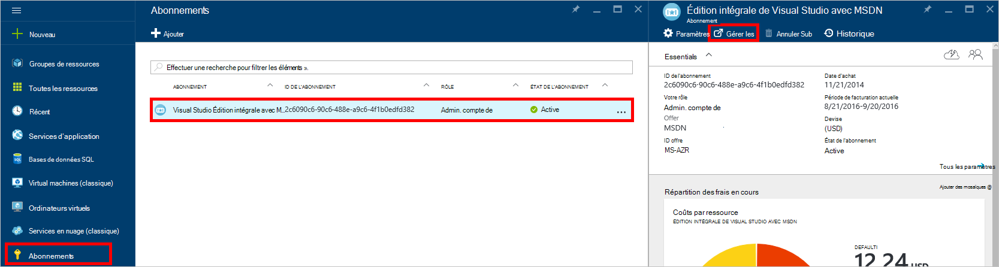
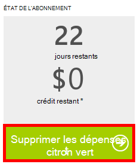

<properties
    pageTitle="Résolution des problèmes liés au portail de DocumentDB | Microsoft Azure"
    description="Découvrez pour résoudre les problèmes dans le portail DocumentDB Azure." 
    services="documentdb"
    documentationCenter=""
    authors="mimig1"
    manager="jhubbard"
    editor="monicar"/>

<tags
    ms.service="documentdb"
    ms.workload="data-services"
    ms.tgt_pltfrm="na"
    ms.devlang="na"
    ms.topic="article"
    ms.date="08/29/2016"
    ms.author="mimig"/>

# Azure portal DocumentDB des conseils de dépannage

Cet article décrit comment résoudre les problèmes de DocumentDB dans le portail Azure. 

## Il manque des ressources

**Symptôme**: les collections ou les bases de données sont manquantes à partir de votre portails lames.

**Solution**: réduisez l’utilisation des applications pour fonctionner sous le contingent du débit maximal de la collection. 

**Explication**: le portail est une application semblable aux autres, en effectuant des appels vers votre base de données de DocumentDB et de la collection. Si vos demandes sont actuellement limitées à cause des appels en cours à partir d’une application distincte, le portail peut également être limité, à l’origine de ressources affichées dans le portail. Pour résoudre le problème, résoudre la cause de l’utilisation du haut débit, puis actualisez la lame de portail. Vous trouverez des informations sur l’utilisation de débit inférieure et comment mesurer dans la section du [débit](documentdb-performance-tips.md#throughput) de l’article de [conseils de performances](documentdb-performance-tips.md) .
 
## Pages ou lames ne se chargent pas

**Symptôme**: ne pas affichent les Pages et les lames dans le portail.

**Solution**: réduisez l’utilisation des applications pour fonctionner sous le contingent du débit maximal de la collection. 

**Explication**: le portail est une application semblable aux autres, en effectuant des appels vers votre base de données de DocumentDB et de la collection. Si vos demandes sont actuellement limitées à cause des appels en cours à partir d’une application distincte, le portail peut également être limité, à l’origine de ressources affichées dans le portail. Pour résoudre le problème, résoudre la cause de l’utilisation du haut débit, puis actualisez la lame de portail. Vous trouverez des informations sur l’utilisation de débit inférieure et comment mesurer dans la section du [débit](documentdb-performance-tips.md#throughput) de l’article de [conseils de performances](documentdb-performance-tips.md) .

## Ajouter le bouton de Collection est désactivé

**Symptôme**: sur la lame de la base de données, le bouton **Ajouter la Collection** est désactivé.

**Explication**: Si votre abonnement Azure est associé à des crédits de l’avantage, telles que les crédits gratuits proposés à partir d’un abonnement MSDN, et que vous avez utilisé l’ensemble de vos crédits pour le mois, vous ne pouvez pas créer les collections supplémentaires dans DocumentDB.

**Solution**: supprimez le plafond des dépenses à partir de votre compte.

1. Dans le portail d’Azure, dans le Jumpbar, cliquez sur **abonnements**et cliquez sur l’abonnement associé à la base de données DocumentDB de la lame **d’abonnement** , cliquez sur **Gérer**. 
    

2. Dans la nouvelle fenêtre de navigateur, vous verrez que vous avez est épuisé. Cliquez sur le bouton **Supprimer le plafond des dépenses** pour supprimer les dépenses pour la période de facturation actuelle ou indéfiniment. Puis terminez l’Assistant pour ajouter ou confirmer vos informations de carte de crédit. 
    

 
## Explorateur de la requête est terminée avec des erreurs

Reportez-vous à la section [Dépannage de requête Explorer](documentdb-query-collections-query-explorer.md#troubleshoot).

## Aucune donnée disponible dans la surveillance des mosaïques

Consultez [dépannage analyse des mosaïques](documentdb-monitor-accounts.md#troubleshooting).

## Aucun document renvoyé dans l’Explorateur de Document

Voir [dépanner l’Explorateur de Document](documentdb-view-json-document-explorer.md#troubleshoot).

## Étapes suivantes

Si vous rencontrez toujours des problèmes dans le portail, veuillez envoyer un e-mail [askdocdb@microsoft.com](mailto:askdocdb@microsoft.com) pour obtenir de l’aide ou le fichier, une demande d’assistance dans le portail en cliquant sur **Parcourir**, **aide + support**, puis en cliquant sur **demande de prise en charge de création**.
