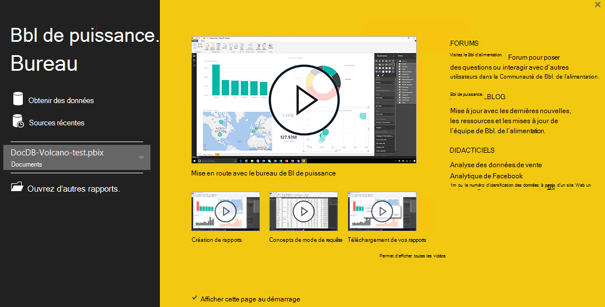
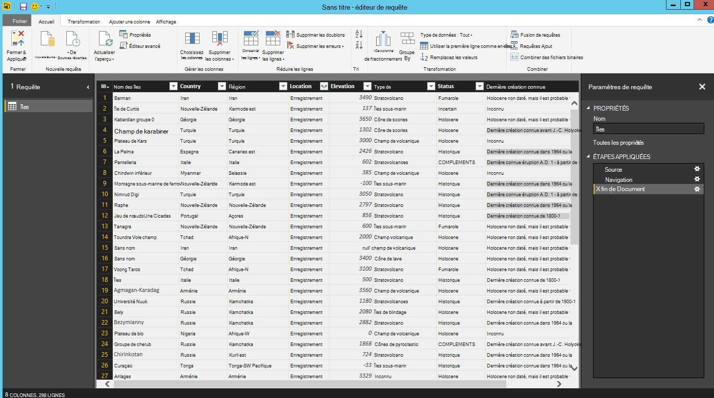

<properties
    pageTitle="Didacticiel de BI d’alimentation pour connecteur de DocumentDB | Microsoft Azure"
    description="Ce didacticiel BI d’alimentation permet d’importer JSON, créer des rapports détaillés et de visualiser des données en utilisant le connecteur DocumentDB et alimentation BI."
    keywords="didacticiel bi de puissance, de visualiser des données, bi connecteur d’alimentation"
    services="documentdb"
    authors="h0n"
    manager="jhubbard"
    editor="mimig"
    documentationCenter=""/>

<tags
    ms.service="documentdb"
    ms.workload="data-services"
    ms.tgt_pltfrm="na"
    ms.devlang="na"
    ms.topic="article"
    ms.date="09/22/2016"
    ms.author="hawong"/>

# Didacticiel de BI de puissance pour DocumentDB : visualiser des données en utilisant le connecteur d’alimentation BI

[PowerBI.com](https://powerbi.microsoft.com/) est un service en ligne où vous pouvez créer et partager des tableaux de bord et des rapports avec des données qui sont importantes pour vous et votre entreprise.  Bureau de BI de puissance est un outil qui vous permet de récupérer des données provenant de diverses sources de données, fusionner transformer les données, créer des visualisations et des rapports puissants et publier les rapports à l’analyse Décisionnelle de puissance de création de rapports dédié.  Avec la dernière version de bureau de BI d’alimentation, vous pouvez maintenant vous connecter à votre compte via le connecteur DocumentDB de la DocumentDB pour le décisionnel d’alimentation.   

Dans ce didacticiel Power BI, nous les différentes étapes pour vous connecter à un compte DocumentDB de puissance BI Desktop, accédez à une collection dans laquelle nous souhaitons extraire les données à l’aide du navigateur, transformer les données JSON sous forme de tableau à l’aide de la puissance BI éditeur de requête du bureau et créer et publier un rapport sur PowerBI.com.

Après avoir terminé ce didacticiel Power BI, vous serez en mesure de répondre aux questions suivantes :  

-   Comment puis-je créer des rapports avec des données à partir de DocumentDB à l’aide de la puissance BI bureau ?
-   Comment puis-je connecter à un compte DocumentDB de puissance BI Desktop ?
-   Comment puis-je récupérer des données à partir d’une collection dans le bureau de BI de puissance ?
-   Comment puis-je pour transformer des données JSON imbriquées dans un bureau de BI de puissance ?
-   Comment puis-je publier et partager mes rapports dans PowerBI.com ?

## Conditions préalables

Avant de suivre les instructions dans ce didacticiel BI d’alimentation, assurez-vous que vous disposez des éléments suivants :

- [La dernière version de bureau de BI d’alimentation](https://powerbi.microsoft.com/desktop).
- Accès à notre compte de démonstration ou des données de votre compte Azure DocumentDB.
    - Le compte de démonstration est rempli avec les données de volcano indiquées dans ce didacticiel. Ce compte de démonstration n’est pas lié par des SLA et est destiné uniquement à des fins de démonstration.  Nous réserve le droit d’apporter des modifications à ce compte de démonstration, y compris mais non limité à, termine le compte, la modification de la clé, restriction de l’accès, la modification et supprimer les données, à tout moment sans préavis ni motif.
        - URL : https://analytics.documents.azure.com
        - Clé en lecture seule : MSr6kt7Gn0YRQbjd6RbTnTt7VHc5ohaAFu7osF0HdyQmfR + YhwCH2D2jcczVIR1LNK3nMPNBD31losN7lQ/fkw ==
    - Ou, pour créer votre propre compte, [créer un compte de base de données DocumentDB en utilisant le portail Azure](https://azure.microsoft.com/documentation/articles/documentdb-create-account/). Ensuite, pour obtenir les îles exemple données qui ressemble à ce qui sont utilisées dans ce didacticiel (mais ne contient pas les blocs de GeoJSON), consultez le [site de NOAA](https://www.ngdc.noaa.gov/nndc/struts/form?t=102557&s=5&d=5) et puis importez les données à l’aide de l' [outil de migration de données DocumentDB](https://azure.microsoft.com/documentation/articles/documentdb-import-data/).

Pour partager vos rapports dans PowerBI.com, vous devez posséder un compte dans PowerBI.com.  Pour plus d’informations sur BI de puissance pour libre et alimentation BI Pro, visitez le site [https://powerbi.microsoft.com/pricing](https://powerbi.microsoft.com/pricing).

## Allons-y
Dans ce didacticiel, imaginons que vous êtes un geologist l’étude des volcans du monde entier.  Les données d’îles sont stockées dans un compte de DocumentDB et les documents JSON similaire à celle ci-dessous.

    {
        "Volcano Name": "Rainier",
        "Country": "United States",
        "Region": "US-Washington",
        "Location": {
            "type": "Point",
            "coordinates": [
            -121.758,
            46.87
            ]
        },
        "Elevation": 4392,
        "Type": "Stratovolcano",
        "Status": "Dendrochronology",
        "Last Known Eruption": "Last known eruption from 1800-1899, inclusive"
    }

Vous souhaitez récupérer les données volcano le DocumentDB compte et visualisez des données dans un rapport de puissance BI interactif comme celui présenté ci-dessous.

Êtes-vous prêt à essayer ? Allons-y.

1. Exécution d’alimentation BI bureau sur votre station de travail.
2. Une fois l’alimentation BI bureau est lancée, un écran de *Bienvenue* s’affiche.

    

3. Vous pouvez **Obtenir les données**, voir **Sources récentes**ou **Ouvrir un autre état** directement à partir de l’écran de *Bienvenue* .  Cliquez sur le X dans le coin supérieur droit pour fermer l’écran. Le **rapport** de puissance BI bureau s’affiche.

    

4. Sélectionnez le ruban **accueil** , puis cliquez sur **Obtenir les données**.  La fenêtre **Obtenir des données** doit s’afficher.

5. Cliquez sur **Azure**, sélectionnez **Microsoft Azure DocumentDB (bêta)**, puis cliquez sur **se connecter**.  La fenêtre de **Connexion de Microsoft Azure DocumentDB** s’affiche.

    

6. Spécifiez l’URL de point de terminaison du compte DocumentDB vous souhaitez récupérer les données, comme indiqué ci-dessous, puis cliquez sur **OK**. Vous pouvez récupérer l’URL dans la zone URI dans la lame **[clés](documentdb-manage-account.md#keys)** du portail Azure ou vous pouvez utiliser le compte de démonstration, auquel cas l’URL est `https://analytics.documents.azure.com`. 

    Renseignez le nom de la base de données, nom de la collection et les instruction SQL comme ces champs sont facultatifs.  Au lieu de cela, nous utiliserons le navigateur pour sélectionner la base de données et la Collection d’identifier d'où proviennent les données.

    

7. Si vous vous connectez à ce point de terminaison pour la première fois, le système vous demandera de la clé de compte.  Vous pouvez récupérer la clé dans la zone de la **Clé primaire** de la lame de **[clés en lecture seule](documentdb-manage-account.md#keys)** du portail Azure, ou vous pouvez utiliser le compte de démonstration, auquel cas la clé est `RcEBrRI2xVnlWheejXncHId6QRcKdCGQSW6uSUEgroYBWVnujW3YWvgiG2ePZ0P0TppsrMgscoxsO7cf6mOpcA==`. Entrez la clé de compte, puis cliquez sur **se connecter**.

    Nous vous recommandons d’utiliser la clé en lecture seule lors de la génération de rapports.  Cela empêchera toute exposition inutile de la clé principale à des risques de sécurité potentiels. La clé en lecture seule est disponible à partir de la blade de [clés](documentdb-manage-account.md#keys) du portail Azure, ou vous pouvez utiliser les informations de compte de démonstration fournies ci-dessus.

    

8. Lorsque le compte est correctement connecté, le **navigateur** s’affiche.  Le **navigateur** affiche une liste des bases de données sous le compte.
9. Cliquez sur, puis développez la base de données d'où vont provenir les données pour le rapport, si vous utilisez le compte de démonstration, sélectionnez **volcanodb**.   

10. Maintenant, sélectionnez une collection que vous allez extraire des données. Si vous utilisez le compte de démonstration, sélectionnez **volcano1**.

    Le volet de visualisation affiche la liste des éléments de **l’enregistrement** .  Un Document est représenté sous la forme d’un type **d’enregistrement** de puissance BI. De même, un bloc JSON imbriqué à l’intérieur d’un document est également un **enregistrement**.

    

11. Cliquez sur **Modifier** pour lancer l’éditeur de requête pour transformer les données.

## Mise à plat et transformation de documents JSON
1. Dans l’éditeur de requête de BI d’alimentation, vous devez voir une colonne de **Document** dans le volet central.

2. Cliquez sur l’expanseur dans la partie droite de l’en-tête de colonne de **Document** .  Le menu contextuel avec une liste de champs s’affiche.  Sélectionnez les champs que vous avez besoin pour votre rapport, par exemple, nom d’îles, pays, région, emplacement, élévation, Type, état et dernière création de connaître, et puis cliquez sur **OK**.

    

3. Le volet central affiche un aperçu du résultat avec les champs sélectionnés.

    

4. Dans notre exemple, la propriété Location est un bloc de GeoJSON dans un document.  Comme vous pouvez le voir, l’emplacement est représenté sous la forme d’un type **d’enregistrement** de puissance BI Desktop.  
5. Cliquez sur l’expanseur dans la partie droite de l’en-tête de colonne emplacement.  Le menu contextuel avec les coordonnées et le type des champs s’affiche.  Nous allons sélectionner le champ de coordonnées et cliquez sur **OK**.

    

6. Le volet central affiche maintenant une colonne de coordonnées de la **liste** type.  Comme indiqué au début de ce didacticiel, les données de GeoJSON dans ce didacticiel sont de type Point avec des valeurs de Latitude et de Longitude enregistrés dans le tableau de coordonnées.

    L’élément de coordonnées [0] représente la Longitude pendant que les coordonnées [1] représente la Latitude.
    

7. Pour aplatir le tableau des coordonnées, nous allons créer une **Colonne personnalisé** appelé LatLong.  Sélectionnez le ruban **d’Ajouter une colonne** , puis cliquez sur **Ajouter une colonne personnalisée**.  La fenêtre **Ajouter une colonne personnalisée** s’affiche.

8. Fournissez un nom pour la nouvelle colonne, par exemple, LatLong.

9. Ensuite, indiquez la formule personnalisée pour la nouvelle colonne.  Dans notre exemple, nous avons concatène les valeurs de Latitude et de Longitude, séparées par une virgule, comme indiqué ci-dessous à l’aide de la formule suivante : `Text.From([Document.Location.coordinates]{1})&","&Text.From([Document.Location.coordinates]{0})`. Cliquez sur **OK**.

    Pour plus d’informations sur les données Analysis Expressions (DAX) y compris les fonctions DAX, visitez le site [Base de DAX dans le bureau de BI d’alimentation](https://support.powerbi.com/knowledgebase/articles/554619-dax-basics-in-power-bi-desktop).

    

10. Le volet central affiche maintenant, la nouvelle colonne LatLong remplie avec les valeurs de Latitude et de Longitude, séparées par une virgule.

    

    Si vous recevez une erreur dans la nouvelle colonne, assurez-vous que les étapes appliquées sous les paramètres de requête correspond à l’illustration suivante :

    

    Si vos étapes sont différentes, supprimer les étapes supplémentaires et essayez de nouveau d’ajouter la colonne personnalisée. 

11. Nous avons terminé l’aplatissement de données au format tabulaire.  Vous pouvez tirer parti de toutes les fonctionnalités disponibles dans l’éditeur de requête pour la forme et transformer des données dans DocumentDB.  Si vous utilisez l’exemple, vous pouvez modifier le type de données d’élévation d’un **nombre entier** en modifiant le **Type de données** sur le ruban **accueil** .

    

12. Cliquez sur **Fermer et appliquer** pour enregistrer le modèle de données.

    

## Les rapports de build
Affichage du rapport de bureau de BI d’alimentation est où vous pouvez commencer la création de rapports permettant de visualiser les données.  Vous pouvez créer des rapports en faisant glisser des champs dans la zone de **rapport** .

Dans la vue de rapport, vous devriez trouver :

 1. Le volet **champs** , il s’agit d’où vous verrez une liste de modèles de données avec les champs que vous pouvez utiliser pour vos rapports.

 2. Le volet de **visualisation** . Un rapport peut contenir une seule ou plusieurs visualisations.  Choisissez les types visual raccord vos besoins dans le volet de **visualisation** .

 3. La zone de **rapport** , il s’agit d’où vous allez créer les effets visuels de votre rapport.

 4. La page de **rapport** . Vous pouvez ajouter plusieurs pages du rapport de puissance BI Desktop.

Voici les principales étapes de création d’un rapport d’affichage carte interactif simple.

1. Dans notre exemple, nous allons créer une vue de carte indiquant l’emplacement de chaque volcano.  Dans le volet de **visualisation** , cliquez sur le type visuel de la carte en surbrillance dans la capture d’écran ci-dessus.  Vous devez voir le type visuel de carte peint sur la zone de **rapport** .  Le volet de **visualisation** doit également afficher un ensemble de propriétés associées au type visual Map.

2. Maintenant, faites glisser déposer le champ LatLong du volet **champs** à la propriété de **l’emplacement** dans le volet de **visualisation** .
3. Ensuite, faites glisser déposer le champ Volcano nom à la propriété de **légende** .  

4. Puis, faites glisser déposer le champ de l’élévation à la propriété **Size** .  

5. Vous devez maintenant voir le mappage visual contenant un ensemble de bulles indiquant l’emplacement de chaque volcano avec la taille de la bulle de corrélation pour l’élévation de la volcano.

6. Vous avez maintenant créé un rapport de base.  Vous pouvez personnaliser le rapport en ajoutant davantage de visualisations.  Dans notre cas, nous avons ajouté un segment Volcano Type pour que le rapport interactif.  

    

## Publication et partage de votre rapport
Pour partager votre rapport, vous devez posséder un compte dans PowerBI.com.

1. Dans le bureau de BI d’alimentation, cliquez sur le ruban **accueil** .
2. Cliquez sur **Publier**.  Vous devrez entrer le nom d’utilisateur et le mot de passe pour votre compte de PowerBI.com.
3. Une fois les informations d’identification a été authentifiée, le rapport est publié à la destination que vous avez sélectionné.
4. Cliquez sur **Ouvrir 'PowerBITutorial.pbix' alimentation BI** pour afficher et partager votre rapport sur PowerBI.com.

    

## Créer un tableau de bord dans PowerBI.com

Maintenant que vous disposez d’un rapport, vous permet de partager sur PowerBI.com

Lorsque vous publiez votre rapport de puissance BI Bureau à PowerBI.com, il génère un **rapport** et un **groupe de données** dans vos clients PowerBI.com. Par exemple, une fois que vous avez publié un rapport nommé **PowerBITutorial** à PowerBI.com, vous verrez PowerBITutorial dans les **rapports** et les **groupes de données** à la fois des sections sur PowerBI.com.

   

Pour créer un tableau de bord qui peut être partagé, cliquez sur le bouton de la **Page de code Pin Live** sur votre état de PowerBI.com.

   

Puis suivez les instructions de [code Pin une mosaïque à partir d’un rapport](https://powerbi.microsoft.com/documentation/powerbi-service-pin-a-tile-to-a-dashboard-from-a-report/#pin-a-tile-from-a-report) pour créer un nouveau tableau de bord. 

Vous pouvez également effectuer des modifications ad hoc au rapport avant de créer un tableau de bord. Toutefois, il est recommandé d’utiliser alimentation BI bureau pour effectuer des modifications et le republier l’état PowerBI.com.

## Actualiser les données de PowerBI.com

Il existe deux manières d’actualiser les données, ad hoc et planifiées.

Pour une actualisation ad hoc, cliquez simplement sur les eclipses (...) par le **groupe de données**, par exemple, PowerBITutorial. Vous devez voir une liste des actions, y compris les **Actualiser maintenant**. Cliquez sur **Actualiser maintenant** pour actualiser les données.

Pour une actualisation planifiée, effectuez les opérations suivantes.

1. Dans la liste action, cliquez sur **Actualiser de la planification** . 
    

2. Dans la page **paramètres** , développez **la source de données d’informations d’identification**. 

3. Cliquez sur **Modifier les informations d’identification**. 

    La fenêtre contextuelle de configuration s’affiche. 

4. Entrez la clé pour se connecter au compte DocumentDB pour ce jeu de données, puis cliquez sur **connexion**. 

5. Développez **l’Actualisation de la planification** et de la planification que vous voulez actualiser le groupe de données. 
  
6. Cliquez sur **Appliquer** et vous avez terminé le paramétrage de l’actualisation planifiée.

## Étapes suivantes
- Pour en savoir plus sur la puissance BI, reportez-vous à la section [mise en route de puissance BI](https://powerbi.microsoft.com/documentation/powerbi-service-get-started/).
- Pour en savoir plus sur DocumentDB, reportez-vous à la [documentation de DocumentDB page d’accueil](https://azure.microsoft.com/documentation/services/documentdb/).
