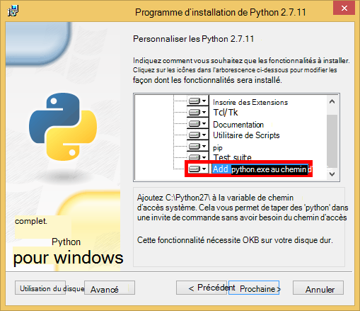

<properties
    pageTitle="Développement d’applications Web Python ballon avec DocumentDB | Microsoft Azure"
    description="Consulter un didacticiel de la base de données sur l’utilisation de DocumentDB pour stocker et accéder aux données d’une application web de Python ballon hébergée sur Azure. Trouver des solutions de développement d’application." 
    keywords="Développement d’applications, didacticiel de la base de données, ballon de python, application web de python, développement web de python, documentdb, azure, Microsoft azure"
    services="documentdb"
    documentationCenter="python"
    authors="syamkmsft"
    manager="jhubbard"
    editor="cgronlun"/>

<tags
    ms.service="documentdb"
    ms.workload="data-management"
    ms.tgt_pltfrm="na"
    ms.devlang="python"
    ms.topic="hero-article"
    ms.date="08/25/2016"
    ms.author="syamk"/>

# <a name="python-flask-web-application-development-with-documentdb"></a>Développement d’applications Web Python ballon avec DocumentDB

> [AZURE.SELECTOR]
- [.NET](documentdb-dotnet-application.md)
- [Node.js](documentdb-nodejs-application.md)
- [Java](documentdb-java-application.md)
- [Python](documentdb-python-application.md)

Ce didacticiel vous montre comment Azure DocumentDB permet de stocker et d’accéder aux données à partir d’un Python web application hébergée sur Azure et suppose que vous avez une expérience préalable en utilisant les Python et sites Web Azure.

Ce didacticiel couvre :

1. Création et configuration d’un compte DocumentDB.
2. Création d’une application MVC de Python.
3. Connexion à et l’utilisation de DocumentDB d’Azure à partir de votre application web.
4. Déploiement de l’application web pour les sites Web d’Azure.

En suivant ce didacticiel, vous allez générer une application de vote simple qui vous permet de voter pour un sondage.


## <a name="database-tutorial-prerequisites"></a>Conditions préalables didacticiels de base de données

Avant de suivre les instructions fournies dans cet article, vous devez vous assurer d’avoir les éléments suivants :

- Un compte Azure actif. Si vous n’avez pas un compte, vous pouvez créer un compte d’essai gratuit dans quelques minutes. Pour plus d’informations, reportez-vous à la section [D’essai Azure](https://azure.microsoft.com/pricing/free-trial/).
- [Visual Studio 2013](http://www.visualstudio.com/) ou supérieur, ou [Express de Visual Studio](), qui est la version gratuite. Les instructions de ce didacticiel sont écrits spécifiquement pour Visual Studio 2015. 
- Outils de Python de Visual Studio à partir de [GitHub](http://microsoft.github.io/PTVS/). Ce didacticiel utilise les Python outils pour VS 2015. 
- Azure SDK de Python pour Visual Studio, version 2.4 ou supérieure disponible à partir de [azure.com](https://azure.microsoft.com/downloads/). Nous avons utilisé Microsoft Azure SDK pour les Python 2.7.
- Les Python 2.7 à partir de [python.org][2]. Nous avons utilisé les Python 2.7.11. 

> [AZURE.IMPORTANT] Si vous installez les Python 2.7 pour la première fois, vérifiez que dans l’écran Personnaliser les Python 2.7.11, vous sélectionnez **Ajouter python.exe au chemin d’accès**.
> 
>    

- Compilateur Microsoft Visual C++ pour les Python 2.7 à partir du [Centre de téléchargement Microsoft][3].

## <a name="step-1-create-a-documentdb-database-account"></a>Étape 1 : Créer un compte de base de données DocumentDB

Commençons par créer un compte DocumentDB. Si vous avez déjà un compte, vous pouvez passer à [étape 2 : créer une application web ballon de Python](#step-2:-create-a-new-python-flask-web-application).

[AZURE.INCLUDE [documentdb-create-dbaccount](../../includes/documentdb-create-dbaccount.md)]

<br/>
Nous étudierons maintenant comment créer une application web à partir du sol Python fiole jusqu'à.

## <a name="step-2-create-a-new-python-flask-web-application"></a>Étape 2 : Créer une application web Python ballon

1. Dans Visual Studio, dans le menu **fichier** , pointez sur **Nouveau**, puis cliquez sur **projet**.

    La boîte de dialogue **Nouveau projet** s’affiche.

2. Dans le volet gauche, développez **modèles** , puis les **Python**, puis cliquez sur **Web**. 

3. Sélectionnez le **Projet Web de fiole** dans le volet central, puis dans le **nom de** zone type **didacticiel**et puis cliquez sur **OK**. N’oubliez pas que les noms de package Python doivent être entièrement en minuscules, comme décrit dans le [Guide de Style pour les Python Code](https://www.python.org/dev/peps/pep-0008/#package-and-module-names).

    Pour les nouveaux pour les Python ballon, il s’agit d’une infrastructure de développement d’application web qui vous permet de créer plus rapidement des applications web dans les Python.

    

4. Dans la fenêtre **Outils de Python pour Visual Studio** , cliquez sur **installer dans un environnement virtuel**. 

    

5. Dans la fenêtre **Ajouter l’environnement virtuel** , vous pouvez accepter les valeurs par défaut et utiliser les Python 2.7 comme environnement de base, car PyDocumentDB ne prend pas en charge les Python 3.x, puis cliquez sur **créer**. Il définit l’environnement virtuel Python requis pour votre projet.

    

    La fenêtre Sortie affiche `Successfully installed Flask-0.10.1 Jinja2-2.8 MarkupSafe-0.23 Werkzeug-0.11.5 itsdangerous-0.24 'requirements.txt' was installed successfully.` lorsque l’environnement est installé avec succès.

## <a name="step-3-modify-the-python-flask-web-application"></a>Étape 3 : Modifier l’application web de Python ballon

### <a name="add-the-python-flask-packages-to-your-project"></a>Ajouter les packages de Python ballon à votre projet

Après avoir configuré votre projet, vous devrez ajouter les packages requis de la fiole à votre projet, y compris les pydocumentdb, le package de Python pour DocumentDB.

1. Dans l’Explorateur de solutions, ouvrez le fichier nommé **requirements.txt** et remplacez le contenu par le texte suivant :

        flask==0.9
        flask-mail==0.7.6
        sqlalchemy==0.7.9
        flask-sqlalchemy==0.16
        sqlalchemy-migrate==0.7.2
        flask-whooshalchemy==0.55a
        flask-wtf==0.8.4
        pytz==2013b
        flask-babel==0.8
        flup
        pydocumentdb>=1.0.0

2. Enregistrez le fichier **requirements.txt** . 
3. Dans l’Explorateur de solutions, cliquez sur **env** et cliquez sur **installer à partir de requirements.txt**.

    

    Après la réussite de l’installation, la fenêtre Sortie affiche les éléments suivants :

        Successfully installed Babel-2.3.2 Tempita-0.5.2 WTForms-2.1 Whoosh-2.7.4 blinker-1.4 decorator-4.0.9 flask-0.9 flask-babel-0.8 flask-mail-0.7.6 flask-sqlalchemy-0.16 flask-whooshalchemy-0.55a0 flask-wtf-0.8.4 flup-1.0.2 pydocumentdb-1.6.1 pytz-2013b0 speaklater-1.3 sqlalchemy-0.7.9 sqlalchemy-migrate-0.7.2

    > [AZURE.NOTE] Dans de rares cas, vous pouvez voir une défaillance dans la fenêtre Sortie. Dans ce cas, vérifiez si l’erreur est liée au nettoyage. Parfois, le nettoyage échoue, mais l’installation sera toujours réussie (défilement vers le haut dans la fenêtre de sortie pour le vérifier). Vous pouvez vérifier votre installation en [vérifiant l’environnement virtuel](#verify-the-virtual-environment). Si l’installation a échoué, mais la vérification est réussie, il est OK pour continuer.

### <a name="verify-the-virtual-environment"></a>Vérification de l’environnement virtuel

Assurons-nous que tout est installé correctement.

1. Générez la solution en appuyant sur **Ctrl**+**MAJ**+**B**.
2. Une fois la génération réussit, démarrez le site Web en appuyant sur **F5**. Cela lance le serveur de développement ballon et lance votre navigateur web. Vous devez voir la page suivante.

    

3. Arrêter le débogage du site Web en appuyant sur **MAJ**+**F5** dans Visual Studio.

### <a name="create-database-collection-and-document-definitions"></a>Créer une base de données, de collecte et de définitions de document

Maintenant nous allons créer votre application de vote par l’ajout de nouveaux fichiers et de mise à jour d’autres utilisateurs.

1. Dans l’Explorateur de solutions, droit sur le projet du **didacticiel** , cliquez sur **Ajouter**, puis cliquez sur **Nouvel élément**. Sélectionnez le **Fichier vide de Python** et nommez le fichier **forms.py**.  
2. Ajoutez le code suivant au fichier forms.py, puis enregistrez le fichier.

```python
from flask.ext.wtf import Form
from wtforms import RadioField

class VoteForm(Form):
    deploy_preference  = RadioField('Deployment Preference', choices=[
        ('Web Site', 'Web Site'),
        ('Cloud Service', 'Cloud Service'),
        ('Virtual Machine', 'Virtual Machine')], default='Web Site')
```


### <a name="add-the-required-imports-to-viewspy"></a>Ajoutez les importations requises pour views.py

1. Dans l’Explorateur de solutions, développez le dossier du **didacticiel** et ouvrez le fichier **views.py** . 
2. Ajoutez les instructions import au début du fichier **views.py** les opérations suivantes, puis enregistrement le fichier. Importer les PythonSDK de DocumentDB et les packages de la fiole.

    ```python
    from forms import VoteForm
    import config
    import pydocumentdb.document_client as document_client
    ```


### <a name="create-database-collection-and-document"></a>Créer une base de données, de collecte et de document

- En **views.py**, ajoutez le code suivant à la fin du fichier. Il prend en charge de la création de la base de données utilisée par le formulaire. Ne supprimez pas le code existant dans **views.py**. Simplement l’ajouter à la fin.

```python
@app.route('/create')
def create():
    """Renders the contact page."""
    client = document_client.DocumentClient(config.DOCUMENTDB_HOST, {'masterKey': config.DOCUMENTDB_KEY})

    # Attempt to delete the database.  This allows this to be used to recreate as well as create
    try:
        db = next((data for data in client.ReadDatabases() if data['id'] == config.DOCUMENTDB_DATABASE))
        client.DeleteDatabase(db['_self'])
    except:
        pass

    # Create database
    db = client.CreateDatabase({ 'id': config.DOCUMENTDB_DATABASE })

    # Create collection
    collection = client.CreateCollection(db['_self'],{ 'id': config.DOCUMENTDB_COLLECTION })

    # Create document
    document = client.CreateDocument(collection['_self'],
        { 'id': config.DOCUMENTDB_DOCUMENT,
          'Web Site': 0,
          'Cloud Service': 0,
          'Virtual Machine': 0,
          'name': config.DOCUMENTDB_DOCUMENT 
        })

    return render_template(
       'create.html',
        title='Create Page',
        year=datetime.now().year,
        message='You just created a new database, collection, and document.  Your old votes have been deleted')
```

> [AZURE.TIP] La méthode **CreateCollection** prend une option **RequestOptions** comme troisième paramètre. Cela peut servir à spécifier le Type d’offre pour la collection. Si aucune valeur d’offerType n’est fourni, puis la collection sera créée à l’aide du proposer le Type par défaut. Pour plus d’informations sur les Types d’offre DocumentDB, consultez [niveaux de performances dans DocumentDB](documentdb-performance-levels.md).


### <a name="read-database-collection-document-and-submit-form"></a>Lire le document, la collection, la base de données et soumettre le formulaire

- En **views.py**, ajoutez le code suivant à la fin du fichier. Cette méthode s’occupe de la configuration de l’écran, la lecture de la base de données, la collection et le document. Ne supprimez pas le code existant dans **views.py**. Simplement l’ajouter à la fin.

```python
@app.route('/vote', methods=['GET', 'POST'])
def vote(): 
    form = VoteForm()
    replaced_document ={}
    if form.validate_on_submit(): # is user submitted vote  
        client = document_client.DocumentClient(config.DOCUMENTDB_HOST, {'masterKey': config.DOCUMENTDB_KEY})

        # Read databases and take first since id should not be duplicated.
        db = next((data for data in client.ReadDatabases() if data['id'] == config.DOCUMENTDB_DATABASE))

        # Read collections and take first since id should not be duplicated.
        coll = next((coll for coll in client.ReadCollections(db['_self']) if coll['id'] == config.DOCUMENTDB_COLLECTION))

        # Read documents and take first since id should not be duplicated.
        doc = next((doc for doc in client.ReadDocuments(coll['_self']) if doc['id'] == config.DOCUMENTDB_DOCUMENT))

        # Take the data from the deploy_preference and increment our database
        doc[form.deploy_preference.data] = doc[form.deploy_preference.data] + 1
        replaced_document = client.ReplaceDocument(doc['_self'], doc)

        # Create a model to pass to results.html
        class VoteObject:
            choices = dict()
            total_votes = 0

        vote_object = VoteObject()
        vote_object.choices = {
            "Web Site" : doc['Web Site'],
            "Cloud Service" : doc['Cloud Service'],
            "Virtual Machine" : doc['Virtual Machine']
        }
        vote_object.total_votes = sum(vote_object.choices.values())

        return render_template(
            'results.html', 
            year=datetime.now().year, 
            vote_object = vote_object)

    else :
        return render_template(
            'vote.html', 
            title = 'Vote',
            year=datetime.now().year,
            form = form)
```


### <a name="create-the-html-files"></a>Créez les fichiers HTML

1. Dans l’Explorateur de solutions, dans le dossier du **didacticiel** , cliquez avec le bouton droit sur le dossier **modèles** , cliquez sur **Ajouter**, puis cliquez sur **Nouvel élément**. 
2. Sélectionnez **Une HTML Page**et puis dans la zone Nom, tapez **create.html**. 
3. Répétez les étapes 1 et 2 pour créer deux fichiers HTML supplémentaires : results.html et vote.html.
4. Ajoutez le code suivant à **create.html** dans les `<body>` élément. Il affiche un message indiquant que nous avons créé une nouvelle base de données, la collection et le document.

    ```html
    
    
    <h2>{{ title }}.</h2>
    <h3>{{ message }}</h3>
    <p><a href="{{ url_for('vote') }}" class="btn btn-primary btn-large">Vote &raquo;</a></p>
    
    ```

5. Ajoutez le code suivant à **results.html** dans les `<body`> élément. Il affiche les résultats de l’interrogation.

    ```html
    
    
    <h2>Results of the vote</h2>
        <br />
        
    
    <div class="row">
        <div class="col-sm-5">{{choice}}</div>
            <div class="col-sm-5">
                <div class="progress">
                    <div class="progress-bar" role="progressbar" aria-valuenow="{{vote_object.choices[choice]}}" aria-valuemin="0" aria-valuemax="{{vote_object.total_votes}}" style="width: {{(vote_object.choices[choice]/vote_object.total_votes)*100}}%;">
                                {{vote_object.choices[choice]}}
                </div>
            </div>
            </div>
    </div>
    
    
    <br />
    <a class="btn btn-primary" href="{{ url_for('vote') }}">Vote again?</a>
    
    ```

6. Ajoutez le code suivant à **vote.html** dans les `<body`> élément. Il affiche le sondage et accepte les voix. Sur l’enregistrement de la voix, le contrôle est passé à views.py où nous reconnaît le cast de vote et ajouter le document en conséquence.

    ```html
    
    
    <h2>What is your favorite way to host an application on Azure?</h2>
    <form action="" method="post" name="vote">
        {{form.hidden_tag()}}
            {{form.deploy_preference}}
            <button class="btn btn-primary" type="submit">Vote</button>
    </form>
    
    ```

7. Dans le dossier **modèles** , remplacez le contenu de **index.html** suit. Ceci sert de la page de lancement de votre application.
    
    ```html
    
    
    <h2>Python + DocumentDB Voting Application.</h2>
    <h3>This is a sample DocumentDB voting application using PyDocumentDB</h3>
    <p><a href="{{ url_for('create') }}" class="btn btn-primary btn-large">Create/Clear the Voting Database &raquo;</a></p>
    <p><a href="{{ url_for('vote') }}" class="btn btn-primary btn-large">Vote &raquo;</a></p>
    
    ```

### <a name="add-a-configuration-file-and-change-the-initpy"></a>Ajoutez un fichier de configuration et modifiez le \_ \_init\_\_.py

1. Dans l’Explorateur de solutions, droit sur le projet du **didacticiel** et cliquez sur **Ajouter**, cliquez sur **Nouvel élément**, sélectionnez **Fichier de Python vide**, puis nommez le fichier **config.py**. Ce fichier de configuration est requis par les formulaires dans la fiole. Vous pouvez l’utiliser pour fournir une clé secrète ainsi. Cette clé n’est pas nécessaire mais pour ce didacticiel.

2. Ajoutez le code suivant à config.py, vous devez modifier les valeurs de **DOCUMENTDB\_hôte** et **DOCUMENTDB\_clé** à l’étape suivante.

    ```python
    CSRF_ENABLED = True
    SECRET_KEY = 'you-will-never-guess'
    
    DOCUMENTDB_HOST = 'https://YOUR_DOCUMENTDB_NAME.documents.azure.com:443/'
    DOCUMENTDB_KEY = 'YOUR_SECRET_KEY_ENDING_IN_=='
    
    DOCUMENTDB_DATABASE = 'voting database'
    DOCUMENTDB_COLLECTION = 'voting collection'
    DOCUMENTDB_DOCUMENT = 'voting document'
    ```

3. Dans [Azure portal](https://portal.azure.com/), atteindre la lame de **clés** en cliquant sur **Parcourir**, **Comptes de DocumentDB**, cliquez deux fois sur le nom du compte à utiliser, puis cliquez sur le bouton **touches** dans la zone **Essentials** . De la lame de **clés** , copiez la valeur de **l’URI** et le coller dans le fichier **config.py** , en tant que la valeur de la **DOCUMENTDB\_hôte** propriété. 
4. Le portail Azure dans la lame **clés** , copiez la valeur de la **Clé primaire** ou la **Clé secondaire**précédent et collez-le dans le fichier **config.py** , en tant que la valeur de la **DOCUMENTDB\_clé** propriété.
5. Dans la ** \_ \_init\_\_.py** , ajoutez la ligne suivante. 

        app.config.from_object('config')

    Afin que le contenu du fichier est :

    ```python
    from flask import Flask
    app = Flask(__name__)
    app.config.from_object('config')
    import tutorial.views
    ```

6. Après avoir ajouté tous les fichiers, l’Explorateur de solutions doit ressembler à ceci :

    


## <a name="step-4-run-your-web-application-locally"></a>Étape 4 : Exécution de votre application web localement

1. Générez la solution en appuyant sur **Ctrl**+**MAJ**+**B**.
2. Une fois la génération réussit, démarrez le site Web en appuyant sur **F5**. Vous devez voir les éléments suivants sur votre écran.

    

3. Cliquez sur **Créer/effacer la base de données Scrutin** pour générer la base de données.

    

4. Ensuite, cliquez sur **Vote** et sélectionnez votre option.

    

5. Pour chaque vote que vous effectuer un cast, il incrémente le compteur approprié.

    

6. Arrêter le débogage du projet en appuyant sur MAJ + F5.

## <a name="step-5-deploy-the-web-application-to-azure-websites"></a>Étape 5 : Déployer l’application web pour les sites Web d’Azure

Maintenant que vous avez l’application complète fonctionne correctement par rapport à DocumentDB, nous allons déployer vers des sites Web d’Azure.

1. Cliquez sur le projet dans l’Explorateur de solutions (Assurez-vous que vous n’êtes pas toujours exécuter localement) et sélectionnez **Publier**.  

    

2. Dans la fenêtre **Publier le site Web** , sélectionnez **Les applications Web Microsoft Azure**, puis cliquez sur **suivant**.

    

3. Dans la fenêtre de la **Fenêtre de Microsoft Azure Web Apps** , cliquez sur **Nouveau**.

    

4. Dans la fenêtre **créer le site sur Microsoft Azure** , entrez un **nom d’application Web**, **service d’application**, **groupe de ressources**et **région**, puis cliquez sur **créer**.

    

5. Dans la fenêtre **Publier le site Web** , cliquez sur **Publier**.

    

3. En quelques secondes, Visual Studio va terminer la publication de votre application web et lancer un navigateur où vous pouvez voir votre travail pratique exécute dans Azure !

## <a name="troubleshooting"></a>Résolution des problèmes

S’il s’agit de la première application de Python que vous avez exécuté sur votre ordinateur, assurez-vous que les dossiers suivants (ou les emplacements d’installation équivalente) sont inclus dans votre variable de chemin d’accès :

    C:\Python27\site-packages;C:\Python27\;C:\Python27\Scripts;

Si vous recevez une erreur sur votre page de vote, et que vous avez nommé votre projet que **didacticiel**, assurez-vous que ** \_ \_init\_\_.py** fait référence au nom de projet approprié dans la ligne : `import tutorial.view`.

## <a name="next-steps"></a>Étapes suivantes

Félicitations ! Vous avez tout terminé votre première application web de Python à l’aide de DocumentDB d’Azure et publiée sur les sites Web d’Azure.

Nous allons mettre à jour et améliorer cette rubrique fréquemment en fonction de vos commentaires.  Une fois que vous avez terminé le didacticiel de, à, à l’aide des boutons de vote en haut et en bas de cette page et veillez à inclure votre opinion sur ce que vous voulez voir des améliorations apportées. Si vous souhaitez que nous vous contacter directement, n’hésitez pas à inclure votre adresse de courriel dans vos commentaires.

Pour ajouter des fonctionnalités supplémentaires à votre application web, passez en revue les API disponibles dans le [Kit de développement de Python DocumentDB](documentdb-sdk-python.md).

Pour plus d’informations sur les Python Azure et Visual Studio, consultez le [Centre de développement de Python](https://azure.microsoft.com/develop/python/). 

Pour des didacticiels supplémentaires ballon de Python, reportez-vous à la section [la fiole méga-didacticiel, partie i : Hello, World !](http://blog.miguelgrinberg.com/post/the-flask-mega-tutorial-part-i-hello-world). 

  [Visual Studio Express]: http://www.visualstudio.com/products/visual-studio-express-vs.aspx
  [2]: https://www.python.org/downloads/windows/
  [3]: https://www.microsoft.com/download/details.aspx?id=44266
  [Microsoft Web Platform Installer]: http://www.microsoft.com/web/downloads/platform.aspx
  [Azure portal]: http://portal.azure.com
