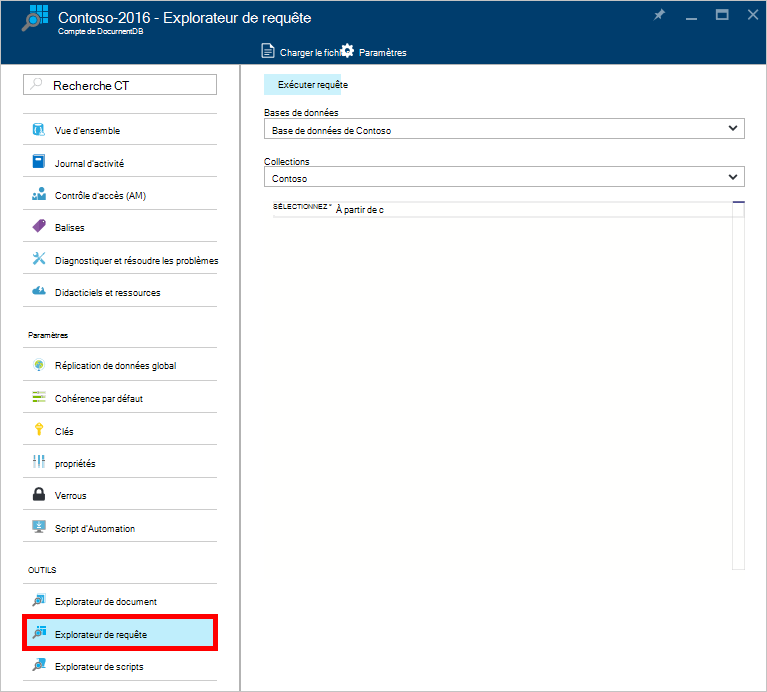

<properties
    pageTitle="Explorateur de DocumentDB requête : SQL éditeur de requête | Microsoft Azure"
    description="Obtenir des informations sur l’Explorateur de requête DocumentDB, un éditeur de requête SQL dans le portail Azure pour écrire des requêtes SQL et de les exécuter par rapport à une collection de NoSQL DocumentDB."
    keywords="écriture de requêtes sql, éditeur de requête sql"
    services="documentdb"
    authors="kirillg"
    manager="jhubbard"
    editor="monicar"
    documentationCenter=""/>

<tags
    ms.service="documentdb"
    ms.workload="data-services"
    ms.tgt_pltfrm="na"
    ms.devlang="na"
    ms.topic="article"
    ms.date="08/30/2016"
    ms.author="kirillg"/>

# Écrire, modifier et exécuter des requêtes SQL pour DocumentDB à l’aide de l’Explorateur requête 

Cet article fournit une vue d’ensemble de l’Explorateur de requête [Microsoft Azure DocumentDB](https://azure.microsoft.com/services/documentdb/) , un outil de portail Azure qui vous permet d’écrire, de modifier et d’exécuter les requêtes SQL contre une [collection de DocumentDB](documentdb-create-collection.md).

1. Dans le portail d’Azure, dans le Jumpbar, cliquez sur **DocumentDB (NoSQL)**. Si **DocumentDB (NoSQL)** n’est pas visible, cliquez sur **Plus de Services** , puis sur **DocumentDB (NoSQL)**.

2. Dans le menu de la ressource, cliquez sur **Explorateur de la requête**. 

    

3. Dans la lame **Explorer de requête** , sélectionnez les **bases de données** et les **Collections** à la requête à partir des listes déroulantes et tapez la requête à exécuter. 

    Les **bases de données** et les **Collections de** listes déroulantes, sont préremplis en fonction du contexte dans lequel vous lancez l’Explorateur de la requête. 

    Une requête par défaut de `SELECT TOP 100 * FROM c` est fourni.  Vous pouvez accepter la requête par défaut ou créer votre propre requête à l’aide du langage de requête SQL décrit dans l’article de [requête SQL et la syntaxe SQL](documentdb-sql-query.md) ou de la [Fiche récapitulative de requête SQL](documentdb-sql-query-cheat-sheet.md) .

    Cliquez sur **exécuter la requête** pour afficher les résultats.

    

4. La lame de **résultats** affiche les résultats de la requête. 

    

## Utilisez les résultats

Par défaut, Explorateur de requête retourne les résultats par groupes de 100.  Si la requête produit les résultats de plus de 100, vous devez simplement utiliser les commandes de la **page suivante** et **précédente page** pour naviguer dans le jeu de résultats.

Pour les requêtes réussies, le volet **d’informations** contient des mesures telles que les frais de la demande, le nombre d’allers-retours la requête effectuée, l’ensemble de résultats affiché actuellement, et s’il y a plus de résultats, qui est accessible via la commande **page suivante** , comme indiqué précédemment.

## Utiliser plusieurs requêtes

Si vous utilisez plusieurs requêtes et que vous souhaitez basculer rapidement entre eux, vous pouvez entrer toutes les requêtes dans la zone de texte de requête de la lame **d’Explorer de requête** , sélectionnez celui que vous voulez exécuter puis puis cliquez sur **exécuter la requête** pour afficher les résultats.

## Ajouter des requêtes à partir d’un fichier dans l’éditeur de requête SQL

Vous pouvez charger le contenu d’un fichier existant à l’aide de la commande **Charger le fichier** .

## Résoudre les problèmes

Si une requête est terminée avec des erreurs, l’Explorateur de requête affiche une liste des erreurs qui peuvent vous aider dans vos efforts de dépannage.

## Exécuter des requêtes à l’extérieur du portail de DocumentDB SQL

L’Explorateur de la requête dans le portail Azure est tout simplement un moyen d’exécuter les requêtes SQL contre DocumentDB. Vous pouvez également exécuter des requêtes SQL à l’aide de l' [API REST](https://msdn.microsoft.com/library/azure/dn781481.aspx) ou le [client SDK](documentdb-sdk-dotnet.md). Pour plus d’informations sur l’utilisation de ces autres méthodes, consultez [SQL de l’exécution de requêtes](documentdb-sql-query.md#executing-sql-queries)

## Étapes suivantes

Pour en savoir plus sur la grammaire de DocumentDB SQL pris en charge dans l’Explorateur de requête, consultez l’article de [requête SQL et la syntaxe SQL](documentdb-sql-query.md) ou d’imprimer la [Fiche récapitulative de requête SQL](documentdb-sql-query-cheat-sheet.md).
Vous pouvez aussi bénéficier d’expérimentation avec le [Laboratoire de requête](https://www.documentdb.com/sql/demo) dans lequel vous pouvez tester des requêtes en ligne à l’aide d’un exemple de dataset.
