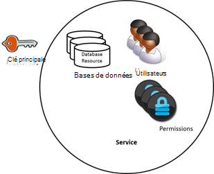
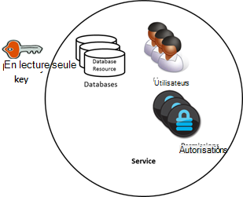
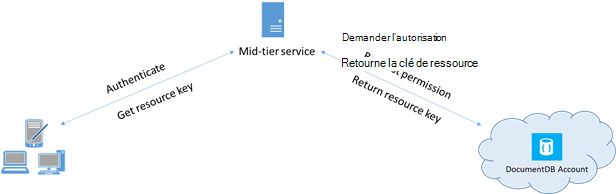

<properties 
    pageTitle="Apprenez à sécuriser l’accès aux données DocumentDB | Microsoft Azure" 
    description="Découvrez les concepts de contrôle d’accès dans DocumentDB, y compris des clés principales, les clés en lecture seule, les utilisateurs et les autorisations." 
    services="documentdb" 
    authors="kiratp" 
    manager="jhubbard" 
    editor="monicar" 
    documentationCenter=""/>

<tags 
    ms.service="documentdb" 
    ms.workload="data-services" 
    ms.tgt_pltfrm="na" 
    ms.devlang="na" 
    ms.topic="article" 
    ms.date="09/19/2016" 
    ms.author="kipandya"/>

# Sécurisation de l’accès aux données de DocumentDB

Cet article fournit une vue d’ensemble de la sécurisation de l’accès aux données stockées dans [Microsoft Azure DocumentDB](https://azure.microsoft.com/services/documentdb/).

Après avoir lu cette présentation, vous serez en mesure de répondre aux questions suivantes :  

-   Quelles sont les clés principales de DocumentDB ?
-   Quelles sont les clés en lecture seule DocumentDB ?
-   Que sont les jetons de ressource DocumentDB ?
-   Comment puis-je utiliser DocumentDB utilisateurs et autorisations pour sécuriser l’accès aux données de DocumentDB ?

## Concepts de contrôle d’accès DocumentDB

DocumentDB fournit des concepts de première classes pour contrôler l’accès aux ressources de DocumentDB.  Pour les besoins de cette rubrique, les ressources de DocumentDB sont regroupées en deux catégories :

- Ressources administratives
    - Compte
    - Base de données
    - Utilisateur
    - Autorisation
- Ressources d’application
    - Collection
    - Offre
    - Document
    - Pièce jointe
    - Procédure stockée
    - Déclencheur
    - Fonction définie par l’utilisateur

Dans le cadre de ces deux catégories, DocumentDB prend en charge trois types de personnages de contrôle d’accès : compte d’utilisateur de base de données, administrateur et administrateur en lecture seule.  Les droits de chaque personnage de contrôle d’accès sont les suivantes :
 
- Administrateur de compte : l’accès complet à toutes les ressources (administration et applications) au sein d’un compte DocumentDB.
- Administrateur en lecture seule : accès en lecture seule à toutes les ressources (d’administration et de l’applications au sein d’un compte DocumentDB. 
- Utilisateur de la base de données : DocumentDB de l’utilisateur associée à un ensemble spécifique de ressources de base de données DocumentDB (par exemple, les collections, les documents, les scripts) une ressource.  Il peut être une ou plusieurs ressources utilisateur associés à une base de données et chaque ressource utilisateur peuvent avoir une ou plusieurs autorisations lui est associées.

Avec les catégories précitées et les ressources en tenant compte, le modèle de contrôle d’accès DocumentDB définit trois types de constructions d’accès :

- Clés principales : lors de la création d’un compte DocumentDB, deux des clés principales (principales et secondaires) sont créés.  Ces clés permettent l’accès administratif complet à toutes les ressources dans le compte DocumentDB.

- Clés en lecture seule : lors de la création d’un compte DocumentDB, création des deux clés en lecture seule (principales et secondaires).  Ces clés permettent l’accès en lecture seule à toutes les ressources dans le compte DocumentDB.

- Les jetons de ressource : un jeton de ressources est associé à une ressource d’autorisation DocumentDB et capture la relation entre l’utilisateur d’une base de données et de l’autorisation de cet utilisateur dispose d’une ressource d’application DocumentDB spécifique (par exemple, collection, document).

## Utilisation des clés de base en lecture seule et DocumentDB

Comme mentionné précédemment, DocumentDB des clés principales fournissent un accès administratif complet à toutes les ressources au sein d’un compte DocumentDB, tandis que les clés en lecture seule permettent l’accès en lecture à toutes les ressources dans le compte.  L’extrait de code suivant illustre l’utilisation d’un point de terminaison DocumentDB compte et la clé principale pour instancier un DocumentClient et créer une nouvelle base de données. 

    //Read the DocumentDB endpointUrl and authorization keys from config.
    //These values are available from the Azure Classic Portal on the DocumentDB Account Blade under "Keys".
    //NB > Keep these values in a safe and secure location. Together they provide Administrative access to your DocDB account.
    
    private static readonly string endpointUrl = ConfigurationManager.AppSettings["EndPointUrl"];
    private static readonly SecureString authorizationKey = ToSecureString(ConfigurationManager.AppSettings["AuthorizationKey"]);
        
    client = new DocumentClient(new Uri(endpointUrl), authorizationKey);
    
    // Create Database
    Database database = await client.CreateDatabaseAsync(
        new Database
        {
            Id = databaseName
        });

## Vue d’ensemble des jetons de ressource DocumentDB

Vous pouvez utiliser un jeton de ressources (en créant des DocumentDB utilisateurs et autorisations) lorsque vous souhaitez fournir l’accès aux ressources dans votre compte DocumentDB pour un client qui ne peut pas être approuvé par la clé principale. Votre DocumentDB des clés principales incluent à la fois une clé primaire et secondaire, qui accorde l’accès administratif à votre compte et à toutes les ressources qu’il contient. Exposition de vos clés de masque ouvre votre compte la possibilité d’utilisation malveillante ou par négligence. 

De même, DocumentDB les clés en lecture seule fournissent un accès en lecture à toutes les ressources - à l’exception des ressources de l’autorisation, bien sûr, dans un compte de DocumentDB et ne peut pas être utilisés pour fournir les plus granulaire de l’accès à des ressources spécifiques de DocumentDB.

Jetons de ressource DocumentDB fournissent une alternative sûre qui autorise les clients à lire, écrire et supprimer des ressources dans votre compte DocumentDB en fonction de l’autorisation et sans nécessité d’un masque ou une seule touche de lecture.

Voici un modèle de design classique par laquelle jetons de ressource peuvent être demandés, générés et livrés aux clients :

1. Un service de milieu de gamme est configuré pour répondre à une application mobile pour partager des photos de l’utilisateur.
2. Le service de niveau intermédiaire possède la clé principale du compte DocumentDB.
3. L’application photo est installée sur les périphériques mobiles des utilisateurs finaux. 
4. Lors de la connexion, l’application de photos établit l’identité de l’utilisateur avec le service de milieu de gamme. Ce mécanisme d’établissement de l’identité est purement à l’application.
5. Une fois l’identité établie, le service de niveau intermédiaire demande des autorisations en fonction de l’identité.
6. Le service de milieu de gamme envoie un jeton de ressources dans l’application phone.
7. L’application phone peut continuer à utiliser le jeton de ressources pour accéder directement aux ressources de DocumentDB avec les autorisations définies par le jeton de ressources et de l’intervalle autorisé par le jeton de la ressource. 
8. Lorsque le jeton de la ressource expire, les demandes suivantes reçoit une exception non autorisé 401.  À ce stade, l’application phone rétablit l’identité et demande un nouveau jeton de ressources.

## Utilisation des autorisations et des DocumentDB utilisateurs
Un utilisateur DocumentDB une ressource est associée à une base de données DocumentDB.  Chaque base de données peut contenir zéro, un ou plusieurs utilisateurs de DocumentDB.  L’extrait de code suivant montre comment créer une ressource d’utilisateur DocumentDB.

    //Create a user.
    User docUser = new User
    {
        Id = "mobileuser"
    };

    docUser = await client.CreateUserAsync(UriFactory.CreateDatabaseUri("db"), docUser);

> [AZURE.NOTE] Chaque utilisateur de DocumentDB possède une propriété PermissionsLink qui peut être utilisée pour récupérer la liste des autorisations associées à l’utilisateur.

Une ressource d’autorisation DocumentDB est associée à un utilisateur DocumentDB.  Chaque utilisateur peut contenir zéro ou plusieurs autorisations de DocumentDB.  Une ressource d’autorisation fournit un accès à un jeton de sécurité dont l’utilisateur a besoin lorsque vous tentez d’accéder à une ressource d’application spécifique.
Il existe deux niveaux d’accès disponibles qui peuvent être fournies par une ressource d’autorisation :

- Tous : L’utilisateur a l’autorisation complète sur la ressource
- Lire : L’utilisateur peut uniquement lire le contenu de la ressource, mais il ne peut pas effectuer en écriture, mise à jour ou des suppressions sur la ressource.

> [AZURE.NOTE] Pour exécuter DocumentDB de l’utilisateur doit disposer de l’autorisation All sur la collection dans laquelle la procédure stockée sera exécutée des procédures stockées.

L’extrait de code suivant montre comment créer une ressource de l’autorisation, le jeton de la ressource de la ressource de l’autorisation de lecture et associer des autorisations à l’utilisateur créé ci-dessus.

    // Create a permission.
    Permission docPermission = new Permission
    {
        PermissionMode = PermissionMode.Read,
        ResourceLink = documentCollection.SelfLink,
        Id = "readperm"
    };
            
  docPermission = attend le client. CreatePermissionAsync (UriFactory.CreateUserUri (« db », « utilisateur »), docPermission) ; Console.WriteLine (docPermission.Id + "possède un jeton de :" + docPermission.Token) ;
  
Si vous avez spécifié une clé de partition de votre collection, puis l’autorisation pour une collection, ressources de document et la pièce jointe doivent également inclure le ResourcePartitionKey en plus de la ResourceLink.

Pour obtenir facilement toutes les ressources d’autorisation associées à un utilisateur particulier, DocumentDB met à disposition une autorisation d’alimentation pour chaque objet utilisateur.  L’extrait de code suivant montre comment récupérer l’autorisation associée à l’utilisateur créé ci-dessus, créez une liste d’autorisation et instancier un nouveau DocumentClient au nom de l’utilisateur.

    //Read a permission feed.
    FeedResponse<Permission> permFeed = await client.ReadPermissionFeedAsync(
      UriFactory.CreateUserUri("db", "myUser"));

    List<Permission> permList = new List<Permission>();
      
    foreach (Permission perm in permFeed)
    {
        permList.Add(perm);
    }
            
    DocumentClient userClient = new DocumentClient(new Uri(endpointUrl), permList);

> [AZURE.TIP] Les jetons de ressource ont timespan valide par défaut de 1 heure.  Durée de vie de jeton, cependant, peut être spécifiée explicitement, avec un maximum de 5 heures.

## Étapes suivantes

- Pour en savoir plus sur DocumentDB, cliquez [ici](http://azure.com/docdb).
- Pour en savoir plus sur la gestion de clés principales et en lecture seule, cliquez [ici](documentdb-manage-account.md).
- Pour savoir comment construire des jetons d’autorisation de DocumentDB, cliquez [ici](https://msdn.microsoft.com/library/azure/dn783368.aspx)
 
