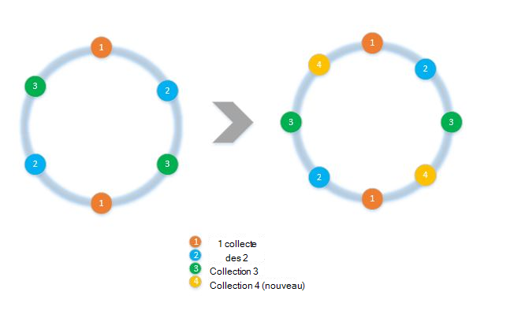
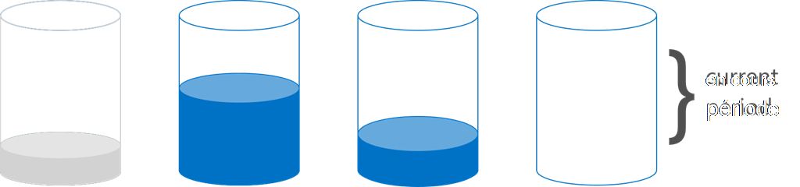

<properties 
    pageTitle="L’implémentation du partitionnement de côté client avec les kits de développement | Microsoft Azure" 
    description="Apprenez à utiliser les kits de développement Azure DocumentDB aux demandes de données et de la gamme de partition (partagé) sur plusieurs collections" 
    services="documentdb" 
    authors="arramac" 
    manager="jhubbard" 
    editor="cgronlun" 
    documentationCenter=""/>

<tags 
    ms.service="documentdb" 
    ms.workload="data-services" 
    ms.tgt_pltfrm="na" 
    ms.devlang="na" 
    ms.topic="article" 
    ms.date="10/27/2016" 
    ms.author="arramac"/>

# <a name="how-to-partition-data-using-client-side-support-in-documentdb"></a>Comment faire pour partitionner les données à l’aide de la prise en charge côté client dans DocumentDB

DocumentDB Azure prend en charge [automatique des collections de partitionnement](documentdb-partition-data.md). Toutefois, il existe des cas où il est intéressant de disposer d’un contrôle fin sur le comportement de partitionnement d’utilisation. Afin de réduire le code de la maquette requis pour le partitionnement des tâches, nous avons ajouté des fonctionnalités dans le .NET, Node.js et kits de développement logiciel Java qui facilite la création d’applications qui sont distribuées entre plusieurs collections.

Dans cet article, nous allons jeter un coup de œil sur les classes et les interfaces dans le Kit de développement .NET et comment vous pouvez les utiliser pour développer des applications partitionnées. Autres kits de développement logiciel Java, Node.js et Python prend en charge des interfaces et des méthodes similaires pour le partitionnement du côté client.

## <a name="client-side-partitioning-with-the-documentdb-sdk"></a>Partitionnement de côté client avec le Kit de développement DocumentDB

Avant de nous approfondir le partitionnement, récapitulons DocumentDB concepts fondamentaux relatifs à la division. Chaque compte de base de données Azure DocumentDB se compose d’un ensemble de bases de données, chacun contenant plusieurs collections, chacun d’eux peut contenir des procédures stockées, déclencheurs, UDF, documents et pièces jointes. Collections peuvent être partitionnée eux-mêmes ou de partition unique et ont les propriétés suivantes :

- Collections offrent d’isolation des performances. Il est donc un gain de performances en regroupant les documents similaires dans la même collection. Par exemple, pour les données de série de temps, vous pouvez souhaiter placer des données pour le mois dernier, ce qui est fréquemment demandé, au sein d’une collection avec un débit plus élevé mis en service que d’anciennes données sont placées au sein des collections avec faible débit mis en service.
- Transactions ACID c'est-à-dire des procédures stockées et les déclencheurs ne peuvent pas s’étendre sur une collection. Les transactions ont une portée limitées au sein d’une valeur de clé de partition unique dans une collection.
- Collections n’appliquent pas un schéma, afin qu’elles puissent être utilisées pour les documents JSON du même type ou de types différents.

À partir de la version [1.5.x de kits de développement logiciel Azure DocumentDB](documentdb-sdk-dotnet.md), vous pouvez effectuer des opérations de document directement par rapport à une base de données. L' [DocumentClient](https://msdn.microsoft.com/library/azure/microsoft.azure.documents.client.documentclient.aspx) utilise en interne la PartitionResolver que vous avez spécifié pour la base de données pour router les demandes à la collection appropriée.

>[AZURE.NOTE] [Partitionnement de côté serveur](documentdb-partition-data.md) introduit dans 1.6.0+ reste API 2015-12-16 et kits de développement logiciel deprecates l’approche de résolution de partition du côté client pour les cas d’usage simples. Partitionnement du côté client toutefois plus de souplesse et vous permet de contrôler l’isolation des performances sur les clés de partition, contrôler le degré de parallélisme lors de la lecture des résultats à partir de plusieurs partitions et utiliser le partitionnement des approches et hachage spatiale/plage.

Par exemple, dans .NET, chaque classe PartitionResolver est une implémentation concrète d’interface [IPartitionResolver](https://msdn.microsoft.com/library/azure/microsoft.azure.documents.client.ipartitionresolver.aspx) qui a trois méthodes - [GetPartitionKey](https://msdn.microsoft.com/library/azure/microsoft.azure.documents.client.ipartitionresolver.getpartitionkey.aspx), [ResolveForCreate](https://msdn.microsoft.com/library/azure/microsoft.azure.documents.client.ipartitionresolver.resolveforcreate.aspx) et [ResolveForRead](https://msdn.microsoft.com/library/azure/microsoft.azure.documents.client.ipartitionresolver.resolveforread.aspx). Les requêtes LINQ et les itérateurs ReadFeed utilisent en interne la méthode ResolveForRead pour effectuer une itération sur toutes les collections qui correspond à la clé de partition pour la demande. De même, créer utilisation d’opérations crée de la méthode ResolveForCreate pour router vers la partition de droite. Il n’y a aucune modification nécessaire pour remplacer, supprimer et lire dans la mesure où ils utilisent les documents déjà contient la référence à la collection correspondante.

Les kits de développement comprend également deux classes qui prennent en charge les deux techniques de partitionnement canoniques, le hachage et la plage de recherches, via un [HashPartitionResolver](https://msdn.microsoft.com/library/azure/microsoft.azure.documents.partitioning.hashpartitionresolver.aspx) et un [RangePartitionResolver](https://msdn.microsoft.com/library/azure/mt126047.aspx). Vous pouvez utiliser ces classes pour ajouter facilement de partitionnement logique à votre application.  

## <a name="add-partitioning-logic-and-register-the-partitionresolver"></a>Ajouter la logique de partitionnement et enregistrer le PartitionResolver 

Voici un extrait de code qui montre comment créer un [HashPartitionResolver](https://msdn.microsoft.com/library/azure/microsoft.azure.documents.partitioning.hashpartitionresolver.aspx) et l’enregistrer avec le DocumentClient pour une base de données.

```cs
// Create some collections to partition data.
DocumentCollection collection1 = await client.CreateDocumentCollectionAsync(...);
DocumentCollection collection2 = await client.CreateDocumentCollectionAsync(...);

// Initialize a HashPartitionResolver using the "UserId" property and the two collection self-links.
HashPartitionResolver hashResolver = new HashPartitionResolver(
    u => ((UserProfile)u).UserId, 
    new string[] { collection1.SelfLink, collection2.SelfLink });

// Register the PartitionResolver with the database.
this.client.PartitionResolvers[database.SelfLink] = hashResolver;

```

## <a name="create-documents-in-a-partition"></a>Créer des documents dans une partition  

Une fois la PartitionResolver est enregistré, vous pouvez effectuer crée et interroge directement par rapport à la base de données, comme illustré ci-dessous. Dans cet exemple, le Kit de développement logiciel utilise le PartitionResolver pour extraire le nom d’utilisateur, hacher et ensuite utiliser cette valeur pour acheminer l’opération de création à la collection appropriée.

```cs
Document johnDocument = await this.client.CreateDocumentAsync(
    database.SelfLink, new UserProfile("J1", "@John", Region.UnitedStatesEast));
Document ryanDocument = await this.client.CreateDocumentAsync(
    database.SelfLink, new UserProfile("U4", "@Ryan", Region.AsiaPacific, UserStatus.AppearAway));
```

## <a name="create-queries-against-partitions"></a>Créer des requêtes sur les partitions  

Vous pouvez interroger à l’aide de la méthode [CreateDocumentQuery](https://msdn.microsoft.com/library/azure/microsoft.azure.documents.linq.documentqueryable.createdocumentquery.aspx) en passant dans la base de données et une clé de partition. La requête renvoie un jeu de résultats unique sur toutes les collections dans la base de données qui correspondent à la clé de partition.  

```cs
// Query for John's document by ID - uses PartitionResolver to restrict the query to the partitions 
// containing @John. Again the query uses the database self link, and relies on the hash resolver 
// to route the appropriate collection.
var query = this.client.CreateDocumentQuery<UserProfile>(
    database.SelfLink, null, partitionResolver.GetPartitionKey(johnProfile))
    .Where(u => u.UserName == "@John");
johnProfile = query.AsEnumerable().FirstOrDefault();
```

## <a name="create-queries-against-all-collections-in-the-database"></a>Créer des requêtes par rapport à toutes les collections dans la base de données 

Vous pouvez également interroger toutes les collections de la base de données et énumérer les résultats comme indiqué ci-dessous, en ignorant l’argument clé de partition.

```cs
// Query for all "Available" users. Here since there is no partition key, the query is serially executed 
// across each partition/collection and returns a single result-set. 
query = this.client.CreateDocumentQuery<UserProfile>(database.SelfLink)
    .Where(u => u.Status == UserStatus.Available);
foreach (UserProfile activeUser in query)
{
    Console.WriteLine(activeUser);
}
```

## <a name="hash-partition-resolver"></a>Résolution de Partition de hachage
Grâce au partitionnement de hachage, les partitions sont affectées en fonction de la valeur d’une fonction de hachage, ce qui vous permet de distribuer équitablement les demandes et les données sur un nombre de partitions. Cette approche est couramment utilisée pour partitionner des données produites ou consommées à partir d’un grand nombre de clients distincts et est utile pour stocker les profils utilisateur, les éléments du catalogue et les données de télémétrie IoT (« Internet des objets »). Partitionnement de hachage est également utilisé par le support de partitionnement côté serveur de DocumentDB au sein d’une collection.

**Partitionnement de hachage :**


Un schéma de partitionnement entre collections de *N* de hachage simple serait à prendre n’importe quel document, calculer *hash(d) mod N* pour déterminer quelle collection qu’il a placés dans. Mais un problème avec cette technique simple est qu’il ne fonctionne pas correctement lorsque vous ajoutez de nouvelles collections ou supprimez des collections car cela nécessiterait presque toutes les données pour obtenir reshuffled. [De hachage cohérente] (http://citeseerx.ist.psu.edu/viewdoc/summary?doi=10.1.1.23.3738) est un algorithme connu qui résout cette difficulté en mettant en oeuvre un hachage qui limite la quantité de déplacement des données requise lors de l’ajout ou la suppression des collections.

La classe [HashPartitionResolver](https://msdn.microsoft.com/library/azure/microsoft.azure.documents.partitioning.hashpartitionresolver.aspx) implémente la logique pour générer un anneau de hachage cohérente sur la fonction de hachage spécifiée dans l’interface [IHashGenerator](https://msdn.microsoft.com/library/azure/microsoft.azure.documents.partitioning.ihashgenerator.aspx) . Par défaut, le HashPartitionResolver utilise une fonction de hachage MD5, mais vous pouvez permuter ce point avec votre propre implémentation de hachage. Le HashPartitionResolver crée en interne les 16 hachages ou « nœuds virtuels » dans l’anneau de hachage pour chaque collection d’afin d’obtenir une distribution uniforme des documents sur les collections, mais vous pouvez faire varier ce nombre compromis asymétrie de données avec la quantité de calcul du côté client.

**Hachage cohérente avec la HashPartitionResolver :**


## <a name="range-partition-resolver"></a>Résolution de Partition de plage

Partitionnement par plage, les partitions sont affectées selon que la clé de partition est dans une certaine plage. Elle est généralement utilisée pour le partitionnement avec les propriétés de cachet de temps (par exemple, eventTime entre le 1er avril 2015 et 14 avr 2015). La classe [RangePartitionResolver](https://msdn.microsoft.com/library/azure/mt126047.aspx) vous permet de conserver un mappage entre une plage\<T\> et lier automatiquement de collection. 

[Plage\<T\> ](https://msdn.microsoft.com/library/azure/mt126048.aspx) est une classe simple qui gère des plages de tous les types qui implémentent IComparable\<T\> et IEquatable\<T\> comme des chaînes ou des nombres. Pour lit et crée, vous pouvez passer n’importe quelle plage arbitraire, et le programme de résolution identifie toutes les collections de candidats en identifiant les plages des partitions qui croisent la plage demandée. Cette fonctionnalité peut être utile lors de l’exécution de requêtes sur des données de série de temps.

**Plage de partitionnement :**  

  

Un cas spécial de partitionnement par plage est lorsque la plage est juste une unique valeur discrète, parfois appelée « recherche de partitionnement ». Elle est généralement utilisée pour le partitionnement par région (par exemple, la partition pour la Scandinavie contient la Norvège, le Danemark et la Suède,) ou pour le partitionnement des locataires dans une application partagée.

## <a name="samples"></a>Exemples 

Examinez le [projet de Github des échantillons de partitionnement des DocumentDB](https://github.com/Azure/azure-documentdb-dotnet/tree/287acafef76ad223577759b0170c8f08adb45755/samples/code-samples/Partitioning) contenant des extraits de code sur l’utilisation de ces PartitionResolvers et de les étendre pour implémenter vos propres programmes de résolution pour s’adapter à des cas d’utilisation spécifique, comme suit : 

* Comment spécifier une expression lambda arbitraire de GetPartitionKey et de l’utiliser pour mettre en œuvre des clés de partitionnement composées ou partitionner différemment les différents types d’objets.
* Comment créer une simple [LookupPartitionResolver](https://github.com/Azure/azure-documentdb-dotnet/blob/287acafef76ad223577759b0170c8f08adb45755/samples/code-samples/Partitioning/Partitioners/LookupPartitionResolver.cs) qui utilise une table de recherche manuelle pour effectuer le partitionnement. Ce modèle est généralement utilisé pour le partitionnement basé sur des valeurs discrètes comme région, ID de client ou une application nom.
* Comment créer un [ManagedPartitionResolver](https://github.com/Azure/azure-documentdb-dotnet/blob/287acafef76ad223577759b0170c8f08adb45755/samples/code-samples/Partitioning/Partitioners/ManagedHashPartitionResolver.cs) qui crée des collections automatiquement basées sur un modèle qui définit un schéma d’affectation de noms, IndexingPolicy et des procédures stockées qui doivent être enregistrés par rapport aux nouvelles collections.
* Comment créer un schéma sans [SpilloverPartitionResolver](https://github.com/Azure/azure-documentdb-dotnet/blob/287acafef76ad223577759b0170c8f08adb45755/samples/code-samples/Partitioning/Partitioners/SpilloverPartitionResolver.cs) qui crée simplement les nouvelles collections que remplir les vieilles collections.
* Comment sérialiser et désérialiser l’état de PartitionResolver en tant que JSON, afin que vous puissiez partager entre les processus et les arrêts. Vous pouvez conserver dans des fichiers de configuration, ou même dans une collection de DocumentDB.
* Une classe [DocumentClientHashPartitioningManager](https://github.com/Azure/azure-documentdb-dotnet/blob/287acafef76ad223577759b0170c8f08adb45755/samples/code-samples/Partitioning/Util/DocumentClientHashPartitioningManager.cs) pour ajouter et supprimer des partitions à une base de données partitionnée dynamiquement en fonction de hachage cohérente. En interne, il utilise un [TransitionHashPartitionResolver](https://github.com/Azure/azure-documentdb-dotnet/blob/287acafef76ad223577759b0170c8f08adb45755/samples/code-samples/Partitioning/Partitioners/TransitionHashPartitionResolver.cs) sur les lectures de l’itinéraire et écrit lors de la migration à l’aide d’un des quatre modes - lire le schéma de partitionnement ancien (ReadCurrent), une nouvelle (ReadNext), fusionner les résultats des deux (ReadBoth) ou ne pas être disponible lors de la migration (aucun).

Les échantillons sont open source et nous vous encourageons à soumettre des demandes d’extraction avec des contributions que pourraient bénéficier les autres développeurs de DocumentDB. Reportez-vous aux [instructions de la Contribution](https://github.com/Azure/azure-documentdb-net/blob/master/Contributing.md) pour obtenir des instructions sur la façon de contribuer.  

>[AZURE.NOTE] Crée de la collection est limitée par DocumentDB, pour certaines de ces méthodes de l’exemple illustrés ici peuvent prendre quelques minutes pour terminer.

##<a name="faq"></a>FAQ
**DocumentDB en charge côté serveur de partitionnement ?**

Oui, DocumentDB prend en charge le [partitionnement du côté serveur](documentdb-partition-data.md). DocumentDB prend également en charge le partitionnement de côté client par l’intermédiaire des résolveurs de partition du côté client pour des utilisations plus avancées.

**Quand dois-je utiliser le côté serveur et côté client partitionnement ?**
Pour la majorité des cas d’usage, nous vous recommandons l’utilisation du partitionnement de côté serveur, car elle gère les tâches d’administration du partitionnement des données et du routage des demandes. Toutefois, si vous devez aller le partitionnement ou avoir un cas d’usage spécialisé pour l’isolation des performances entre les différentes valeurs de clés de la partition, puis de partitionnement côté client peut être la meilleure approche.

**Comment ajouter ou supprimer une collection de mon modèle de partitionnement ?**

Examinons l’implémentation de DocumentClientHashPartitioningManager dans le projet samples pour obtenir un exemple de comment vous pouvez implémenter le repartitionnement.

**Comment rendre persistantes ou partager ma configuration de partitionnement avec d’autres clients ?**

Vous pouvez sérialiser l’état partitionneur au format JSON et stocker dans des fichiers de configuration, ou même au sein des collections de la DocumentDB. Examinons la méthode RunSerializeDeserializeSample dans le projet samples pour obtenir un exemple.

**Comment chaîner les différentes techniques de partitionnement ?**

Vous pouvez chaîner PartitionResolvers en implémentant votre propre IPartitionResolver qui utilise en interne un ou plusieurs programmes de résolution existantes. Examinons TransitionHashPartitionResolver dans le projet samples pour obtenir un exemple.

##<a name="references"></a>Références
* [Le partitionnement dans DocumentDB côté serveur](documentdb-partition-data.md)
* [Collections de DocumentDB et des niveaux de performances](documentdb-performance-levels.md)
* [Partitionnement des exemples de code sur Github](https://github.com/Azure/azure-documentdb-dotnet/tree/287acafef76ad223577759b0170c8f08adb45755/samples/code-samples/Partitioning)
* [DocumentDB Documentation de kit de développement .NET sur MSDN](https://msdn.microsoft.com/library/azure/dn948556.aspx)
* [Exemples de DocumentDB .NET](https://github.com/Azure/azure-documentdb-net)
* [DocumentDB limites](documentdb-limits.md)
* [Blog de DocumentDB sur les conseils de Performance](https://azure.microsoft.com/blog/2015/01/20/performance-tips-for-azure-documentdb-part-1-2/)
 
