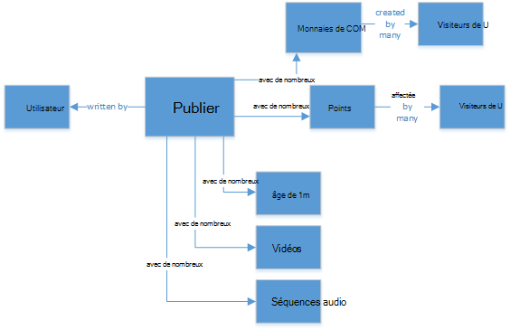
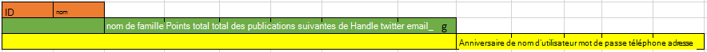
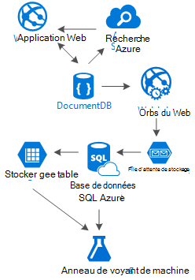

<properties 
    pageTitle="Modèle de conception DocumentDB : applications de médias sociaux | Microsoft Azure" 
    description="Obtenir des informations sur un modèle de conception de réseaux sociaux en tirant parti de la souplesse du stockage de DocumentDB et d’autres services Azure." 
    keywords="applications de support de réseaux sociaux"
    services="documentdb" 
    authors="ealsur" 
    manager="jhubbard" 
    editor="" 
    documentationCenter=""/>

<tags 
    ms.service="documentdb" 
    ms.workload="data-services" 
    ms.tgt_pltfrm="na" 
    ms.devlang="na" 
    ms.topic="article" 
    ms.date="09/27/2016" 
    ms.author="mimig"/>

# Allez sociale avec DocumentDB

Vivant dans une société massivement interconnectés signifie que, à un moment donné de la vie, vous devenez partie d’un **réseau social**. Nous utilisons des réseaux sociaux pour garder le contact avec vos collègues, vos amis, la famille, ou parfois partager notre passion avec des personnes ayant des intérêts communs.

En tant qu’ingénieurs ou les développeurs, nous pourrions avoir demandé comment ces réseaux stocker et interconnexion de nos données, ou peut-être ont même été chargé pour créer ou concevoir un nouveau réseau social pour un marché de niche spécifique vous-même. C’est lorsque la grande question se pose : comment toutes ces données sont stockées ?

Supposons que nous créons un réseau de social nouvel et brillant, où les utilisateurs peuvent poster des articles avec le média associé comme, images, vidéos ou musique même. Les utilisateurs peuvent commenter les publications et offrent des points de contrôle d’accès. Il y a un flux de messages que les utilisateurs verront et être en mesure d’interagir avec sur la page de lancement du site Web principal. Cela ne sembler très complexe (au premier), mais par souci de simplicité, nous allons arrêter là (nous pourrions plonger dans les flux d’utilisateur personnalisés affectés par des relations, mais il dépasse l’objectif de cet article).

Par conséquent, comment de cette banque et où ?

Nombre d'entre vous peuvent expérience sur les bases de données SQL ou au moins la notion de [relationnel de modélisation de données](https://en.wikipedia.org/wiki/Relational_model) , et vous pourriez être tenté de commencer à dessiner quelque chose comme ceci :

 

Une structure de données parfaitement normalisée et convivial... qui n’évolue pas. 

Ne vous y trompez pas, j’ai travaillé avec les bases de données SQL à ma vie de tous les, ils sont très utiles, mais comme chaque plate-forme de modèle, de pratiques et de logiciels, il n’est pas idéal pour tous les scénarios.

Pourquoi n’est-il pas SQL la meilleure solution dans ce scénario ? Examinons la structure d’une seule publication, si je souhaite afficher cette publication dans un site Web ou une application, que j’aurais exécuter une requête avec... les jointures de table 8 ( !) juste pour afficher une seule publication, maintenant, image d’un flux de données de publications qui dynamiquement charger et s’affichent à l’écran et vous pouvez voir où je vais.

Nous pourrions, bien sûr, utiliser une instance SQL humongous avec assez de puissance pour des milliers de requêtes de ces jointures pour répondre à notre contenu, mais réellement, pourquoi nous lorsqu’il existe une solution plus simple de résoudre ?

## La route de NoSQL

Graphique spéciale des bases de données qui peut [s’exécuter sur Azure](http://neo4j.com/developer/guide-cloud-deployment/#_windows_azure) , mais ils ne sont pas bon marchés et nécessitent les services IaaS (Infrastructure-as-a-Service, les Machines virtuelles principalement) et de la maintenance. Je vais à l’objectif de cet article à partir d’une solution économique qui fonctionne pour la plupart des scénarios, en cours d’exécution sur la base de données NoSQL de d’Azure [DocumentDB](https://azure.microsoft.com/services/documentdb/). À l’aide d’une approche de [NoSQL](https://en.wikipedia.org/wiki/NoSQL) , stockage de données au format JSON et l’application de [la dénormalisation](https://en.wikipedia.org/wiki/Denormalization), notre post précédemment complexe peut être transformé en un seul [Document](https://en.wikipedia.org/wiki/Document-oriented_database):

    {
        "id":"ew12-res2-234e-544f",
        "title":"post title",
        "date":"2016-01-01",
        "body":"this is an awesome post stored on NoSQL",
        "createdBy":User,
        "images":["http://myfirstimage.png","http://mysecondimage.png"],
        "videos":[
            {"url":"http://myfirstvideo.mp4", "title":"The first video"},
            {"url":"http://mysecondvideo.mp4", "title":"The second video"}
        ],
        "audios":[
            {"url":"http://myfirstaudio.mp3", "title":"The first audio"},
            {"url":"http://mysecondaudio.mp3", "title":"The second audio"}
        ]
    }

Et elle peut être obtenue avec une seule requête et aucune jointure. C’est beaucoup plus simple et directe, et budget-wise, elle nécessite moins de ressources pour un meilleur résultat.

DocumentDB Azure permet de s’assurer que toutes les propriétés sont indexées avec son [indexation automatique](documentdb-indexing.md), qui peut même être [personnalisé](documentdb-indexing-policies.md). L’approche sans schéma nous permet de stocker des Documents avec différents et dynamiques des structures, peut-être demain que nous voulons avoir une liste de catégories ou de hashtags associés à des publications, DocumentDB gère les nouveaux Documents avec les attributs ajoutés sans aucun travail supplémentaire requis par nous.

Les commentaires sur une publication peuvent être traitées comme uniquement d’autres publications avec une propriété du parent (Cela simplifie notre mappage d’objet). 

    {
        "id":"1234-asd3-54ts-199a",
        "title":"Awesome post!",
        "date":"2016-01-02",
        "createdBy":User2,
        "parent":"ew12-res2-234e-544f"
    }

    {
        "id":"asd2-fee4-23gc-jh67",
        "title":"Ditto!",
        "date":"2016-01-03",
        "createdBy":User3,
        "parent":"ew12-res2-234e-544f"
    }

Et toutes les interactions sociales peuvent être stockées dans un objet séparé, comme les compteurs :

    {
        "id":"dfe3-thf5-232s-dse4",
        "post":"ew12-res2-234e-544f",
        "comments":2,
        "likes":10,
        "points":200
    }

Création de flux consiste simplement à créer des documents qui peuvent contenir une liste des ID de publication avec un ordre de pertinence donné :

    [
        {"relevance":9, "post":"ew12-res2-234e-544f"},
        {"relevance":8, "post":"fer7-mnb6-fgh9-2344"},
        {"relevance":7, "post":"w34r-qeg6-ref6-8565"}
    ]

Nous aurions un flux « dernière » avec les messages classés par date de création, un flux de « plu » avec ces publications avec aime plus au cours des 24 dernières heures, nous pourrions même implémenter un flux personnalisé pour chaque utilisateur en fonction de la logique du marché et centres d’intérêt et il serait encore une liste de publications. Il s’agit de la création de ces listes, mais les performances de lecture restent sans gêne. Une fois que nous avons acquièrent une de ces listes, nous délivrer une seule requête à DocumentDB à l’aide de l' [opérateur](documentdb-sql-query.md#where-clause) pour obtenir des pages de publications à la fois.

Les flux d’alimentation pourraient être construites à l’aide des processus d’arrière-plan [' Services Azure App](https://azure.microsoft.com/services/app-service/) : [Webjobs](../app-service-web/web-sites-create-web-jobs.md). Une fois qu’une publication est créée, le traitement en arrière-plan peut être déclenché à l’aide du [Stockage Azure](https://azure.microsoft.com/services/storage/) [files d’attente](../storage/storage-dotnet-how-to-use-queues.md) et Webjobs déclenchée à l’aide du [SDK de Webjobs d’Azure](../app-service-web/websites-dotnet-webjobs-sdk.md), mise en œuvre de la propagation de la publication dans le flux de données en fonction de votre propre logique personnalisée. 

Points et aime sur une publication peut être traité de manière différée à l’aide de cette même technique pour créer un environnement cohérent par la suite.

Suiveurs sont plus délicate. DocumentDB possède une limite de taille de document de 512 Ko, vous pouvez penser à propos du stockage du marché sous la forme d’un document avec cette structure :

    {
        "id":"234d-sd23-rrf2-552d",
        "followersOf": "dse4-qwe2-ert4-aad2",
        "followers":[
            "ewr5-232d-tyrg-iuo2",
            "qejh-2345-sdf1-ytg5",
            //...
            "uie0-4tyg-3456-rwjh"
        ]
    }

Cette solution fonctionne pour un utilisateur avec quelques milliers du marché, mais si certains célébrités rejoint nos rangs, ce sera approche finalement atteint l’extrémité de la taille du document.

Pour résoudre ce problème, nous pouvons utiliser une approche mixte. Dans le cadre du document de statistiques de l’utilisateur, nous pouvons stocker le nombre de barreaux de :

    {
        "id":"234d-sd23-rrf2-552d",
        "user": "dse4-qwe2-ert4-aad2",
        "followers":55230,
        "totalPosts":452,
        "totalPoints":11342
    }

Et le graphique réel imposait peut être stocké dans les Tables de stockage Azure à l’aide d’une [Extension](https://github.com/richorama/AzureStorageExtensions#azuregraphstore) qui permet à de simples « Suit-A-B » stockage et la récupération. De cette façon, nous pouvons déléguer le processus d’extraction de la liste des barreaux exacte (lorsque nous avons besoin) aux Tables de stockage Azure, mais pour une recherche de numéros abrégés, nous utiliserons à l’aide de DocumentDB.

## La duplication de données et le modèle « Échelle »

Comme vous l’avez peut-être remarqué dans le document JSON qui fait référence à une publication, il y a plusieurs occurrences d’un utilisateur. Et vous souhaitez deviné droite, que cela signifie que les informations qui représente un utilisateur, compte tenu de la dénormalisation, peuvent être présentes dans plusieurs endroits.

Pour permettre des requêtes plus rapides, nous rencontrer des doublons. Le problème avec cet effet secondaire est que si par une action, les modifications de données d’un utilisateur, nous devons trouver toutes les activités qu’il jamais a et les mettre à jour tous les. Ne son très pratique, à droite ?

Bases de données de graphique résoudre à leur façon, nous allons le résoudre en identifiant les attributs de la clé de l’utilisateur qui nous afficher dans notre application pour chaque activité. Si nous visuellement afficher un billet dans notre application et afficher du seulement le créateur nom et image, pourquoi stocker toutes les données de l’utilisateur dans l’attribut « createdBy » ? Si pour chaque commentaire nous ne montrons que les images de l’utilisateur, nous n’ayez pas besoin du reste de ses informations. C’est là, quelque chose que j’appelle le « modèle d’échelle » entre en jeu.

Prenons les informations utilisateur à titre d’exemple :

    {
        "id":"dse4-qwe2-ert4-aad2",
        "name":"John",
        "surname":"Doe",
        "address":"742 Evergreen Terrace",
        "birthday":"1983-05-07",
        "email":"john@doe.com",
        "twitterHandle":"@john",
        "username":"johndoe",
        "password":"some_encrypted_phrase",
        "totalPoints":100,
        "totalPosts":24
    }
    
En examinant ces informations, nous pouvons détecter rapidement les informations critiques, et qui n’est pas, créant ainsi une « échelle » :

L’étape la plus petite est appelée un UserChunk, l’information minimale qui identifie un utilisateur et qu’il est utilisé pour la duplication de données. En réduisant la taille des données dupliquées pour que les informations nous seront « afficher », nous réduisons la possibilité de mise à jour massive.

L’étape intermédiaire est appelée l’utilisateur, ce sont les données complets qui seront utilisées sur la plupart des requêtes dépendant de performances sur les DocumentDB, les plus consulté et critique. Il inclut les informations représentées par un UserChunk.

Le plus grand est l’utilisateur étendu. Il inclut toutes les informations utilisateur essentielles ainsi que les autres données qui ne nécessitent pas vraiment à lire rapidement ou son utilisation est éventuelle (par exemple, le processus de connexion). Ces données peuvent être stockées hors de DocumentDB, dans la base de données de SQL Azure ou Tables de stockage Azure.

Pourquoi serait fractionné de l’utilisateur et même stocker cette information dans des endroits différents ? Étant l’espace de stockage en DocumentDB [pas infinie](documentdb-limits.md) et d’une efficacité de point de vue, plus les documents, les costlier les requêtes. Conserver les documents slim, avec les informations correctes pour effectuer toutes vos requêtes DEPENDANT de la performance de votre réseau social et stocker les autres informations supplémentaires pour les scénarios éventuelle, comme les modifications de profil complet, connexions, même d’exploration de données pour l’analytique de l’utilisation et les initiatives de données volumineuses. Nous ne s’occupe pas vraiment si la collecte des données par l’exploration de données est plus lent, car il est en cours d’exécution sur la base de données de SQL Azure, nous ont concernent bien que nos utilisateurs bénéficient d’une expérience rapide et compacte. Un utilisateur, stocké dans DocumentDB, ressemblerait à ceci :

    {
        "id":"dse4-qwe2-ert4-aad2",
        "name":"John",
        "surname":"Doe",
        "username":"johndoe"
        "email":"john@doe.com",
        "twitterHandle":"@john"
    }

Et une publication ressemblerait à :

    {
        "id":"1234-asd3-54ts-199a",
        "title":"Awesome post!",
        "date":"2016-01-02",
        "createdBy":{
            "id":"dse4-qwe2-ert4-aad2",
            "username":"johndoe"
        }
    }

Lorsqu’une modification se produit lorsque un des attributs du segment est affecté, il est facile de trouver les documents concernés à l’aide de requêtes qui pointent vers les attributs indexés (sélectionnez * FROM publie p où p.createdBy.id == « edited_user_id ») puis mettez à jour les segments.

## La zone de recherche

Les utilisateurs génère, par chance, beaucoup de contenu. Et nous devons être en mesure de fournir la possibilité de rechercher et de rechercher du contenu qui peut ne pas être directement dans leurs flux de données de contenu, peut-être parce que nous ne suivent pas les créateurs, ou peut-être nous essayons simplement trouver l’ancien post nous l’avons fait il y a 6 mois.

Heureusement, et étant donné que nous utilisons DocumentDB d’Azure, nous pouvons facilement implémenter un moteur de recherche à l’aide [d’Azure rechercher](https://azure.microsoft.com/services/search/) en quelques minutes et sans avoir à saisir une seule ligne de code (autres que de toute évidence, le processus de recherche et l’interface utilisateur).

Pourquoi est-ce facile ?

Recherche Azure implémente ce qu’ils appellent des [indexeurs](https://msdn.microsoft.com/library/azure/dn946891.aspx), des processus d’arrière-plan que raccordement dans vos référentiels de données et State ajouter, mettre à jour ou supprimer vos objets dans les index. Ils prennent en charge [une [base de données de SQL Azure indexeurs](https://blogs.msdn.microsoft.com/kaevans/2015/03/06/indexing-azure-sql-database-with-azure-search/), Azure BLOB indexeurs](../search/search-howto-indexing-azure-blob-storage.md) et Heureusement, [Azure DocumentDB indexeurs](../documentdb/documentdb-search-indexer.md). Le passage d’informations à partir de DocumentDB à la recherche d’Azure est simple, comme les informations de la banque d’informations au format JSON, il nous faut [créer notre Index](../search/search-create-index-portal.md) et mapper les attributs de nos Documents que nous souhaitons indexé et qui est, en quelques minutes (dépend de la taille des données), tout le contenu de notre seront disponible pour effectuer des recherches, en la meilleure solution de recherche en tant que Service dans l’infrastructure de nuage. 

Pour plus d’informations sur la recherche d’Azure, vous pouvez consulter le [Guide de l’auto-stoppeur à la recherche](https://blogs.msdn.microsoft.com/mvpawardprogram/2016/02/02/a-hitchhikers-guide-to-search/).

## La base de connaissances sous-jacent

Après avoir enregistré ce contenu dont la taille augmente chaque jour, nous pourrions peut-être trouver nous-même penser : que puis-je faire avec tous les flux d’informations à partir de mes utilisateurs ?

La réponse est simple : placer pour travailler et obtenir des informations à partir de celui-ci.

Mais, que pouvons-nous nous en savoir plus ? [Analyse de sentiment](https://en.wikipedia.org/wiki/Sentiment_analysis), des recommandations de contenu en fonction des préférences de l’utilisateur sont que quelques exemples de simples ou même un automatisée modérateur contenu qui garantit que tout le contenu publié par notre réseau social est sûr pour la famille.

Maintenant que j’ai trouvé raccordé, vous devez penser vous devez certains doctorat en sciences de mathématiques pour extraire ces modèles et ces informations à partir de fichiers et de bases de données simples, mais il serait incorrect.

[Formation de Machine d’azure](https://azure.microsoft.com/services/machine-learning/), partie de la [Suite d’Intelligence Cortana](https://www.microsoft.com/en/server-cloud/cortana-analytics-suite/overview.aspx), est l’un service entièrement géré cloud qui vous permet de créer des workflows à l’aide d’algorithmes dans une simple interface de glisser-déplacer, coder vos propres algorithmes de [R](https://en.wikipedia.org/wiki/R_(programming_language)) ou utiliser certains des déjà générées et prêts à l’emploi des API telles que : [Texte Analytique](https://gallery.cortanaanalytics.com/MachineLearningAPI/Text-Analytics-2), [Modérateur de contenu](https://www.microsoft.com/moderator) ou des [recommandations](https://gallery.cortanaanalytics.com/MachineLearningAPI/Recommendations-2).

Pour atteindre un de ces scénarios d’apprentissage automatique, nous pouvons [Lac de données Azure](https://azure.microsoft.com/services/data-lake-store/) permet d’intégrer les informations provenant de différentes sources et [U-SQL](https://azure.microsoft.com/documentation/videos/data-lake-u-sql-query-execution/) permet de traiter les informations et de générer une sortie qui peut être traitée par l’apprentissage automatique de Azure.

Une autre possibilité consiste à utiliser les [Services cognitifs de Microsoft](https://www.microsoft.com/cognitive-services) pour analyser le contenu de nos utilisateurs ; seulement pouvons nous comprenons les mieux (grâce à l’analyse de ce qu’ils écrivent avec [Texte Analytique API](https://www.microsoft.com/cognitive-services/en-us/text-analytics-api)), mais nous avons également détecter le contenu indésirable ou réservé aux adulte et d’agir en conséquence avec [l’API de Vision d’ordinateur](https://www.microsoft.com/cognitive-services/en-us/computer-vision-api). Les Services cognitifs comprennent un grand nombre de solutions de-l’emploi qui ne nécessitent pas n’importe quel type de connaissance d’apprentissage automatique à utiliser.

## Conclusion

Cet article tente de vous éclairer dans les solutions de création de réseaux sociaux complètement sur Azure avec les services de faible coût et de fournir d’excellents résultats en encourageant l’utilisation d’une distribution de solution et les données de plusieurs niveaux de stockage appelée « Échelle ».

La vérité est qu’il n’y a aucune panacée pour ce type de scénarios, il est créée par la combinaison des services excellents qui nous permettent de créer des expériences exceptionnelles synergie : la vitesse et la liberté de DocumentDB Azure pour fournir une grande application sociale, l’intelligence derrière une solution de première classe de recherche comme la recherche d’Azure, la flexibilité des Services d’application Azure à l’hôte ne même pas indépendant du langage applications mais des processus d’arrière-plan puissante et extensible Azure Storage et base de données de SQL Azure pour stockage de gros volumes de données et de la puissance de l’analyse d’apprentissage d’ordinateur Azure pour créer des connaissances et intelligence qui peut fournir des commentaires à nos processus et l’aide que nous fournir le bon contenu aux utilisateurs appropriés.

## Étapes suivantes

En savoir plus sur les données de modélisation en lisant l’article de la [modélisation des données dans DocumentDB](documentdb-modeling-data.md) . Si vous êtes intéressé dans d’autres cas d’utilisation de DocumentDB, consultez [Common DocumentDB cas d’usage](documentdb-use-cases.md).

Ou en savoir plus sur DocumentDB en suivant le [Chemin d’accès de la formation DocumentDB](https://azure.microsoft.com/documentation/learning-paths/documentdb/).
