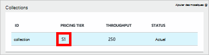
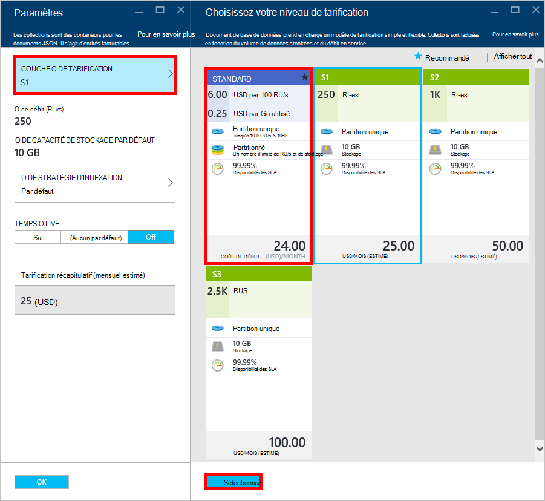
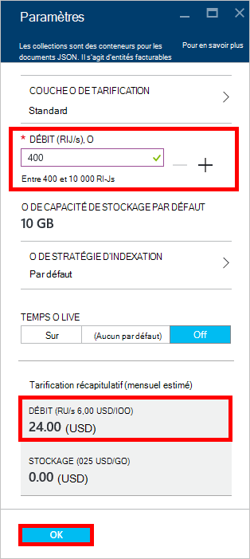
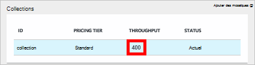

<properties 
    pageTitle="Améliorer votre compte DocumentDB S1 | Microsoft Azure" 
    description="Tirer parti d’améliorer le débit de votre compte de DocumentDB S1 en effectuant quelques modifications simples dans le portail Azure." 
    services="documentdb" 
    authors="mimig1" 
    manager="jhubbard" 
    editor="monicar" 
    documentationCenter=""/>

<tags 
    ms.service="documentdb" 
    ms.workload="data-services" 
    ms.tgt_pltfrm="na" 
    ms.devlang="na" 
    ms.topic="article" 
    ms.date="08/25/2016" 
    ms.author="mimig"/>

# Améliorer votre compte DocumentDB

Suivez ces étapes pour tirer parti d’améliorer le débit de votre compte Azure DocumentDB S1. Avec peu ou sans coût supplémentaire, vous pouvez augmenter le débit de votre compte S1 existant à partir de 250 [RU/s](documentdb-request-units.md) à 400 RU/s ou plus !  

> [AZURE.VIDEO changedocumentdbcollectionperformance]

## Modifier les performances défini par l’utilisateur dans le portail Azure

1. Dans votre navigateur, accédez au [**portail Azure**](https://portal.azure.com). 
2. Cliquez sur **Parcourir** -> **DocumentDB (NoSQL)**, puis sélectionnez le compte de le DocumentDB à modifier.   
3. Dans l’objectif de **bases de données** , sélectionnez la base de données à modifier et puis dans la lame de la **base de données** , sélectionnez la collection avec le niveau de tarification S1.

      

4. De la lame de **Collection** , cliquez sur **plus**, puis cliquez sur **paramètres**.   
5. Dans la lame de **paramètres** , cliquez sur le **Niveau de prix** et notez que l’estimation de coût mensuel pour chaque plan s’affiche. De la lame de **Choisir votre niveau de tarification** , cliquez sur **Standard**, puis cliquez sur **Sélectionner** pour enregistrer vos modifications.

      

6. Dans la lame de **paramètres** , le **Niveau de prix** est modifié en **Standard** et le **débit (RU/s)** s’affiche avec une valeur par défaut de 400. Cliquez sur **OK** pour enregistrer vos modifications. 

    > [AZURE.NOTE] Vous pouvez définir le débit entre 400 et 10 000 [unités de demande](../articles/documentdb/documentdb-request-units.md)/second (RU/s). Le **Prix de résumé** en bas de la page met à jour automatiquement afin de fournir une estimation du coût mensuel.
    
    

8. Sur la lame de la **base de données** , vous pouvez vérifier le débit de suralimentation de la collection. 

    

Pour plus d’informations sur les modifications liées au débit prédéfini et définies par l’utilisateur, consultez le blog de [DocumentDB : tout ce que vous devez savoir pour utiliser les nouvelles options de tarification](https://azure.microsoft.com/blog/documentdb-use-the-new-pricing-options-on-your-existing-collections/).

## Étapes suivantes

Si vous déterminez que vous avez besoin plus de débit (plus de 10 000 RU/s) ou plus de stockage (supérieur à 10 Go) vous pouvez créer une collection partitionnée. Pour créer une collection partitionnée, voir [Création d’une collection](documentdb-create-collection.md).