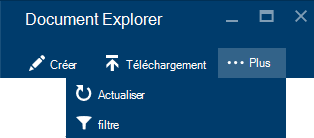

<properties
    pageTitle="DocumentDB Document Explorer, pour afficher le JSON | Microsoft Azure"
    description="Obtenir des informations sur l’Explorateur de Document DocumentDB, un outil d’Azure Portal à JSON permet d’afficher, de modifier, de créer et de télécharger des documents JSON avec DocumentDB, une base de données de documents NoSQL."
        keywords="Afficher json"
    services="documentdb"
    authors="kirillg"
    manager="jhubbard"
    editor="monicar"
    documentationCenter=""/>

<tags
    ms.service="documentdb"
    ms.workload="data-services"
    ms.tgt_pltfrm="na"
    ms.devlang="na"
    ms.topic="article"
    ms.date="08/30/2016"
    ms.author="kirillg"/>

# Permet d’afficher, de modifier, de créer et de télécharger des documents JSON à l’aide de DocumentDB Document Explorer

Cet article fournit une vue d’ensemble de l’Explorateur de Document [Microsoft Azure DocumentDB](https://azure.microsoft.com/services/documentdb/) , un outil de portail Azure qui vous permet d’afficher, de modifier, de créer, de télécharger et de filtrer les documents JSON avec DocumentDB. 

Notez que le Document Explorer n’est pas activé sur les comptes de DocumentDB avec prise en charge de protocole de MongoDB. Cette page sera mis à jour lorsque cette fonctionnalité est activée.

## Lancer l’Explorateur de Document

1. Dans le portail d’Azure, dans le Jumpbar, cliquez sur **DocumentDB (NoSQL)**. Si **DocumentDB (NoSQL)** n’est pas visible, cliquez sur **Plus de Services** , puis sur **DocumentDB (NoSQL)**.

2. Sélectionnez le nom du compte. 

3. Dans le menu de la ressource, cliquez sur **Explorateur de Document**. 
 
    

    De la lame de **l’Explorateur de Document** , les **bases de données** et les **Collections de** listes déroulantes, sont remplis au préalable en fonction du contexte dans lequel vous avez lancé l’Explorateur de Document. 

## Créer un document

1. [Lancer l’Explorateur de Document](#launch-document-explorer).

2. De la lame de **l’Explorateur de Document** , cliquez sur **Créer un Document**. 

    Un extrait de JSON minimal est fourni dans la lame du **Document** .

    

2. Dans la lame de **Document** , tapez ou collez le contenu du document JSON pour créer et puis cliquez sur **Enregistrer** pour valider votre document à la base de données et la collection spécifiée de la lame de **Document Explorer** .

    

    > [AZURE.NOTE] Si vous ne fournissez pas une propriété « id », Document Explorer automatiquement ajoute une propriété de l’id, puis génère un GUID en tant que la valeur d’identificateur.

    Si vous avez déjà des fichiers de données à partir de JSON, MongoDB, SQL Server, fichiers CSV, stockage de Table d’Azure, Amazon DynamoDB, HBase, ou de DocumentDB [outil de migration de données](documentdb-import-data.md) dans d’autres collections de DocumentDB, permet d’importer rapidement vos données.

## Modification d’un document

1. [Lancer l’Explorateur de Document](#launch-document-explorer).

2. Pour modifier un document existant, sélectionnez-le dans la lame de **Document Explorer** , modifiez le document dans la lame du **Document** , puis cliquez sur **Enregistrer**.

    

    Si vous modifiez un document et que vous décidez que vous voulez ignorer l’ensemble de modifications, cliquez sur **Ignorer** dans la lame de **Document** , confirmer l’action Ignorer, et l’état précédent du document est rechargé.

    

## Supprimer un document

1. [Lancer l’Explorateur de Document](#launch-document-explorer).

2. Sélectionnez le document dans **l’Explorateur de Document**et cliquez sur **Supprimer**, puis confirmez la suppression. Après confirmation, le document est immédiatement supprimé de la liste de l’Explorateur de Document.

    

## Travailler avec des documents JSON

Explorateur de document valide contenant tous les documents nouveaux ou modifiés JSON valide.  Vous pouvez même afficher les erreurs JSON en plaçant le curseur sur la section incorrecte pour obtenir plus d’informations sur l’erreur de validation.

En outre, Document Explorer vous empêche d’enregistrer un document avec un contenu non valide de JSON.

Enfin, Explorateur de Document vous permet de facilement afficher les propriétés du document actuellement chargé en cliquant sur la commande **Propriétés** .

> [AZURE.NOTE] La propriété timestamp (DTS) est représentée en interne sous forme d’heure de l’époque, mais l’Explorateur de Document affiche la valeur dans un format lisible GMT.

## Filtrage de documents
Explorateur de documents prend en charge un nombre d’options de navigation et des paramètres avancés.

Par défaut, Document Explorer charge aux 100 premiers documents de la collection sélectionnée, par leur date de création du plus tôt au plus tard.  Vous pouvez charger des documents supplémentaires (par lots de 100) en sélectionnant l’option **charger plus** en bas de la lame de Document Explorer. Vous pouvez choisir les documents à charger par le biais de la commande de **filtre** .

1. [Lancer l’Explorateur de Document](#launch-document-explorer).

2. En haut de la lame de **l’Explorateur de Document** , cliquez sur **filtre**.  

    
  
3.  Les paramètres de filtre s’affichent sous la barre de commandes. Dans les paramètres de filtre, fournir une clause WHERE et/ou une clause ORDER BY, puis cliquez sur **filtre**.

    

    Explorateur de document actualise automatiquement les résultats avec les documents correspondant à la requête de filtre. Lire plus d’informations sur la grammaire de DocumentDB SQL dans [les requêtes SQL et la syntaxe SQL](documentdb-sql-query.md) article ou imprimer une copie de la [Fiche récapitulative de requête SQL](documentdb-sql-query-cheat-sheet.md).

    Les zones de liste déroulante **base de données** et de la **Collection** vous permet de modifier facilement la collection à partir de laquelle les documents sont en cours d’affichage sans avoir à fermer et relancer le Document Explorer.  

    Explorateur de document prend également en charge le filtrage du jeu actuellement chargé de documents par leur propriété id.  Tapez simplement le filtre de Documents par zone id.

    

    Les résultats dans l’Explorateur de Document liste sont filtrés en fonction de vos critères fournis.

    

    > [AZURE.IMPORTANT] L’Explorateur de Document filtre fonctionnalité uniquement les filtres de ***actuellement*** chargé l’ensemble de documents et effectue une requête sur la collection actuellement sélectionnée.

4. Pour actualiser la liste des documents chargés par l’Explorateur de Document, cliquez sur **Actualiser** dans la partie supérieure de la lame.

    

## Ajouter des documents en masse

Explorateur de documents prend en charge la réception en bloc d’un ou plusieurs JSON des documents existants, jusqu'à 100 fichiers JSON par l’opération de téléchargement.  

1. [Lancer l’Explorateur de Document](#launch-document-explorer).

2. Pour démarrer le processus de téléchargement, cliquez sur **Télécharger un Document**.

    

    La lame de **Télécharger un Document** s’ouvre. 

2. Cliquez sur le bouton Parcourir pour ouvrir une fenêtre de l’Explorateur de fichiers, sélectionnez un ou plusieurs documents JSON à télécharger, puis cliquez sur **Ouvrir**.

    

    > [AZURE.NOTE] Explorateur de document prend actuellement en charge jusqu'à 100 documents JSON par l’opération de téléchargement individuels.

3. Une fois que vous êtes satisfait de votre sélection, cliquez sur le bouton **Télécharger** .  Les documents sont automatiquement ajoutés à la grille de l’Explorateur de Document et les résultats de téléchargement sont affichés en tant que l’opération progresse. Échecs d’importation sont signalées pour les fichiers individuels.

    

4. Une fois l’opération terminée, vous pouvez sélectionner jusqu'à 100 un autre des documents à télécharger.

## Travailler avec des documents JSON à l’extérieur du portail.

L’Explorateur de Document dans le portail Azure est le seul moyen de travailler avec des documents dans DocumentDB. Vous pouvez également utiliser des documents à l’aide de l' [API REST](https://msdn.microsoft.com/library/azure/mt489082.aspx) ou le [client SDK](documentdb-sdk-dotnet.md). Par exemple, du code, consultez les [exemples de documents de développement .NET SDK](documentdb-dotnet-samples.md#document-examples) et [Kit de développement logiciel Node.js les exemples de documents](documentdb-nodejs-samples.md#document-examples).

Si vous avez besoin d’importer ou de migration de fichiers à partir d’une autre source (JSON fichiers, MongoDB, SQL Server, CSV fichiers, Table d’Azure storage, Amazon DynamoDB ou HBase), vous pouvez utiliser [l’outil de migration de données](documentdb-import-data.md) DocumentDB pour importer rapidement vos données à DocumentDB.

## Résoudre les problèmes

**Symptôme**: Document Explorer ne renvoie **aucun document trouvé**.

**Solution**: Vérifiez que vous avez activé l’abonnement approprié, la base de données et la collection dans lequel les documents ont été insérés. En outre, vérifiez que vous travaillez dans vos quotas de débit. Si vous êtes à votre débit maximal lors de l’obtention et de niveau limité, réduisez l’utilisation des applications pour fonctionner sous le contingent du débit maximal de la collection.

**Explication**: le portail est une application semblable aux autres, en effectuant des appels vers votre base de données de DocumentDB et de la collection. Si vos demandes sont actuellement limitées à cause des appels en cours à partir d’une application distincte, le portail peut également être limité, à l’origine de ressources affichées dans le portail. Pour résoudre le problème, résoudre la cause de l’utilisation du haut débit, puis actualisez la lame de portail. Vous trouverez des informations sur l’utilisation de débit inférieure et comment mesurer dans la section du [débit](documentdb-performance-tips.md#throughput) de l’article de [conseils de performances](documentdb-performance-tips.md) .

## Étapes suivantes

Pour en savoir plus sur la grammaire de DocumentDB SQL pris en charge dans l’Explorateur de Document, consultez l’article de [requête SQL et la syntaxe SQL](documentdb-sql-query.md) ou d’imprimer la [Fiche récapitulative de requête SQL](documentdb-sql-query-cheat-sheet.md).

Le [cursus](https://azure.microsoft.com/documentation/learning-paths/documentdb/) est également une ressource utile pour vous guider pendant que vous en savoir plus sur DocumentDB. 
