<properties
    pageTitle="Explorateur de scripts DocumentDB, un éditeur JavaScript | Microsoft Azure"
    description="Obtenir des informations sur l’Explorateur de scripts DocumentDB, un outil de portail Azure pour gérer les artefacts programmation côté serveur DocumentDB, y compris les procédures stockées, des déclencheurs et des fonctions définies par l’utilisateur."
    keywords="éditeur JavaScript"
    services="documentdb"
    authors="kirillg"
    manager="jhubbard"
    editor="monicar"
    documentationCenter=""/>

<tags
    ms.service="documentdb"
    ms.workload="data-services"
    ms.tgt_pltfrm="na"
    ms.devlang="na"
    ms.topic="article"
    ms.date="08/30/2016"
    ms.author="kirillg"/>

# Créer et exécuter des procédures stockées, des déclencheurs et des fonctions définies par l’utilisateur à l’aide de l’Explorateur de scripts DocumentDB

Cet article fournit une vue d’ensemble de l’Explorateur de scripts [Microsoft Azure DocumentDB](https://azure.microsoft.com/services/documentdb/) , qui est un éditeur JavaScript dans le portail Azure qui vous permet de visualiser et d’exécuter les artefacts programmation côté serveur DocumentDB, y compris les procédures stockées, des déclencheurs et des fonctions définies par l’utilisateur. Pour en savoir plus sur la programmation côté serveur de DocumentDB dans l’article de [procédures stockées, les déclencheurs de base de données et les fichiers UDF](documentdb-programming.md) .

## Lancer l’Explorateur de scripts

1. Dans le portail d’Azure, dans le Jumpbar, cliquez sur **DocumentDB (NoSQL)**. Si **Les comptes de DocumentDB** n’est pas visible, cliquez sur **Plus de Services** , puis sur **DocumentDB (NoSQL)**.

2. Dans le menu ressources, cliquez sur **Explorateur de scripts**.

    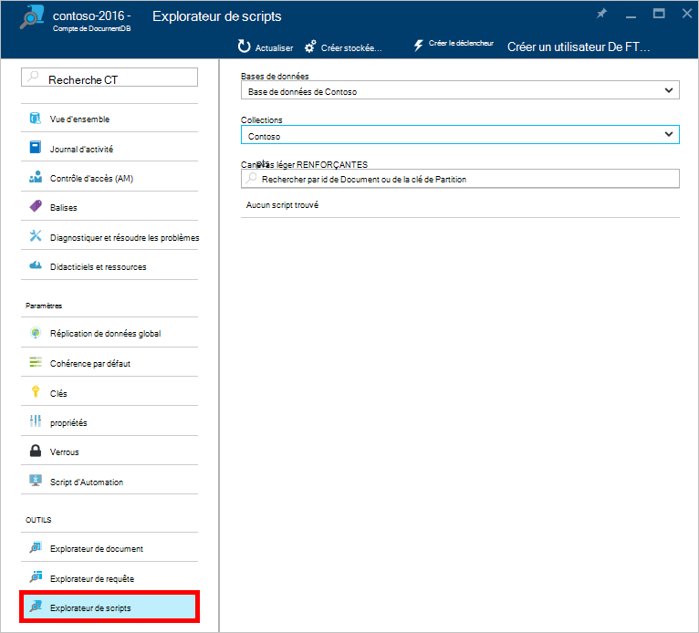
 
    Les zones de liste déroulante **base de données** et de la **Collection** sont remplis au préalable en fonction du contexte dans lequel vous lancez l’Explorateur de scripts.  Par exemple, si vous lancez à partir d’une lame de la base de données, la base de données en cours est renseignée au préalable.  Si vous lancez à partir d’une lame de collection, la collection en cours est alors préremplie.

4.  Les zones de liste déroulante **base de données** et de **Collection** permet de modifier facilement la collection à partir de laquelle les scripts sont en cours d’affichage sans avoir à fermer et à relancer Explorateur de scripts.  

5. Explorateur de scripts prend également en charge le filtrage par leur propriété id le jeu actuellement chargé de scripts.  Il suffit de taper dans la zone de filtre et les résultats dans la liste de l’Explorateur de scripts sont filtrés en fonction de vos critères fournis.

    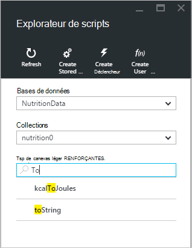

    > [AZURE.IMPORTANT] L’Explorateur de scripts filtrer uniquement les filtres des fonctionnalités du jeu ***actuellement*** chargé de scripts et n’actualise pas automatiquement la collection actuellement sélectionnée.

5. Pour actualiser la liste des scripts chargés par le Script de l’Explorateur, cliquez simplement sur la commande **Actualiser** en haut de la lame.

    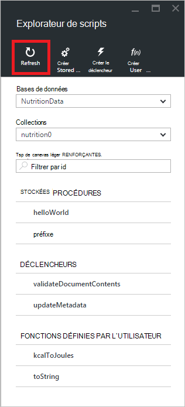

## Créer, afficher et modifier des procédures stockées, des déclencheurs et des fonctions définies par l’utilisateur

Explorateur de scripts vous permet d’exécuter facilement les opérations sur les objets de programmation côté serveur DocumentDB.  

- Pour créer un script, il suffit de cliquer sur applicable Créer commande au sein de l’Explorateur de scripts, fournir un id, entrez le contenu du script et cliquez sur **Enregistrer**.

    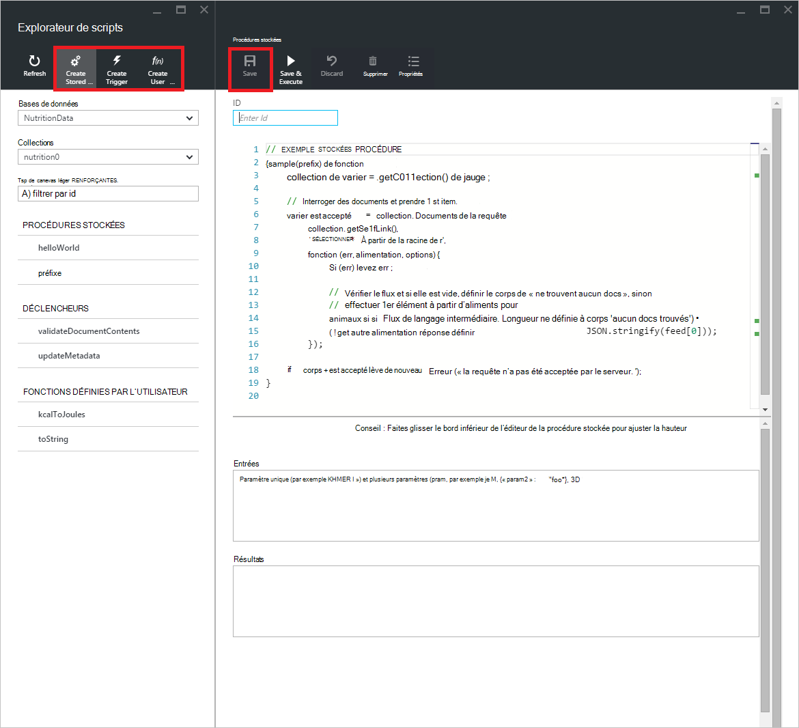

- Lors de la création d’un déclencheur, vous devez également spécifier l’opération de type et le déclenchement du déclencheur

    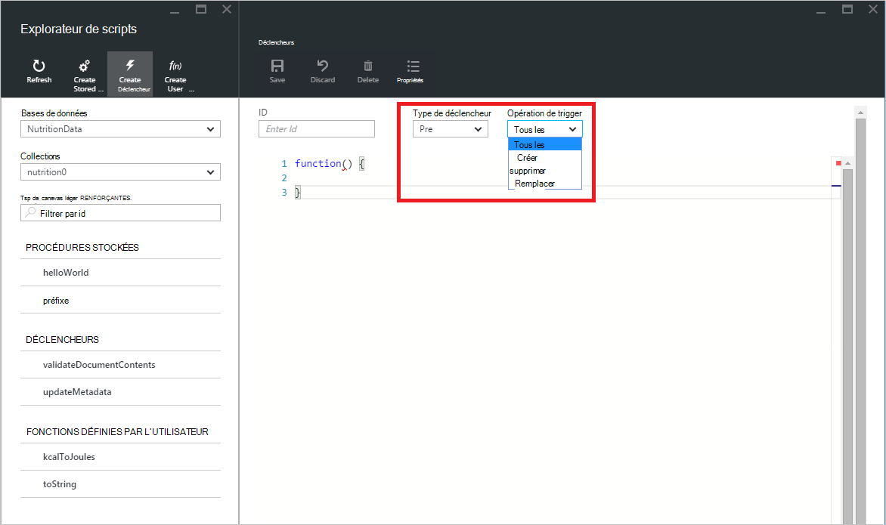

- Pour afficher un script, cliquez simplement sur le script qui vous intéressent.

    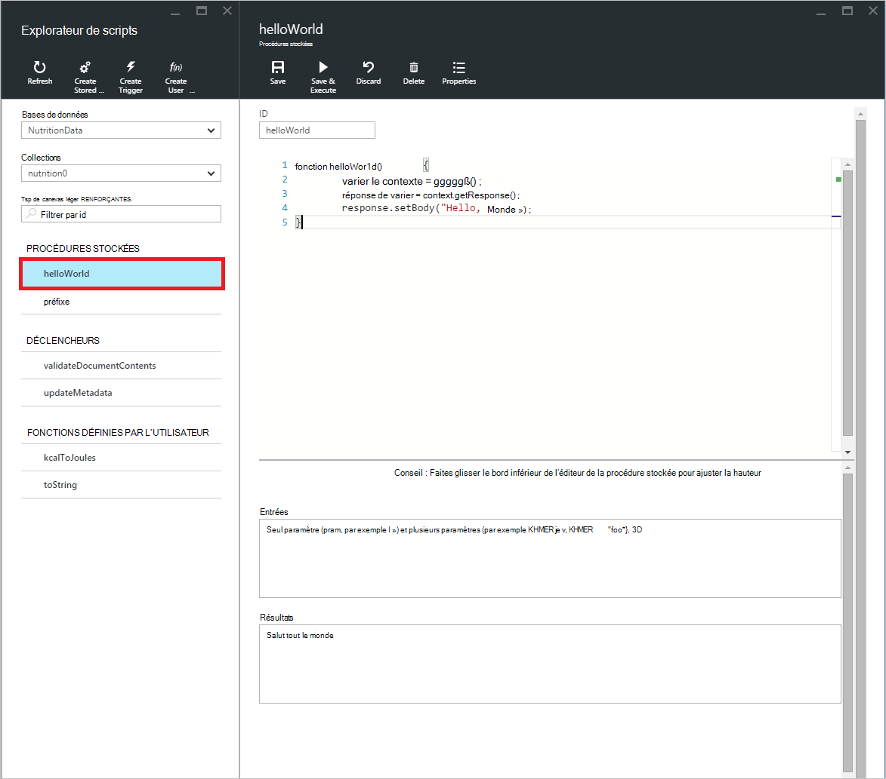

- Pour modifier un script, il suffit d’apportez les modifications souhaitées dans le code JavaScript à l’éditeur et cliquez sur **Enregistrer**.

    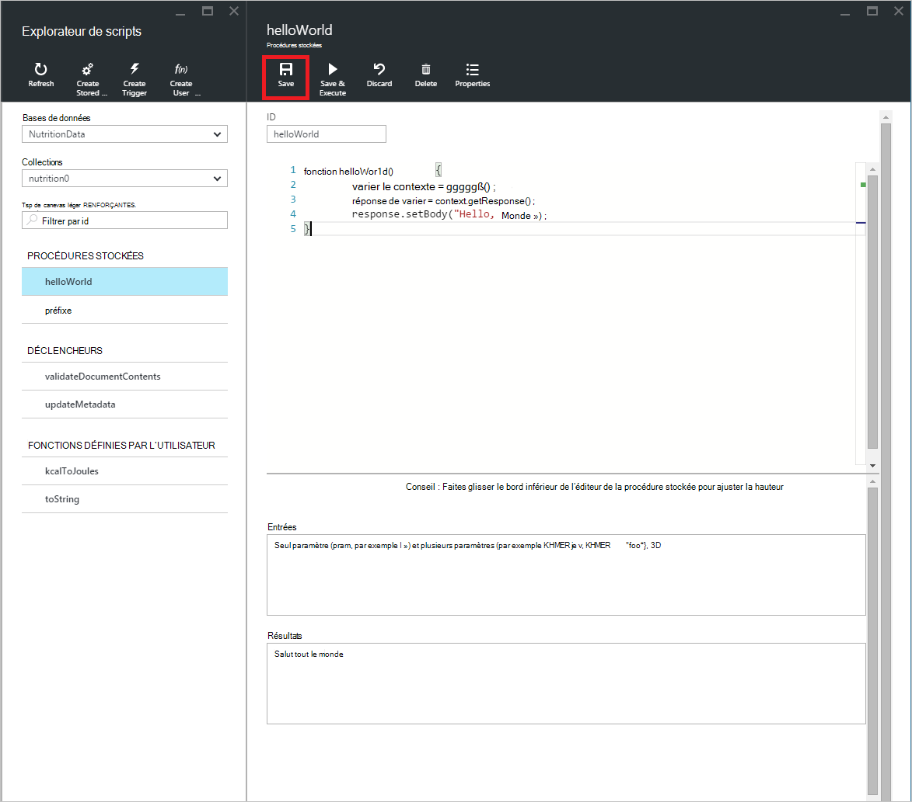

- Pour ignorer les modifications en attente à un script, cliquez simplement sur la commande **Annuler** .

    

- Explorateur de scripts vous permet également de visualiser facilement les propriétés système de script actuellement chargé en cliquant sur la commande **Propriétés** .

    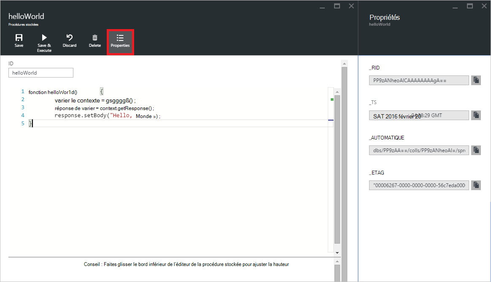

    > [AZURE.NOTE] La propriété timestamp (DTS) est représentée en interne sous forme d’heure de l’époque, mais Explorateur de scripts affiche la valeur dans un format lisible GMT.

- Pour supprimer un script, sélectionnez-le dans l’Explorateur de scripts et cliquez sur la commande **Supprimer** .

    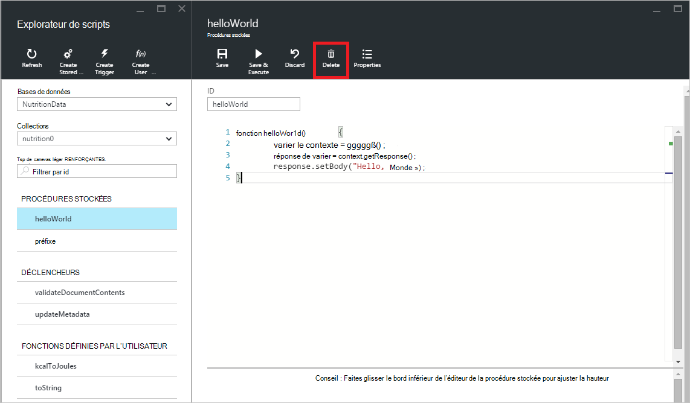

- Cliquez sur **Oui** pour confirmer l’action supprimer ou annuler l’action de suppression en cliquant sur **non**.

    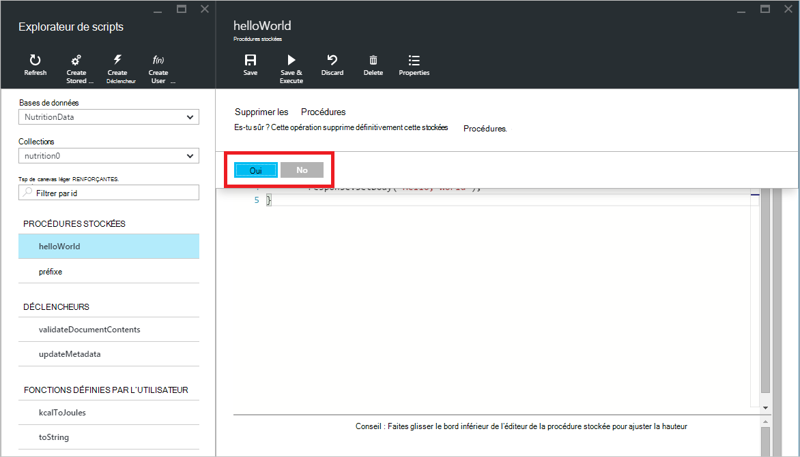

## Exécuter une procédure stockée

> [AZURE.WARNING] Exécution de procédures stockées dans l’Explorateur de scripts n’est pas encore prise en charge pour les collections de partitionné de côté serveur. Pour plus d’informations, visitez le [partitionnement et la mise à l’échelle dans DocumentDB](documentdb-partition-data.md).

Explorateur de scripts vous permet d’exécuter des procédures stockées de côté serveur à partir du portail Azure.

- Lors de l’ouverture d’une nouvelle lame de procédure stockée de créer, un script par défaut (*préfixe*) sera déjà fourni. Pour exécuter le script de *préfixe* ou de votre propre script, ajoutez un *code* et les *entrées*. Pour les procédures stockées qui acceptent des paramètres multiples, toutes les entrées doivent être dans un tableau (par exemple *[« foo », « bar »]*).

    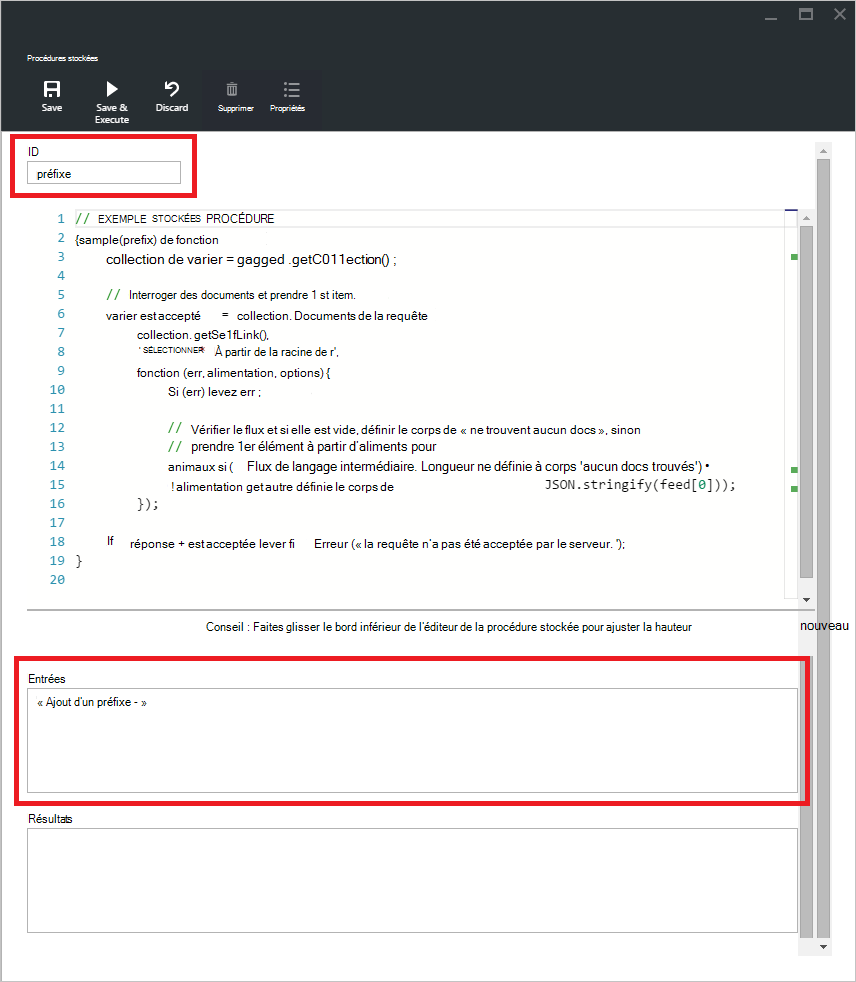

- Pour exécuter une procédure stockée, cliquez simplement sur la commande **Enregistrer et exécuter** dans le volet de l’éditeur de script.

    > [AZURE.NOTE] La commande **Enregistrer et exécuter** enregistrera votre procédure stockée avant l’exécution, ce qui signifie qu’il va remplacer la version précédemment enregistrée de la procédure stockée.

- Succès exécutions de procédures stockées présente l’état *enregistré avec succès et de l’exécution de la procédure stockée* et les résultats renvoyés seront répercutées dans le volet de *résultats* .

    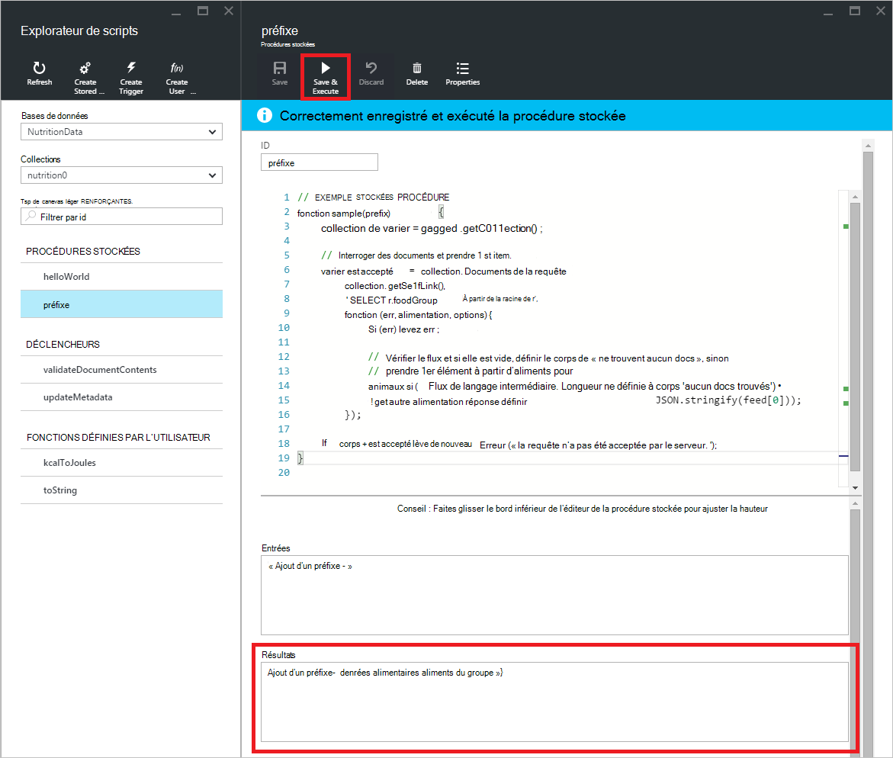

- Si l’exécution rencontre une erreur, l’erreur sera remplie dans le volet de *résultats* .

    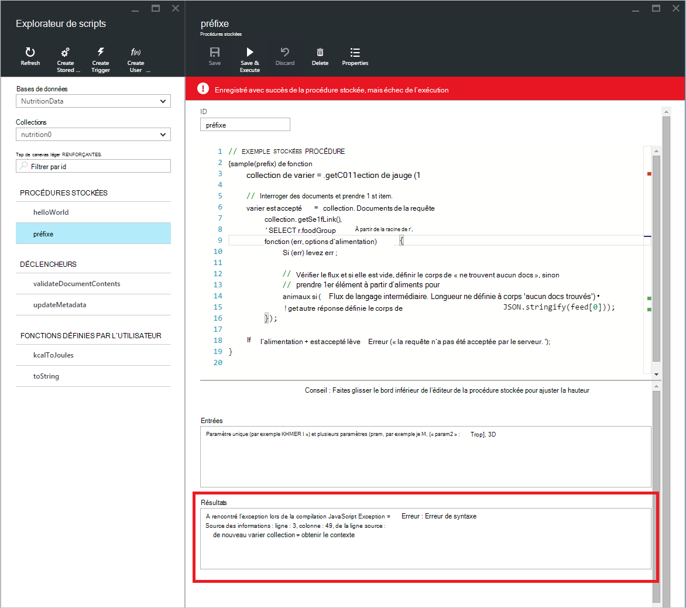

## Travailler avec des scripts à l’extérieur du portail.

L’Explorateur de scripts dans le portail Azure est tout simplement un moyen de travailler avec des procédures stockées, des déclencheurs et des fonctions définies par l’utilisateur dans DocumentDB. Vous pouvez également travailler avec des scripts à l’aide de la l’API REST et le [SDK de client](documentdb-sdk-dotnet.md). La documentation de l’API REST comprend des exemples pour l’utilisation avec [reste d’à l’aide de procédures stockées](https://msdn.microsoft.com/library/azure/mt489092.aspx), [reste d’à l’aide de fonctions définies par l’utilisateur](https://msdn.microsoft.com/library/azure/dn781481.aspx)et des [déclencheurs à l’aide de reste](https://msdn.microsoft.com/library/azure/mt489116.aspx). Exemples sont également disponible montrant comment [travailler avec des scripts à l’aide de C#](documentdb-dotnet-samples.md#server-side-programming-examples) et de [travailler avec des scripts à l’aide de Node.js](documentdb-nodejs-samples.md#server-side-programming-examples).

## Étapes suivantes

Pour en savoir plus sur la programmation côté serveur de DocumentDB dans l’article de [procédures stockées, les déclencheurs de base de données et les fichiers UDF](documentdb-programming.md) .

Le [cursus](https://azure.microsoft.com/documentation/learning-paths/documentdb/) est également une ressource utile pour vous guider pendant que vous en savoir plus sur DocumentDB.  
