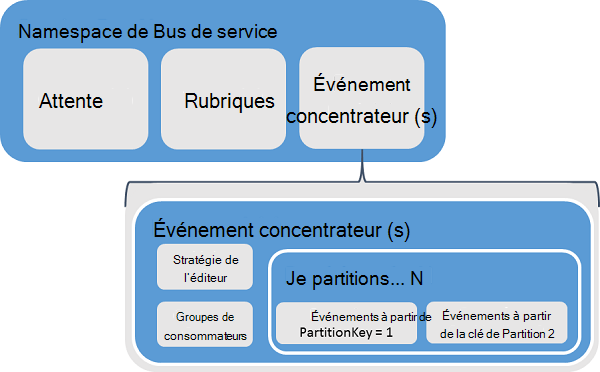
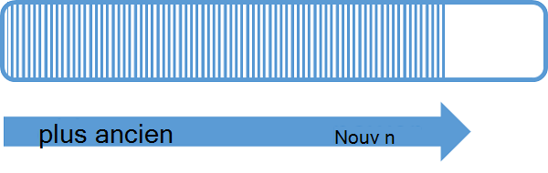
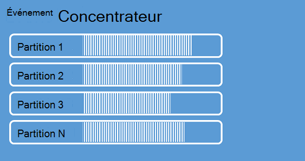
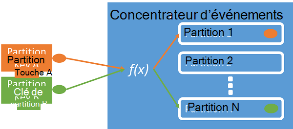
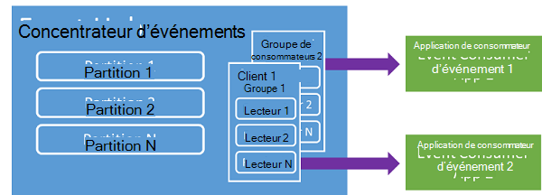
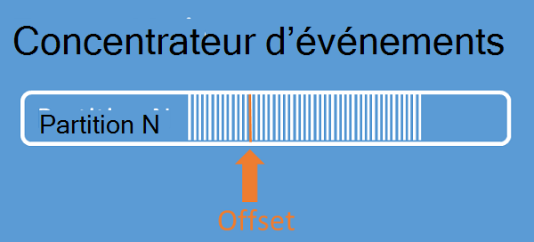
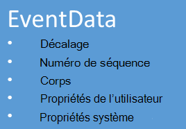

<properties 
    pageTitle="Vue d’ensemble des concentrateurs d’événement Azure | Microsoft Azure"
    description="Introduction et présentation des concentrateurs d’événement Azure."
    services="event-hubs"
    documentationCenter="na"
    authors="sethmanheim"
    manager="timlt"
    editor="" />
<tags 
    ms.service="event-hubs"
    ms.devlang="na"
    ms.topic="get-started-article"
    ms.tgt_pltfrm="na"
    ms.workload="na"
    ms.date="08/16/2016"
    ms.author="sethm" />

# Vue d’ensemble des événements concentrateurs Azure

De nombreuses solutions modernes l’intention à fournir une expérience client adaptive ou pour améliorer des produits par le biais de commentaires en continu et automatique de télémétrie. Ces solutions sont confrontées au défi de façon sécurisée et fiable traitement des très grandes quantités d’informations de différents éditeurs simultanées. Concentrateurs d’événement Microsoft Azure est un service de plate-forme gérée qui fournit une base pour l’incorporation de données à grande échelle dans un large éventail de scénarios. Des exemples de ces scénarios sont comportement de suivi dans les applications mobiles, des informations de trafic à partir de batteries de serveurs web, capture les événements dans le jeu dans les jeux de la console, ou les données de télémétrie recueillies à partir des machines industrielles ou connecté des véhicules. Le rôle commun que concentrateurs d’événement joue dans les architectures de solution est qu’elle agit comme la « porte » pour un pipeline des événements, souvent appelée une *ingestor de l’événement*. Un ingestor de l’événement est un composant ou un service qui se trouve entre les consommateurs d’événements et les éditeurs d’événements de dissocier la production d’un flux d’événements de la consommation de ces événements.

Les concentrateurs événement Azure est un service qui fournit des événements et télémétrie pénètre dans le nuage à grande échelle, avec une latence faible et haute fiabilité de traitement des événements. Ce service, utilisé avec d’autres services en aval, est particulièrement utile dans les scénarios Internet des objets (IoT), traitement des flux de travail ou d’expérience utilisateur et instrumentation de l’application. Concentrateurs d’événements fournit un flux de messages de gestion des capacités et si un concentrateur d’événements est une entité semblable à des rubriques et des files d’attente, elle présente des caractéristiques qui sont très différentes de messagerie d’entreprise traditionnel. Scénarios de messagerie d’entreprise nécessitent généralement des fonctionnalités sophistiquées séquençage, -lettres mortes, prise en charge des transactions, des garanties de livraison fort, bien que la préoccupation dominante pour l’incorporation de l’événement est un débit élevé et flexibilité pour les flux d’événements de traitement. Par conséquent, les capacités de concentrateurs d’événement diffèrent des rubriques du Bus de Service dans la mesure où ils sont fortement en faveur de haut débit et les scénarios de traitement des événements. En tant que tel, événement concentrateurs n’implémentent pas certaines des fonctions de messagerie qui sont disponibles pour les rubriques. Si vous avez besoin de ces fonctionnalités, rubriques restent le meilleur choix.

Un concentrateur d’événements est créé au niveau espace de noms événement concentrateurs, semblable à des rubriques et des files d’attente de Bus de Service. Concentrateurs d’événement utilise AMQP et HTTP comme ses interfaces API primaires. Le diagramme suivant montre la relation entre les concentrateurs d’événement et des Bus de Service.

## Vue d’ensemble conceptuelle

Concentrateurs d’événement fournit le message en continu via un modèle de consommateur partitionnées. Files d’attente et les rubriques utilisent un modèle de [Consommateur de concurrents](https://msdn.microsoft.com/library/dn568101.aspx) dans lequel chaque consommateur tente de lire à partir de la même file d’attente ou la ressource. Cette concurrence pour les ressources est traduit dans les limites d’échelle pour les applications de traitement de flux et de la complexité. Concentrateurs d’événement utilise un modèle de consommateur partitionnées dans lequel chaque consommateur lit uniquement un sous-ensemble spécifique, ou une partition, le flux de message. Ce modèle permet l’échelle horizontale pour le traitement de l’événement et offre d’autres fonctionnalités axées sur le flux de données qui ne sont pas disponibles dans les rubriques et les files d’attente.

### Partitions

Une partition est une séquence ordonnée d’événements qui est conservée dans un concentrateur d’événements. Arrivée des événements plus récents, ils sont ajoutés à la fin de cette séquence. Une partition peut être considérée comme un « journal de validation ».

Partitions de conservent les données pendant une période de rétention configurée est définie au niveau du concentrateur de l’événement. Ce paramètre s’applique à toutes les partitions dans l’événement concentrateur. Événements de date d’expiration sur une base de temps ; Vous ne pouvez pas les supprimer explicitement. Un concentrateur d’événements contient plusieurs partitions. Chaque partition est indépendante et contient ses propres séquence de données. Par conséquent, les partitions augmentent souvent à des taux différents.

Le nombre de partitions est spécifié à l’heure de création du concentrateur de l’événement et doit être compris entre 2 et 32 (la valeur par défaut est 4). Les partitions constituent un mécanisme d’organisation données et concernent plus le degré de parallélisme en aval requis en utilisant des applications à débit de concentrateurs de l’événement. Ainsi, le choix du nombre de partitions dans un concentrateur d’événements directement lié au nombre de lecteurs concurrents que vous prévoyez. Après la création du concentrateur d’événements, le nombre de partitions n’est pas modifiable ; Vous devez envisager ce numéro en fonction de l’échelle de prévu à long terme. Vous pouvez augmenter la limite de partition de 32 en contactant l’équipe du Bus des services.

Bien que les partitions sont identifiables et peuvent être envoyées à directement, qu'il est préférable d’éviter d’envoyer des données à des partitions spécifiques. Au lieu de cela, vous pouvez utiliser des constructions de niveau supérieures présentées dans les sections de [l’Éditeur d’événements](#event-publisher) et de la [Stratégie de l’éditeur](#capacity-and-security) .

Dans le contexte des événements, les messages sont appelés *données d’événement*. Données d’événement contiennent le corps de l’événement, un utilisateur défini sac de propriétés et diverses métadonnées à propos de l’événement comme son décalage de la partition et son numéro dans la séquence de flux de données. Les partitions sont remplies avec une séquence de données d’événement.

## Éditeur d’événements

Toute entité qui envoie des événements ou des données à un concentrateur d’événements est un *Éditeur d’événements*. Éditeurs d’événements peuvent publier des événements à l’aide de HTTPS ou AMQP 1.0. Éditeurs d’événements utilisent un jeton de Signature de l’accès partagé (SAS) s’identifient à un concentrateur d’événements et peut avoir une identité unique, ou utiliser un jeton SAS commun, en fonction des exigences du scénario.

Pour plus d’informations sur l’utilisation des associations de sécurité, reportez-vous à la section [Authentification de Signature à accès partagé avec Bus de Service](../service-bus-messaging/service-bus-shared-access-signature-authentication.md).

### Tâches publisher

Cette section décrit les tâches courantes pour les éditeurs d’événements.

#### Acquérir un jeton SAS

Signature d’accès partagé (SAS) est le mécanisme d’authentification pour les concentrateurs d’événement. Bus de service fournit des stratégies SAS à l’espace de noms et au niveau du concentrateur de l’événement. Un jeton SAS est généré à partir d’une clé SAS et est un hachage SHA d’une URL codée dans un format spécifique. Bus de Service peut ainsi authentifier l’expéditeur et régénérer le hachage en utilisant le nom de la clé (stratégie) et le jeton. En règle générale, les jetons SAS pour les éditeurs d’événements sont créés avec **Envoyer** uniquement des privilèges sur un concentrateur d’événements spécifiques. Ce mécanisme URL SAS est la base pour l’identification d’éditeur introduite dans la stratégie de l’éditeur. Pour plus d’informations sur l’utilisation des associations de sécurité, reportez-vous à la section [Authentification de Signature à accès partagé avec Bus de Service](../service-bus-messaging/service-bus-shared-access-signature-authentication.md).

#### Un événement de publication.

Vous pouvez publier un événement via AMQP 1.0 ou HTTPS. Bus de service fournit une classe de [EventHubClient](https://msdn.microsoft.com/library/microsoft.servicebus.messaging.eventhubclient.aspx) pour publier des événements à un concentrateur d’événements à partir de clients .NET. Pour d’autres exécutions et des plates-formes, vous pouvez utiliser n’importe quel client de AMQP 1.0, tels que [Apache Qpid](http://qpid.apache.org/). Vous pouvez publier des événements individuellement ou par lots. Une seule publication (instance de données d’événement) a une limite de 256 Ko, qu’il s’agisse d’un événement unique ou un lot. Événements de publication plus grandes que cela entraîne une erreur. Il est recommandé pour les éditeurs à être au courant des partitions dans le concentrateur d’événements et pour ne spécifier qu’une *clé de partition* (introduit dans la section suivante), ou leur identité via leur jeton d’associations de sécurité.

Le choix d’utiliser AMQP ou HTTPS est spécifique au scénario d’utilisation. AMQP nécessite l’établissement d’un socket bidirectionnel persistant en outre pour le transport au niveau TLS (security) ou SSL/TLS. Cela peut être une opération coûteuse en termes de trafic réseau, mais il ne se produit au début d’une session AMQP. HTTPS a une charge initiale inférieure, mais qu’il requiert SSL supplémentaire de charge pour chaque demande. Pour les éditeurs qui publient fréquemment des événements, AMQP permet des économies importantes sur les performances, la latence et le débit.

### Clé de partition

Une clé de partition est une valeur qui est utilisée pour mapper des données entrantes d’événements dans les partitions spécifiques pour les besoins de l’organisation des données. Clé de partition est une valeur fournie par l’expéditeur passée à un concentrateur d’événements. Elle est traitée via une fonction de hachage statique, le résultat qui crée le devoir de partition. Si vous ne spécifiez pas une clé de partition lors de la publication d’un événement, une affectation de répétition alternée est utilisée. Lorsque vous utilisez les clés de partition, l’éditeur d’événements n’est plus conscient de sa clé de partition, pas la partition à laquelle les événements sont publiés. Ce découplage de clé et de partition isole l’expéditeur de savoir trop de choses sur le traitement en aval et le stockage des événements. Les clés de partition sont importants pour organiser les données pour le traitement en aval, mais fondamentalement non liés à des partitions eux-mêmes. Un périphérique ou un utilisateur unique identité rend une clé de partition en bon état, mais les autres attributs, tels que la géographie peuvent également être utilisé pour grouper des événements associés en une partition unique. L’image suivante montre les émetteurs d’événements à l’aide de clés de la partition pour les partitions.

Événement concentrateurs garantit que tous les événements partagent la même valeur de clé de partition sont remis dans l’ordre et la même partition. Important, si les clés sont utilisées avec les stratégies de publisher, décrites dans la section suivante, puis l’identité de l’éditeur et la valeur de la clé de partition doivent correspondre. Dans le cas contraire, une erreur se produit.

### Consommateur d’événements

Toute entité qui lit les données d’événement à partir d’un concentrateur d’événements est un consommateur d’événements. Tous les consommateurs d’événements lire le flux d’événements par le biais de partitions dans un groupe de consommateurs. Chaque partition doit avoir qu’un seul lecteur actif à la fois. Tous les consommateurs d’événements concentrateurs se connectent via la session de AMQP 1.0, dans lequel les événements sont remis dès qu’elles sont disponibles. Le client n’a pas besoin pour l’interrogation de la disponibilité des données.

#### Groupes de consommateurs

Le mécanisme de publication et d’abonnement de concentrateurs d’événement est activé par le biais de groupes de consommateurs. Un groupe de consommateurs est une vue (état, position ou décalage) d’un concentrateur d’événements entière. Activer des groupes de consommateurs plusieurs applications consommatrices à chacun ont une vue distincte du flux d’événements et pour lire le flux indépendamment à leur propre rythme et avec leurs propres offsets. Dans un architecture de traitement de flux, chaque application en aval équivaut à un groupe de consommateurs. Si vous souhaitez écrire des données d’événement dans le stockage à long terme, cette application de rédacteur de stockage est un groupe de consommateurs. Traitement de l’événement complexe est effectuée par le groupe des consommateurs d’une autre, distincte. Vous pouvez uniquement accéder aux partitions via un groupe de consommateurs. Il y a toujours un groupe de consommateurs de par défaut dans un concentrateur d’événements, et vous pouvez créer jusqu'à 20 groupes de consommateurs pour un concentrateur d’événements de niveau Standard.

Voici des exemples de la convention d’URI de groupe consommateur :

    //<my namespace>.servicebus.windows.net/<event hub name>/<Consumer Group #1>
    //<my namespace>.servicebus.windows.net/<event hub name>/<Consumer Group #2>

L’image suivante montre les consommateurs d’événements au sein de groupes de consommateurs.

#### Décalages de flux

Un décalage correspond à la position d’un événement au sein d’une partition. Vous pouvez considérer un décalage sous la forme d’un curseur côté client. L’offset est un octet de numérotation de l’événement. Cela permet à un consommateur d’événements (lecteur) spécifier un point dans le flux d’événements à partir de laquelle il souhaite commencer la lecture des événements. Vous pouvez spécifier le décalage sous forme d’estampille ou sous la forme d’une valeur de décalage. Les clients sont responsables pour stocker leurs propres valeurs de décalage en dehors du service événements concentrateurs.

Au sein d’une partition, chaque événement inclut un offset. Ce décalage est utilisé par les consommateurs pour afficher l’emplacement dans la séquence d’événements d’une partition donnée. Décalages peuvent être passés au concentrateur d’événements sous la forme d’un nombre ou une valeur d’horodatage lorsqu’un lecteur se connecte.

#### Script de vérification

*Point de contrôle* est un processus par lequel les lecteurs marquer ou valider leur position dans une séquence d’événements de partition. Point de contrôle est de la responsabilité du consommateur et se produit sur une base par partition, au sein d’un groupe de consommateurs. Cela signifie que pour chaque groupe de consommateurs, chaque lecteur de la partition doit conserver une trace de sa position actuelle dans l’événement de flux et informer le service lorsqu’il considère que le flux de données complète. Si un lecteur se déconnecte d’une partition, lorsqu’il reconnecte il commence la lecture au point de contrôle qui a été précédemment soumis par le dernier lecteur de cette partition dans ce groupe de consommateurs. Lorsque le lecteur se connecte, il transmet cet offset au concentrateur pour spécifier l’emplacement à partir duquel commencer la lecture des événements. De cette façon, vous pouvez utiliser le script de vérification pour les deux événements de marquer comme « terminé » par les applications en aval et de fournir la résilience en cas de basculement entre des lecteurs en cours d’exécution sur des ordinateurs différents. Étant donné que les données d’événement sont retenues pour l’intervalle de conservation spécifiée à la fois que le concentrateur d’événements est créé, il est possible renvoyer les données plus anciennes en spécifiant un décalage inférieur à partir de ce processus de vérification. Grâce à ce mécanisme, vérification permet de résilience de basculement et de relecture de flux d’événements contrôlés.

#### Tâches courantes de consommateur

Cette section décrit les tâches courantes pour les consommateurs d’événements événements concentrateurs ou lecteurs. Tous les consommateurs d’événements concentrateurs se connectent via AMQP 1.0. AMQP 1.0 est une session et un canal de communication bidirectionnel connaissance de l’état. Chaque partition possède une session de liaison AMQP 1.0 qui facilite le transport des événements séparés par partition.

##### Se connecter à une partition

Pour consommer des événements à partir d’un concentrateur de l’événement, un consommateur doit se connecter à une partition. Comme mentionné précédemment, vous toujours accédez à partitions dans un groupe de consommateurs. Dans le cadre du modèle de consommateur partitionnées, seulement un seul lecteur doit être actif sur une partition à la fois au sein d’un groupe de consommateurs. Il est courant lorsque vous vous connectez directement à des partitions à utiliser un mécanisme de location afin de coordonner les connexions de lecteur aux partitions spécifiques. De cette façon, il est possible pour chaque partition dans un groupe de consommateurs de n'avoir qu’un seul lecteur actif. Gestion de la position dans l’ordre pour un lecteur est une tâche importante qui est obtenue par le biais de point de contrôle. Cette fonctionnalité est simplifiée par l’utilisation de la classe [EventProcessorHost](https://msdn.microsoft.com/library/microsoft.servicebus.messaging.eventprocessorhost.aspx) pour les clients .NET. [EventProcessorHost](https://msdn.microsoft.com/library/microsoft.servicebus.messaging.eventprocessorhost.aspx) est un agent de client intelligent et est décrite dans la section suivante.

##### Lire les événements

Après l’ouverture d’une session de AMQP 1.0 et un lien pour une partition spécifique, les événements sont livrés au client AMQP 1.0 par le service de concentrateurs de l’événement. Ce mécanisme de livraison permet de débit et latence plus faible que les mécanismes de type pull comme HTTP GET. Comme les événements sont envoyés au client, chaque instance de données d’événement contient des métadonnées importantes telles que le nombre de décalage et de séquence sont utilisés pour faciliter la vérification de la séquence d’événements.

Il est de votre responsabilité de gérer cet offset d’une manière que meilleur permet la gestion des cours dans le flux de traitement.

## Capacité et la sécurité

Concentrateurs d’événement est une architecture hautement évolutive et parallèle pour l’entrée de flux de données. En tant que tel, il y a plusieurs aspects essentiels à prendre en compte lorsque vous dimensionnez et une solution basée sur les Hubs d’événement de mise à l’échelle. Le premier de ces contrôles de capacité est appelé *unités de débit*, décrite dans la section suivante.

### Unités de débit

La capacité de débit de concentrateurs d’événement est contrôlée par des unités de débit. Unités de débit sont achetées avant d’unités de capacité. Une unité de débit unique comprend les éléments suivants :

- Pénétration : Jusqu'à 1 Mo par seconde ou 1 000 événements par seconde.

- Sortie : Jusqu'à 2 Mo par seconde.

Pénétration est limitée à la quantité de capacité offerte par le nombre d’unités de débit acheté. Envoi de données au-dessus des résultats de ce montant dans une exception « quota dépassé ». Ce montant est soit 1 Mo par seconde ou 1 000 événements par seconde, selon ce qui apparaît en premier. Sortie ne produit pas de limitation d’exceptions, mais est limitée à la quantité de transfert de données prévue par les unités achetées débit : 2 Mo par seconde, par unité de débit. Si vous de recevoir des exceptions de taux publication ou attendez sortie ultérieure pensez à vérifier le nombre d’unités débit que vous avez acheté l’espace de noms dans lequel le concentrateur d’événements a été créé. Pour obtenir des unités de débit plus élevé, vous pouvez ajuster le paramètre sur la page des **espaces de noms** sur l’onglet **échelle** dans [Azure portal classique][]. Vous pouvez également modifier ce paramètre à l’aide de l’API d’Azure.

Bien que les partitions sont un concept d’organisation données, unités de débit sont purement un concept de capacité. Unités de débit sont facturées par heure et sont acquis. Une fois acheté, unités de débit sont facturées pour un minimum d’une heure. À un débit de 20 unités peuvent être achetées pour un espace de noms de concentrateurs de l’événement, et il existe une limite de compte Azure de 20 unités de débit. Ces unités de débit sont partagées entre tous les concentrateurs d’événement dans un espace de noms donné.

Unités de débit sont mis en service sur le mieux et ne peuvent pas toujours être disponibles pour un achat immédiat. Si vous avez besoin d’une capacité spécifique, il est recommandé que vous achetez ces unités de débit à l’avance. Si vous avez besoin de plus de 20 unités de débit, vous pouvez contacter le support de Azure pour acheter d’autres unités de débit sur une base d’engagement dans des blocs de 20, le premier unités de débit de 100. En outre, vous pouvez également acheter des blocs de 100 unités de débit.

Il est recommandé que vous équilibrer les partitions et les unités de débit pour atteindre une échelle optimale avec les concentrateurs d’événement. Une seule partition a une échelle maximale de l’unité d’un débit. Le nombre d’unités de débit doit être inférieur ou égal au nombre de partitions dans un concentrateur d’événements.

Pour obtenir des informations de tarification détaillées, consultez [Tarification des concentrateurs d’événement](https://azure.microsoft.com/pricing/details/event-hubs/).

### Stratégie de l’éditeur

Événement concentrateurs permet un contrôle granulaire sur les éditeurs d’événements par le biais de *stratégies d’éditeur*. Les stratégies de Publisher sont un ensemble de fonctionnalités d’exécution visant à faciliter le grand nombre d’éditeurs d’événements indépendants. Avec les stratégies d’éditeur, chaque éditeur utilise son propre identificateur unique lors de la publication d’événements à un concentrateur d’événements, en utilisant le mécanisme suivant :

    //<my namespace>.servicebus.windows.net/<event hub name>/publishers/<my publisher name>

Vous n’êtes pas obligé de créer des noms des éditeurs à l’avance, mais ils doivent correspondre le jeton d’associations de sécurité utilisé lors de la publication d’un événement, afin de garantir l’identité de l’éditeur indépendant. Pour plus d’informations sur les associations de sécurité, reportez-vous à la section [Authentification de Signature à accès partagé avec Bus de Service](../service-bus-messaging/service-bus-shared-access-signature-authentication.md). Lors de l’utilisation de stratégies d’éditeur, la valeur de **PartitionKey** est définie pour le nom de l’éditeur. Pour fonctionner correctement, ces valeurs doivent correspondre.

## Résumé

Les concentrateurs événement Azure fournit un événement d’une évolutivité et d’un service qui peut être utilisé pour l’application et utilisateur flux de travail courant de surveillance à n’importe quelle échelle de traitement de télémétrie. La capacité de fournir publication-abonnement de fonctionnalités avec une faible latence et à grande échelle, événement les concentrateurs servent de « rampe suite » de données volumineuses. Avec publisher sur l’identité et les listes de révocation, ces fonctionnalités sont étendues dans les scénarios courants de l’Internet des objets. Pour plus d’informations sur le développement d’applications de concentrateurs d’événement, consultez le [guide de programmation de concentrateurs de l’événement](event-hubs-programming-guide.md).

## Étapes suivantes

Maintenant que vous avez appris sur les concepts de concentrateurs d’événement, vous pouvez atteindre les scénarios suivants :

- Mise en route avec un [didacticiel de concentrateurs de l’événement].
- Un [exemple d’application qui utilise des concentrateurs d’événement]complète.

[Azure portal classique]: http://manage.windowsazure.com
[Didacticiel de concentrateurs d’événement]: event-hubs-csharp-ephcs-getstarted.md
[exemple d’application qui utilise des concentrateurs d’événement]: https://code.msdn.microsoft.com/windowsazure/Service-Bus-Event-Hub-286fd097
