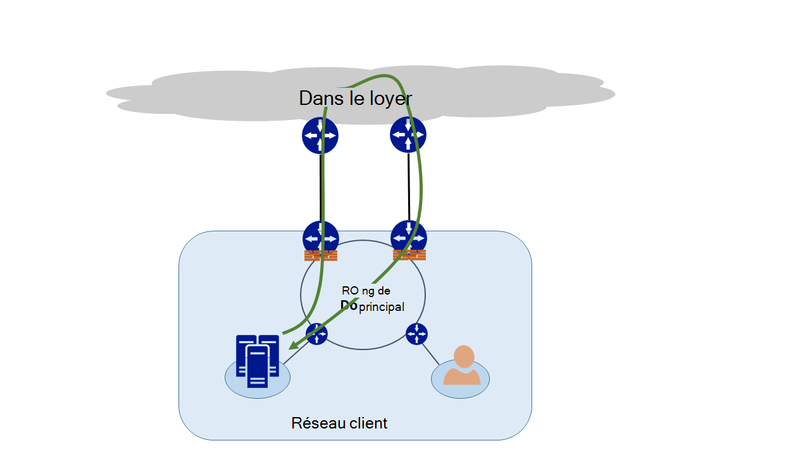
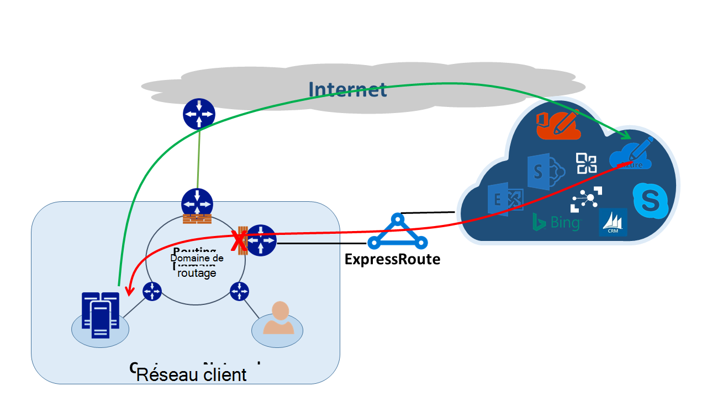
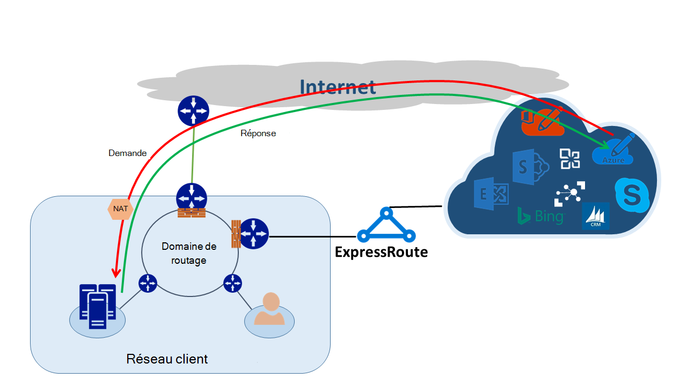

<properties
   pageTitle="Routage asymétrique | Microsoft Azure"
   description="Cet article vous guide à travers les problèmes que client risque d’être confrontée routage asymétrique dans un réseau qui comporte plusieurs liens vers une destination."
   documentationCenter="na"
   services="expressroute"
   authors="osamazia"
   manager="carmonm"
   editor=""/>
<tags
   ms.service="expressroute"
   ms.devlang="na"
   ms.topic="get-started-article"
   ms.tgt_pltfrm="na"
   ms.workload="infrastructure-services"
   ms.date="10/10/2016"
   ms.author="osamazia"/>

# Le routage asymétrique avec plusieurs chemins d’accès réseau

Cet article explique comment transférer et renvoyer le trafic réseau peut emprunter des itinéraires différents lorsque plusieurs chemins sont disponibles entre le réseau source et destination.

Il est important de comprendre deux concepts de comprendre le routage asymétrique. Un est l’effet de plusieurs chemins d’accès réseau. L’autre est comment périphériques, telles qu’un pare-feu, conserver l’état. Ces types de périphériques sont appelés périphériques avec état. Une combinaison de ces deux facteurs crée des scénarios dans le réseau sur lequel le trafic est ignoré par un dispositif dynamique, car le périphérique avec état n’a pas détecté que le trafic provenait avec le périphérique lui-même.

## Plusieurs chemins d’accès réseau

Lorsqu’il n’y a qu’un seul lien à Internet par le biais de leur fournisseur de services Internet pour un réseau d’entreprise, tout le trafic vers et à partir d’Internet est transmis le même chemin. Souvent, les sociétés achètent plusieurs circuits, comme les chemins d’accès redondants, afin d’améliorer la disponibilité du réseau. Dans ce cas, il est possible que le trafic qui passe en dehors du réseau, à Internet, traverse un lien et le trafic de retour traverse un autre lien. Il est communément appelée routage asymétrique. Dans le routage asymétrique, inverse le trafic de réseau prend un chemin d’accès différent à partir du flux d’origine.

Bien qu’il se produit principalement sur Internet, également le routage asymétrique s’applique avec d’autres combinaisons de plusieurs chemins d’accès. Il s’applique, par exemple, à la fois à un chemin d’accès Internet et un chemin d’accès privé qui vont vers la même destination et plusieurs chemins d’accès privés qui vont vers la même destination.

Chaque routeur situé le long de la façon dont, à partir de la source vers la destination, calcule le meilleur chemin pour atteindre une destination. Détermination du routeur de meilleur chemin possible est basée sur deux facteurs principaux :

-   Routage entre réseaux externes est basé sur un protocole de routage protocole BGP (Border Gateway). BGP prend des publicités voisins et les exécute à travers une série d’étapes à suivre pour déterminer le meilleur chemin vers la destination. Il stocke le meilleur chemin dans sa table de routage.
-   La longueur d’un masque de sous-réseau associé à une gamme influence des chemins de routage. Si un routeur reçoit plusieurs publications, mais avec des masques de sous-réseau différents pour la même adresse IP, le routeur préfère la publication avec un masque de sous-réseau plus long, car il est considéré comme un itinéraire plus spécifique.

## Périphériques avec état

Routeurs consulter l’en-tête d’un paquet IP à des fins de routage. Certains périphériques Rechercher encore plus grande dans le paquet. En règle générale, ces périphériques consulter Layer4 (Transmission Control Protocol, ou TCP ; ou protocole de datagramme utilisateur ou UDP), ou même Layer7 les en-têtes (couche Application). Ces types de périphériques sont des périphériques de sécurité ou les périphériques de l’optimisation de la bande passante. 

Un pare-feu est un exemple courant d’un périphérique avec état. Un pare-feu autorise ou refuse un paquet à passer par l’intermédiaire de ses interfaces basées sur les différents champs de protocole, le port TCP/UDP, des en-têtes d’URL. Ce niveau de l’inspection des paquets met une lourde charge sur le périphérique de traitement. Pour améliorer les performances, le pare-feu inspecte le premier paquet d’un flux. S’il autorise le paquet à passer, il conserve les informations de flux dans sa table d’état. Tous les paquets suivants liés à ce flux sont autorisées en fonction de la première détermination. Un paquet qui fait partie d’un flux existant peut arriver au niveau du pare-feu. Si le pare-feu ne comporte aucune information de l’état antérieur à son sujet, le pare-feu abandonne le paquet.

## Asymétrique de routage avec ExpressRoute

Lorsque vous vous connectez à Microsoft par le biais de ExpressRoute d’Azure, votre réseau est modifié comme suit :

-   Vous avez plusieurs liens à Microsoft. Un lien est votre connexion Internet existante, et l’autre est via ExpressRoute. Certains types de trafic à Microsoft peut passer par Internet mais y revenir, via ExpressRoute, ou vice versa.
-   Vous recevez les adresses IP plus spécifiques via ExpressRoute. Ainsi, pour le trafic de votre réseau à Microsoft pour les services offerts par ExpressRoute, les routeurs préfèrent toujours ExpressRoute.

Pour comprendre l’effet de que ces deux modifications ont sur un réseau, prenons l’exemple des scénarios. Par exemple, vous avez un seul circuit à Internet et consommer de tous les services Microsoft via Internet. Le trafic de votre réseau Microsoft et arrière parcourt la même liaison Internet et passe par le pare-feu. Le firewall enregistre le flux qu’il voit le premier paquet et les paquets de retour sont autorisés car le flux existe dans la table d’état.

Ensuite, vous activez ExpressRoute et consommer des services offerts par Microsoft sur ExpressRoute. Tous les autres services de Microsoft sont consommés sur Internet. Vous déployez un pare-feu distinct à votre avantage qui est connecté à ExpressRoute. Microsoft annonce des préfixes plus spécifiques à votre réseau via ExpressRoute pour des services spécifiques. Votre infrastructure de routage choisit ExpressRoute comme le chemin d’accès par défaut de ces préfixes. Si votre annonce pas vos adresses IP publiques à Microsoft sur le ExpressRoute, Microsoft communique avec vos adresses IP publiques via Internet. Transférer le trafic de votre réseau à Microsoft utilise ExpressRoute et trafic inversé à partir de Microsoft Internet. Lorsque le pare-feu au niveau du bord voit un paquet de réponse d’un flux qui est introuvable dans la table d’état, il supprime le trafic de retour.

Si vous choisissez d’utiliser le même pool de traduction d’adresse réseau de ExpressRoute et de l’Internet, vous verrez des problèmes semblables avec les clients de votre réseau sur les adresses IP privées. Demandes de services, tels que Windows Update accéder via Internet, car les adresses IP de ces services ne sont pas annoncées via ExpressRoute. Toutefois, le trafic de retour revient via ExpressRoute. Si Microsoft reçoit une adresse IP avec le même masque de sous-réseau à partir d’Internet et ExpressRoute, il préfère ExpressRoute sur Internet. Si un pare-feu ou un autre périphérique avec état qui se trouve sur la périphérie du réseau et face à ExpressRoute ne comporte aucune information préalable sur le flux, il abandonne les paquets appartenant à ce flux.

## Solutions de routage asymétriques

Vous avez deux options principales pour résoudre le problème de routage asymétrique. L’une est par l’intermédiaire de routage, et l’autre à l’aide de NAT basée sur la source (SNAT).

### Routage

Assurez-vous que vos adresses IP publiques sont publiés vers des liaisons réseau (étendu WAN) approprié. Par exemple, si vous souhaitez utiliser Internet pour le trafic d’authentification et ExpressRoute pour le trafic de votre messagerie, vous ne devez pas publier vos adresses IP publiques de Active Directory Federation Services (ADFS) sur ExpressRoute. De la même façon, n’oubliez pas ne pas d’exposer un local serveur AD FS pour les adresses IP que le routeur reçoit via ExpressRoute. Les itinéraires reçus sur ExpressRoute sont plus spécifiques afin qu’ils ExpressRoute le chemin d’accès par défaut pour le trafic d’authentification à Microsoft. Cela entraîne le routage asymétrique.

Si vous souhaitez utiliser ExpressRoute pour l’authentification, assurez-vous que votre annonce des adresses IP publiques AD FS sur ExpressRoute sans NAT. De cette manière, le trafic qui provient de Microsoft et qui accède à un site sur serveur AD FS dépasse ExpressRoute. Trafic de retour client à Microsoft utilise ExpressRoute car il s’agit de l’itinéraire par défaut sur Internet.

### Basé sur une source NAT

Une autre façon de résoudre les problèmes de routage asymétriques est à l’aide de SNAT. Par exemple, vous avez ne figure pas l’adresse IP publique d’un serveur de SMTP Simple Mail Transfer Protocol () sur site sur ExpressRoute parce que vous avez l’intention d’utiliser Internet pour ce type de communication. Une demande qui est à l’origine avec Microsoft et puis accède au serveur SMTP local circulent sur Internet. Vous SNAT la demande entrante à une adresse IP interne. Trafic inversé à partir du serveur SMTP passe au pare-feu de périmètre (qui vous utilisez NAT) à la place de par le biais de ExpressRoute. Le trafic de retour remonte via Internet.

## Détection de routage asymétrique

Traceroute est la meilleure façon pour vous assurer que votre trafic réseau passe par le chemin d’accès attendu. Si vous souhaitez le trafic du serveur SMTP local Microsoft à prendre le chemin d’accès de l’Internet, le traceroute attendu est à partir du serveur SMTP à Office 365. Le résultat valide que le trafic sortant en effet de votre réseau vers Internet et non vers ExpressRoute.
